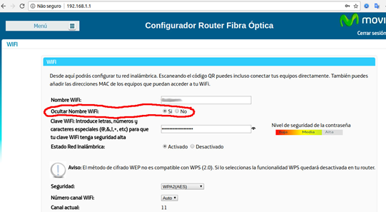

# REDES INALÁMBRICAS

- [REDES INALÁMBRICAS](#redes-inal%c3%81mbricas)
  - [1. INTRODUCCIÓN](#1-introducci%c3%93n)
  - [2. WIFI](#2-wifi)
    - [2.1	ESTÁNDARES](#21-est%c3%81ndares)
    - [2.2. DISPOSITIVOS WIFI](#22-dispositivos-wifi)
    - [2.3	EQUIPOS FINALES](#23-equipos-finales)
    - [2.4	EQUIPOS DE RED](#24-equipos-de-red)
    - [2.4.1	PUNTO DE ACCESO](#241-punto-de-acceso)
      - [2.4.2	REPETIDORES INALÁMBRICOS](#242-repetidores-inal%c3%81mbricos)
      - [2.4.3	ROUTERS INALÁMBRICOS](#243-routers-inal%c3%81mbricos)
    - [2.5	SEGURIDAD EN REDES WIFI](#25-seguridad-en-redes-wifi)
      - [2.5.1	ENCRIPTACIÓN](#251-encriptaci%c3%93n)
      - [2.5.2	REDES 5 GHZ Y 2.4 GHZ](#252-redes-5-ghz-y-24-ghz)
      - [2.5.3.	Bloquear el acceso utilizando filtrado MAC](#253-bloquear-el-acceso-utilizando-filtrado-mac)
      - [2.5.4.	OCULTACIÓN DE RED](#254-ocultaci%c3%93n-de-red)
  - [3.	BLUETOOTH](#3-bluetooth)
    - [3.1	INTRODUCCIÓN](#31-introducci%c3%93n)
    - [3.2	OBJETIVOS](#32-objetivos)
    - [3.3	CONFIGURACIÓN Y CONEXIÓN DE DISPOSITIVOS](#33-configuraci%c3%93n-y-conexi%c3%93n-de-dispositivos)
    - [3.4	EJEMPLOS](#34-ejemplos)
- [4. Internet de las cosas](#4-internet-de-las-cosas)
- [5. Pago contactless](#5-pago-contactless)

## 1. INTRODUCCIÓN

En este apartado hablaremos de las redes sin cables o **inalámbricas**. Las redes más extendidas hasta hace años eran las redes conectadas por medio de cables.  Si los ordenadores están relativamente próximos y permanecen siempre en el mismo sitio, esta puede ser la mejor opción. Sin embargo, hoy en día las redes inalámbricas están mucho más extendidas.

La tecnología inalámbrica es especialmente útil si:

- Si los ordenadores están alejados
- Los cables pueden molestar o son complicados de instalar.
- Se quiere disfrutar de la conexión a Internet en cualquier rincón
- La instalación de una red inalámbrica presenta muchas ventajas. La principal, es que no hay cables por en medio

Las **tecnologías** de redes inalámbricas más extendidas son:

- Bluetooth
- Telefonía móvil (3G, 4G)
- Wifi

En general todos utilizamos una combinación de ellas, puesto que según el uso que queramos dar y dónde nos encontremos, nos serán más o menos convenientes.

    Actividad 1 ¿Cuales de las tecnologías inalámbricas utilizas en casa y en qué situaciones? Imagina cómo pasarías el día de hoy si no tuvieras ninguna de ellas y cómo lo solucionarías.

## 2. WIFI

Las redes wifi tienen las siguientes ventajas, con respecto a las conexiones por cable:

- **Comodidad**: muy superior a las redes cableadas. Cualquiera que tenga acceso a la red puede conectarse desde distintos puntos dentro de un rango de espacio
- Instalación: permiten el acceso de múltiples ordenadores sin ningún problema ni gasto en infraestructura, ni gran cantidad de cables.
- **Compatibilidad**: En cualquier parte del mundo podremos utilizar la tecnología Wifi.
Por el contrario, también presentan algunos inconvenientes, como, por ejemplo:
- **Menor velocidad** en comparación a una conexión cableada, debido a interferencias y pérdidas de señal
- **Seguridad**. Existen algunos programas capaces de capturar paquetes, de forma que puedan calcular la contraseña de la red y de esta forma acceder a ella. 
- No se puede controlar el área de **cobertura** de una conexión, de manera que un receptor se puede conectar desde fuera de la zona de recepción prevista (e.g. desde fuera de una oficina, desde una vivienda colindante).
- No es **compatible** con otros tipos de conexiones sin cables como Bluetooth, GPRS, UMTS, etc.

    Actividad 2. ¿Cuales de los inconvenientes anteriores son los que más has notado en tu casa o en el instituto al utilizar redes wifi?

### 2.1	ESTÁNDARES

Un estándar son una serie de normas que definen las características de una red de área local inalámbrica (WLAN).
Las redes Wifi también se agrupan en el estándar 802.11. Una red Wifi es una red que cumple con el estándar 802.11.

A los dispositivos certificados por la “WiFi Alliance” usan un logotipo como el siguiente, e indica que son compatibles con la tecnología Wifi.

    Actividad 3: adjunta una captura de las redes wifi que detectas con tu móvil

Según el tipo de conexión Wifi, tenemos diferentes “estándares” o versiones, que permiten diferentes tipos de conexiones, con velocidades y distancias diferentes. Algunas de ellas son:

- 802.11**b**
- 802.11**g**
- 802.11**a**
- 802.11**n**

A medida que la investigación avanza, se crean versiones nuevas, que proporcionan más velocidad y/o cobertura, entre otras. En este recuadro podéis ver las diferencias entre algunas de las versiones:

Es importante que los equipos que se desea conectar a una red wifi entiendan el mismo “idioma” y por tanto utilicen versiones de wifi que entiendan todos.

    Actividad 4: averigua que tipos de redes wifi admite tu router (a,b,n). Necesitas saber el modelo del router, que ya buscamos en otra práctica. Si puedes, busca la cobertura que tiene y la velocidad (mbps).

### 2.2. DISPOSITIVOS WIFI

Para poder crear una red wifi, necesitamos:

- Dispositivos (smartphones, tablets, TV, ordenadores) 
- Equipos de conexión (router, punto de acceso, etc.). 

En función de la red que queramos montar necesitemos unos u otro. También es posible conectar móviles entre ellos a través de wifi sin necesidad de un router, pero no es lo más habitual.

### 2.3	EQUIPOS FINALES

En equipos antiguos, fabricados antes de inventarse las redes inalámbricas, necesitamos adaptadores para hacer que estos equipos se puedan conectar a una red wifi. 

Existen diferentes tipos:

**Tarjetas de expansión**

Se agregan (o vienen de fábrica) a los ordenadores de sobremesa. Hoy en día están perdiendo terreno debido a las tarjetas USB. 

**Tarjetas PCMCIA**
Modelo que se utilizó mucho en los primeros ordenadores portátiles, Hoy en día internas en estos ordenadores. 

Como véis en la imagen, los ordenadores y portátiles más antiguos necesitan estos accesorios para poderse conectar a una red WiFi.

**Antenas USB**

Más adelante, y aprovechando que todos los equipos traían de serie puertos USB, estas tarjetas se fabricaron con forma de **pendrive**, más sencillo de conectar a un pc, ya sea de sobremesa o portátil. Haciendo uso de todas las ventajas que tiene la tecnología USB.

También se popularizaron los adaptadores USB para conectarse a redes de datos móviles, llamados **modem USB**. Estos nos permitían conectarnos a una red móvil desde un ordenador portátil, por ejemplo.

**Circuitos internos**

La mayoría de dispositivos hoy en día disponen de adaptadores Wi-Fi en los circuitos internos de. Los podemos encontrar en:

- Televisiones
- Móviles y tablets
- Portátiles
- Consolas

    Actividad 5: explica qué equipos de tu casa están conectados a través de Wifi.

    Actividad 6: Explica cuales de los dispositivos anteriores necesitaríamos para conectar a Internet un portátil que no tiene tarjeta de red wifi y un ordenador de sobremesa como los del aula de informática.

### 2.4	EQUIPOS DE RED

Generalmente los equipos no se conectan directamente entre ellos, sino que necesitan un equipo de red, como por ejemplo un router, para qué gestione la red, los comunique a todos entre ellos, y les de salida a internet. Para ello existen diferentes equipos:

### 2.4.1	PUNTO DE ACCESO

Cuando tenemos un edificio o casa muy grande, podemos necesitar ampliar la cobertura de nuestra red. Los **puntos de acceso** generan una Red WiFi a la que se pueden conectar otros dispositivos. 

Permiten conectar dispositivos en forma inalámbrica a una red existente. 

Pueden agregarse más puntos de acceso a una red para generar redes de cobertura más amplia. Suelen estar en las paredes de los pasillos en edificios grandes.

#### 2.4.2	REPETIDORES INALÁMBRICOS

- Se utilizan para extender la cobertura de una red inalámbrica
- Se conectan a una red existente que tiene señal más débil
- Crean una señal limpia a la que se pueden conectar los equipos dentro de su alcance. 

#### 2.4.3	ROUTERS INALÁMBRICOS

- Dispositivos compuestos, especialmente diseñados para redes pequeñas (hogar o pequeña oficina). Estos dispositivos incluyen:
–	Router encargado de interconectar redes con internet
–	Punto de acceso (explicado más arriba)
–	Switch Permite la comunicación entre todos los equipos conectados
- Las antenas nos permiten transmitir y recibir la señal de radiofrecuencia para comunicar por Wifi con los diferentes equipos. 

    Actividad 7: Explica qué equipos de red de los anteriores tienes en tu casa, y adjunta una foto de ellos. 

    Actividad 8: ¿Cuales de ellos crees que te sería más útil si vivieras en una casa de 3 pisos? ¿Por qué?

### 2.5	SEGURIDAD EN REDES WIFI

Las redes wifi, al transmitirse por el aire, son especialmente sensibles a ataques y usos indebidos. Es por ello que la seguridad es especialmente importante, por encima de las redes cableadas. Para ello podemos tomar varias medidas:

#### 2.5.1	ENCRIPTACIÓN

Los datos transmitidos por wifi se envían por el aire, por lo que cualquier persona con una antena podría capturarlos y ver lo que estamos enviando (fotos, correos, etc.). Por ello es importante cifrar la información o encriptarla, utilizando algún tipo de contraseña.

Algunos tipos de encriptación Wi-Fi son WEP y WPA, encargados de la codificación de la información transmitida para proteger su confidencialidad. Estos mecanismos transforman lo que estamos enviando para que nadie lo pueda entender salvo el ordenador al que lo enviamos. Utilizaremos para ello una contraseña, que solo sabrán los usuarios autorizados de esa red.

Entrando en el router podemos cambiar el tipo de encriptación (modo de seguridad), cambiar el nombre de nuestra red o la contraseña. Esto solo lo puede hacer el administrador de red. En general, viene ya configurado, y solo usuarios con conocimientos lo pueden cambiar.

**Información en el router**

En nuestro router, podemos ver en la parte posterior la información para conectarnos. Como podéis ver, la mayoría de routers hoy en día tienen configuradas dos redes Wi-Fi diferentes, cada una con su nombre (SSID).

También podemos ver la clave, necesaria para podernos conectar. También tenemos unos códigos QR que, en función del dispositivo, le podemos hacer una foto y se conecta a la red sin tener que buscar el nombre ni escribir la contraseña a mano.

Desde nuestro dispositivo portátil solo tenemos que buscar las redes wifi que tenemos a nuestro alcance y también podremos saber si:

- Estan o no protegidas con contraseña
- Nos llega señal suficiente
- Tenemos algún problema de conexión a Internet

    Actividad 9: adjunta una foto de la etiqueta de tu router. Tapa la clave a ser posible con paint o alguna herramienta de google docs. ¿Cuántas redes wifi tienes y cómo se llaman?¿a cual o cuales te conectas?

#### 2.5.2	REDES 5 GHZ Y 2.4 GHZ 

Muchos habréis visto que tenéis en casa o podéis tener dos redes wifi diferentes. Las dos las crea vuestro router. Una funciona con ondas de 5 GHz (Gigaherzios) y otra de 2.4 GHz. Son como diferentes canales de radio. En función de lo que queramos hacer, nos conviene una u otra.

- La de 5 GHz nos ofrece más velocidad, pero llega menos lejos, por lo que es conveniente si estamos cerca. Funciona muy bien para jugar online, o servicios de Streaming (Netflix, HBO)
- La de 2.4 GHz es mejor para chatear, enviar emails o navegar por la red.

En la parte trasera del router suele aparecer la información con los nombres de las dos redes.

    Actividad 10. ¿Cuales de estas redes tienes en casa?¿Cómo se llaman?

#### 2.5.3.	Bloquear el acceso utilizando filtrado MAC

El **filtrado de MAC** sólo se permite acceso a los dispositivos autorizados. Como esta dirección es fija para cada tarjeta de red, tiene muchas aplicaciones. Por ejemplo, vuestro móvil tiene una tarjeta de red dentro, y por tanto una dirección MAC propia (es única y permite identificar vuestro móvil).

Como cada teléfono tiene una dirección MAC propia, podemos dejar conectar o no a Internet a los móviles que nosotros queramos. Esto se llama filtrado MAC.

En el router se crea una lista de direcciones permitidas, las de cada dispositivo que se puede conectar. Si un móvil con esta dirección se conecta al router, este le permitirá conectarse a Internet. En caso contrario, se conectará a la wifi correctamente pero no tendrá internet.

**Ejemplo**

En primer lugar, se crea una lista en el router, donde agregaremos todas las direcciones MAC que queramos restringir. Podremos elegir si lo que queremos es permitir solo esos ordenadores y no dejar conectarse a nadie más o, por el contrario, dejar conectar a todo el mundo menos a esos.

    Actividad 11: imagina que quieres bloquear el móvil de tus padres para que no se conecten a la wifi. Qué información necesitas saber de sus teléfonos y del router y qué pasos tienes que seguir para hacerlo?

#### 2.5.4.	OCULTACIÓN DE RED

Una forma de evitar que alguien se conecte a mi red wifi es ocultarla. Si nadie ve el nombre de la Wifi de nuestra casa, es más difícil que puedan conectarse a ella. Esto se llama ocultación del punto de acceso (ocultación SSID). De este modo, la red no se muestra en la lista de redes wifi para conectarse y por tanto es invisible a otros usuarios.

Los que sí conocen el nombre de la red wifi la pueden **escribir a mano el nombre de la red wifi** y conectarse, por lo que necesitan saber el nombre de antemano.

También podríamos directamente desactivar la red wifi si solo conectamos al router con cables. De este modo, nadie se podrá conectar por wifi a nuestra red.

## 3.	BLUETOOTH

### 3.1	INTRODUCCIÓN

Bluetooth es una tecnología desarrollada para la comunicación inalámbrica de datos de **corto alcance**.

Algunas de sus características:

- Baja complejidad
- Bajo consumo
- Bajo costo

Bluetooth, al igual que Wifi, tiene la capacidad de atravesar paredes y maletines, por lo cual es ideal tanto para el trabajo móvil, como el trabajo en oficinas.

### 3.2	OBJETIVOS

Los principales objetivos que se pretenden son:

- Facilitar las comunicaciones entre equipos móviles.
- Eliminar los cables y conectores entre estos.
- Ofrecer la posibilidad de crear pequeñas redes inalámbricas y facilitar la sincronización de datos entre equipos personales.
- Bluetooth es particularmente conveniente en ciertas situaciones, por ejemplo, 
- Al transferir archivos de un teléfono móvil a otro sin cables. 
- Enviar música y fotos entre una PC y un teléfono móvil es otra aplicación útil.

### 3.3	CONFIGURACIÓN Y CONEXIÓN DE DISPOSITIVOS

Para establecer comunicación entre dispositives hay que **emparejarlos**. En algunos dispositivos veréis que también se llama **vincular**. Es decir, tenemos que buscar primero con qué dispositivo nos queremos conectar.

Para el funcionamiento se sigue una estructura maestro-esclavo y funciona del siguiente modo:

1. Se activan los dos dispositives
2. El maestro (auriculares) debe estar visibles en un radio inferior de 10 m.
3. El esclavo (smartphone) se encarga de buscar otros dispositivos dentro del radio.

Cuando se encuentra un dispositivo, se inicia un protocolo de seguridad basado en código. En ocasiones se nos pedirá un código. Se comprueba el código en el dispositivo maestro y en el esclavo. Si es el mismo, se establece el emparejamiento y comienza el traspaso de información.

    Actividad 12: Habilita bluetooth en tu móvil y adjunta una captura de las conexiones bluetooth disponibles.

### 3.4	EJEMPLOS

La mayoría de coches disponen de un sistema de navegación integrado que permite conectar con un smartphone a través de Bluetooth, para poder, entre otras funciones:

**Bluetooth en el coche**

- Hacer llamadas utilizando la función de manos libres. Podemos acceder a la agenda de contactos del móvil a través de la consola.
- Reproducir música desde el móvil.

**Auriculares inalámbricos**

Otro ejemplo lo podemos encontrar en auriculares inalámbricos, que nos permiten escuchar la música de un dispositivo cercano sin necesidad de cables. Un ejemplo es el de los Airpods de Apple.

**Teclados, ratones y mandos**

La mayoría de los teclados y ratones hoy en día son inalámbricos, pues nos permiten evitar tener cables por en medio, y poder conectar un ratón o teclado a diferentes dispositivos según lo necesitemos.

**Equipos de sonido**

Otro caso interesante es el de los sistemas de sonido home cinema, en los que tenemos varios altavoces repartidos por una habitación, y podemos utilizar la tecnología Bluetooth para conectarlos sin cables y se envíen el sonido de forma inalámbrica.

En este caso, la barra de sonido sí estaría conectada al televisor, pero el subwoofer se conectaría con la barra a través de Bluetooth.

    Actividad 13: De todos los ejemplos anteriores, explica cuales de ellos tenéis en casa tú o algún miembro de tu familia. 
    Actividad 14: ¿Qué inconvenientes crees que pueden tener los dispositivos anteriores comparándolos con su misma versión pero con cables?

# 4. Internet de las cosas

En la actualidad y en un futuro próximo, cualquier equipo eléctrico y electrónico (lavadoras, luces, neveras) de nuestra casa se podrá conectar a una red Wifi o Bluetooth y, por tanto a Internet. Esto se conoce como "internet de las cosas" o IoT.

Esto, unido a los **asistentes de voz** como Alexa, Siri o Google home, abre un nuevo mundo de posibilidades, puesto que podemos dar órdenes con nuestra voz y así conseguir que otros equipos hagan ciertas cosas, como encender las luces, o ponernos una película en la televisión, por ejemplo.

    Actividad 15. Si tienes algún asistente de voz explica cual y para qué lo utilizas. 
    Actividad 16. ¿Crees qué presentan algún problema en cuanto a la privacidad?

# 5. Pago contactless

Es un sistema de pago inalámbrico utilizando la **tecnología NFC** que nos permite realizar pagos con solo aproximar el medio de pago (tarjeta, móvil, smartwatch...) al terminal de pago (datáfono) compatible con esta tecnología.

Para poder usar estos servicios necesitamos:

- Una tarjeta de crédito o débito o un smartphone con soporte para contactless.
- Un datáfono con soporte para contacless.

Así podemos utilizar, como forma de pago, nuestro móvil junto con alguna de las aplicaciones   de   cartera   virtual. Para ello, tenemos a nuestra dispositición muchas **apps** diferentes:

- Google Pay
- Apple Pay
- Samsung Pay

Los bancos tienen también sus propias apps para los diferentes sistemas operativos:

- BBVA Wallet
- La-Caixa Wallet

Actividad 17: averigua si tu móvil tiene o no NFC y adjunta si es así una captura del menú de tu móvil donde se activa.

Actividad 18: ¿alguien de tu familia utiliza NFC o tarjetas contactless? Explica en qué situaciones y piensa qué ventajas aporta hoy en día con la situación del COVID.