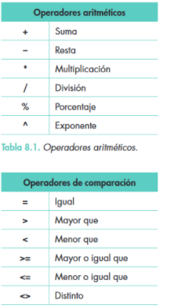

- [Hojas de cálculo](#hojas-de-cálculo)
  - [1. Introducción](#1-introducción)
  - [2. Conceptos básicos de hoja de cálculo](#2-conceptos-básicos-de-hoja-de-cálculo)
  - [3. Movernos por la hoja de cálculo](#3-movernos-por-la-hoja-de-cálculo)
  - [5. operadores](#5-operadores)
  - [6. FUNCIONES predefinidas](#6-funciones-predefinidas)
    - [INSERTAR FUNCIONES](#insertar-funciones)
    - [ASISTENTE DE FUNCIONES](#asistente-de-funciones)
    - [Escribir directamente las fórmulas](#escribir-directamente-las-fórmulas)
    - [Funciones matemáticas](#funciones-matemáticas)
    - [Funciones matemáticas](#funciones-matemáticas-1)
    - [Funciones de fecha y hora](#funciones-de-fecha-y-hora)
    - [FUNCIONES de texto](#funciones-de-texto)
  - [Referencia a celdas](#referencia-a-celdas)
    - [Referencia absoluta](#referencia-absoluta)
    - [Referencia relativa](#referencia-relativa)
    - [Referencia mixta](#referencia-mixta)
- [FORMATO CONDICIONAL](#formato-condicional)
- [Gráficos](#gráficos)
  - [Crear un gráfico](#crear-un-gráfico)
  - [Modificar un gráfico](#modificar-un-gráfico)
  - [Vista preliminar](#vista-preliminar)
  - [Configurar páginas de impresión](#configurar-páginas-de-impresión)
  - [Imprimir los datos de la hoja](#imprimir-los-datos-de-la-hoja)

# Hojas de cálculo

## 1. Introducción

Las hojas de cálculo programas informáticos capaces de trabajar con números de forma sencilla e intuitiva. Sus principales aplicaciones son la realización automática de cálculos, la creación de gráficos, la implementación de bases de datos, etc. 
Es por ello que una hoja de cálculo se puede ver como una combinación de muchas calculadoras operando simultáneamente y relacionadas entre sí, junto con un editor de textos, un editor de gráficos, una base de datos y unas grandes posibilidades de comunicación de datos con otros programas (Word, Power Point, Access, etc.).
Una de las hojas de cálculo más extendidas y utilizadas en la actualidad es Excel
Hoja de cálculo
Excel es una hoja de cálculo integrada en Microsoft Office. Esto quiere decir que si ya conoces otro programa de Office, como Word, Access, Outlook, PowerPoint, etc. te resultará familiar utilizar Excel, puesto que muchos iconos y comandos funcionan de forma similar en todos los programas de Office.

## 2. Conceptos básicos de hoja de cálculo

Repasemos la terminología asociada al trabajo con hojas de cálculo:

**Libros**

Los documentos de hoja de cálculo se denominan libros. El archivo se guarda con una extensión en función del programa con que se creó (Libro1.xls para microsoft office excel, .ods para libreoffice calc. ).
Cada archivo (libro) está formado por varias hojas. En principio consta de 3 hojas, pero se pueden ampliar (Hoja 1, Hoja 2, etc.)

**Hojas**

Cada hoja presenta una cuadrícula formada por columnas y filas.
Columnas: conjunto de celdas verticales. Cada columna se nombra por letras: A, B, C,..., AA, AB, AC,..., IV.

**Filas**

- Conjunto de celdas horizontales. Cada fila se nombra con números: desde 1 hasta 65536.
- Las hojas se componen de 1 048 576 filas por 16 384 columnas y se almacenan en libros.
Celdas
Una celda es la intersección de una columna y una fila en una hoja. Se nombra con el nombre de su columna y a continuación el número de su fila. Por ejemplo, B9 corresponde a la celda de la columna B con la fila 9.

**Celda activa**

Es la celda sobre la que se sitúa el cursor, preparado para trabajar con ella. Se identifica porque aparece más remarcada que las demás (en la imagen, la celda E13).

**Rango**

Bloque rectangular de una o más celdas que Excel trata como una unidad. Los rangos son vitales en la Hoja de Cálculo, ya que todo tipo de operaciones se realizan a base de rangos.
rango de celdas

Conjunto de celdas correlativas. Se define con la primera celda y con la última, separadas  por  el  signo  «dos  puntos» (:).  Es  muy  útil  para  realizar una misma operación sobre varias celdas simultáneamente.

## 3. Movernos por la hoja de cálculo

**Cómo ir directamente a una celda concreta**

Para acudir a una celda concreta de la hoja de trabajo se pueden hacer dos cosas:
En el cuadro de la celda activa, escribir la referencia celda a la que se quiere acudir.
Pulsar la tecla de función F5 y escribir la referencia de la celda.

**Cómo ir a la última fila, columna o celda**

Con la tecla CTRL:

- CTRL + flecha abajo: última fila
- CTRL + flecha arriba: primera fila
- CTRL + flecha derecha: última columna
- CTRL + flecha izquierda: primera columna

**pegado especial**

Existe la posibilidad de duplicar o mover el contenido de las celdas mediante las opciones de Copiar y Pegar del Portapapeles. Si se elige la opción Pegar, se copiarán, además del contenido de la celda, el formato y los comentarios. Para copiar solo alguna de las características, se deberá elegir la que corresponda del menú del botón Pegar o la opción Pegado especial
Tipos de datos

En las celdas se pueden introducir datos de muy diverso tipo:

- Texto
- Números
- Fechas
- Fórmulas, etc.
 
Según el tipo de dato que asignemos, tomará una celda como un número o como texto, por ejemplo.

**Validar datos**

Al introducir un dato en la celda hay que validarlo:
Escribiendo el dato y pulsando Intro.
Escribiendo el dato y presionando el botón de validar de la barra de fórmulas.

**Introducir datos**

los datos se introducen escribiéndolos directamente con el teclado en la celda donde se deseen añadir, y validándolos.

- Texto: hola
- Números: 5,231 (los decimales se suelen expresar con coma, si bien depende de la configuración regional del equipo)
- Fechas: 21-12-1997, 21/12/1997, 21-12-77, 21-dic-77, etc.

**Mensajes y errores en las celdas**

Posibles mensajes a la hora de introducir datos:

- #¡VALOR! Una dirección de referencia de celda está equivocada.
- 3,24E+13 Equivale a 3,24 · 1013
- ######## El dato ocupa un ancho mayor que el de la columna (ampliar columna para verlo).

## 5. operadores

En las fórmulas debemos tener en cuenta algunos aspectos elementales:
Empiezan con el signo igual «igual» (=).t
Todas las fórmulas utilizan uno o varios operadores aritméticos (Tabla 8.1) para combinar los números o las referencias a las celdas.
Si en una fórmula se usan varios operadores aritméticos, se pueden incluir paréntesis para especificar la manera de evaluarla.
Cuando en las fórmulas se utilizan funciones, no son necesarios los operadores aritméticos.

## 6. FUNCIONES predefinidas

Excel permite la realización automática de multitud de operaciones (matemáticas, estadísticas, lógicas, financieras, de fechas y hora, de búsqueda, de operación con textos, de Bases de Datos, etc.). Estas operaciones están disponibles en forma de funciones.
La utilización de funciones requiere de cierto conocimiento de las mismas (para qué sirven, resultado que ofrecen, sintaxis, datos de entrada aceptados, etc.). Afortunadamente Excel ofrece un asistente para la utilización de funciones.

### INSERTAR FUNCIONES

Todas las funciones se deben anteceder del signo igual (=). 
De otra forma no las reconocerá como fórmulas: =21+15.

### ASISTENTE DE FUNCIONES

Insertar Función (o clicar en el icono & en la barra de funciones). Se abre un cuadro de diálogo donde podemos buscar la función (por descripción, categoría, etc.).
Al seleccionar la función que se desea utilizar aparece el asistente de uso de funciones, que nos informará sobre cómo opera la función, operadores que requiere, resultado que devuelve, etc.

### Escribir directamente las fórmulas

Otra forma de utilizar funciones, distinta al asistente, es escribir directamente la función en la celda, siguiendo la siguiente sintaxis:
= FUNCIÓN (rango1;rango2;...)
El operador igual (=) es obligatorio antes del nombre de la función. 
Los operandos (celdas o rangos) se separan por punto y coma (;)

### Funciones matemáticas

Algunas de las funciones más habituales son:
FUNCIÓN
FINALIDAD
* =PROMEDIO()
  * Esta función nos devuelve el promedio (la media aritmética) de los números o del rango que está entre paréntesis.
  * Ejemplo: =PROMEDIO(4,5,6) devuelve el valor 5
* =MAX()
  * Esta función nos devuelve el valor máximo de una lista de números o de celdas.
  * Ejemplo: =MAX(1,12,125) devuelve el valor 125
=MIN()
Esta función nos devuelve el valor mínimo de una lista de números o de celdas.
Ejemplo: =MIN(1,12,125) devuelve el valor 1
* =MODA()
Esta función nos devuelve el valor más repetido de una lista de números o de celdas.
Ejemplo: =MODA(1,2,2,3,4) devuelve el valor 2 (el más repetido).
* =CONTAR()
  * Devuelve el número de celdas que contienen un número, así como el número contenido.
* =CONTAR.BLANCO()
  * Cuenta el número de celdas en blanco de un rango.
* =CONTARA()
  * Cuenta el número de veces que aparece contenido en forma de texto o en forma de números en un rango de celdas.
  * Ejemplo: =CONTARA(A1:A10). Si en esas diez celdas seis contienen algún tipo de texto, dos contienen números y el resto están vacías, el valor devuelto es 8 (porque hay 6 que contienen texto + 2 que contienen cifras).
* =SI()
  * Comprueba si se cumple una condición. Si el resultado es VERDADERO devuelve un valor, mientras que si es FALSO devuelve otro valor.
  * Ejemplo: =Si(A1>=5;”aprobado”;”suspendido”): Si el valor que está en la celda A1 es, por ejemplo, 7, el valor devuelto es "aprobado” y si es menor que 5, el valor será "suspendido”
* =CONTAR.SI()
  * Cuenta las celdas en un rango que cumplen una determinada condición especificada.
  * Ejemplo: Ejemplo: =CONTAR.SI(A1:A10;12). Si el número 12 está dos veces entre esas diez celdas, el valor devuelto es 2.

### Funciones matemáticas

Algunas de las funciones más habituales son:
= SUMA() =PRODUCTO()
Realiza la suma (+) o producto (*) de la cadena de números especificada.
=SUMAR.SI
Suma las celdas indicadas si se cumple determinada condición.
=M.C.D.() =M.C.M.()
Funciones para obtener el máximo común divisor y el mínimo común múltiplo
=POTENCIA()
Devuelve el resultado de elevar un número a una determinada potencia.
Ejemplo: =POTENCIA(2;3) da como resultado 8.
=RADIANES()
Convierte de grados a radianes.
=TRUNCAR()
Convierte un decimal en entero, eliminando la parte decimal.
=PI()
Devuelve el valor del número pi (n) con 15 dígitos.
=FACT()
Devuelve el factorial de un número (n!)
=ALEATORIO() =ALEATORIO.ENTRE()
Devuelve un n° aleatorio entre 0 y 1.
= NUMERO.ROMANO()
Convierte un número a número romano, en formato texto.
=SENO() =COS() =TAN()
Calcula el seno, coseno o tangente de un ángulo.

### Funciones de fecha y hora

Algunas de las funciones más habituales son:
=AHORA()
Devuelve la fecha y hora actual.
=DIASEM()
Devuelve el día de la semana codificado del 1 al 7
=DIAS360()
Devuelve el número de días entre 2 fechas (año de 360 días ^ 12 meses de 30 días)
=AÑO() =MES() =DIA() =HORA()
Devuelve el año actual (1997, 2015), mes actual (112), día actual del mes (1-31), y hora actual (0-23), respectivamente.

### FUNCIONES de texto

=CONCATENAR()
Une varias cadenas de texto en una sola.
=DERECHA()
Devuelve el número de caracteres especificado a la derecha de un texto.
=IZQUIERDA()
Ídem
=LARGO()
Devuelve el número de caracteres de una cadena de texto.
=IGUAL()
Comprueba si 2 cadenas de texto son iguales.
=REEMPLAZAR()
Reemplaza parte de una cadena de texto por otra.

Funciones de búsqueda y referencia
=BUSCARV()
Busca un valor determinado en la columna de la izquierda de una tabla y devuelve el valor en la misma fila de una columna especificada.
=HIPERVÍNCULO()
Crea un enlace a un documento en el disco duro o en la Web

## Referencia a celdas

Las referencias identifican una celda o un grupo de celdas en una hoja de cálculo. Con ellas se indica a Excel las celdas en las que debe buscar los valores que se utilizarán en la fórmula.

- B7: dato de la celda definida por la columna B y la fila 7.
- Hoja2!A2: dato de la celda definida por la columna A y la fila 2, en la Hoja2.
- C8:E15: rango definido desde la celda C8 hasta la celda E15
- $C$1: referencia absoluta (fija) al dato de la celda C1.

### Referencia absoluta

Es aquella que representa una dirección específica, cuando la fórmula se copia se conserva la fórmula íntegra. La referencia absoluta se determina colocando el signo de dólar ($) antes de la letra de la columna y antes del número de la fila que se quiera sea absoluto.
Ejemplo: $D$3.

### Referencia relativa

Es aquella que localiza relativamente, es decir, de acuerdo a la posición en que se encuentre la celda donde se escribió la fórmula. Indica a la hoja de cálculo la distancia de celdas hacia abajo, arriba, izquierda y derecha. 
Ejemplo: D3.

### Referencia mixta

Es aquella que representa una dirección absoluta únicamente en la fila o en la columna. 
Ejemplo: $D3, D$3.

# FORMATO CONDICIONAL

El formato condicional sirve para que, dependiendo del valor de la celda, Excel aplique un formato especial o no sobre esa celda.

El formato condicional suele utilizarse para resaltar errores, para destacar valores que cumplan una determinada condición, para resaltar las celdas según el valor contenido en ella, etc.
Formato condicional:
Seleccionar la celda.
Formato ->  Formato condicional.
Cuadro de diálogo: En este cuadro indicaremos una condición y el formato que deberán tener los valores que cumplan esa condición. Si pulsamos sobre Agregar >> podemos aplicar más de una condición. Como máximo podemos aplicar tres condiciones distintas.

# Gráficos

Las hojas de cálculo permiten obtener gráficos a partir de los datos que se tengan en dicha Hoja.
un gráfico es la representación visual de los datos de una hoja de cálculo. Los valores de las celdas aparecen en forma de líneas, barras, columnas, sectores, etc.

## Crear un gráfico

## Modificar un gráfico

Mover, copiar y redimensionar un gráfico
 Visualización e impresión de hoja
En la impresión, por defecto, se imprime la hoja de cálculo entera. Sin embargo, en la mayoría de los casos solo se necesita imprimir una parte. Para ello, primero hay que delimitar el área de impresión y, a continuación, imprimir esa área. En el caso práctico siguiente se desarrolla el procedimiento de impresión

## Vista preliminar

## Configurar páginas de impresión

## Imprimir los datos de la hoja

