# Edición de vídeo

# Introducción

Nuestros ojos ven en todo momento las imágenes que le llegan a través de la luz. Como es imposible grabarlo todo, para grabar vídeo se toman fotos llamadas **fotogramas** cada cierto tiempo y se juntan todas.

La retina de nuestro ojo tiene la propiedad de retener durante unos instantes lo último que ha visto, de modo cuando vemos una secuencia de imágenes que cambia rápidamente, las imágenes se superponen en nuestra retina unas sobre otras, dando la sensación de continuidad y movimiento.

Al reproducirse una detrás de la otra a mucha velocidad dan sensación de continuidad y "confunden" al ojo humano. 

# Parámetros del vídeo digital

¿Cómo medimos la calidad o el tamaño de un vídeo?

# Frames

Cada fotograma (frame) se divide en líneas horizontales y líneas verticales. Cada puntito donde se junta una línea vertical y una horizontal se llama **píxel** y, por tanto, un conjunto de píxels conforman un fotograma o frame.

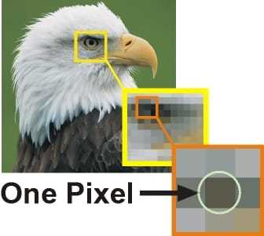

# Proporciones o relación de aspecto

La relación de aspecto nos indica la proporción o relación entre anchura (x) y altura (y). Se expresa como x:y

- En la televisión tradicional esta ha sido siempre de 4:3, pues esta era la forma de las televisiones.
- Actualmente, debido a la alta definición se utiliza más el formato panorámico, más alargado y similar a la vista humana. El formato llamado panorámico es el de 16:9 o dieciséis novenos.

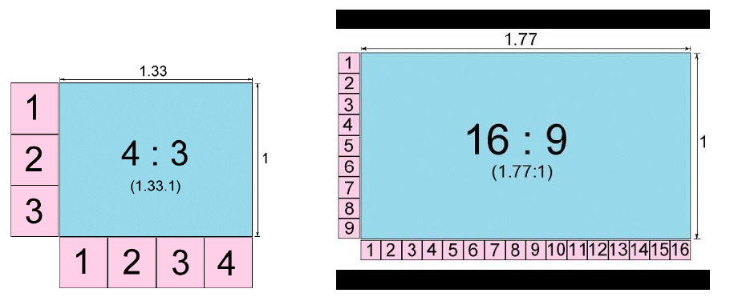

En caso de que el la relación de aspecto del vídeo y del móvil, televisión o dispositivo en el que lo esté viendo no coincida, se rellena con **bandas negras**.

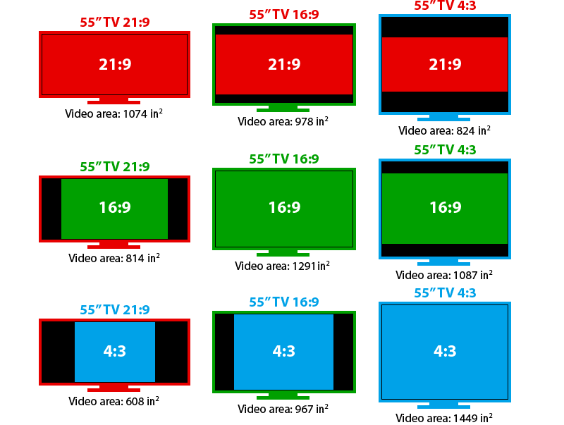

# Resolución

Define el máximo detalle que se puede obtener de la imagen y determina su calidad. El tamaño de la imagen se calcula como el producto de  píxeles horizontales y  píxeles verticales de la imagen.

Estas dos imágenes tienen una resolución de 3x3 y 6x6 píxeles.

Estas dos, de 10x10 y 15x15. 

Si tuviéramos más píxeles, como en una imagen de 1280 x 720, la calidad sería mucho mejor y tendría más definición. Por contra, ocuparía más espacio. Esta imagen tendría una resolución de 921.600‬ de píxeles. A llegar a 1.000.000, se cuentan por millones de píxeles o **megapíxels**.

Para indicar la resolución de una imagen se utiliza habitualmente solo los **píxeles de la vertical** seguidos de una letra:

- P si el video es progresivo
- I si el video es entrelazado

Por ejemplo, los vídeos en fullHD tienen una resolución de 1080p. Esto significa que la imagen mide 1080 píxeles en vertical y el video es del tipo progresivo.

# FPS o fotogramas por segundo

Los vídeos están formados por muchas fotos, una detrás de la otra. A cada una de estas fotos se le llama un **fotograma** (**frame**), y según la cantidad de fotos por segundo que tenga el vídeo, variará su calidad.

La unidad utilizada es **frames por segundo (fps)**. A mayor tasa de frames por segundo, la imagen se verá más fluída. Si la tasa es muy baja, puede llegar a marear, además de verse mal.

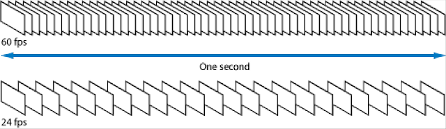

Habitualmente:

- Televisión: 25 fps
- Cine: 24 fps
- Dibujos animados: 15 fps

Hoy en día se llegan a grabar vídeos de 50 o 60 FPS, un valor más elevado. El vídeo parece más **real**, pero a cambio los vídeos:

- Ocupan mucho más espacio.
- Tardan más sen subirse a Internet

Los FPS se suelen indicar a continuación de la resolución:

- 1080p60 sería un vídeo Full HD con 60 frames por segundo
- 2160p60 sería un vídeo Full HD con 60 frames por segundo

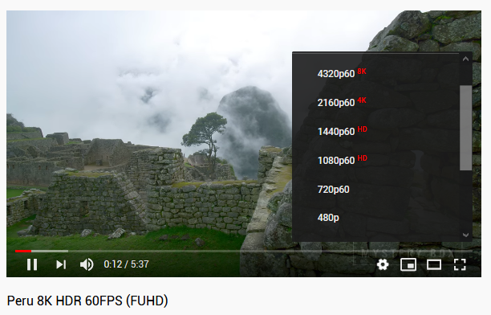

# Alta definición

Hoy en día la mayoría de equipos que pueden procesar y reproducir video en alta definición. Alta definición se aplica al contenido que tiene más de 720 píxeles de alto. Se etiquetan con:

- **HD** para una calidad de 720p
- **Full HD** para una calidad de 1080p
- **4K** para una calidad equivalente a 4 pantallas FullHD juntas (2160p).

Los equipos que compramos traen etiquetas en las cajas que nos indican de la calidad de vídeo que permiten visualizar o grabar.

Existen calidades de vídeo por encima del FullHD, como **4K** o incluso **8K**. Como se puede apreciar, en el mismo tamaño de televisión caben más píxeles, y por tanto la definición y la calidad de la imagen es mayor.

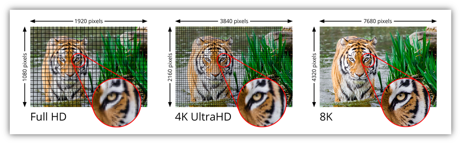

Para poder ver películas o series en 4K o superior, necesitamos:

- Tener un **monitor** compatible con esta tecnología. Si nuestra televisión es fullHD no podremos ver nada grabado a 4k.
- Que la **película** o la serie que veamos esté grabada a 4K. Si no lo está, se verá con menor calidad de la esperada, por mucho que la televisión sea 4K.
- La **conexión a Internet** tiene que ser suficientemente rápida para permitir recibir el contenido en 4K. Si tenemos contratado, por ejemplo, Netflix a 4K, pero nuestra conexión de internet es muy lenta, solo lo veremos en FullHD o menor. 

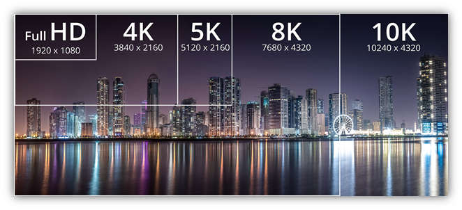

Como los discos Blu-ray no tienen capacidad suficiente para guardar una película en formato 4K (es mucho más grande), se inventó el formato **Blu-ray Ultra HD**. Las películas grabadas en un Blu-ray convencional, solo pueden almacenar video en FullHD (1080).

# Bitrate o flujo de bits

Juntando la resolución y los fps, tenemos la tasa de bits o bit rate. Esto significa la velocidad a la que se envía el vídeo (Mbps), y depende de su tamaño y, por tanto, de su calidad.

Ejemplos:

- Un vídeo 1080p24 tiene un bitrate de 49.766.400‬ bits por segundo(aproximadamente 50 Mbps). Es decir, que si no tengo una conexión de Internet de 50 Mb o más, probablemente no lo veré bien.
- Un vídeo 1080p60 tiene un bitrate de 124.416.000‬  bits por segundo(aproximadamente 124 Mbps). Es decir, que si no tengo una conexión de Internet de 100 Mb o más, probablemente no lo veré bien.

Cómo véis, la calidad de nuestra conexión a Internet es fundamental para determinar la calidad que puedo ver de vídeo en casa. 

# Programas de edición de vídeo

Existen diferentes programas y apps que permiten componer fragmentos de vídeo y a partir de ellos:

- Agregar audio, imágenes...
- Insertar texto
- Añadir efectos de vídeo y transiciones

Ejemplos:

- Windows Movie Maker (Windows)
- Openshot (linux)
- Otros...

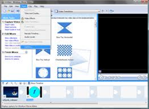

También existen programas que nos permiten capturar la pantalla de nuestro ordenador para así grabarla o compartir lo que estamos viendo o jugando como:

- Camtasia
- OBS

De este modo se graban muchos de los videotutoriales y partidas de videojuegos que podemos encontrar en Internet.

# Dispositivos de captura

Para poder grabar vídeo, podemos utilizar diferentes dispositivos. La evolución en la captura de vídeo doméstico has sido la siguiente:

- Generalmente se han utilizado cámaras que grababan primero en cintas, y más adelante en mini DVDs. Las cámaras de vídeo y de fotos eran completamente independientes.
- Posteriormente aparecieron las **webcam**, que nos permitían conectarlas directamente a un ordenador y transmitir lo grabado, permitiendo las **videoconferencias**.
- Las **cámaras de fotos digitales** se volvieron más pequeñas y asequibles, y con el tiempo permitieron la grabación de vídeo.
- Por último, **teléfonos móviles y tablets** han ido incorporando también cámaras que permiten grabar vídeo y tomar fotos. Al tener estos dispositivos conexión a Internet integrada, el proceso de grabar y compartir las grabaciones se hace mucho más rápido.

## Tarjetas de memoria

Con la invención de las **tarjetas de memoria**, los vídeos se pasan a grabar en estas tarjetas. Las tarjetas se pueden intercambiar entre dispositivos, y gracias a ellas tenemos más espacio para guardar fotos o vídeos.

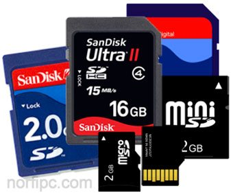

## Memoria interna

Los dispositivos tienen una **memoria interna** dentro, que no se puede extraer. Se utiliza para guardar las apps y el sistema operativo. Con el tiempo estas memorias se han hecho más grandes y, en general, ya no suele ser necesaria una tarjeta de memoria para guardar vídeo, fotos o música, sino que se guardan en la memoria interna del dispositivo.

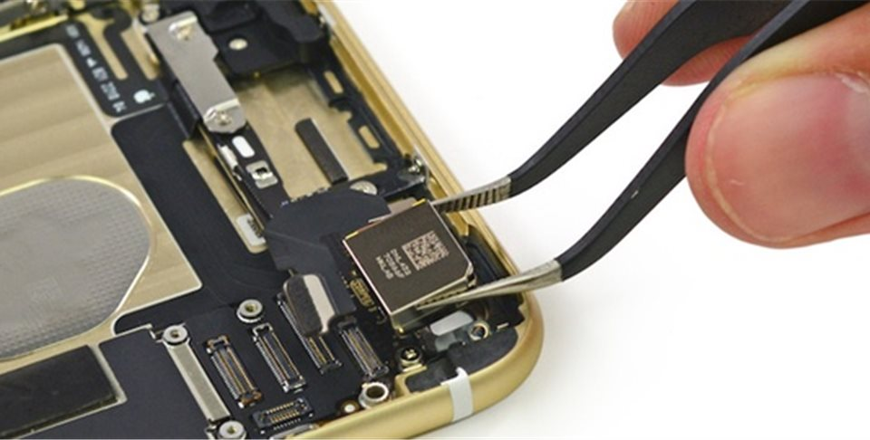

## Servicios en la nube

Tanto las tarjetas como la memoria interna necesitaban de una conexión a un ordenador o portátil para poder editar el vídeo, así como guardarlo o subirlo a internet y compartirlo, generalmente mediante un cable tipo USB o firewire.

Hoy en día las **conexiones de datos** han aumentado de velocidad y las tecnologías inalámbricas o Bluetooth han permitido la conexión sin cable. Esto, junto a que las compañías ofrecen servicios de **almacenamiento en la nube** y las redes sociales, han permitido que el vídeo ya no sea necesario  enviarlo a otro dispositivo, sino que lo podemos grabar, editar y subir a Internet directamente.

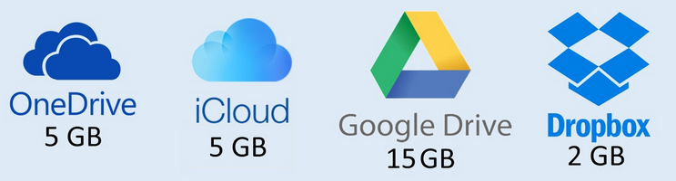

Existen también plataformas de vídeo online, como **Youtube** o **Twitch** que permiten crear canales, suscribirse a ellos, y comentar, pareciéndose cada vez más a una red social propiamente dicha.

Estas plataformas han ido evolucionando y permiten también editar el contenido desde la propia página web, o por ejemplo la **transmisión en directo**.

# Formatos de vídeo

Muchas veces el problema con todas estas opciones y formatos es la **compatibilidad**. Un dispositivo es compatible con un tipo de vídeo si es capaz de reproducirlo sin problemas. Cada dispositivo graba en un formato diferente y podemos tener problemas a la hora de reproducirlos.

Tipos de archivos de vídeo:

| Extensión  | Formato de vídeo  |
|---|---|
| AVI  | Formato más extendido. Utilizado inicialmente en Windows  |
| MOV  | De Apple. Necesita reproductor específico  |
| WMV  | Formato de microsoft. Permite añadir protección de copyright.Ofrece soporte para la gestión digital de derechos, evitando que los usuarios puedan copiar la información, interesante para los vendedores de audio y vídeo digitales en línea.  |
| MPG  | Compatibilidad mundial, compresión de audio y vídeo con poca perdida de calidad hace posible la fácil descarga de estos archivos en una web. |
| MKV  | Muy utilizado en películas y series. Se utiliza este formato porque permite almacenar muchos datos en el mismo archivo. Por ejemplo, incluir pistas de audio en varios idiomas.

# Tecnología 3D

## Funcionamiento

La tecnología 3D está basada en diferencia de percepción de los dos ojos. En el mundo real detectamos la profundidad de las cosas porque la luz llega un poco diferente a cada uno de nuestros dos ojos. Si no te lo crees, cierra primero solo un ojo, luego solo el otro, y verás que lo que ves es diferente. Eso hace que veamos "en 3D".

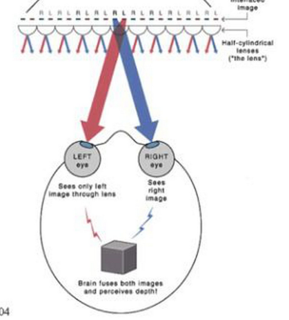

Al mirar una pantalla, todo lo que aparece en ella está a la misma distancia de nosotros, por lo que esta distancia se tiene que simular. Para ello se colorea el vídeo con colores azules y rojos.

Por supuesto, para simular esto necesitamos unas gafas. Al colocarnos unas gafas 3D, cada ojo recibe una imagen ligeramente diferente, por el filtrado de cada lente. Esto es lo que produce la sensación de profundidad.

# Videoconferencia

Hoy en dia existen múltiples herramientas para videoconferencia, que nos permiten hacer videollamadas entre 2 o más personas, como:

- Facetime (productos Apple)
- Whatsapp 
- Google Hangouts

Otras herramientas me permiten también compartir una pantalla, chatear al mismo tiempo o enviar documentos.
