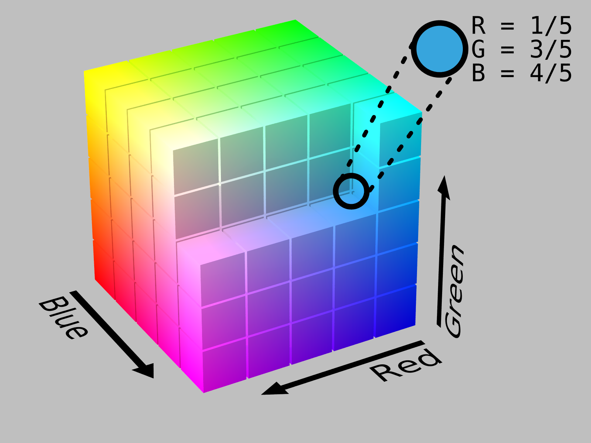
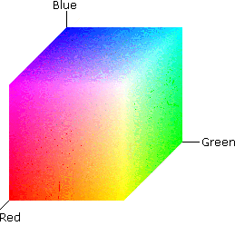

- [1	TIPOS DE IMÁGENES](#1tipos-de-imágenes)
  - [1.1	IMÁGENES ANALÓGICAS Y DIGITALES](#11imágenes-analógicas-y-digitales)
  - [1.2	VENTAJAS DE LA IMAGEN DIGITAL:](#12ventajas-de-la-imagen-digital)
- [2	TIPOS DE IMÁGENES DIGITALES:](#2tipos-de-imágenes-digitales)
  - [2.1	IMÁGENES DE MAPAS DE TOS (BITMAPS)](#21imágenes-de-mapas-de-tos-bitmaps)
  - [2.2	IMÁGENES VECTORIALES](#22imágenes-vectoriales)
- [3	RESOLUCIÓN:](#3resolución)
- [4	COLOR:](#4color)
  - [4.1	PROFUNDIDAD DE COLOR (PROFUNDIDAD DE PÍXEL)](#41profundidad-de-color-profundidad-de-píxel)
  - [4.2. MODOS DE COLOR](#42-modos-de-color)
  - [4.3. COLOR HSB](#43-color-hsb)
  - [4.4	COLOR RGB](#44color-rgb)
  - [4.5	COLOR CMYK](#45color-cmyk)
- [5.ADQUISICIÓN DE IMÁGENES](#5adquisición-de-imágenes)
- [6	FORMATOS DE ARCHIVO.](#6formatos-de-archivo)
- [7	COMPRESIÓN](#7compresión)
  - [7.1.1	COMPRESIÓN CON PÉRDIDA](#711compresión-con-pérdida)
    - [7.1.2	COMPRESIÓN SIN PÉRDIDA](#712compresión-sin-pérdida)
- [8. FORMATOS DE ARCHIVOS MAPA DE BITS](#8-formatos-de-archivos-mapa-de-bits)
- [9. EDICIÓN DE IMÁGENES DIGITALES](#9-edición-de-imágenes-digitales)

EDICIÓN DIGITAL DE IMÁGENES
# 1	TIPOS DE IMÁGENES

## 1.1	IMÁGENES ANALÓGICAS Y DIGITALES

Las imágenes analógicas son aquellas que presentan una variación continua de los valores de
luminosidad, saturación y color. Son las imágenes naturales.

La	imagen	digital supone	la	traducción de	los valores de	luminosidad,	saturación	y color	a un
lenguaje que pueda entender el ordenador y los periféricos con él relacionados, esto es, un lenguaje digital (0 y 1)

## 1.2	VENTAJAS DE LA IMAGEN DIGITAL:

-	No se degradan con el tiempo (se mantienen estables)
-	Pueden ser manipuladas con facilidad.
-	Se guardan en dispositivos de almacenamiento que requieren de poco espacio físico.
Desventajas de la imagen digital:
-	La calidad de imagen analógica es superior a la digital.
Digitalización: proceso por el cual se transforma una imagen analógica a una digital

# 2	TIPOS DE IMÁGENES DIGITALES:

## 2.1	IMÁGENES DE MAPAS DE TOS (BITMAPS)

Las imágenes de mapa de bits están descritas mediante una gran cantidad de cuadradlos, llamados píxeles, que están rellenos de color aunque sólo sea blanco o negro (cada píxel de un color, mezcla del Roj o-V erde-Azul).

## 2.2	IMÁGENES VECTORIALES

Se componen de contornos y refíenos definidos matemáticamente (vectorialmente) mediante precisas ecuaciones que describen perfectamente cada ilustración.

Imagen formada por 2 contornos de diferentes colores 
Otra diferencia importante es el peso que tienen en disco 0° que ocupan); las imágenes vectoriales pesan poco, mientras que las de mapas de bits pesan mas que las vectoriales.

Las representaciones en mapa de bits son muy aconsejables cuando el original presente una gran tonalidad de colores, aunque sean grises, como es el caso de las fotograf as o las reproducciones de pinturas, sin embargo, las imágenes vectoriales son idóneas cuando se trate de representar ilustraciones compactas, con poca variación en su gama de colores y que requieren contornos precisos y susceptibles de ser escaladas, como	logotipos o	imágenes	corporativas que se	reproducen a	diferentes	tamaños,	desde	una	tarjeta	de
visita hasta un panel publicitario de grandes dimensiones.

También	hay que	tener	presente	que cualquier	imagen	digital,	ya	sea	vectorial	o mapa de bits,	se
representará e imprimirá en “modo píxel”.

# 3	RESOLUCIÓN:

La resolución de una imagen es	la	cantidad	de	píxeles	que	la	describen. Suele	medirse en	términos de
"píxeles por pulgada" (ppp ) y de ella depende tanto la calidad de la representación como el tamaño que ocupa en memoria el archivo gráfico generado.

En el ejemplo de la página 1, si esos 100 píxeles (10x10) están en 1 pulgada (resolución=100 ppp), la imagen tendrá mayor resolución que si están en 10 pulgadas (resolución = 10 ppp)
Si estas imágenes tienen el mismo tamaño, en pulgadas, está claro que la primera tiene mas píxeles que la última, por lo tanto mayor resolución.

La medida de una imagen son las dimensiones reales en términos de anchura y aura una vez impresas. 
Por ejemplo: Una imagen con una resolución de 20 ppp se imprime con una configuración de 300x200 píxeles. Dará un tamaño de imagen:
Horizontal: 300píxeles/75 ppp=4,17pulgadas x 2,54 cm/pulgada= 10,59 cm Vertical: 200píxeles/75 ppp=2,78pulgadas x 2,54 cm/pulgada= 7,06 cm

La resolución óptima que debe tener una imagen para imprimir es de 300 ppp
En cuanto al tamaño de la imagen en un monitor, depende de la configuración del monitor.

Por ejemplo, en un monitor de 15 pulgadas con la configuración típica de 800 píxeles horizontales y 600 verticales, una imagen con dimensiones de 800 x 600 píxeles llenaría toda la pantalla. En un monitor de 17 pulgadas con un ajuste, también, de 800 x 600 píxeles, la misma imagen volvería a llenar la pantalla, pero cada uno de los píxeles tendría un tamaño mayor. Si se camba la configuración de este segundo monitor a 1024 x 768 píxeles, la imagen se mostraría en un tamaño más pequeño, sin llegar a ocupar toda la pantalla.
Mira este	ejemplo,	verás	como una	imagen con la	misma	dimensión	en	píxeles	es mostrada de forma distinta en un mismo monitor con configuraciones distintas.

El tamaño o medida de una imagen son sus dimensiones reales en términos de anchura y aura una vez impresa, mientras	que el	tamaño del archivo	se	refiere	a	la	cantidad	de memoria	física	necesaria	para almacenar la información de la imagen digitalizada en cualquier soporte informático de almacenamiento.

Lógicamente la	resolución	de	la	imagen condiciona	grandemente	estos	dos conceptos.	Puesto	que el número de píxeles de una imagen digitalizada es fio, al aumentar el tamaño de la imagen reducimos la resolución y viceversa.

Cuando pretendemos que una aplicación que manipule imágenes digitalizadas mantenga el tamaño de las mismas pero aumente la resolución la estamos "obligando" a que se "invente" píxeles y, en determinados casos, puede provoca que la imagen final así manipulada tenga una calidad más pobre que la original originada en pérdida de datos o desenfoque de la ilustración.

Reducir la resolución de la imagen, manteniendo su tamaño, ocasiona la eliminación de píxeles y por lo tanto, una descripción menos precisa de la misma junto a unas transiciones de color más bruscas. 

El tamaño del archivo que genera una imagen digitalizada es proporcional, lógicamente, a su resolución, por lo tanto, modificando ésta estamos modificando, en el mismo sentido el tamaño del archivo.

# 4	COLOR:

## 4.1	PROFUNDIDAD DE COLOR (PROFUNDIDAD DE PÍXEL)

Se llama profundidad de color a la cantidad de colores diferentes que pueden presentarse en una imagen. Para almacenar esta información se asigna un número de bits para indicar el color de cada pixel. 

Si quisiéramos saber el color de un pixel en una imagen de 16 colores necesitaríamos 16 (=24), combinaciones diferentes esto es 4 bits y así sucesivamente.

Veamos los bits necesarios para cada profundidad de color.
Número de bits	Combinaciones posibles	Número de colores
8	28	256
16	216	Aprox 65000
24	^24_	16,7 millones

## 4.2. MODOS DE COLOR

Fundamentalmente existen cuatro modos de color que son: 

- HSB (tono, saturación y brillo)
- RGB (red, green y blue o RVA, rojo, verde y azul)
- CMYK (cián, magenta, amarillo y negro) 

## 4.3. COLOR HSB

Está basado en el modo en que el ojo humano percibe el color, por lo tanto se trata del modo más "natural" y atiende a tres características fundamentales:

- **Tono**: Normalmente esta característica se confunde con el nombre del color en cuestión y se refere a la longitud de onda de la luz refejada o emitida por un objeto.
- **Saturación**: Es la intensidad del color y representa el matiz en relación al tono, midiéndose en términos de porcentaje de 0% a 100% (saturación máxima* También se le conoce con el término "croma".
- **Brillo**: Consiste en la claridad u oscuridad relativa a cada tono de color y se mide también en porcentaje de 0% (negro) al 100%> (blanco).

## 4.4	COLOR RGB

Este modo es el más cercano al ser el que se usa en la iluminación artificial y en la mayoría de monitores y pantallas gráficas proporcionando la mayoría del espectro visible mezclando las luces generadas por fósforos rojos, verdes y azules. Estos tres colores primarios crean el banco cuando se combinan simultáneamente por eso se llaman también "aditivos".

Teniendo en cuenta que en la memoria del ordenador (a RAM), la memoria está organizada en boques de 8 bits (1 byte) para almacenar los datos, por tanto en 1 byte se pueden almacenar 256 colores. Por ello, en cada canal:

- **Rojo**	Presenta 28 tonalidades diferentes, es decir 256 tonalidades.
- **Verde**	Presenta 2 tonalidades diferentes, es decir 256 tonalidades.
- **Azul**	Presenta 2 tonalidades diferentes, es decir 256 tonalidades.

Por ello, cada píxel podrá tener: 256x256x256 = **16 millones de colores diferentes**

## 4.5	COLOR CMYK

Este sistema responde a una idea totalmente opuesta al anterior, puesto que, en vez de basarse en una fuente de luz para generar las mezclas de los colores primarios, se basa en la propiedad de la tinta impresa en papel de absorber la luz que recibe.

Cuando una luz banca incide sobre tintas translúcidas, éstas absorben parte del espectro de modo que el color no absorbido se refleja. En el plano teórico, los pigmentos mezclados de cián, magenta y amarillo deberían absorber todo el espectro, produciendo, en consecuencia, negro. Por esta razón son llamados "colores sustractivos". En la práctica todas las tintas contienen impurezas y ello ocasiona que la mezcla genere un color marrón oscuro, siendo necesario perfilar con tinta negra para conseguir un color negro auténtico.

# 5.ADQUISICIÓN DE IMÁGENES

Se pueden obtener imágenes digitales de diferentes maneras:

-	Por digitalización de imágenes analógicas (escaneado)
- Por una cámara digital.
- Bajándolas de Internet.
- De diferentes soportes (CD, DVD, memorias flash,...)
- Creándolas con un editor de imágenes.

Tipos de imágenes más habituales

- Fotografías digitales	Las imágenes son de alta calidad. Normalmente trabaja con archivos jpg y raw y en algunos casos tif.
- Imágenes de Internet	Son imágenes de baja resolución (72 ppp), optimizadas a diferentes formaos (gif, jpg, pn...)

# 6	FORMATOS DE ARCHIVO.

Una vez que tenemos nuestra imagen, lo normal es que la guardemos en un archivo. Esta acción de guardado generará un archivo que contendrá:

- Los bits que describen la imagen 
- Información sobre la propia imagen

El formato de una imagen es la estructura de datos en la que se guarda la imagen

- **JPEG** (Joint Photographic Experts Group;Grupo de Expertos en Fotografía): formato de compre-sión muy utilizado. Es el habitual en las cámaras fotográficas. El proceso, no obstante, acarrea una pérdida de calidad de imagen, aunque no se aprecia a simple vista.
- **GIF** (Graphics Interchange For-mat; formato de intercambio de gráficos): mantiene íntegra la calidad de origen. Se usa mucho para animaciones.
- **BMP** (Bit Mapped Picture; mapa de bits): creado por Microsoft.
- **TIFF** (Tagged Image File Format;formato de archivo de imágenes con etiquetas): archivo de gráfi cos de mapa de bits muy grandes. Se utiliza en artes gráficas. t 
- **PNG** (Portable Network Graphics; gráfi cos de red portables): man-tiene íntegra la calidad original y soporta transparencia

# 7	COMPRESIÓN

El alto consumo de disco necesario para almacenar imágenes propició que apareciesen diferentes técnicas que trataban de comprimir el volumen del archivo y mitigar así su voracidad de recursos.

## 7.1.1	COMPRESIÓN CON PÉRDIDA

Se produce cuando los algoritmos usados para reducir las cadenas del código desechan información y, como consecuencia, al descomprimir el archivo se produce una pérdida de información en los datos de la imagen. Sin embargo, algunos como el JPEG que es un formato con pérdida, usan una manera de compensar ésta, de modo que la información que eliminan no pertenece al	espectro	visible,	así,	al descomprimirse,	el	ojo	humano no puede	detectar	ninguna
aeración. Esta conducta se tipifica matizando que son formaos SIN PÉRDIDA VISUAL. 
### 7.1.2	COMPRESIÓN SIN PÉRDIDA
Evidentemente condensan las cadenas de código sin despreciar ningún tipo de información sobre la imagen, por	lo	que	ésta	se	regenera	intacta	al	ser	descomprimida.	Está claro	que	las	ratios de
compresión son menores con estos sistemas pero a veces el sacrificio merece la pena.
Formaos de archivos vectoriales

| Extensión | Características                                                      |
| --------- | -------------------------------------------------------------------- |
| wmf       | Es típico de las aplicaciones de Windows.                            |
| odg       | Corresponde al estándar abierto de documentos (odt) de OpenOfice.org |
| cdr       | Típico de la aplicación Corel Draw.                                  |
| swf       | Animación de Macromedia Flash.                                       |
| dxf       | Utilizado en programas de arquitectura, como Autocad o Qcad.         |

# 8. FORMATOS DE ARCHIVOS MAPA DE BITS

| Extensión  | Características                                                                                                                                                                                    |
| ---------- | -------------------------------------------------------------------------------------------------------------------------------------------------------------------------------------------------- |
| bmp        | Formato típ^ico de Paint. No pierden calidad aunque se manipulen muchas veces. Profundidad de color de 24 bits (16 millones de colores) Se puede comprimir sin pérdidas. No admite transparencias. |
| gif        | Profundidad de color de 8 bits (256 colores) Se puede comprimir sin pérdidas. Admite transparencias.                                                                                               |
| jpg o jpeg | Profundidad de color de 24 bits (16 millones de colores) Se puede comprimir con pérdidas, pero el usuario puede elegir el grado de compresión. No admite transparencias.                           |
| png        | Profundidad de color de 24 bits (16 millones de colores) o de 8 bits (256 colores) Se puede comprimir sin pérdidas. Admite transparencias.                                                         |
| tif o tiff | Profundidad de color de hasta 64 bits. Se puede comprimir sin pérdidas. Admite transparencias. Es ideal para imprimir.                                                                             |
| xcf        | Archivo original de Gimp.Profundidad de color de 8 bits por canal (16 millones de colores) Admite transparencias                                                                                   |
| psd        | Archivo original de Photoshop Document. Profundidad de color de 8 bits por canal (16 millones de colores). Admite transparencias                                                                   |
| raw        | Condene la información de la imagen tal y como fue adquirida por el sensor.                                                                                                                        |
| pict o pct | Formato de imagen de Macintosh Profundidad de color de hasta 64 bits Se puede comprimir sin pérdidas. Admite transparencias.                                                                       |

# 9. EDICIÓN DE IMÁGENES DIGITALES

Existen infinidad de aplicaciones para editar o crear imágenes.

| Programas                                              | Aplicaciones                                            | Tipos de imágenes    |
| ------------------------------------------------------ | ------------------------------------------------------- | -------------------- |
| Paint GIMP Photoshop Paint Shop Pro Picassa Irfan View | Retoque fotográfico, gráfico, visores de imágenes, etc. | Mapas de bits        |
| Corel Draw, FreeHand, Inkscape, Illustrator            | Dibujo artístico                                        | Imagines vectoriales |
| AutoCad, AutoSketch, Qcad. CATIA                       | Ingeniería y arquitectura. Dibujo técnico en 2D y 3D    |                      |
| 3D Studio Max, Blender                                 | Diseño 3D                                               |                      |

