Sonido digital

- [1	SONIDO](#1-sonido)
  - [1.1	FRECUENCIA DE UN SONIDO](#11-frecuencia-de-un-sonido)
  - [1.2 FORMA DE ONDA](#12-forma-de-onda)
- [2. Generación de sonido](#2-generaci%c3%b3n-de-sonido)
  - [2.1. Sonido en altavoces](#21-sonido-en-altavoces)
  - [2.2. SONIDO DE LA VOZ](#22-sonido-de-la-voz)
- [3. CAPTURA DEL SONIDO](#3-captura-del-sonido)
  - [3.1	MICRÓFONOS](#31-micr%c3%93fonos)
  - [3.2 Grabación de sonido](#32-grabaci%c3%b3n-de-sonido)
    - [3.2.1. VINILOS](#321-vinilos)
    - [3.2.2. CASSETTE Y CD](#322-cassette-y-cd)
  - [3.3	INFORMÁTICA](#33-inform%c3%81tica)
  - [3.4. TARJETAS DE SONIDO INTERNAS](#34-tarjetas-de-sonido-internas)
  - [3.5. Tarjetas integradas](#35-tarjetas-integradas)
  - [3.6. TARJETAS DE SONIDO EXTERNAS](#36-tarjetas-de-sonido-externas)
- [4. DIGITALIZACIÓN DEL SONIDO](#4-digitalizaci%c3%93n-del-sonido)
  - [4.1. FORMATO DE AUDIO DIGITAL](#41-formato-de-audio-digital)
  - [4.2. COMPRESIÓN](#42-compresi%c3%93n)
  - [4.3.	FORMATO MIDI](#43-formato-midi)
- [5. PROGRAMAS DE AUDIO](#5-programas-de-audio)
  - [5.1. REPRODUCTORES](#51-reproductores)
  - [5.2.	DAWs o estaciones de trabajo](#52-daws-o-estaciones-de-trabajo)
- [6.TRANSMISIÓN A TRAVÉS DE INTERNET](#6transmisi%c3%93n-a-trav%c3%89s-de-internet)
  - [6.1. Streaming](#61-streaming)
  - [6.2. Podcast](#62-podcast)

# 1	SONIDO

El sonido es una sensación producida en el oído por un movimiento vibratorio que se propaga por un medio (generalmente por el aire) que transmite la vibración hasta nuestro oído.

En el ejemplo, al vibrar la campana, mueve el aire que hay alrededor con una frecuencia determinada. Cuando esta llega al oído, activa el mecanismo de oído interno que traduce esta vibración en señales eléctricas que llegan a nuestro cerebro.

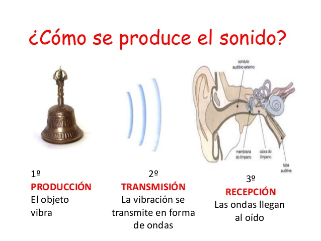

El sonido se propaga por un medio físico que generalmente es el aire, pero no es el único. En cambio, no se propaga en el vacío, por lo que en el espacio no podríamos oír nada, por ejemplo.

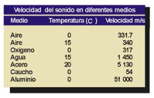

## 1.1	FRECUENCIA DE UN SONIDO

La frecuencia de sonido es el número de vibraciones por segundo que produce. Se mide en Herzios (Hz), aunque generalmente se **utilizan** unidades más grandes: KHz, MHz
Los sonidos agudos tienen una frecuencia más alta, mientras que los sonidos graves tienen frecuencias más bajas. 

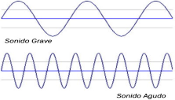

El oído humano percibe sonidos entre 20 Hz y 20 KHz (20.000 Hz). Esto es así puesto que la mayoría de los sonidos que interesan al ser humano se dan entre estas frecuencias. Por encima de 20.000 Hz o por debajo de 20 Hz hay sonidos, pero las personas no somos conscientes de ellos.

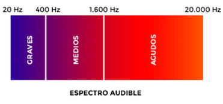

En este vídeo, podéis comprobar los diferentes sonidos que puede percibir un ser humano, de más grave a más agudo:

https://www.youtube.com/watch?time_continue=47&v=qNf9nzvnd1k&feature=emb_logo

Los sonidos por encima del máximo humano se llaman ultrasonidos, y pueden ser percibidos por ciertos animales. En el caso del delfín y los murciélagos los utilizan a modo de sónar para comunicarse a largas distancias u orientarse a través de ellos. Por el contrario, también existen los infrasonidos.

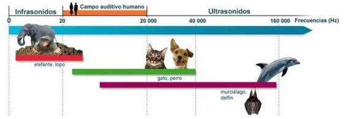

## 1.2 FORMA DE ONDA

Normalmente los sonidos o canciones contienen más de una frecuencia, puesto que están compuestos de varios instrumentos y voces al mismo tiempo.

Por ello, cada sonido tiene una forma de onda, que representa la amplitud (más fuerte o más flojo) y la frecuencia del sonido en cada segundo.

- En este caso, los fragmentos de izquierda y derecha son sonidos más graves (se ve más distancia entre las ondas), pero más fuertes (por ello suben más alto).
- Por el contrario, el fragmento de en medio suena más flojo pero tiene una frecuencia más aguda.

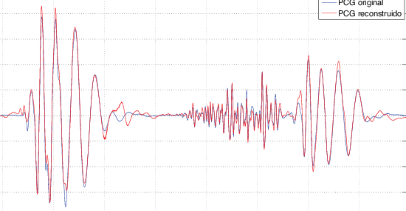

Aquí podemos ver el sonido correspondiente a una palabra pronunciada por una persona. Cada trozo corresponde a una sílaba. Cada sílaba de una palabra produce un golpe de sonido, separadas una de otra por un breve espacio.

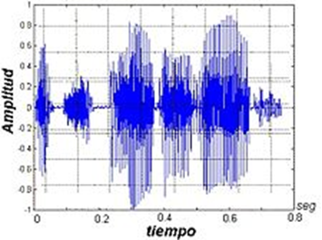

# 2. Generación de sonido

Para generar un sonido necesitamos hacer vibrar el aire de alguna forma (palmas, cuerdas vocales, etc.). Algunos aparatos e instrumentos musicales generan sonido utilizando unas membranas que se mueven en función de la frecuencia del sonido. Otros modifican el aire de alguna forma para producir sonido.

## 2.1. Sonido en altavoces

Los altavoces, según la electricidad que reciben, activan un electroimán. Este electroimán mueve la membrana, que al desplazarse mueve a su vez el aire creando sonido.

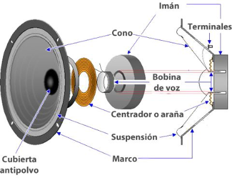

Podéis ver un vídeo del proceso a cámara lenta. Se ha filmado a cámara lenta, porque normalmente la vibración de la membrana es tan rápida que no podemos percibirlo.

En los sonidos graves (generalmente en los subwoofers), la vibración es más lenta y por tanto fácil de ver.

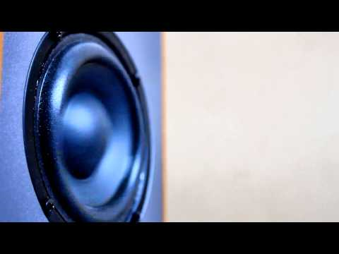

## 2.2. SONIDO DE LA VOZ

Otro método de generar diferentes sonidos es el empleado por las cuerdas vocales que todos tenemos en la garganta. Éstas funcionan de un modo ligeramente diferente.
El aire es impulsado por los pulmones, y las cuerdas vocales, según su posición, simplemente “modulan” cómo será el sonido.

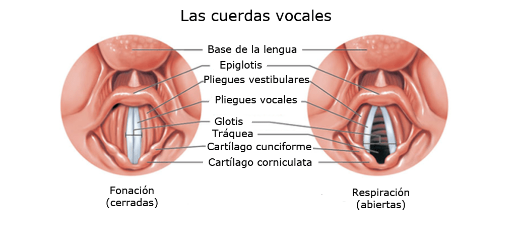

Este funcionamiento tiene lógica, puesto que no únicamente utilizamos los pulmones para hablar, sino también para respirar, y no siempre nos interesa emitir algún sonido.

Podéis ver un video del funcionamiento de las cuerdas vocales a continuación. 
Las cuerdas vocales se mueven mucho más rápido de lo que se ve, imaginad que, para un sonido de 1000 Hz, se moverían a razón de 1000 veces por segundo.

# 3. CAPTURA DEL SONIDO

Gracias a diversos inventos, hoy en día podemos capturar el sonido, mediante a micrófonos o tarjetas de sonido y, también podemos:

- Almacenar en dispositivos como CD, discos duros, para utilizarlos a posteriori.
- Se puede transmitir a unos altavoces.
- Utilizando técnicas de streaming lo podemos enviar a través de Internet a cualquier lugar del mundo.
- Por último, tenemos la posibilidad de reproducir este sonido en un lugar y momento diferente al original.

## 3.1	MICRÓFONOS

Los micrófonos contienen una membrana que vibra cuando le llega aire.  En función de la fuerza del aire y la frecuencia, fibra de una forma u otra. Esta vibración se convierte en una señal eléctrica que se envía a un equipo de sonido para ser amplificada o guardada de algún modo.

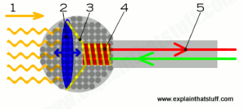

Existen multitud de tipos de micrófonos, según su construcción y su uso. En este caso, podéis ver dos modelos de micrófono habituales.

También podemos adquirir un set de grabación que también incluye un soporte o trípode, además de diferentes filtros, como los antipop o anti viento.

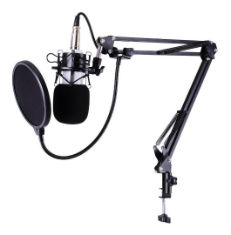

## 3.2 Grabación de sonido

Antes de la informática, todo el proceso de grabación, mezcla y reproducción se hacían con equipos eléctricos de forma analógica.

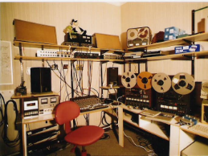

### 3.2.1. VINILOS

El sonido grabado se guardaba en formatos analógicos (vinilos). Estos discos están formados de diferentes surcos microscópicos. Según como se mueve una aguja al recorrer los surcos del disco, el sonido suena de una forma u otra.

### 3.2.2. CASSETTE Y CD

Posteriormente invención del DAT (cassette) y posteriormente el compact disc (CD) permite grabar el sonido de forma digital, consiguiendo una mayor calidad y permitiendo transportar la música de un modo más sencillo, dando lugar a reproductores portátiles, como los walkmans.

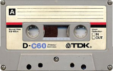

Gracias a ello podemos digitalizar el sonido y mejorar la calidad de las grabaciones, así como facilitar su edición y producción (y copia).

## 3.3	INFORMÁTICA

Gracias a la informática, podemos guardar el sonido en formato digital (ceros y unos) en un ordenador, en forma de archivo de audio. Estos archivos, se pueden modificar, editar y mezclar directamente utilizando un ordenador utilizando diferentes programas.

Para poder hacer todo esto necesitamos introducir (digitalizar) los sonidos dentro del ordenador para poder trabajar con ellos.

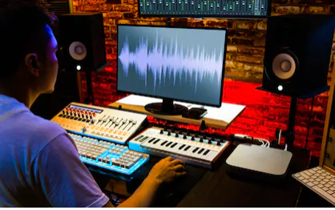

Si tenemos que grabar un instrumento como guitarras acústicas, baterías, etc. o la voz, necesitamos traducir estos sonidos analógicos a sonido digital. Para ello utilizamos un conversor analógico-digital. Este conversor suele venir incluido en una tarjeta de sonido.

A esta tarjeta conectaremos los dispositivos que queremos grabar en nuestro ordenador mediante diferentes cables.

## 3.4. TARJETAS DE SONIDO INTERNAS

También existen tarjetas de sonido internas, aunque ya están en desuso, en forma de tarjetas de expansión. Se utilizan fundamentalmente en ordenadores para reproducir sonido y grabar voz de menor calidad, pero no se suelen utilizar para producción musical.

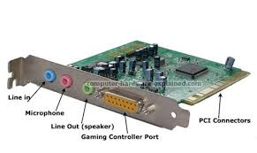

## 3.5. Tarjetas integradas

Actualmente estas tarjetas no se instalan como tarjetas de expansión independientes
Están integradas en la propia placa base del dispositivo.

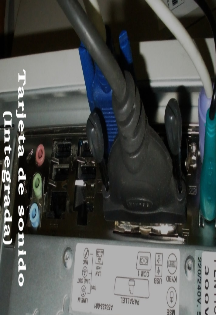

## 3.6. TARJETAS DE SONIDO EXTERNAS

Las tarjetas de sonido más profesionales son tarjetas externas. En esta ocasión tienen forma de cajas con botones y entradas, que se conectan a través de un puerto externo como USB.

Estas tarjetas se pueden conectar a diferentes dispositivos, según nuestra necesidad.

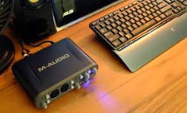

La tarjeta tiene diferentes entradas y salidas para conectar instrumentos y micrófonos (jack, cannon, etc).

- Las entradas por la parte frontal permiten conectar 1, 2 o más instrumentos para introducir sonido y convertirlo a sonido digital que se envía al ordenador.
- Una vez el ordenador reproduce una canción, o un vídeo, convierte estos archivos digitales otra vez a señal analógica que sale por las salidas traseras, por ejemplo, hacia unos altavoces. Los altavoces solo entienden de señales analógicas para poder funcionar.
- También tenemos una serie de botones para poder controlar el volumen, por ejemplo.
- Por último, una salida USB nos permitirá conectarlo al ordenador.

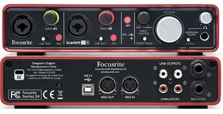

En la siguiente imagen podéis ver una configuración para un pequeño estudio casero, utilizando una tarjeta de sonido, un micrófono, una guitarra eléctrica, un ordenador y altavoces.

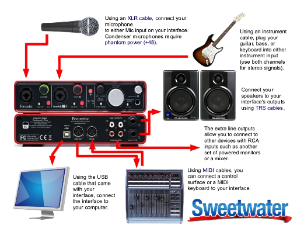

# 4. DIGITALIZACIÓN DEL SONIDO

Para poder introducir uno sonido en un equipo informático, hace falta transformar un sonido de naturaleza analógica (continua) en una señal digital en forma de 1s y 0s, el lenguaje que se utiliza en informática.

En primer lugar, se toman muestras de la señal cada cierto tiempo (**muestreo**)
A cada una de estas muestras se les da un valor numérico en función de su fuerza (**cuantización**).

En el muestreo, el ordenador toma muestras de la señal sonora cada cierto tiempo. Cuantas más muestras tomamos por segundo, la calidad en el sonido digital cuanto será mayor puesto que se parecerá más al original.

La frecuencia de muestreo se suele expresar en **KHz**.

**Ejemplo**

Mira la señal original de color negro. Es analógica y por ello tiene formas más onduladas.

- En A, podemos ver cómo solo se toman dos muestras, y por tanto la forma digital se parece muy poco a la original.
- En B,al tomar el doble de muestras, se parece un poco más.
- Por último, la E es en la que se han tomado más muestras.

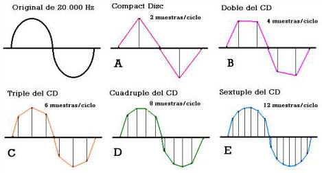

Algunas medidas típicas son:

- 11 KHz (calidad baja)
- 22 KHz (calidad media)
- 44,1 KHz (calidad alta)
- 96 KHz (calidad muy alta)

## 4.1. FORMATO DE AUDIO DIGITAL

Una vez convertido el audio en sonido digital (ceros y unos), lo podemos guardar de diferentes formas. El formato del archivo indica la estructura con la que el sonido es almacenado.

La **extensión** del archivo (mp3, wav, flac) nos indica el tipo de archivo del que se trata. Cada formato tiene unas ventajas y unos inconvenientes concretos. Además, ayuda al sistema operativo a saber que es un archivo de audio y decidir con qué programa se va a abrir.

## 4.2. COMPRESIÓN

Si los guardamos tal cual, los archivos de audio contienen toda la información del sonido original. De esta forma, tenemos archivos de mejor calidad, pero mayor tamaño. 

Gracias a los ordenadores podemos comprimir los archivos de sonido y vídeo utilizando operaciones matemáticas para reducir el tamaño descartando parte de la información que no somos capaces de apreciar. 

La calidad del sonido es menor pero también disminuye el tamaño. Una canción comprimida en MP3 puede ocupar **una décima parte** de lo que ocuparía la misma canción sin comprimir

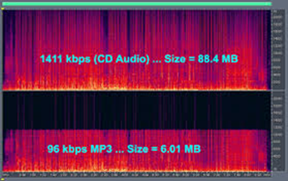

La invención del archivo MP3 permitió que la música ocupara menos en los ordenadores. Gracias a ello se popularizaron los reproductores MP3, que permitían almacenar cientos de canciones, mientras que un CD normal daba para unas 15 aproximadamente.

Al ocupar menos los archivos también se popularizó la piratería musical a través de internet, a través de diferentes programas de intercambio de archivos, como Napster, Ares, o eMule, por ejemplo.

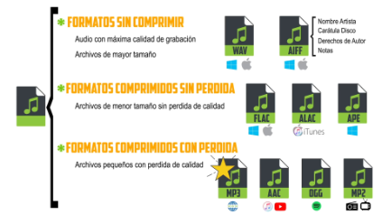

## 4.3.	FORMATO MIDI

Interfaz digital de instrumentos musicales. Lo utilizan ordenadores, sintetizadores y dispositivos electrónicos musicales para comunicarse entre ellos.

Guarda descripción musical de un audio. El sonido final depende del instrumento que lo reproduzca

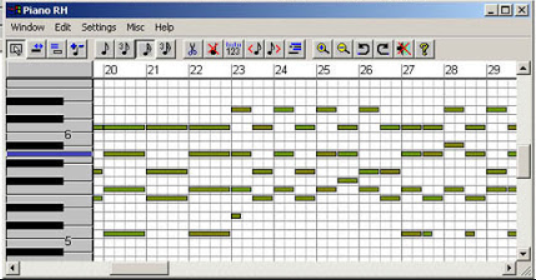

Gracias a esta tecnología, entre otras cosas, podemos **emular** (simular de forma artificial), utilizando teclados midi, el sonido de cualquier instrumento, desde una batería hasta una guitarra, etc. Con solo una herramienta, podemos crear una canción musical completa.

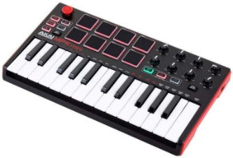

Ejemplos:

- https://www.youtube.com/watch?v=C_C0rAKiBEA
- https://www.youtube.com/watch?v=WaHMwMruD80

# 5. PROGRAMAS DE AUDIO

## 5.1. REPRODUCTORES

Aplicación que permite escuchar audio digital
Algunos incluyen funcionalidades
Crear listas de reproducción
Escuchar emisoras online
Sincronizar archivos entre ordenador y dispositivos portátiles
Añadir etiquetas ID3

## 5.2.	DAWs o estaciones de trabajo

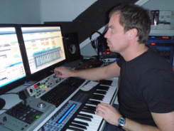

Una estación de trabajo de audio digital o DAW, es un software que permite crear música sobre la base de audio o sonidos MIDI. Los sonidos pueden insertarse desde medios externos micrófono, instrumento musical, teclado, sintetizador.

Los sonidos se pueden trabajar en pistas separadas y aplicar diferentes efectos a una pista a o a un trozo concreto.Permite también exportar el resultado en diferentes formatos de audio.

Algunos ejemplos son: 

- Cubase
- Pro Tools
- Reaper
- Otros: Ardour, Cakewalk Sonar, FL Studio, lmms, DSP-Quattro, etc.

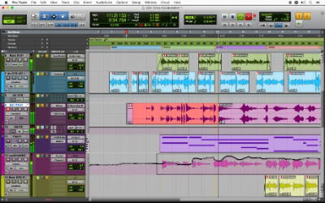

# 6.TRANSMISIÓN A TRAVÉS DE INTERNET

## 6.1. Streaming

El **streaming** consiste en transmitir sonido o vídeo digital a través de internet en tiempo real. Permite escuchar música a la carta sin descargar todo el archivo previamente

Se financian a través de publicidad o mediante suscripción.

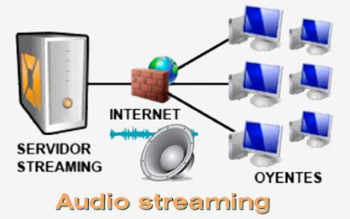

## 6.2. Podcast

Se trata de un archivo de sonido digital creado para ser difundido por Internet. 
Cualquiera puede escucharlo en el momento que desee desde un ordenador o dispositivo portátil.

Recorrido de un podcast

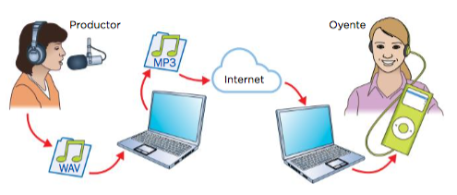
 
1) Productor graba el archivo
2) Comprime el archivo en un formato apto para el podcast
3) Lo cuelga en Internet
4) El usuario final lo descarga y reproduce

