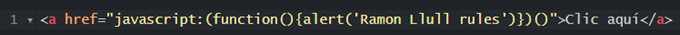
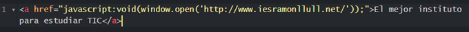
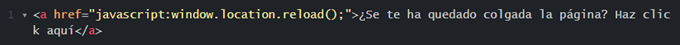
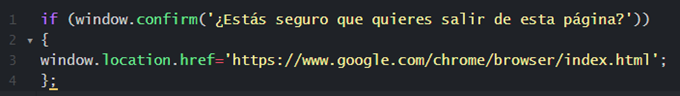
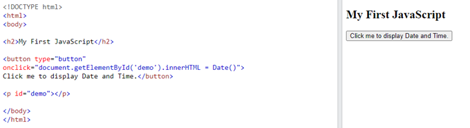
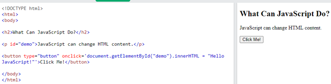
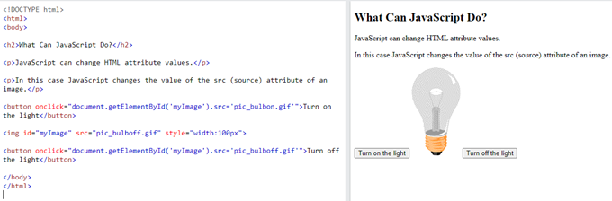
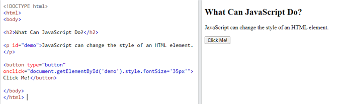

# Javascript

Aquí aprendrem a: 

-  Cridar una funció de javascript des d'un botón
-  Definir codi dins una etiqueta script
-  Extreure el codi javascript a un arxiu extern
-  Crear funcions javascript senzilles
-  Crear i utilitzar variables

## Arrays

Los arrays son conjuntos de elementos.

```javascript
alumnes = ["dani","manolo", "Juan"]
```

Para hacer referencia a los diferentes elementos del array:

```javascript
alumno[0] nos devolverá "dani"
alumno[1] nos devolverá "manolo"
alumno[2] nos devolverá "juan"
```
Si queremos agregar elmentos al array:

```javascript
alumno.push("pepe")
```
Ahora el array tendrá 4 elementos, pepe será **alumno[3]**

Para saber la cantidad de elementos que tiene un array:

```javascript
alumno.length
```
Iterar sobre los elementos de un array con for:

```javascript
for (i=0;i<alumnos.length;i++){
  windows.alert(alumnos[i]);
}
```
Eliminar el último elemento:

```javascript
alumnos.pop()
```

Eliminar el primer elemento

```javascript
alumnos.shift()
```


## Snippets d'exemple

Abrir un mensaje de alerta pulsando un enlace:



Abrir una página en una ventana nueva:



Imprimir página:


Recargar una página



Pedir confirmación al salir de una página. Recuerda ponerlo dentro de un bloque javascript, o entre etiquetas script.




Mostrar fecha y hora mediante un botón



Cambiar el contenido del HTML



Cambiar atributos de un HTML



Cambiar estilos CSS


