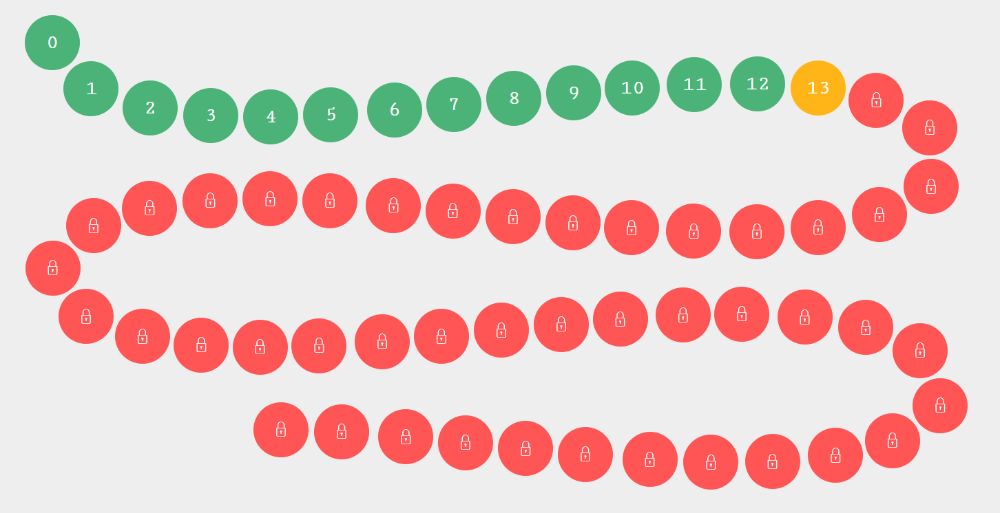

# Introducción a la programación

Sin programación, los ordenadores, incluidos los teléfonos inteligentes, serían solo colecciones de plástico, metal y silicio. Todo lo que has hecho en una computadora se hizo porque alguien **programó** una aplicación para hacerlo. Piensa cuántas veces al día tú o alguien con quien estás usa ub ordenador.

Si Google Assistant o Alexa te levantan por la mañana, es porque alguien lo programó para hacerlo. Si un vehículo te lleva al instituto, es probable que tenga un ordenador a bordo o tal vez un GPS programado para llevarlo allí. Si se detiene en una tienda y recoge jugo, el empleado probablemente usa un programa de computadora para aceptar una tarjeta de crédito o calcular su cambio. 

Si su profesor ingresa tus notas en un ordenador, un programa puede calcular tu media o incluir esas calificaciones en tu boletín de notas. Si ve dibujos animados, (a menos que sean dibujos animados antiguos dibujados a mano), es probable que hayan sido dibujados usando un programa de ordenador. 

Si estás viendo servicios en una plataforma de streaming del tipo Netflix, hay un programa que las lleva a tu televisor y te permite hacer selecciones.

## Actividades de iniciación

Para introducirnos en el mundo de la programación, os propongo varios ejercicios online que os ayudarán a razonar cómo funciona un programa informático. En las asignaturas de 1º y principalmente en 2º de bachillerato aprendremos también a programar con un lenguaje concreto, como Python o HTML y Javascript, para hacer páginas web.

Por ahora, lo importante es que te familiarices con los programas informáticos, cómo se crean y cómo funcionan. Para ello te he preparado algunas actividades que ya han sido creadas en Internet que creo que te pueden ayudar a introducirte en la programación.

## Actividad 1

[Compute it](http://compute-it.toxicode.fr/?hour-of-code) nos propone una serie de actividades para comprobar que sabemos seguir las instrucciones y funcionamiento de un programa sencillo. 

Cuando termines la actividad, adjunta una foto como la siguiente de la pantalla principal (enfocando con tu smartphone al monitor) y con un papelito al lado del monitor con tu nombre, para comprobar que lo has hecho tú.

## Actividad 2

En la siguiente actividad aprenderemos a tratar con **variables**. Las variables son como cajitas donde podemos guardar ciertos valores, como números, letras o palabras, y darles un nombre.

http://silentteacher.toxicode.fr/hourofcode

## Actividad 3

Introduccion visual a Python. En esta actividad manejarás una "tortuga", a la que habrá que dar instrucciones para que vaya haciendo determinadas acciones.

https://hourofpython.com/una-introduccion-visual-a-python/bienvenido-a/una-hora-de-codigo.html
