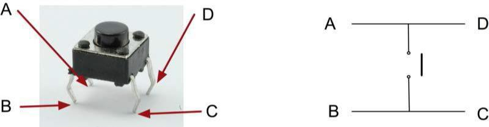
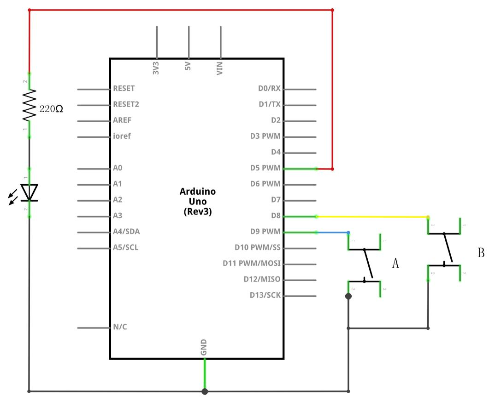
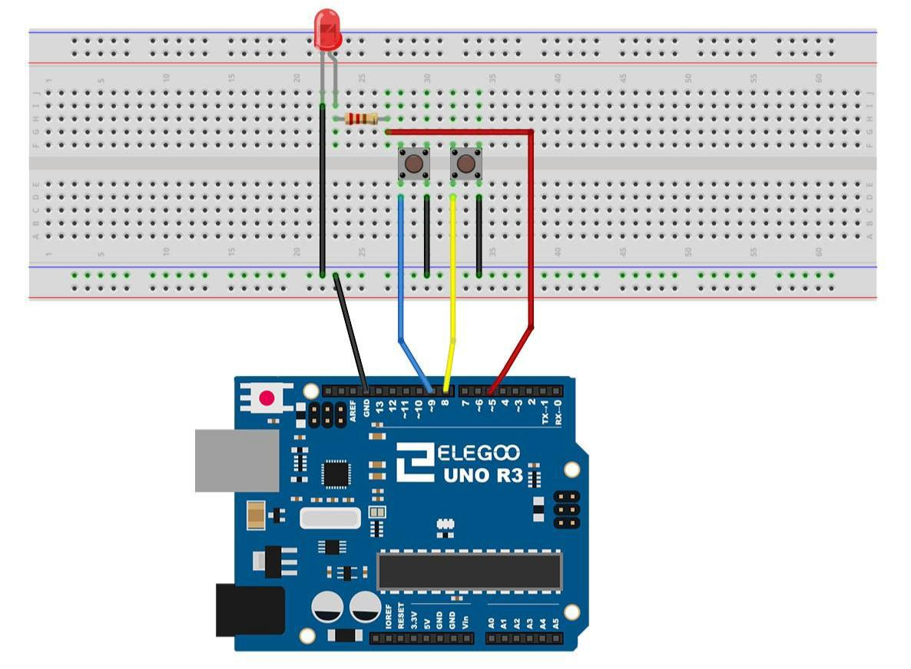
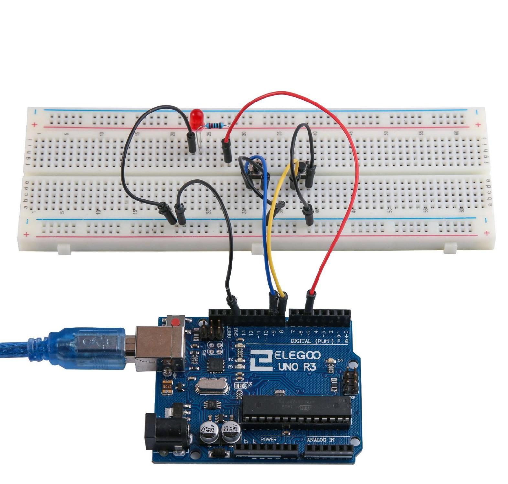

## Lección 5 Entradas Digitales 
### Resumen 
En esta lección, usted aprenderá a utilizar los botones con entradas digitales para  encender y apagar un LED.  
Presionar el botón se encenderá el LED; pulsar el otro botón se apagará el LED.  
Componente necesario: 

- (1) x Elegoo Uno R3 
- (1) protoboard de 830 puntos de amarre x 
- LED rojo de 5mm x (1)  
- (1) x resistencia de 220 ohmios 
- interruptores de presión x (2)  
- (7) x M M cables (cables de puente de macho a macho) 
- Introducción del componente 

### Pulsadores

Los interruptores son componentes muy simples. Cuando pulse un botón o girar una palanca, conectan dos contactos para que la electricidad fluya a través de ellos. Los interruptores táctiles poco utilizados en esta lección tienen cuatro conexiones, que pueden ser un poco confusas



En realidad, hay realmente dos conexiones eléctricas. Dentro del paquete de interruptor, pins B y C se conectan entre sí, como son A y D.

### Conexión

### Esquema




### Diagrama de cableado



Aunque los cuerpos de los interruptores son cuadrados, los pasadores sobresalen de los lados opuestos del interruptor. Esto significa que los pines sólo estarán lo suficientemente separados cuando se colocan correctamente en la placa de pruebas. Recuerde que el LED tiene que tener el cable negativo más corto a la izquierda.

### Código

Después de cablearlo, por favor, abra el programa en el código de carpeta - Lección 5 entradas digitales y presione UPLOAD para cargar el programa. Si se aparecen errores, ver Lección 2 para obtener más información sobre el tutorial de subir programa.

El bosquejo en su placa UNO de carga. Presionando el botón izquierdo se encenderá el LED mientras que pulsando el botón derecho apagará.

La primera parte del proyecto define tres variables para ls tres patas que se van a utilizar. El 'ledPin' es el pin de salida y 'pinBotonA' se refiere al interruptor más cerca de la parte superior de la placa y 'buttonBpin' para el otro interruptor.

La función de **setup** define el ledPin como una salida normal, pero ahora tenemos las dos entradas para ocuparse. En este caso, utilizamos el conjunto el pinMode ser 'INPUT_PULLUP' como este:

El modo pin de INPUT_PULLUP significa que el pin debe ser utilizado como una entrada, pero que si nada mas se conecta a la entrada, se debe 'sacarse' a alta. En otras palabras, el valor predeterminado de la entrada es alta, a menos que se tiró bajo por la acción de pulsar el botón.

Por esta razón los interruptores están conectados a tierra. Cuando un interruptor se presiona, se conecta la clavija de entrada a la tierra, para que ya no es alta.

Puesto que la entrada es normalmente alta y va sólo baja cuando se pulsa el botón, la lógica es un poco boca abajo. Nosotros nos encargaremos de esto en la **función loop**

En la **función loop** hay dos declaraciones de 'si'. Uno para cada botón. Cada uno hace un 'digitalRead' en la entrada adecuada.

Recuerde que si se presiona el botón, la entrada correspondiente será baja, si el botón A es bajo, entonces un 'digitalWrite' en el ledPin enciende.

## Código completo

```c
int ledPin = 5;
int pinBotonA = 9;
int pinBotonB = 8;

byte leds = 0;

void setup() 
{
  pinMode(ledPin, OUTPUT);
  pinMode(pinBotonA, INPUT_PULLUP);  
  pinMode(pinBotonB, INPUT_PULLUP);  
}

void loop() 
{
  if (digitalRead(pinBotonA) == LOW)
  {
    digitalWrite(ledPin, HIGH);
  }
  if (digitalRead(pinBotonB) == LOW)
  {
    digitalWrite(ledPin, LOW);
  }
}
``` 



Del mismo modo, si se presiona el botón B, un bajo se escribe en el ledPin.
