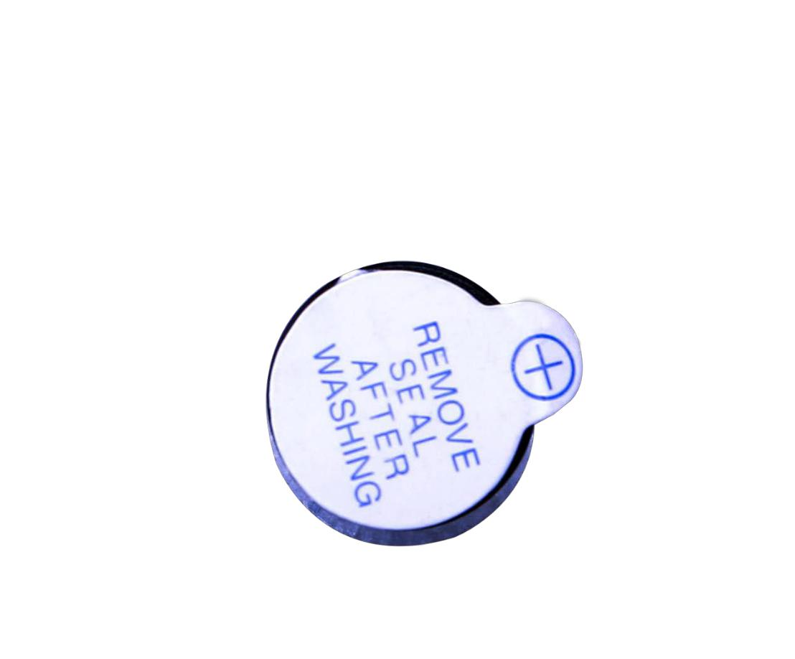

## Lección 6 Activar zumbador 

### Resumen 
En esta lección, aprenderá a generar un sonido con un timbre activo.  
Componente necesario: 

- (1) x Elegoo Uno R3 
- (1) zumbador de Active x 
- (2) x F M cables (cables de hembra a macho DuPont) 

### Zumbador

Zumbadores electrónicos son alimentados por CC, equipado con un circuito  integrado. Son ampliamente utilizados en computadoras, impresoras, fotocopiadoras, alarmas, juguetes electrónicos, dispositivos electrónicos  automotores, teléfonos, alarmas y otros productos electrónicos para dispositivos de voz. 

Se pueden categorizar en activos y pasivos. Gire que los pernos  de dos zumbadores boca arriba. Con un tablero de circuito verde es un zumbador  pasivo, mientras que el otro cerrado con una cinta negra es un activo.  

- Un **zumbador activo** tiene una fuente oscilante integrada, por lo que va a generar un sonido cuando se electrifica. El  zumbador activo es a menudo más caro
- Un **zumbador pasivo**  no tiene esa fuente para que no pitan si se utilizan señales de DC; en cambio,  necesitará usar ondas cuadradas cuya frecuencia es entre 2K y 5K manejarlo. 




### Conexión

### Esquema


### Diagrama de conexiones


### Código


```c
int buzzer = 12;//the pin of the active buzzer
void setup()
{
 pinMode(buzzer,OUTPUT);//initialize the buzzer pin as an output
}
void loop()
{
 unsigned char i;
 while(1)
 {
   //output an frequency
   for(i=0;i<80;i++)
   {
    digitalWrite(buzzer,HIGH);
    delay(1);//wait for 1ms
    digitalWrite(buzzer,LOW);
    delay(1);//wait for 1ms
    }
    //output another frequency
     for(i=0;i<100;i++)
      {
        digitalWrite(buzzer,HIGH);
        delay(2);//wait for 2ms
        digitalWrite(buzzer,LOW);
        delay(2);//wait for 2ms
      }
  }
} 
```

