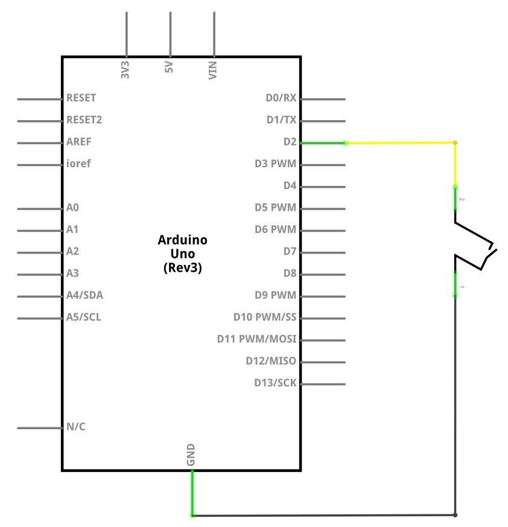
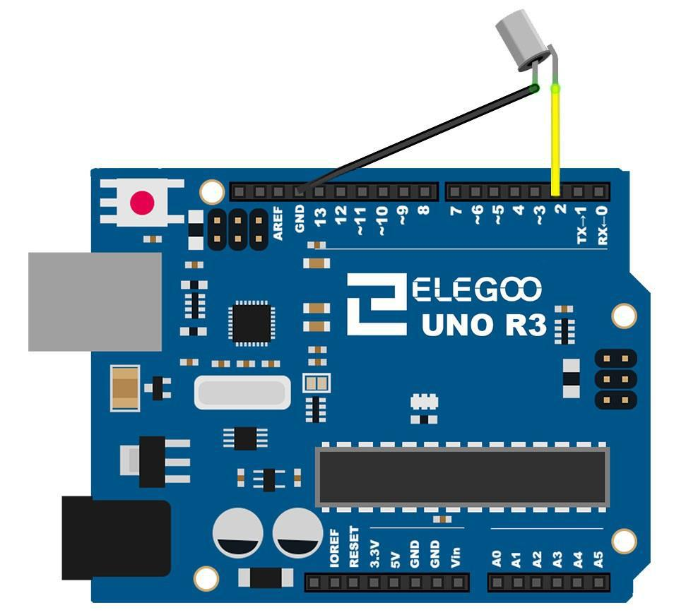
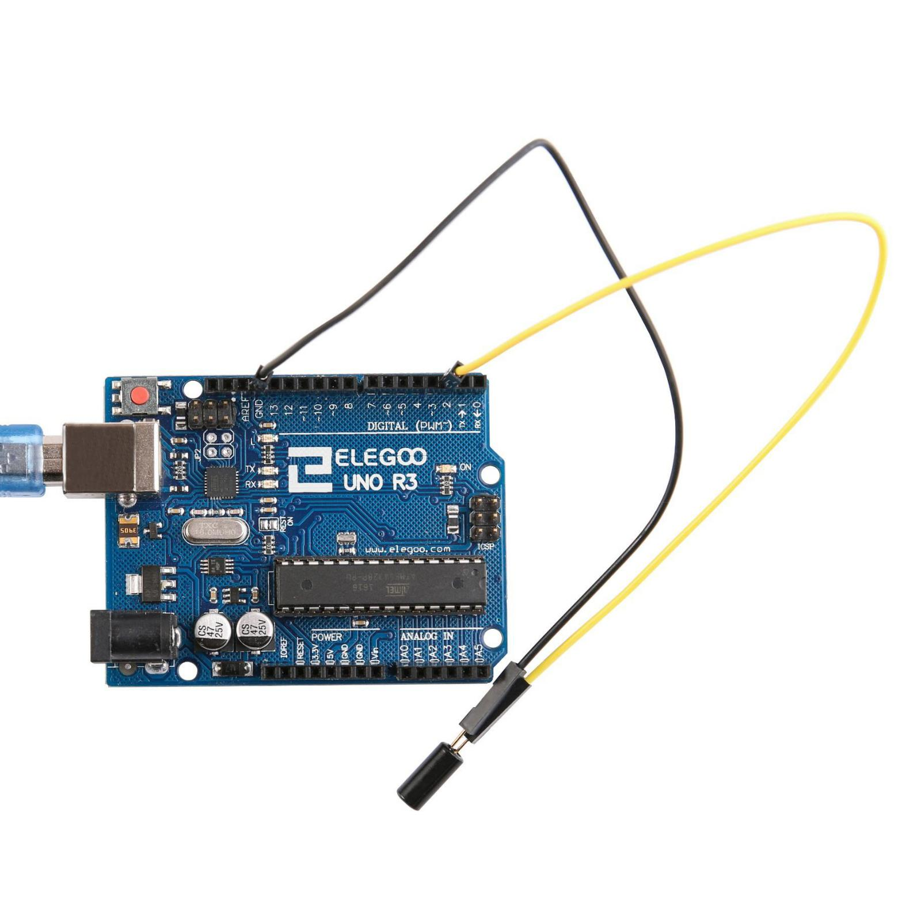

## Lección 8 Interruptor de bola de inclinación 

### Resumen 
En esta lección, usted aprenderá cómo utilizar un interruptor de bola de inclinación  para detectar el pequeño ángulo de inclinación.  

Componentes Requeridos: 
```
(1) x Elegoo Uno R3 
(1) x interruptor de inclinación bola  
(2) x F-M wires (cables de hembra a macho DuPont)  
```

### Sensor de inclinación 

Los sensores de inclinación (interruptor de bola de inclinación) le permiten detectar orientación o inclinación. Son pequeños, económicos, de bajo consumo y fáciles de usar. Si se usan correctamente, no se desgastarán. Su simplicidad los hace populares para los juguetes, los adminículos y los aparatos. A veces, se conocen como "interruptores de mercurio", "interruptores de inclinación" o "sensores de bola rodante" por razones obvias.

Se componen generalmente de una cavidad de una cierta clase (cilíndrica es popular, aunque no siempre) con una masa libre conductora adentro, tal como una gota del mercurio o bola rodante. Un extremo de la cavidad tiene dos elementos conductores (polos). Cuando el sensor está orientado de tal manera que dicho extremo está hacia abajo, la masa rueda sobre los polos y los cortocircuitos, actuando como un interruptor de tiro.

Aunque no es tan preciso ni flexible como un acelerómetro completo, los interruptores de inclinación pueden detectar movimiento u orientación. Otro beneficio es que los grandes pueden cambiar de energía por su cuenta. Los acelerómetros, por otro lado, producen voltaje digital o analógico que luego deben analizarse utilizando circuitos extra.


### Conexión

### Esquema



### Diagrama de conexiones



### Código

Después de efectuar el cableado, por favor, abra el programa en el código de carpeta lección 8 interruptor de la bola y haga clic en UPLOAD para cargar el programa. Ver Lección 2 para obtener más información sobre programa cargar si hay algún error.


