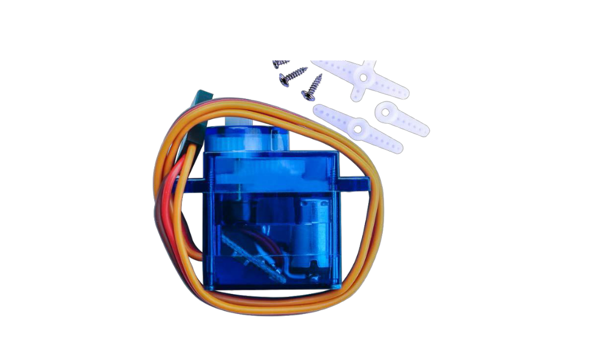
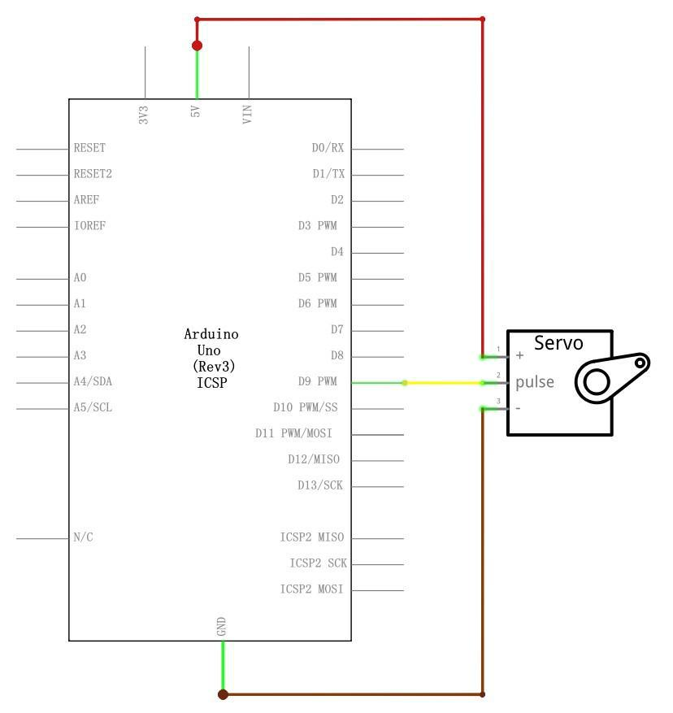

## Lección 9 Servo 

### Resumen 

El Servo es un tipo de motorreductor que sólo puede girar 180 grados. Se controla  mediante el envío de impulsos eléctricos de la placa de UNO R3. Estos pulsos le dice al servo qué posición se debe mover. 

El Servo tiene tres cables, de que el marrón  es el cable a tierra y deben conectarse a GND puerto UNO, el rojo es el cable de corriente y debe conectarse al puerto de 5v y la naranja es el alambre de señal y debe conectarse al puerto #9.  

Componentes necesario: 

| Cant | Elemento                                     |
| ---- | -------------------------------------------- |
| 1    | Elegoo Uno R3                                |
| 1    | Servo (SG90)                                 |
| 1    | M cables (cables de puente de macho a macho) |

### Servomotor SG90 

| Parámetro                  | Valor                                                          |
| -------------------------- | -------------------------------------------------------------- |
| Longitud del cable:        | 25cm                                                           |
| Sin carga;                 | Velocidad: 0,12 seg/60degree (4.8V), 0.10 sec/60 grados (6.0V) |
| Puesto de par (4.8V):      | 1,6 kg/cm                                                      |
| Temperatura:               | -30 ~ 60' C                                                    |
| Ancho de banda muerta:     | 5 us                                                           |
| Voltaje de funcionamiento: | 3.5 ~ 6V                                                       |
| Dimensión:                 | 1.26 en x 1,18 en x 0,47 en (3,2 x 3 cm x 1.2 cm)              |
| Peso:                      | 4,73 onzas (134)                                               |



### Conexión

### Esquema



### Diagrama de cableado


### Código

Antes de ejecutar esto, debemos incluir la **biblioteca servo**.


En caso de no tenerla, podríamos incluirla descargando el archivo .zip y seguir los siguientes pasos:


Un código de ejemplo sería el siguiente.

```c
#include <Servo.h>

Servo myservo;  // create servo object to control a servo
// twelve servo objects can be created on most boards

int pos = 0;    // variable to store the servo position

void setup() {
  myservo.attach(9);  // Le asignamos el PIN 9.
}

void loop() {
  for (pos = 0; pos <= 180; pos += 1) { // goes from 0 degrees to 180 degrees
    // in steps of 1 degree
    myservo.write(pos);              // tell servo to go to position in variable 'pos'
    delay(15);                       // waits 15ms for the servo to reach the position
  }
  for (pos = 180; pos >= 0; pos -= 1) { // goes from 180 degrees to 0 degrees
    myservo.write(pos);              // tell servo to go to position in variable 'pos'
    delay(15);                       // waits 15ms for the servo to reach the position
  }
}
```

Para obtener más información sobre carga el archivo de **librería**, ver Lección 1.


En la foto, el cable marrón del servo se adapta a través de los cables negros de M-M, el rojo uno se adapta a través de los cables rojos de M-M y la naranja uno se adapta a través de los cables amarillos de M-M .
