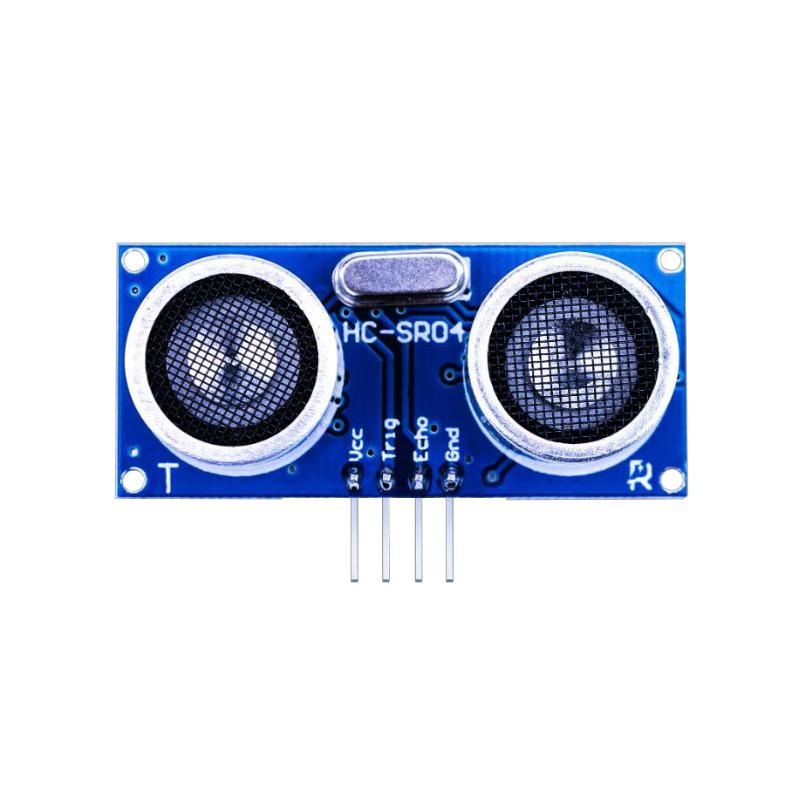

## Lección 10 Módulo Sensor ultrasónico 



### Resumen 

El **sensor ultrasónico** es ideal para todo tipo de proyectos que necesitan medidas de distancia, evitando los obstáculos como ejemplos.  

El HC-SR04 es barato y fácil de usar ya que vamos a usar una **librería** diseñada  específicamente para estos sensores.  

### Componentes necesarios

```
(1) x Elegoo Uno R3 
(1) x Módulo de sensor ultrasónico  
(4) x F M cables (cables de hembra a macho DuPont)  
```
### Sensor de ultrasonidos 

El módulo HC-SR04 del sensor ultrasónico proporciona la función sin contacto de la medida los 2cm-400cm, la precisión que varía puede alcanzar a 3m m. Los módulos incluyen transmisores ultrasónicos, receptor y circuito de control. El principio básico del trabajo:

Utilizando el disparador IO para una señal de nivel alto de al menos 10us,

El Módulo envía automáticamente ocho 40 kHz y detecta si hay una señal de pulso hacia atrás.

SI la señal de retorno, a través de alto nivel, tiempo de alta salida IO duración es el tiempo de envío de ultrasonido tore giro.

Distancia de prueba = (tiempo de alto nivel x velocidad del sonido (340m / s) / 2

El diagrama de sincronización se muestra a continuación. Sólo tiene que suministrar un pulso de 10us corto a la entrada de activación para iniciar el rango, y luego el módulo enviará una ráfaga de 8 ciclos de ultrasonido a 40 kHz y aumentar su eco. El Echo es un objeto de distancia que es el ancho de pulso y el rango en proporción. Puede calcular el rango a través del intervalo de tiempo entre la señal de disparo de envío y la señal de eco de recepción. Fórmula: us / 58 = centímetros o us / 148 = inch; O: el rango = tiempo de alto nivel * velocidad

(340M / S) / 2; 

Sugerimos utilizar más de 60ms de ciclo de medición, con el fin de evitar la señal de disparo a la señal de eco.


### Conexión


### Diagrama de cableado


### Montaje


### Código

Necesitaremos una librería para poder utilizar algunas funciones y comunicarnos con el sensor. Para ello, deberemos de incluirla en nuestro proyecto, de la siguiente forma:


Una vez incluída, ya la podemos utilizar en nuestro programa.

```c
#include "SR04.h"
#define TRIG_PIN 12
#define ECHO_PIN 11
SR04 sr04 = SR04(ECHO_PIN,TRIG_PIN);
long a;

void setup() {
   Serial.begin(9600);
   delay(1000);
}

void loop() {
   a=sr04.Distance();
   Serial.print(a);
   Serial.println("cm");
   delay(1000);
}

```

Abrir al monitor y puede ver los datos como soplo:

Haga clic en el botón Serial Monitor para encender el monitor serie. Se introducen los conceptos básicos sobre el monitor serial en detalles en la lección 1.


