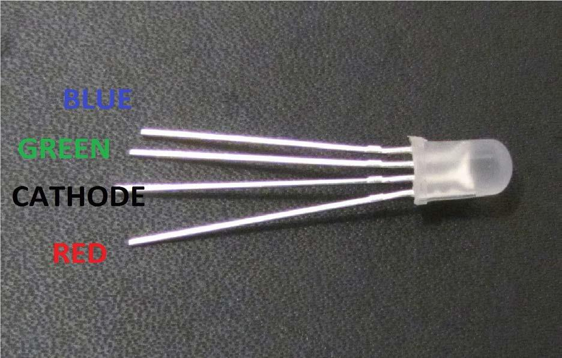
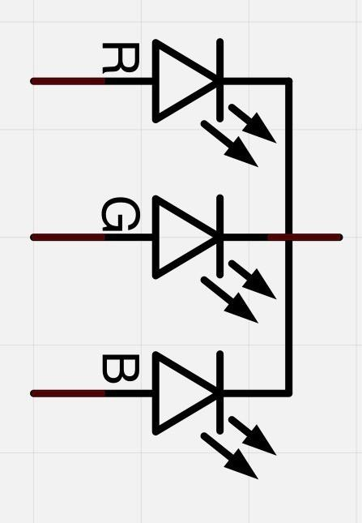
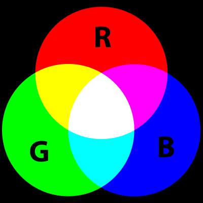
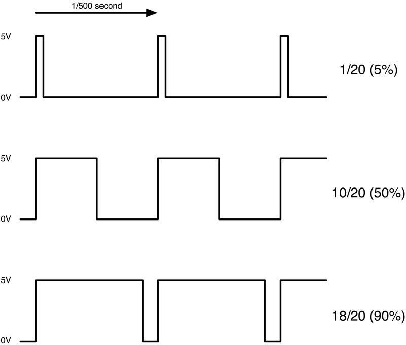
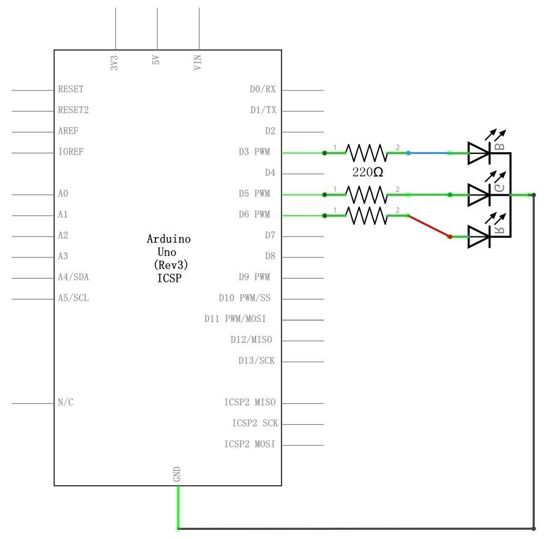
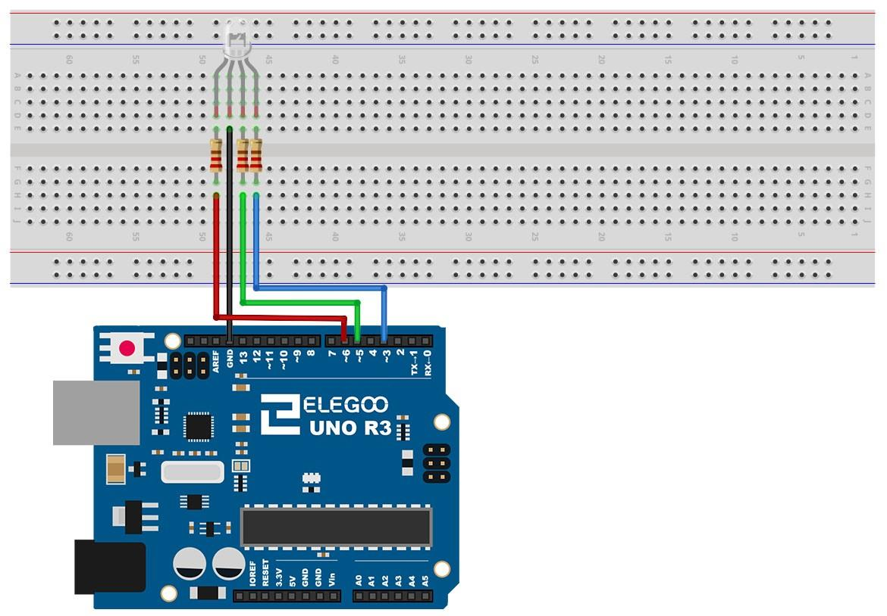
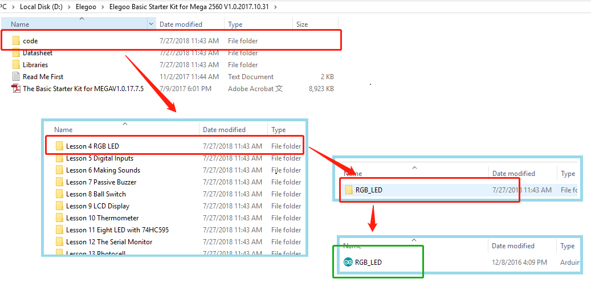
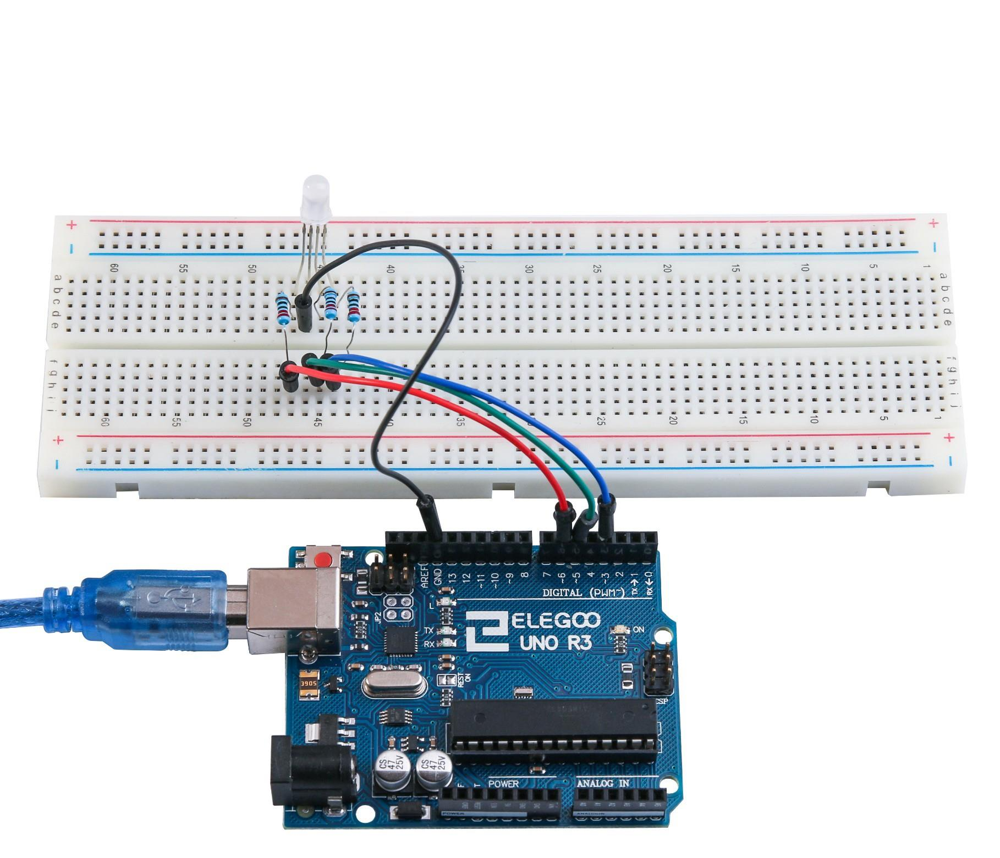

- [Prácticas Arduino](#prácticas-arduino)
  - [Lección 0 Instación IDE](#lección-0-instación-ide)
    - [Instalación de Arduino (Windows)](#instalación-de-arduino-windows)
    - [Instalación de Arduino (Mac OS X)](#instalación-de-arduino-mac-os-x)
  - [Lección 1 Añadir bibliotecas y Monitor serie abierta](#lección-1-añadir-bibliotecas-y-monitor-serie-abierta)
    - [Cómo instalar una biblioteca](#cómo-instalar-una-biblioteca)
    - [Manual de instalación](#manual-de-instalación)
    - [Arduino serie Monitor (Windows, Mac, Linux)](#arduino-serie-monitor-windows-mac-linux)
    - [Configuración](#configuración)
    - [Pros](#pros)
    - [Contras](#contras)
  - [Lección 2 Blink](#lección-2-blink)
    - [Resumen](#resumen)
  - [Lección 3 LED](#lección-3-led)
    - [Resumen](#resumen-1)
    - [Protoboard](#protoboard)
    - [LED](#led)
    - [Resistencias](#resistencias)
    - [Diagrama de Cableado](#diagrama-de-cableado)
  - [Lección 4 RGB LED](#lección-4-rgb-led)
    - [Resumen](#resumen-2)
    - [RGB](#rgb)
    - [Teoría (PWM)](#teoría-pwm)
    - [Diagrama de cableado](#diagrama-de-cableado-1)
  - [Lección 5 Entradas Digitales](#lección-5-entradas-digitales)
    - [Resumen](#resumen-3)
    - [Diagrama de cableado](#diagrama-de-cableado-2)
  - [Lección 6 Activar zumbador](#lección-6-activar-zumbador)
    - [Resumen](#resumen-4)
  - [Lección 7 Zumbador Pasivo](#lección-7-zumbador-pasivo)
    - [Resumen](#resumen-5)
- [## Lección 8 Interruptor de bola de inclinación](#-lección-8-interruptor-de-bola-de-inclinación)
    - [Resumen](#resumen-6)
  - [Diagrama de conexión](#diagrama-de-conexión)
  - [Lección 9 Servo](#lección-9-servo)
    - [Resumen](#resumen-7)
    - [Diagrama de cableado](#diagrama-de-cableado-3)
  - [## Lección 10 Módulo Sensor ultrasónico](#-lección-10-módulo-sensor-ultrasónico)
    - [Resumen](#resumen-8)
    - [Diagrama de cableado](#diagrama-de-cableado-4)

# Prácticas Arduino

## Lección 0 Instación IDE 
Introducción 
Entorno de desarrollo integrado (IDE) de Arduino es el software de la plataforma Arduino.  En esta lección, usted aprenderá cómo configurar tu ordenador para usar Arduino y cómo  establecer sobre las lecciones que siguen.  
El software de Arduino para programar tu Arduino está disponible para  Windows, Mac y Linux. El proceso de instalación es diferente para las tres plataformas y lamentablemente hay una cierta cantidad de trabajo manual para instalar el software.  
Paso 1: Ir a https://www.arduino.cc/en/Main/Software y a continuación de la página. 
La versión disponible en este sitio web es generalmente la última versión y la versión actual puede ser más reciente que la versión en el cuadro. 
Paso 2 : Descargar el desarrollo software que es compatible con el sistema operativo del  ordenador. Windows tomar como un ejemplo aquí
9 / 165 
Haga click en Windows Installer.  
Haga click en DESCARGAR (JUST DOWNLOAD).  
También está disponible en el material que nos proporciona la versión 1.8.0, y las versiones de nuestros materiales son las últimas versiones cuando se hizo este manual.
10 / 165 

### Instalación de Arduino (Windows) 

Instalar Arduino con el exe. Paquete de instalación. 
Haga click en I Agree to see de esta ventana 


Click Next 

Puede pulsar examinar... elegir una ruta de instalación o directamente en el directorio que  desee.

12 / 165 

Haga Click en Install para comenzar la instalacion  

Por último, aparece la siguiente ventana, haga clic en Installa para finalizar la instalación.  .  
A continuación, aparece el siguiente icono en el escritorio 

13 / 165 
Haga doble clic para entrar en el entorno de desarrollo deseado  

Directamente puede elegir el paquete de instalación para la instalación y omitir los  contenidos abajo y saltar a la siguiente sección. Pero si quieres aprender algunos métodos  que no sea el paquete de instalación, por favor lea la sección.  
Descomprime el archivo zip descargado, haga doble clic para abrir el programa y entrar en el  entorno de desarrollo deseado 

14 / 165 

15 / 165

Sin embargo, este método de instalación necesita instalación de driver.. 
La carpeta de Arduino incluye el propio programa de Arduino y los controladores que permiten que el Arduino se conecte al ordenador mediante un cable USB. Antes de que inicie el software de Arduino, vas a instalar a los controladores USB.  
Conecte su cable USB en el Arduino y el en el USB en tu ordenador. La luz en el LED se enciende y usted puede obtener un mensaje de 'Found New Hardware' de Windows. Ignore este mensaje y cancele cualquier intento que Windows hace para tratar de instalar los  controladores automáticamente.  
El major método de instalación de los controladores USB debe hacerse desde el  administrador de dispositivos. Esto es accesible de diferentes maneras dependiendo de la  versión de Windows. En Windows 7, primero tienes que abrir el Panel de Control, luego  seleccione la opción de ver los iconos, y usted debe encontrar el administrador de dispositivos en la lista.  
En 'Otros dispositivos', debería ver un icono de 'dispositivo desconocido' con un triangulo  amarillo de advertencia junto a él. Se trata de tu Arduino. 
16 / 165 

. 
17 / 165 

Haga clic derecho sobre el dispositivo y seleccione la opción del menú superior (Update Driver Software...). Pedirá a 'Buscar automáticamente software de controlador actualizado' o "Examinar mi PC para el software de controlador". Seleccione la opción Buscar en este ordenador en la ruta del CD , por ejemplo en D:\arduino1.8.0\drivers.  

Haga clic en 'Siguiente' y puede obtener una advertencia de seguridad, si es así, permitir que el software a instalar. Una vez instalado el software, usted recibirá un mensaje de confirmación. 

18 / 165 
Los usuarios de Windows pueden omitir las instrucciones de instalación, para sistemas Mac y Linux y saltar a la lección 1. 
Usuarios de Mac y Linux pueden seguir leyendo esta sección 

### Instalación de Arduino (Mac OS X) 

Descargar y descomprimir el archivo zip, haga doble clic en Arduino.app para entrar en el IDE  de Arduino; el sistema le pedirá que instale la biblioteca de tiempo de ejecución de Java si no  lo tienes en tu ordenador. Una vez finalizada la instalación se puede ejecutar el IDE de Arduino.  

Instalación de Arduino (Linux) 
Usted tendrá que utilizar el comando de instalación. Si está utilizando el sistema de Ubuntu, se  recomienda instalar el IDE de Arduino desde el centro de software de Ubuntu.  

Consejos: Si tienes problemas en la instalación de los controladores, consulte el UNO R3, MEGA, NANO controlador preguntas más frecuentes.


## Lección 1 Añadir bibliotecas y Monitor serie abierta 

Instalación de bibliotecas adicionales de Arduino 
Una vez que esté instalado con el software de Arduino y utilizando las funciones integradas, puede que desee ampliar la capacidad de tu Arduino con bibliotecas adicionales. 
¿Cuáles son las bibliotecas? 
Las bibliotecas son una colección de código que hace que sea fácil para usted conectar a un  sensor, pantalla, módulo, etcetera. Por ejemplo, la librería LiquidCrystal incorporada facilita  hablar con pantallas LCD de caracteres. Hay cientos de librerías adicionales disponibles en  Internet para su descarga. Las bibliotecas integradas y algunas de estas bibliotecas  adicionales aparecen en la referencia. Para utilizar las bibliotecas adicionales, necesitará  instalarlas.  

### Cómo instalar una biblioteca 

Mediante el administrador de la biblioteca  

Para instalar una nueva biblioteca en el IDE de Arduino se puede utilizar el **administrador de biblioteca** (disponible desde IDE versión 1.8.0). Abra el IDE y haga clic en el menú "Dibujo" y luego la biblioteca incluyen > Gestión de bibliotecas.  

Entonces el director de la biblioteca se abrirá y usted encontrará una lista de bibliotecas que ya están instalado o listo para su instalación. En este ejemplo vamos a instalar la biblioteca  de puente. Desplazarse por la lista para encontrarla, a continuación, seleccione la versión de la biblioteca que desea instalar. A veces sólo está disponible una versión de la biblioteca. Si  no aparece el menú de selección de versión, no te preocupes: es normal.  
Hay veces que tienes que esperar, tal como se muestra en la figura. Por favor actualice y esperar21 / 165 
Finalmente haga click en instalar y esperar a que el IDE instale la nueva biblioteca. La  descarga puede tardar un tiempo dependiendo tu velocidad de conexión. Una vez haya  terminado, debe aparecer una etiqueta instalada junto a la biblioteca de puente. Una vez  instalada puede cerrar el administrador de la biblioteca.  

Ahora ya puede encontrar la nueva biblioteca disponible en el menú de biblioteca. Si quieres  añadir tu propia biblioteca vaya a abrir un nuevo tema en Github. 
Importar una biblioteca de .zip 
Las bibliotecas se distribuyen a menudo como un archivo ZIP o una carpeta. El nombre de la  carpeta es el nombre de la biblioteca. Dentro de la carpeta será un archivo .cpp, un archivo .h  y a menudo un fichero llamado keywords.txt, carpeta de ejemplos y otros archivos  requeridos por la biblioteca. A partir de la versión 1.0.5, puede instalar bibliotecas de partido  3 º en el IDE.
Descomprime la librería descargada y dejarlo como está.  
En el IDE de Arduino, desplácese a Sketch > Biblioteca incluyen. En la parte superior de la  lista desplegable, seleccione la opción "agregar. Biblioteca ZIP''. 

Se le pedirá para seleccionar la biblioteca que desea añadir. Desplácese hasta la ubicación  del archivo .zip y luego pincha en abrir. 
23 / 165 

Volver al dibujo > menú de biblioteca de importación. Ahora debe ver la biblioteca en la parte inferior del menú desplegable. Está listo para ser utilizado en su lista. El archivo zip se ha  incorporado en la carpeta de bibliotecas en el directorio de plantillas de Arduino.  Nota: la biblioteca estará disponible para utilizar en los dibujos, pero los ejemplos de la  biblioteca no serán expuestos en el archivo > ejemplos hasta después del IDE se ha reiniciado.  Los dos son los enfoques más comunes. Asimismo, pueden manejarse sistemas MAC y Linux.  El manual de instalación que se introducirá por debajo como alternativa puede usarse rara  vez y los usuarios que no lo necesiten pueden saltarlo  

### Manual de instalación 

Para instalar la biblioteca, primero salga de la aplicación de Arduino. Luego descomprima el  archivo ZIP que contiene la biblioteca. Por ejemplo, para instalar una librería llamada  "ArduinoParty", descomprime ArduinoParty.zip. Debería contener una carpeta  calledArduinoParty, con archivos como ArduinoParty.cpp y ArduinoParty.h dentro. (Si los  archivos .cpp y .h no en una carpeta, debe crear uno. En este caso, usted sería hacer una carpeta llamada "ArduinoParty" y copiar todos los archivos que estaban en el archivo ZIP, como ArduinoParty.cpp y ArduinoParty.h.)  

Arrastre la carpeta de ArduinoParty en esta carpeta (la carpeta de bibliotecas). Bajo Windows, lo probable es que se llamará "My Documents\Arduino\libraries". Para usuarios de Mac, lo  probable es que se llamará "Bibliotecas de Arduino de documentos". En Linux, será la carpeta  "libraries" en su sketchbook. 
La carpeta de la biblioteca Arduino debe ahora este aspecto (en Windows): 
```
Mi Documents\Arduino\libraries\ArduinoParty\ArduinoParty.cpp 
Mi Documents\Arduino\libraries\ArduinoParty\ArduinoParty.h  
Mi Documents\Arduino\libraries\ArduinoParty\examples 
```
o como esta (en Mac y Linux): 
Documents/Arduino/libraries/ArduinoParty/ArduinoParty.cpp 
Documents/Arduino/libraries/ArduinoParty/ArduinoParty.h  
Documentos/Arduino/bibliotecas/ArduinoParty/ejemplos 
.... 
Puede haber más archivos que solo los .cpp y .h, sólo asegúrese de que están todos allí. (La  biblioteca no funcionará si pones los archivos .cpp y .h en la carpeta de bibliotecas o si está  anidados en una carpeta extra. Visualizador: 
Documents\Arduino\libraries\ArduinoParty.cpp y 
Documents\Arduino\libraries\ArduinoParty\ArduinoParty\ArduinoParty.cpp no funcionarán.)  
Reiniciar la aplicación Arduino. Asegúrese de que la nueva biblioteca aparece en el directorio  -> elemento de menú de biblioteca de importación del software. ¡Eso es todo! ¡Ha instalado  una biblioteca!  

### Arduino serie Monitor (Windows, Mac, Linux) 

Entorno de desarrollo integrado (IDE) de Arduino es el software de la plataforma Arduino. Y, porque utilizando un terminal es una gran parte del trabajo con Arduinos y otros  microcontroladores, decidieron incluir un terminal de serie con el software. En el entorno de Arduino, esto se llama al Monitor serie. 
25 / 165 
.  
Realizar la conexión 
Monitor de serie viene con cualquier versión del IDE Arduino. Para abrirlo, simplemente haga  clic en el icono Serial Monitor.  
.  

Seleccionar cuál de los puertos a abrir en el Monitor Serial es lo mismo que seleccionar un  puerto para cargar código de Arduino. Vaya a herramientas -> Serial Port y seleccione el  puerto correcto.  
Consejos: Elegir el mismo puerto COM que tienes en el administrador de dispositivos.
26 / 165 
Una vez abierto, debería ver algo como esto: 

27 / 165 

### Configuración 

El Monitor Serial ha limitado opciones, pero lo suficiente para manejar la mayoría de sus  necesidades de comunicación serial. El primer ajuste que se puede modificar es la velocidad  en baudios. Haga clic en la velocidad en baudios tasa lista desplegable para seleccionar la  velocidad correcta. (9600 baudios) 
)  

Por último, puede establecer el terminal desplazamiento automático o no marcando la casilla  en la esquina inferior izquierda  

### Pros 
El Monitor Serial es una gran manera rápida y fácil para establecer una conexión en serie con  el Arduino. Si ya trabaja en el IDE de Arduino, no hay realmente ninguna necesidad de abrir un terminal separado para Mostrar datos  

### Contras 

La falta de valores deja mucho que desear en el Monitor Serial, y, para comunicaciones serie avanzadas, no puede hacer el truco. 


## Lección 2 Blink 

### Resumen 

En esta lección, usted aprenderá cómo programar el tablero de regulador UNO R3 a  parpadear el LED integrado de Arduino y cómo descargar programas pasos básicos  
Componente necesario: 
```
(1) x Elegoo Uno R3 
```
Principal 
La placa de UNO R3 tiene unas filas de conectores a ambos lados que se utilizan para  conectar varios dispositivos electrónicos y plug-in 'escudos' que amplía su capacidad. También tiene un indicador luminoso que usted puede controlar desde sus plantillas. Este  LED está construido sobre el tablero de UNO R3 y se refiere a menudo como la 'L' LED ya que  es como se etiqueta en el tablero.

Usted puede encontrar que 'L' de la placa UNO R3 LED parpadea cuando se conecta a un enchufe del USB. Esto es porque las placas se envían generalmente con el sketch de 'Blink' pre-instalado.  

En esta lección, vamos a reprogramar el tablero UNO R3 con nuestro propio directorio de Blink y luego cambiar la tasa a la que parpadea.  

En la lección 0, configurar el IDE de Arduino y aseguró que podría encontrar el puerto serie correcto para conectarse a la placa UNO R3. Ahora ha llegado el momento para poner el  programa de prueba y la placa de UNO R3.  

El IDE de Arduino incluye una gran colección de dibujos de ejemplo, se puede cargar y usar.  Esto incluye un directorio de ejemplo para hacer el parpadeo del LED de 'L'.  

Cargar el sketch de 'Blink' que encontrarás en el sistema de menús del IDE bajo archivo >  ejemplos > 01 conceptos básicos 

Cuando se abre la ventana de dibujo, agrandarla para que puedan ver el dibujo completo en  la ventana.  

Los dibujos de ejemplo incluidos con el IDE de Arduino son de 'sólo lectura'. Es decir, puedes subir a una Junta de UNO R3, pero si cambia, no se puede guardar como el archivo  mismo.  
Puesto que vamos a cambiar este sketch, lo primero que tienes que hacer es guardar su propia copia.  

En el menú archivo en el IDE de Arduino, seleccione 'Guardar como.' y guarde el dibujo con  el nombre 'MyBlink' 

Ha guardado su copia de 'Blink' en su sketchbook. Esto significa que si alguna vez quiere encontrar otra vez, puede simplemente abrir usando el archivo > opción de menú de Sketchbook. 

Conecte la placa de Arduino al ordenador con el cable USB y compruebe que la ''Board Type ' y 'Puerto serie' están ajustados correctamente.  

Note: The Board Type and Serial Port here are not necessarily the same as shown in Nota: 35 / 165

El tipo de tarjeta y puerto Serial aquí no son necesariamente la misma que se muestra en la imagen. Si usas 2560, entonces usted tendrá que elegir Mega 2560 como el tipo de Junta, otras opciones se pueden hacer de la misma manera. Y el puerto Serial para todo el mundo es diferente, a pesar de COM 26 elegido aquí, sería COM3 o COM4 en su ordenador. Un puerto COM correcto se supone que es COMX (arduino XXX), que es por los criterios de  certificación. 

El IDE de Arduino mostrará la configuración actual de la Junta en la parte inferior de la  ventana.  

Haga clic en el botón 'Subir'. El segundo botón de la izquierda en la barra de herramientas.  

Si usted mira el área de estado del IDE, verá una barra de progreso y una serie de mensajes. Al principio, que dice 'Bosquejo compilar...'. Esto convierte el dibujo en un  formato adecuado para subir a la Junta.  

A continuación, el estado cambiará a 'Subir'. En este punto, los LEDs de la Arduino deben  comenzar a parpadear como se transfiere el dibujo. 

Por último, el estado cambiará a 'Done'.  

El otro mensaje nos dice que el bosquejo está utilizando 928 bytes de 32.256 bytes  disponibles. Después de la etapa de compilación Sketch... podría obtener el siguiente mensaje de error:  
Puede significar que su Junta no está conectado a todos, o no se ha instalado los drivers (si  es necesario) o que se ha seleccionado el puerto serial incorrecto.  

Si encuentras esto, volver a la lección 0 y verifique su instalación.  
Una vez completada la carga, la Junta debe reiniciar y empiezan a parpadear.  El código abierto  

Tenga en cuenta que una gran parte de este esquema se compone de comentarios. Estas no  son instrucciones de programa real; por el contrario, sólo explican cómo funciona el  programa. Están allí para su beneficio. 

Todo entre / * y * en la parte superior del bosquejo es un Comentario de bloque; explica lo que el bosquejo es para. 

Comentarios de una sola línea comienzan con // y todo hasta el final de esa línea se considera un comentario.  

La primera línea de código es: 

```arduino
int led = 13; 
```

Como explica el comentario sobre ella, esto es dar un nombre al pin que el LED está  conectado a. Se trata de 13 en mayoría Arduinos, incluyendo la ONU y Leonardo.  A continuación, tenemos la función de 'configuración'. Otra vez, como dice el comentario, este se ejecuta cuando se presiona el botón de reset. También se ejecuta cada vez que la  Junta se reinicia por alguna razón, como poder primero se aplica a él, o después de un  bosquejo se ha subido  
void setup() { 
// Inicializa el pin digital como salida.  
pinMode(led, OUTPUT); 
} 

Cada sketch Arduino debe tener una función de 'configuración', y el lugar donde puede Agregar las instrucciones de su propio entre {y}.  

En este caso, es un comando, que, como dice el comentario dice la placa Arduino que vamos  a utilizar el pin LED como salida.  

También es obligatorio para un boceto tener una función de 'lazo'. A diferencia de la función  de 'setup' que se ejecuta sólo una vez, después de un reset, la función 'loop', después que haya terminado de ejecutar sus comandos, empezar inmediatamente otra vez.  

```arduino
void loop() { 
digitalWrite(led, HIGH); // Encienda el LED (alto es el nivel de voltaje)  delay(1000); // Espere un segundo 
digitalWrite(led, LOW); // Apagar el LED por lo que la tensión baja  delay(1000); // Espere un segundo 
} 
```
Dentro de la función de bucle, los comandos en primer lugar activar el pin del LED (alto), girar a 'retraso' de 1000 milisegundos (1 segundo), entonces el pin LED apagado y pausa para  otro segundo.  

Ahora vas a que el LED parpadee más rápido. Como puede haber adivinado, la clave de esto radica en cambiar el parámetro () para el comando 'retardo'.  

Este período de retardo en milisegundos, así que si desea que el LED parpadee dos veces tan  rápidamente, cambiar el valor de 1000 a 500. Esto entonces pausa durante medio segundo  cada retraso en lugar de un segundo entero.  

Sube otra vez el bosquejo y verá el LED comienza a parpadear más rápidamente 

## Lección 3 LED 
### Resumen 
En esta lección, usted aprenderá cómo cambiar el brillo de un LED usando diferentes valores  de resistencia.  
Componente necesario: 
```
(1) x Elegoo Uno R3 
LED rojo de 5mm x (1)  
(1) x resistencia de 220 ohmios  
(1) x resistencia de 1 k ohm  
(1) x resistencia de ohmio 10 k  
(2) x M M cables (cables de puente de macho a macho)  
```

### Protoboard

Un protoboard permite circuitos prototipo rápidamente, sin necesidad de soldar las  conexiones. A continuación un ejemplo. 

Breadboards vienen en varios tamaños y configuraciones. La clase más simple es sólo una  rejilla de agujeros en un bloque de plástico. En el interior son tiras de metal que proporcionan una conexión eléctrica entre los agujeros en las filas más cortas. Empujando  las patillas de dos componentes diferentes de la misma fila se une a ellos juntos  eléctricamente. Un canal profundo, corriendo por el centro indica que hay una rotura en las  conexiones, lo que significa, puede insertar un chip con las patillas a ambos lados del canal  sin conectarlos juntos. Algunos breadboards tienen dos tiras de agujeros que corre a lo largo  de los bordes laterales del tablero que son separados de la red principal. Éstos tienen tiras  corriendo por la longitud de la tabla dentro y proporcionan una manera para conectar una  tensión común. Son generalmente en pares para + 5 voltios y tierra. Estas tiras se denominan  carriles y le permiten alimentar a muchos componentes o puntos en el tablero.  

Si bien son breadboards para prototipos, tienen algunas limitaciones. Porque las conexiones  son temporales y de acople, no son tan fiables como conexiones soldadas. Si tienes  problemas intermitentes con un circuito, puede ser debido a una mala conexión en una  protoboard.  

### LED

LED es un gran indicador. Utilizan muy poca electricidad durará para siempre.  En esta lección, usarás tal vez el más común de todos los LEDs: un LED de 5mm de color rojo. 5mm se refiere al diámetro del LED. Otros tamaños comunes son 3mm y 10mm.  Directamente no se puede conectar un LED a una batería o fuente de tensión porque 

1) El  LED tiene un positivo y un negativo llevar y no se encenderá si se coloca mal y debe utilizarse 
2) Un LED con una resistencia para limitar o 'ahogar' la cantidad de corriente que fluye a través de él; ¡de lo contrario, quemará 

Si no utilizas un resistencia con un LED, entonces se puede quemar casi de inmediato, como  demasiada corriente fluirá a través, calienta y destruye al 'cruce' donde se produce la luz.  Hay dos maneras de saber cual es el positivo del LED y que la negativa.  En primer lugar, el positivo es más largo.  

En segundo lugar, donde la pata del negativo entra en el cuerpo del LED, hay un borde plano  para el caso del LED.  

Si le sucede que tiene un LED que tiene un lado plano al lado del cable más largo, usted debe saber que la pata es el positivo.  

### Resistencias

Como su nombre lo indica, resistencias de resisten el flujo de electricidad. Cuanto mayor sea  el valor de la resistencia, resiste más y la menos corriente fluirá a través de él. Vamos a usar esto para controlar Cuánta electricidad fluye a través del LED y por lo tanto, como claramente brilla.  
Pero primero, más sobre resistencias...  

La unidad de resistencia se denomina Ohm, que se abrevia generalmente a Ω la letra griega  Omega. Porque un Ohm es un valor bajo de resistencia (no resiste mucho a todos), incluye los valores de resistencias en kΩ (1.000 Ω) y MΩ (1.000.000 Ω). Éstos se llaman kilo-ohms y mega-ohmios.  

En esta lección, vamos a utilizar tres valores diferentes de resistencia: 220Ω, 1kΩ y 10kΩ.  Estas resistencias todas se ven iguales, excepto que tienen rayas de colores diferentes en  ellos. Estas rayas decirte el valor de la resistencia.  
El código de color resistor tiene tres franjas de colores y luego una banda de oro en un  extremo. 

A diferencia de los LEDs, resistencias no tienen un cable positivo y negativo. Se puede conectar de cualquier manera alrededor.  

Si encuentra este método de enfoque demasiado complicada, puedes leer la bandera de anillo de color en nuestras resistencias directamente para determinar su valor de resistencia.  O puede usar un multímetro digital en lugar de otro. 

Conexión 
Esquema

### Diagrama de Cableado

La UNO es una conveniente fuente de 5 voltios, que vamos a utilizar para alimentar el LED y la resistencia. No necesita hacer nada con su UNO, salvo que lo conecte un cable USB.  
Con la resistencia de 220 Ω en su lugar, el LED debe ser bastante brillante. Si cambia  la resistencia 220 de Ω para la resistencia de 1kΩ, el LED aparecerá regulador un  poco. Por último, con el resistor de 10 kΩ en su lugar, el LED estará casi visible. Tire  el cable de puente rojo de la placa y tocar en el agujero y eliminarlo, por lo que actúa  como un interruptor. Sólo podrá notar la diferencia.  
Por el momento, tienes 5V va a una pata de la resistencia, la otra pata de la  resistencia va al lado positivo del LED y el otro lado del LED va a GND. Sin embargo, si nos mudamos la resistencia por lo que vino después el LED, como se muestra abajo, el LED seguirá la luz.  
Probablemente desee volver a colocar el resistor 220 Ω. 
No importa qué lado del LED que ponemos la resistencia, siempre y cuando está allí  en algún lugar  
Imagen de ejemplo
46 / 165 

## Lección 4 RGB LED 

### Resumen 
RGB LED son una forma divertida y fácil para agregar color a sus proyectos. Puesto  que es como regular 3 LED en uno, el uso y conenxión no es muy diferente.  Vienen en 2 versiones: ánodo común o cátodo común.  
Ánodo común utiliza 5V en el pin común, mientras que el cátodo común se conecta  a tierra.  
Como con cualquier LED, tenemos que conectar algunas resistencias en línea (3 total)  así que podemos limitar la corriente absorbida.  

En nuestro bosquejo, se comienzan con el LED en el estado de color rojo, entonces  se descolora a verde, luego se descolora azul y finalmente hacia el color rojo.  Haciendo esto que nos pasará por la mayor parte del color que se puede lograr.  

Componente necesario: 


- (1) x Elegoo Uno R3 
- (1) protoboard de 830 puntos de amarre x  
- M M de x (4) cables (cables de puente de macho a macho)  
- (1) x RGB LED  
- (3) resistencias de 220 ohmios x 

### RGB

A primera vista, LEDs RGB (rojo, verde y azul) sólo parecen regular LED. Sin embargo, dentro del paquete del LED generalmente, hay realmente tres LEDs, uno rojo, uno  verde y sí, uno azul. Controlando el brillo de cada uno de los LEDs individuales, usted  puede mezclar prácticamente cualquier color que desee.  

Mezclamos colores del mismo modo que sería mezclar pintura en una paleta -  ajustando el brillo de cada uno de los tres LEDs. La manera dura para hacer esto sería  usar valor diferentes resistencias (o resistencias variables) como hicimos con el en la  lección 2, pero eso es un mucho trabajo! Afortunadamente para nosotros, Kit UNO  R3 tiene una función analogWrite que puede utilizar con pines marcados con un ~ a  la salida de una cantidad variable de energía los LEDs apropiados.  

El LED RGB tiene cuatro conductores. Hay un cable a la conexión positiva de cada  uno de los LEDs individuales dentro del paquete y un patilla única que está  conectado a los tres lados negativos de los LEDs. 





En las fotografías le mostramos 4 electrodo LED. Cada perno separado de color verde o azul o de rojo se llama ánodo. Siempre conectará «+» a él. Cátodo va a "-" (tierra).  Si se conecta otra forma diferente el LED no se encenderá.  
La común conexión negativa del paquete LED es el segundo pasador de la parte plana. También es el más largo de las cuatro patas y se conectarán a la tierra.  Cada LED dentro del paquete requiere su propio resistor de 220Ω para prevenir  demasiada corriente que fluye a través de él. Los tres conductores del positivo de los LEDs (uno rojo, uno verde y uno azul) están conectados a los pines de salida UNO  con estas resistencias. 
49 / 165 
Color: 
La razón por la que usted puede mezclar cualquier color usted tiene gusto variando  las cantidades de rojo, verde y azul de la luz es que el ojo tiene tres tipos de receptor de luz (rojo, verde y azul). Su ojo y el cerebro procesan las cantidades de rojo, verde y azul y conviertan en un color del espectro.  

En cierto modo, mediante el uso de los tres LEDs, estamos jugando un truco en el  ojo. Esta misma idea se utiliza en televisores, donde la pantalla LCD tiene puntos de color rojo, verde y azul junto a unos a otros que componen cada píxel.  



Si establece el brillo de todos los tres LEDs al ser el mismo, el color general de la luz  será blanco. Si apagamos el LED azul, para que sólo los LEDs rojo y verdes son el  mismo brillo, la luz aparecerá amarillo.  
Que podemos controlar el brillo de cada una de las partes de rojas, verdes y azules  del LED por separado, lo que es posible mezclar cualquier color que nos gusta.  Negro no es tanto un color como una ausencia de luz. Por lo tanto, lo más cercano  que podemos llegar a negro con el LED es apagar los tres colores. 
50 / 165 

### Teoría (PWM) 

Modulación de ancho de pulso (PWM) es una técnica para el control de potencia. También utilizamos aquí para controlar el brillo de cada uno de los LEDs. El siguiente diagrama muestra que la señal de uno de lo PWM pins en la UNO.  



Aproximadamente cada 1/500 de segundo, la salida PWM producirá un pulso. La  duración de este pulso es controlada por la función 'analogWrite'. Así:

- 'analogWrite(0)' no producirá ningún pulso 
- 'analogWrite(255)' producirá un  pulso que dura todo el camino hasta el pulso siguiente vencimiento, para que la  salida es en realidad todo el tiempo.  

Si especificamos un valor en el analogWrite que está en algún lugar entre 0 y 255, se producir un pulso. Si el pulso de salida es alto para el 5% del tiempo, entonces lo  que nosotros estamos manejando sólo recibirá el 5% de potencia.  Si, sin embargo, la salida es 5V para el 90% del tiempo, la carga recibirá el 90% de la potencia entregada a él. No podemos ver los LEDs de encendido y apagado a esa  velocidad, así que, sólo parece que está cambiando el brillo.  

Conexión 


Esquema 
52 / 165
### Diagrama de cableado





Code 
After wiring, please open the Sketch in folder path: Tutorial > English > code > Lesson 4 RGB LED > RGB_LED, and click UPLOAD to upload the program.  


See Lesson 2 for details about program uploading if there are any errors.  
The sketch starts by specifying which pins are going to be used for each ofthe colors: 
```arduino
// Define Pins 
#define BLUE 3 
#define GREEN 5 
#define RED 6 
```

The next step is to write the 'setup' function. As we have learnt in earlier lessons, the setup function runs just once after the Arduino has reset. In this case, all it has  to do is define the three pins we are using as beingoutputs. 

```arduino
void setup() 
{ 
pinMode(RED, OUTPUT); 
pinMode(GREEN, OUTPUT); 
pinMode(BLUE,OUTPUT); 
digitalWrite(RED, HIGH); 
digitalWrite(GREEN, LOW); 
digitalWrite(BLUE, LOW); 
}
```

Antes de echar un vistazo a la función 'loop', veamos la última función en el proyecto.  Las variables de definición  
redValue = 255; // choose a value between 1 and 255 to change the color.  greenValue = 0; 
blueValue = 0; 

Esta función tiene tres argumentos, uno para el brillo de los LEDs rojos, verdes y azules. En cada caso de que el número será en el rango 0 a 255, donde 0 significa  apagado y 255 significa brillo máximo. La función entonces llama 'analogWrite' para  ajustar el brillo de cada LED.  

Si nos fijamos en la función 'loop' se puede ver que ajuste la cantidad de luz roja, verde y azul que queremos mostrar y luego una pausa por un segundo antes de pasar al siguiente color.  
```
#define delayTime 10 // fading time between colors  
Delay(delayTime); 
```

Trate de añadir algunos colores de los tuyos el dibujo y ver el efecto en tu LED.  



## Lección 5 Entradas Digitales 
### Resumen 
En esta lección, usted aprenderá a utilizar los botones con entradas digitales para  encender y apagar un LED.  
Presionar el botón se encenderá el LED; pulsar el otro botón se apagará el LED.  
Componente necesario: 
(1) x Elegoo Uno R3 
(1) protoboard de 830 puntos de amarre x 
LED rojo de 5mm x (1)  
(1) x resistencia de 220 ohmios 
interruptores de presión x (2)  
(7) x M M cables (cables de puente de macho a macho) 
Introducción del componente 
INTERRUPTORES DE EMPUJE: 
Los interruptores son componentes muy simples. Cuando pulse un botón o girar una  palanca, conectan dos contactos para que la electricidad fluya a través de ellos.  Los interruptores táctiles poco utilizados en esta lección tienen cuatro conexiones, que pueden ser un poco confusas  

En realidad, hay realmente dos conexiones eléctricas. Dentro del paquete de interruptor, pins B y C se conectan entre sí, como son A y D.
56 / 165 

Conexión 
Esquema
57 / 165 
### Diagrama de cableado
58 / 165 

Aunque los cuerpos de los interruptores son cuadrados, los pasadores sobresalen de los lados opuestos del interruptor. Esto significa que los pines sólo estarán lo  suficientemente separados cuando se colocan correctamente en la placa de pruebas.  Recuerde que el LED tiene que tener el cable negativo más corto a la izquierda.  
Código 
Después de cablearlo, por favor, abra el programa en el código de carpeta - ## Lección  5 entradas digitales y presione UPLOAD para cargar el programa. Si se aparecen  errores, ver ## Lección 2 para obtener más información sobre el tutorial de subir programa. 
El bosquejo en su placa UNO de carga. Presionando el botón izquierdo se encenderá  el LED mientras que pulsando el botón derecho apagará.  
La primera parte del proyecto define tres variables para ls tres patas que se van a  utilizar. El 'ledPin' es el pin de salida y 'buttonApin' se refiere al interruptor más cerca  de la parte superior de la placa y 'buttonBpin' para el otro interruptor.  La función de 'configuración' define el ledPin como una salida normal, pero ahora  tenemos las dos entradas para ocuparse. En este caso, utilizamos el conjunto el  pinMode ser 'INPUT_PULLUP' como este:  
pinMode(buttonApin, INPUT_PULLUP); 
pinMode(buttonBpin, INPUT_PULLUP); 
El modo pin de INPUT_PULLUP significa que el pin debe ser utilizado como una  entrada, pero que si nada mas se conecta a la entrada, se debe 'sacarse' a alta. En  otras palabras, el valor predeterminado de la entrada es alta, a menos que se tiró  bajo por la acción de pulsar el botón.  
Por esta razón los interruptores están conectados a tierra. Cuando un interruptor se presiona, se conecta la clavija de entrada a la tierra, para que ya no es alta.  Puesto que la entrada es normalmente alta y va sólo baja cuando se pulsa el botón, la lógica es un poco boca abajo. Nosotros nos encargaremos de esto en la función  'loop'  
void loop() 
{ 
if (digitalRead(buttonApin) == LOW) 
{
59 / 165 
digitalWrite(ledPin, HIGH); 
} 
if (digitalRead(buttonBpin) == LOW) 
{ 
digitalWrite(ledPin, LOW); 
} 
} 
En la función 'loop' hay dos declaraciones de 'si'. Uno para cada botón. Cada uno  hace un 'digitalRead' en la entrada adecuada.  
Recuerde que si se presiona el botón, la entrada correspondiente será baja, si el  botón A es bajo, entonces un 'digitalWrite' en el ledPin enciende.  Del mismo modo, si se presiona el botón B, un bajo se escribe en el ledPin.  
Imagen de ejemplo
60 / 165 
## Lección 6 Activar zumbador 
### Resumen 
En esta lección, aprenderá a generar un sonido con un timbre activo.  
Componente necesario: 
(1) x Elegoo Uno R3 
(1) zumbador de Active x 
(2) x F M cables (cables de hembra a macho DuPont) 
Introducción del componente 
ZUMBADOR: 
Zumbadores electrónicos son alimentados por CC, equipado con un circuito  integrado. Son ampliamente utilizados en computadoras, impresoras, fotocopiadoras, alarmas, juguetes electrónicos, dispositivos electrónicos  automotores, teléfonos, alarmas y otros productos electrónicos para dispositivos de voz. ZUMBADORES se pueden categorizar como activa y pasiva. Gire que los pernos  de dos zumbadores boca arriba. Con un tablero de circuito verde es un zumbador 
pasivo, mientras que el otro cerrado con una cinta negra es un activo.  La diferencia entre los dos es que un buzzer activo tiene una fuente oscilante integrada, por lo que va a generar un sonido cuando se electrifica. Una alarma pasiva  no tiene esa fuente para que no pitan si se utilizan señales de DC; en cambio,  necesitará usar ondas cuadradas cuya frecuencia es entre 2K y 5K manejarlo. El  zumbador activo es a menudo más caros que el pasivo debido a múltiples circuitos oscilantes incorporados. 
61 / 165
Conexión Esquema

62 / 165 

Diagrama de conexiones 
63 / 165
Código 
Después de efectuar el cableado, abrir el programa en el código carpeta - ## Lección 6 haciendo sonidos y haga clic en cargar para cargar el programa. Ver ## Lección 2 para  obtener más información sobre programa cargar si hay algún error. 
Imagen de ejemplo

64 / 165 

## Lección 7 Zumbador Pasivo 
### Resumen 
En esta lección, usted aprenderá cómo utilizar una señal acústica pasiva.  El propósito del experimento es generar ocho sonidos, cada sonido dura 0,5 segundos: de Alto Do (523Hz), Re (587 hertzios), Mi (659Hz), Fa (698Hz), tan (784Hz), La (880Hz), Si (988Hz) hacer agudos (1047Hz).  
Componente necesario: 
(1) x Elegoo Uno R3 
(1) zumbador pasiva de x  
(2) x F M cables (cables de hembra a macho DuPont)  
Introducción del componente 
Zumbador pasiva: 
El principio de funcionamiento del zumbador pasiva está utilizando PWM generar audio para hacer el aire para que vibre. Debidamente cambiado tanto como la  frecuencia de vibración, puede generar diferentes sonidos. Por ejemplo, enviando  un pulso de 523Hz, puede generar Alto, pulso de 587Hz, puede generar el rango medio, pulso de 659Hz, que puede producir Mi de rango medio. Por el timbre, puede reproducir una canción. 
Nosotros debemos tener cuidado de no utilizar la función de () escritura analógica Kit UNO R3 para generar un pulso el timbre, porque la salida de pulso de analógico  (de escritura) se fija (500 Hz). 
65 / 165 
Conexión Esquema

66 / 165 
Diagrama de conexiones
67 / 165 

Cableado el zumbador conectado a la placa UNO R3, rojo (positivo) que el pin8, cable negro (negativo) a la tierra.  
Código 
Después de efectuar el cableado, por favor, abra el programa en el código de carpeta - lección 7 pasivo zumbador y haga clic en UPLOAD para cargar el programa. Ver ## Lección 2 para obtener más información sobre programa cargar si hay algún error. Antes de ejecutar esto, asegúrese de que ha instalado la biblioteca < parcelas > o  volver a instalarlo, si es necesario. De lo contrario, el código no funcionará. 
Para obtener más información sobre carga el archivo de biblioteca, ver ## Lección 1. Imagen de ejemplo
68 / 165 

# ## Lección 8 Interruptor de bola de inclinación 

### Resumen 
En esta lección, usted aprenderá cómo utilizar un interruptor de bola de inclinación  para detectar el pequeño ángulo de inclinación.  
Componentes Requeridos: 
(1) x Elegoo Uno R3 
(1) x interruptor de inclinación bola  
(2) x F-M wires (cables de hembra a macho DuPont)  
Introducción del componente 
Sensor de inclinación 
Los sensores de inclinación (interruptor de bola de inclinación) le permiten detectar orientación o inclinación. Son pequeños, económicos, de bajo consumo y fáciles de usar. Sise usan correctamente, no se desgastarán. Su simplicidad los hace populares  para los juguetes, los adminículos y los aparatos. A veces, se conocen como  "interruptores de mercurio", "interruptores de inclinación" o "sensores de bola  rodante" por razones obvias.  
Se componen generalmente de una cavidad de una cierta clase (cilíndrica es popular, aunque no siempre) con una masa libre conductora adentro, tal como una gota del  mercurio o bola rodante. Un extremo de la cavidad tiene dos elementos  conductores (polos). Cuando el sensor está orientado de tal manera que dicho  extremo está hacia abajo, la masa rueda sobre los polos y los cortocircuitos, 
actuando como un interruptor de tiro.  
Aunque no es tan preciso ni flexible como un acelerómetro completo, los  interruptores de inclinación pueden detectar movimiento u orientación. Otro  beneficio es que los grandes pueden cambiar de energía por su cuenta. Los  acelerómetros, por otro lado, producen voltaje digital o analógico que luego deben  analizarse utilizando circuitos extra. 
69 / 165 

Conexión 
Esquema
70 / 165 

## Diagrama de conexión
71 / 165 
Código 
Después de efectuar el cableado, por favor, abra el programa en el código de carpeta - lección 8 interruptor de la bola y haga clic en UPLOAD para cargar el programa. Ver ## Lección 2 para obtener más información sobre programa cargar si hay algún error. 
Imagen de ejemplo 
72 / 165
## Lección 9 Servo 
### Resumen 
Servo es un tipo de motorreductor que sólo puede girar 180 grados. Se controla  mediante el envío de impulsos eléctricos de la placa de UNO R3. Estos pulsos le dice al servo qué posición se debe mover a. El Servo tiene tres cables, de que el marrón  es el cable a tierra y deben conectarse a GND puerto UNO, el rojo es el cable de corriente y debe conectarse al puerto de 5v y la naranja es el alambre de señal y debe conectarse al puerto #9.  
Componente necesario: 
(1) x Elegoo Uno R3 
(1) x Servo (SG90)  
(3) x M M cables (cables de puente de macho a macho)  
Introducción del componente 
▪ SG90 
▪ Universal para conector JR y FP 
▪ Longitud del cable: 25cm  
▪ Sin carga; Velocidad: 0,12 seg/60degree (4.8V), 0.10 sec/60 grados (6.0V)  ▪ Puesto de par (4.8V): 1,6 kg/cm  
▪ Temperatura: -30 ~ 60' C  
▪ Ancho de banda muerta: 5us  
▪ Voltaje de funcionamiento: 3.5 ~ 6V 
▪ Dimensión: 1.26 en x 1,18 en x 0,47 en (3,2 x 3 cm x 1.2 cm) 
▪ Peso: 4,73 onzas (134) 
73 / 165

Conexión 
Esquema
74 / 165 
### Diagrama de cableado
75 / 165 

Código 
Después de efectuar el cableado, por favor, abra el programa en el código de carpeta  ## Lección 9 Servomecanismo y haga clic en UPLOAD para cargar el programa. Ver ## Lección 2 para obtener más información sobre programa cargar si hay algún error. Antes de ejecutar esto, asegúrese de que ha instalado el < Servo > Biblioteca o volver a instalarlo, si es necesario. De lo contrario, el código no funciona. Para obtener más información sobre carga el archivo de biblioteca, ver ## Lección 1. 
Imagen de ejemplo 
En la foto, el cable marrón del servo se adapta a través de los cables negros de M M, el rojo uno se adapta a través de los cables rojos de M-M y la naranja uno se adapta a través de los cables amarillos de M-M  
. 
76 / 165 

## ## Lección 10 Módulo Sensor ultrasónico 

### Resumen 
El sensor ultrasónico es ideal para todo tipo de proyectos que necesitan medidas de distancia, evitando los obstáculos como ejemplos.  
El HC-SR04 es barato y fácil de usar ya que vamos a usar una biblioteca diseñada  específicamente para estos sensores.  
Componente necesario: 
(1) x Elegoo Uno R3 
(1) x Módulo de sensor ultrasónico  
(4) x F M cables (cables de hembra a macho DuPont)  
Introducción del componente 
Sensor de ultrasonidos 
El módulo HC-SR04 del sensor ultrasónico proporciona la función sin contacto de la  medida los 2cm-400cm, la precisión que varía puede alcanzar a 3m m. Los módulos  incluyen transmisores ultrasónicos, receptor y circuito de control. El principio  básico del trabajo: 
(1) Utilizando el disparador IO para una señal de nivel alto de al menos 10us,  (2) El Módulo envía automáticamente ocho 40 kHz y detecta si hay una señal de pulso hacia atrás.  
(3) SI la señal de retorno, a través de alto nivel, tiempo de alta salida IO duración  es el tiempo de envío de ultrasonido tore giro.  
Distancia de prueba = (tiempo de alto nivel x velocidad del sonido (340m / s) / 2  El diagrama de sincronización se muestra a continuación. Sólo tiene que suministrar un pulso de 10us corto a la entrada de activación para iniciar el rango, y luego el módulo enviará una ráfaga de 8 ciclos de ultrasonido a 40 kHz y aumentar su eco. El Echo es un objeto de distancia que es el ancho de pulso y el  rango en proporción. Puede calcular el rango a través del intervalo de tiempo  entre la señal de disparo de envío y la señal de eco de recepción. Fórmula: us / 58 = centímetros o us / 148 = inch; O: el rango = tiempo de alto nivel * velocidad 
77 / 165 
(340M / S) / 2; Sugerimos utilizar más de 60ms de ciclo de medición, con el fin de evitar la señal de disparo a la señal de eco.  
Conexión 
Esquema
78 / 165 

### Diagrama de cableado
79 / 165 

Código 
Uso de una biblioteca diseñada para estos sensores hará nuestro código corto y sencillo.  
Incluimos la biblioteca al principio de nuestro código, y luego mediante simples  comandos podemos controlar el comportamiento del sensor.  
Después de efectuar el cableado, por favor, abra el programa en la carpeta de código 10 módulo de Sensor ultrasónico de lección y haga clic en cargar para cargar el  programa. Ver ## Lección 2 para más detalles sobre el programa cargar si hay algún error. 
Antes de ejecutar esto, asegúrese de que ha instalado el < HC-SR04 > Biblioteca o  volver a instalarlo, si es necesario. De lo contrario, el código no funciona. Para obtener más información sobre carga el archivo de biblioteca, ver ## Lección 1 Imagen de ejemplo

80 / 165 
