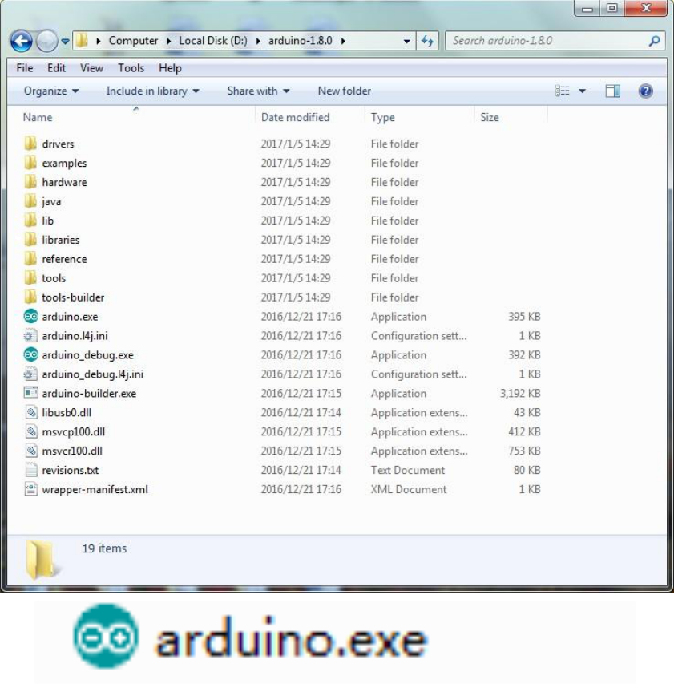
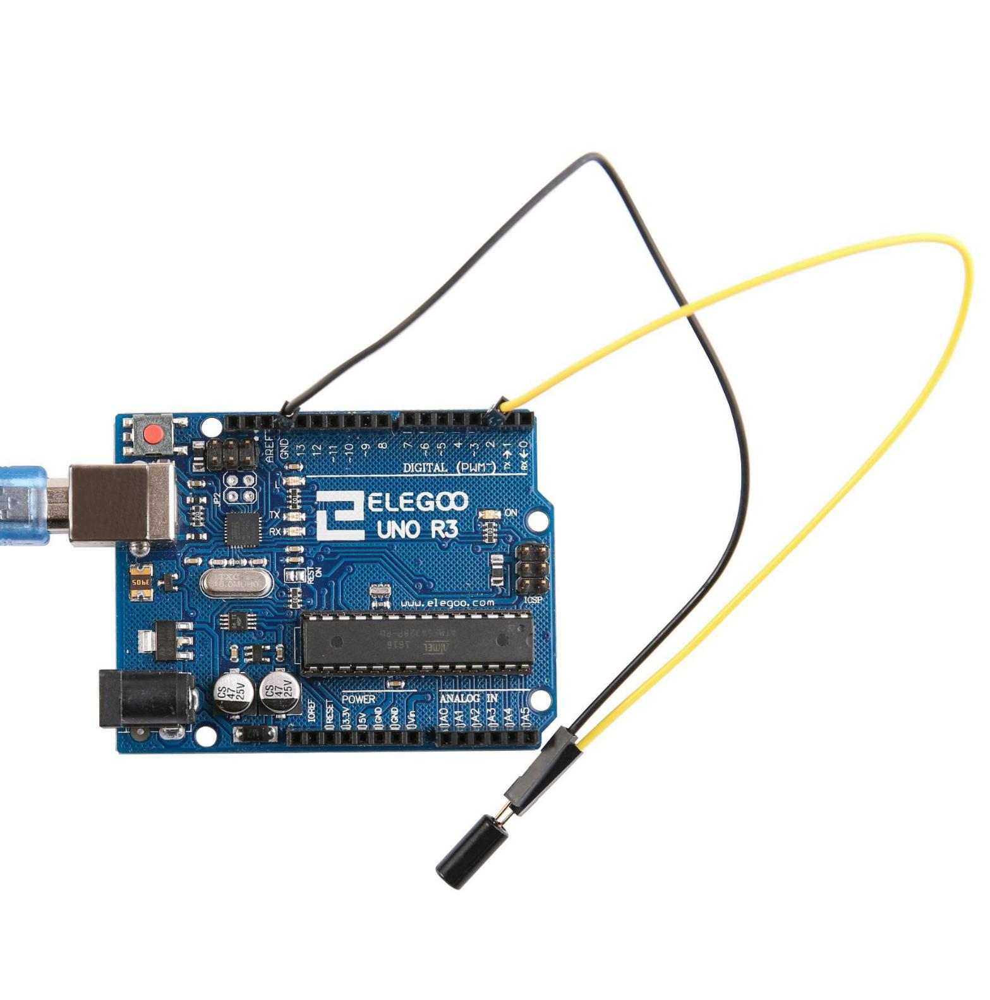
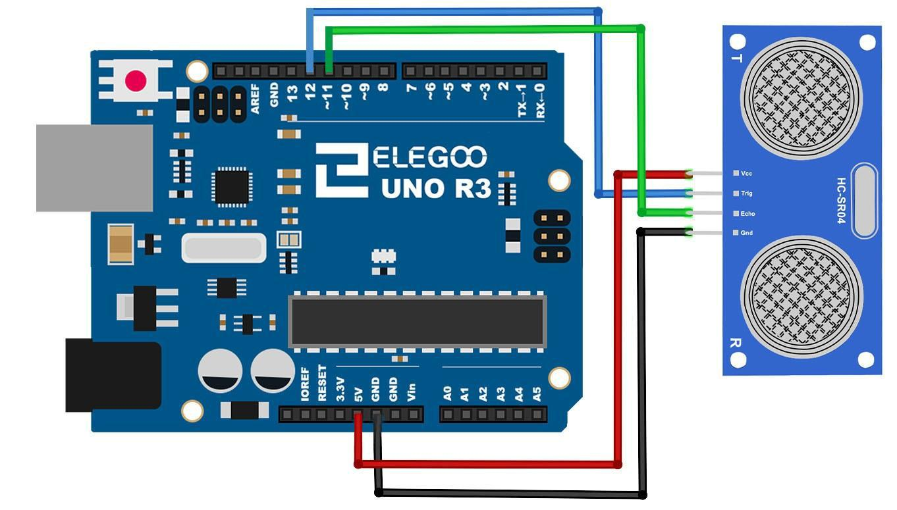
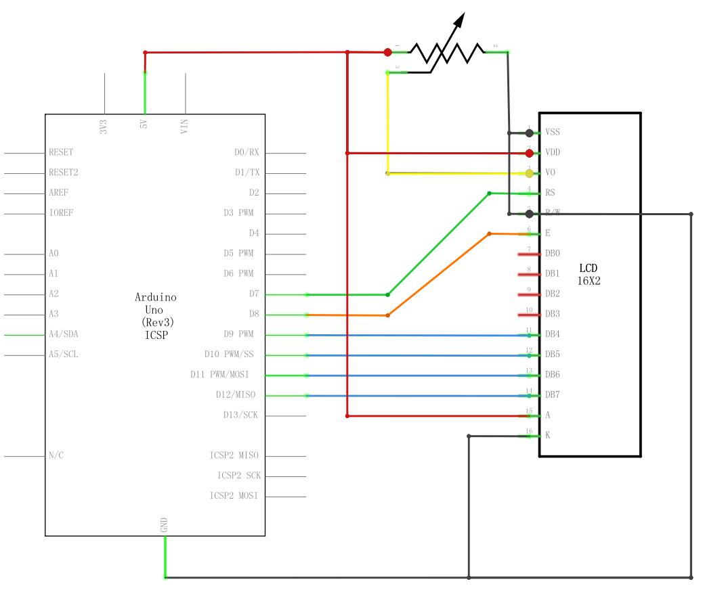
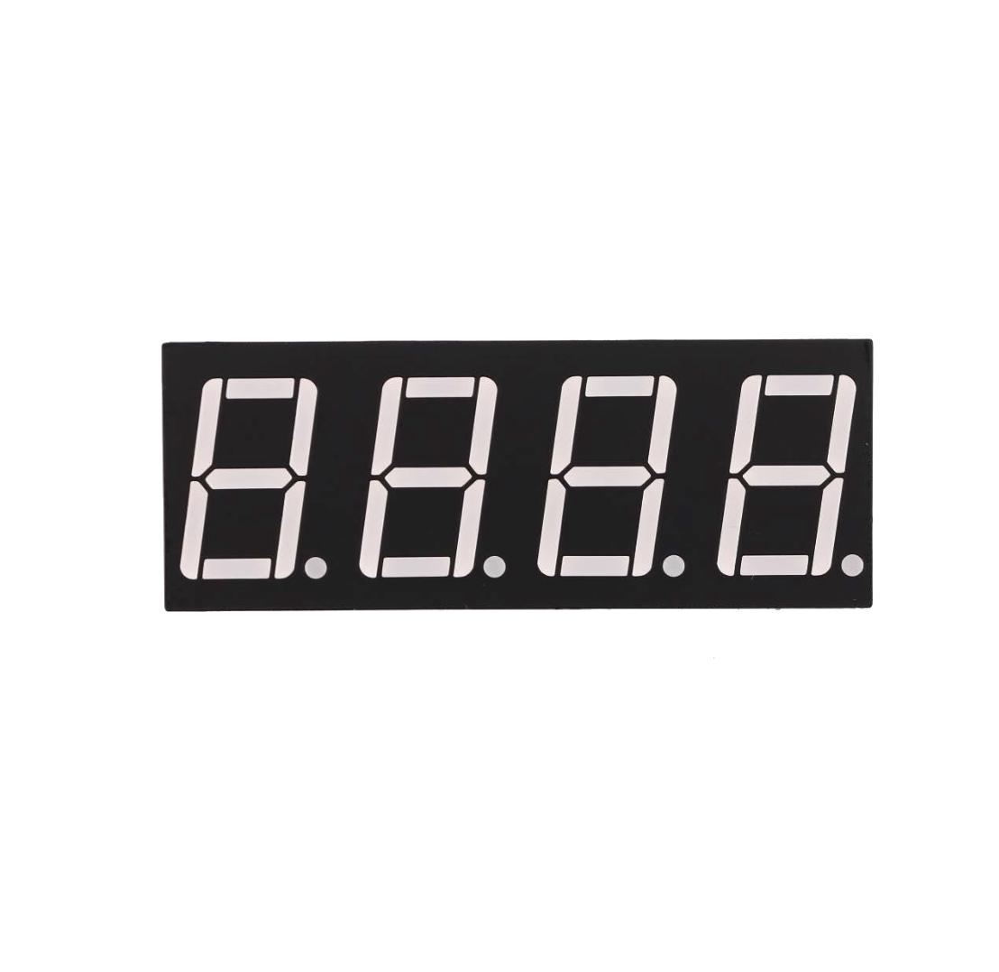

- [Elegoo Super Starter Kit para UNO](#elegoo-super-starter-kit-para-uno)
  - [Lección 0 Instación IDE](#lección-0-instación-ide)
    - [Introducción](#introducción)
    - [Instalación de Arduino (Mac OS X)](#instalación-de-arduino-mac-os-x)
    - [Instalación de Arduino (Linux)](#instalación-de-arduino-linux)
  - [Lección 1 Añadir **librería**s y Monitor serie abierta](#lección-1-añadir-librerías-y-monitor-serie-abierta)
    - [Instalación de **librería**s adicionales de Arduino](#instalación-de-librerías-adicionales-de-arduino)
    - [¿Qué son las librerías?](#qué-son-las-librerías)
    - [Cómo instalar una libreria](#cómo-instalar-una-libreria)
    - [Importar una **librería** de .zip](#importar-una-librería-de-zip)
    - [Manual de instalación](#manual-de-instalación)
    - [Arduino serie Monitor (Windows, Mac, Linux)](#arduino-serie-monitor-windows-mac-linux)
    - [Configuración](#configuración)
    - [Pros](#pros)
    - [Contras](#contras)
  - [Lección 2 Blink](#lección-2-blink)
    - [Resumen](#resumen)
    - [Placa Arduino UNO R3](#placa-arduino-uno-r3)
    - [Comentarios](#comentarios)
    - [Cambiar la frecuencia de parpadeo](#cambiar-la-frecuencia-de-parpadeo)
  - [Lección 3 LED](#lección-3-led)
    - [Resumen](#resumen-1)
    - [Protoboard](#protoboard)
    - [LED](#led)
    - [Resistencias](#resistencias)
    - [Conexión](#conexión)
    - [Esquema](#esquema)
    - [Diagrama de Cableado](#diagrama-de-cableado)
  - [Lección 4 RGB LED](#lección-4-rgb-led)
    - [Resumen](#resumen-2)
    - [RGB](#rgb)
    - [Color](#color)
    - [Teoría (PWM)](#teoría-pwm)
    - [Conexión](#conexión-1)
    - [Esquema](#esquema-1)
    - [Diagrama de cableado](#diagrama-de-cableado-1)
    - [Código](#código)
  - [Lección 5 Entradas Digitales](#lección-5-entradas-digitales)
    - [Resumen](#resumen-3)
    - [Pulsadores](#pulsadores)
    - [Conexión](#conexión-2)
    - [Esquema](#esquema-2)
    - [Diagrama de cableado](#diagrama-de-cableado-2)
    - [Código](#código-1)
  - [Lección 6 Activar zumbador](#lección-6-activar-zumbador)
    - [Resumen](#resumen-4)
    - [Zumbador](#zumbador)
    - [Conexión](#conexión-3)
    - [Esquema](#esquema-3)
    - [Diagrama de conexiones](#diagrama-de-conexiones)
    - [Código](#código-2)
  - [Lección 7 Zumbador Pasivo](#lección-7-zumbador-pasivo)
    - [Resumen](#resumen-5)
- [Componentes necesarios](#componentes-necesarios)
    - [Zumbador pasivo](#zumbador-pasivo)
    - [Conexión](#conexión-4)
    - [Esquema](#esquema-4)
    - [Diagrama de conexiones](#diagrama-de-conexiones-1)
    - [Código](#código-3)
  - [Lección 8 Interruptor de bola de inclinación](#lección-8-interruptor-de-bola-de-inclinación)
    - [Resumen](#resumen-6)
    - [Sensor de inclinación](#sensor-de-inclinación)
    - [Conexión](#conexión-5)
    - [Esquema](#esquema-5)
    - [Diagrama de conexiones](#diagrama-de-conexiones-2)
    - [Código](#código-4)
  - [Lección 9 Servo](#lección-9-servo)
    - [Resumen](#resumen-7)
    - [Servomotor SG90](#servomotor-sg90)
    - [Conexión](#conexión-6)
    - [Esquema](#esquema-6)
    - [Diagrama de cableado](#diagrama-de-cableado-3)
    - [Código](#código-5)
  - [Lección 10 Módulo Sensor ultrasónico](#lección-10-módulo-sensor-ultrasónico)
    - [Resumen](#resumen-8)
    - [Componentes necesarios](#componentes-necesarios-1)
    - [Sensor de ultrasonidos](#sensor-de-ultrasonidos)
    - [Conexión](#conexión-7)
    - [Esquema](#esquema-7)
    - [Diagrama de cableado](#diagrama-de-cableado-4)
    - [Código](#código-6)
  - [Lección 11 Sensor de humedad y temperatura DHT11](#lección-11-sensor-de-humedad-y-temperatura-dht11)
    - [Resumen](#resumen-9)
    - [Sensor de temperatura y humedad](#sensor-de-temperatura-y-humedad)
    - [Conexión](#conexión-8)
    - [Esquema](#esquema-8)
    - [Diagrama de cableado](#diagrama-de-cableado-5)
    - [Código](#código-7)
  - [Lección 12 Módulo Joystick analógico](#lección-12-módulo-joystick-analógico)
    - [Resumen](#resumen-10)
    - [Palanca de mando](#palanca-de-mando)
    - [Conexión](#conexión-9)
    - [Esquema](#esquema-9)
    - [Diagrama de cableado](#diagrama-de-cableado-6)
    - [Código](#código-8)
  - [Lección 13 Módulo de receptor IR](#lección-13-módulo-de-receptor-ir)
    - [Resumen](#resumen-11)
    - [Componentes necesarios](#componentes-necesarios-2)
    - [Sensor receptor de infrarrojos](#sensor-receptor-de-infrarrojos)
    - [Conexión](#conexión-10)
    - [Esquema](#esquema-10)
    - [Diagrama de cableado](#diagrama-de-cableado-7)
    - [Código](#código-9)
  - [Lección 14 Pantalla LCD](#lección-14-pantalla-lcd)
    - [Resumen](#resumen-12)
    - [Componentes necesarios](#componentes-necesarios-3)
    - [LCD1602](#lcd1602)
    - [Conexión](#conexión-11)
    - [Esquema](#esquema-11)
    - [Diagrama de cableado](#diagrama-de-cableado-8)
    - [Codigo](#codigo)
  - [Lección 15: Termómetro](#lección-15-termómetro)
    - [Resumen](#resumen-13)
    - [Componentes necesarios](#componentes-necesarios-4)
    - [Termistor](#termistor)
    - [Conexión](#conexión-12)
    - [Esquema](#esquema-12)
    - [Diagrama de cableado](#diagrama-de-cableado-9)
    - [Código](#código-10)
  - [Lección 16 Ocho LED con 74HC595](#lección-16-ocho-led-con-74hc595)
    - [Resumen](#resumen-14)
    - [74HC595 Registro de desplazamiento](#74hc595-registro-de-desplazamiento)
    - [Conexión](#conexión-13)
    - [Esquema](#esquema-13)
    - [Diagrama de cableado](#diagrama-de-cableado-10)
    - [Código](#código-11)
  - [Lección 17 El monitor Serial](#lección-17-el-monitor-serial)
    - [Resumen](#resumen-15)
    - [Código](#código-12)
  - [Lección 18 Fotocélula](#lección-18-fotocélula)
    - [Resumen](#resumen-16)
    - [Componentes necesarios:](#componentes-necesarios-5)
  - [Fotocélula](#fotocélula)
    - [Conexión](#conexión-14)
    - [Esquema](#esquema-14)
    - [Diagrama de cableado](#diagrama-de-cableado-11)
    - [Código](#código-13)
  - [Lección 19 74HC595 y display Segmentado](#lección-19-74hc595-y-display-segmentado)
    - [Resumen](#resumen-17)
    - [Componentes necesarios](#componentes-necesarios-6)
    - [Display de siete segmentos](#display-de-siete-segmentos)
    - [Conexión](#conexión-15)
    - [Esquema](#esquema-15)
    - [Diagrama de cableado](#diagrama-de-cableado-12)
    - [Código](#código-14)
    - [](#)
  - [Lección 20 Display de 7 segmentos de cuatro dígitos](#lección-20-display-de-7-segmentos-de-cuatro-dígitos)
    - [Resumen](#resumen-18)
    - [Componentes necesarios](#componentes-necesarios-7)
    - [Muestra de 4 dígitos de 7 segmentos](#muestra-de-4-dígitos-de-7-segmentos)
    - [Esquema](#esquema-16)
    - [Diagrama de cableado](#diagrama-de-cableado-13)
    - [Código](#código-15)
  - [Lección 21 Motor de corriente continua](#lección-21-motor-de-corriente-continua)
    - [Resumen](#resumen-19)
    - [Componentes necesarios](#componentes-necesarios-8)
    - [Fuente de alimentación de la placa](#fuente-de-alimentación-de-la-placa)
    - [L293D](#l293d)
    - [Diagrama de bloques](#diagrama-de-bloques)
    - [Conexión](#conexión-16)
    - [Esquema](#esquema-17)
    - [Diagrama de cableado](#diagrama-de-cableado-14)
    - [Código](#código-16)
  - [Lección 22 Relé](#lección-22-relé)
    - [Resumen](#resumen-20)
    - [Componentes necesarios](#componentes-necesarios-9)
    - [Relé](#relé)
    - [Conexión](#conexión-17)
    - [Esquema](#esquema-18)
    - [Diagrama de cableado](#diagrama-de-cableado-15)
    - [Código](#código-17)
  - [Lección 23 Motor paso a paso](#lección-23-motor-paso-a-paso)
    - [Resumen](#resumen-21)
    - [Componentes necesarios](#componentes-necesarios-10)
    - [Motor paso a paso](#motor-paso-a-paso)
    - [Esquema de circuitos](#esquema-de-circuitos)
    - [ULN2003 Placa conductora](#uln2003-placa-conductora)
    - [Conexión](#conexión-18)
    - [Esquema](#esquema-19)
    - [Diagrama de cableado](#diagrama-de-cableado-16)
    - [Código](#código-18)
    - [Lección 24 Control Motor paso a paso con mando a distancia](#lección-24-control-motor-paso-a-paso-con-mando-a-distancia)
    - [Resumen](#resumen-22)
    - [Componentes necesarios](#componentes-necesarios-11)
    - [Conexión](#conexión-19)
    - [Esquema](#esquema-20)
    - [Diagrama de cableado](#diagrama-de-cableado-17)
    - [Código](#código-19)


# Elegoo Super Starter Kit para UNO

## Lección 0 Instación IDE 

### Introducción 

El **Entorno de desarrollo integrado (IDE) de Arduino** es el software de la plataforma Arduino. En esta lección, usted aprenderá cómo configurar tu ordenador para usar Arduino y cómo establecer sobre las lecciones que siguen.

El software de Arduino que se utilizarán para programar tu Arduino está disponible para Windows, Mac y Linux. El proceso de instalación es diferente para las tres plataformas y lamentablemente hay una cierta cantidad de trabajo manual para instalar el software.

Paso 1: Ir a https://www.arduino.cc/en/Main/Software y a continuación de la página.


La versión disponible en este sitio web es generalmente la última versión y la versión actual puede ser más reciente que la versión en el cuadro.

Paso 2 : Descargar el desarrollo software que es compatible con el sistema operativo del ordenador. Windows tomar como un ejemplo aquí


Haga click en Windows Installer.


Haga click en DESCARGAR (JUST DOWNLOAD).

También está disponible en el material que nos proporciona la versión 1.8.0, y las versiones de nuestros materiales son las últimas versiones cuando se hizo este manual.


Instalación de Arduino (Windows)

Instalar Arduino con el exe. Paquete de instalación.


Haga click en I Agree to see de esta ventana


Click Next


Puede pulsar examinar... elegir una ruta de instalación o directamente en el directorio que desee.


Haga Click en Install para comenzar la instalación


Por último, aparece la siguiente ventana, haga clic en Install para finalizar la instalación.


A continuación, aparece el siguiente icono en el escritorio


13 / 165

Haga doble clic para entrar en el entorno de desarrollo deseado


Directamente puede elegir el paquete de instalación para la instalación y omitir los contenidos abajo y saltar a la siguiente sección. Pero si quieres aprender algunos métodos que no sea el paquete de instalación, por favor lea la sección.

Descomprime el archivo zip descargado, haga doble clic para abrir el programa y entrar en el entorno de desarrollo deseado





Sin embargo, este método de instalación necesita instalación de driver..

La carpeta de Arduino incluye el propio programa de Arduino y los controladores que permiten que el Arduino se conecte al ordenador mediante un cable USB. Antes de que inicie el software de Arduino, vas a instalar a los controladores USB.

Conecte su cable USB en el Arduino y el en el USB en tu ordenador. La luz en el LED se enciende y usted puede obtener un mensaje de 'Found New Hardware' de Windows. Ignore este mensaje y cancele cualquier intento que Windows hace para tratar de instalar los controladores automáticamente.

El major método de instalación de los controladores USB debe hacerse desde el administrador de dispositivos. Esto es accesible de diferentes maneras dependiendo de la versión de Windows. En Windows 7, primero tienes que abrir el Panel de Control, luego seleccione la opción de ver los iconos, y usted debe encontrar el administrador de dispositivos en la lista.

En 'Otros dispositivos', debería ver un icono de 'dispositivo desconocido' con un triangulo amarillo de advertencia junto a él. Se trata de tu Arduino.


Haga clic derecho sobre el dispositivo y seleccione la opción del menú superior (Update Driver Software...). Pedirá a 'Buscar automáticamente software de controlador actualizado' o "Examinar mi PC para el software de controlador". Seleccione la opción Buscar en este ordenador en la ruta del CD , por ejemplo en D:\arduino1.8.0\drivers.


Haga clic en 'Siguiente' y puede obtener una advertencia de seguridad, si es así, permitir que el software a instalar. Una vez instalado el software, usted recibirá un mensaje de confirmación.


Los usuarios de Windows pueden omitir las instrucciones de instalación, para sistemas Mac y Linux y saltar a la lección 1.

Usuarios de Mac y Linux pueden seguir leyendo esta sección

### Instalación de Arduino (Mac OS X)

Descargar y descomprimir el archivo zip, haga doble clic en Arduino.app para entrar en el IDE de Arduino; el sistema le pedirá que instale la **librería** de tiempo de ejecución de Java si no lo tienes en tu ordenador. Una vez finalizada la instalación se puede ejecutar el IDE de Arduino.


### Instalación de Arduino (Linux)

Usted tendrá que utilizar el comando de instalación. Si está utilizando el sistema de Ubuntu, se recomienda instalar el IDE de Arduino desde el centro de software de Ubuntu.


Consejos: Si tienes problemas en la instalación de los controladores, consulte el UNO R3, MEGA, NANO controlador preguntas más frecuentes.


## Lección 1 Añadir **librería**s y Monitor serie abierta 

### Instalación de **librería**s adicionales de Arduino 

Una vez que esté instalado con el software de Arduino y utilizando las funciones integradas, puede que desee ampliar la capacidad de tu Arduino con **librería**s adicionales.

### ¿Qué son las librerías? 

Las **librerías** son una colección de funciones que hacen que sea fácil para usted conectar a un  sensor, pantalla, módulo, etcétera. Por ejemplo, la librería **LiquidCrystal** incorporada facilita  hablar con pantallas LCD de caracteres. 

Hay cientos de librerías adicionales disponibles en Internet. Para utilizar las **librería**s adicionales, es necesario instalarlas primero. 

### Cómo instalar una libreria 

Mediante el administrador de la **librería**

Para instalar una nueva **librería** en el IDE de Arduino se puede utilizar el **administrador de **librería**** (disponible desde IDE versión 1.8.0). Abra el IDE y haga clic en el menú "Dibujo" y luego la **librería** incluyen > Gestión de **librería**s.  


Entonces el director de la **librería** se abrirá y usted encontrará una lista de **librería**s que ya están instalado o listo para su instalación. En este ejemplo vamos a instalar la **librería** de puente. Desplazarse por la lista para encontrarla, a continuación, seleccione la versión de la **librería** que desea instalar. A veces sólo está disponible una versión de la **librería**. Si no aparece el menú de selección de versión, no te preocupes: es normal.

Hay veces que tienes que esperar, tal como se muestra en la figura. Por favor actualice y esperar


Finalmente haga click en instalar y esperar a que el IDE instale la nueva **librería**. La descarga puede tardar un tiempo dependiendo tu velocidad de conexión. Una vez haya terminado, debe aparecer una etiqueta instalada junto a la **librería** de puente. Una vez instalada puede cerrar el administrador de la **librería**.


Ahora ya puede encontrar la nueva **librería** disponible en el menú de **librería**. Si quieres añadir tu propia **librería** vaya a abrir un nuevo tema en Github.

### Importar una **librería** de .zip 

Las **librería**s se distribuyen a menudo como un archivo ZIP o una carpeta. El nombre de la carpeta es el nombre de la **librería**. Dentro de la carpeta será un archivo .cpp, un archivo .h y a menudo un fichero llamado **keywords.txt**, carpeta de ejemplos y otros archivos requeridos por la **librería**. A partir de la versión 1.0.5, puede instalar **librería**s de partido 3 º en el IDE. Descomprime la librería descargada y dejarlo como está.

En el IDE de Arduino, desplácese a **Sketch > Biblioteca** incluyen. En la parte superior de la lista desplegable, seleccione la opción "agregar. Biblioteca ZIP''.


Se le pedirá para seleccionar la **librería** que desea añadir. Desplácese hasta la ubicación del archivo .zip y luego pincha en abrir.


Volver al dibujo > menú de **librería** de importación. Ahora debe ver la **librería** en la parte inferior del menú desplegable. Está listo para ser utilizado en su lista. El archivo zip se ha incorporado en la carpeta de **librería**s en el directorio de plantillas de Arduino.

Nota: la **librería** estará disponible para utilizar en los dibujos, pero los ejemplos de la **librería** no serán expuestos en el archivo > ejemplos hasta después del IDE se ha reiniciado. Los dos son los enfoques más comunes. Asimismo, pueden manejarse sistemas MAC y Linux. El manual de instalación que se introducirá por debajo como alternativa puede usarse rara vez y los usuarios que no lo necesiten pueden saltarlo

### Manual de instalación 

Para instalar la **librería**, primero salga de la aplicación de Arduino. Luego descomprima el archivo ZIP que contiene la **librería**. Por ejemplo, para instalar una librería llamada "ArduinoParty", descomprime ArduinoParty.zip. Debería contener una carpeta calledArduinoParty, con archivos como ArduinoParty.cpp y ArduinoParty.h dentro. (Si los archivos .cpp y .h no en una carpeta, debe crear uno. En este caso, usted sería hacer una carpeta llamada "ArduinoParty" y copiar todos los archivos que estaban en el archivo ZIP, como ArduinoParty.cpp y ArduinoParty.h.)

Arrastre la carpeta de ArduinoParty en esta carpeta (la carpeta de **librería**s). Bajo Windows, lo probable es que se llamará "My Documents\Arduino\libraries". Para usuarios de Mac, lo probable es que se llamará "Bibliotecas de Arduino de documentos". En Linux, será la carpeta "libraries" en su programabook.

La carpeta de la **librería** Arduino debe ahora este aspecto (en Windows):

```
Mi Documents\Arduino\libraries\ArduinoParty\ArduinoParty.cpp 
Mi Documents\Arduino\libraries\ArduinoParty\ArduinoParty.h  
Mi Documents\Arduino\libraries\ArduinoParty\examples 
```
o como esta (en Mac y Linux): 

```
Documents/Arduino/libraries/ArduinoParty/ArduinoParty.cpp 
Documents/Arduino/libraries/ArduinoParty/ArduinoParty.h  
Documentos/Arduino/**librería**s/ArduinoParty/ejemplos 
```

Puede haber más archivos que solo los .cpp y .h, sólo asegúrese de que están todos allí. (La **librería** no funcionará si pones los archivos .cpp y .h en la carpeta de **librería**s o si está anidados en una carpeta extra. Visualizador:

Documents\Arduino\libraries\ArduinoParty.cpp y Documents\Arduino\libraries\ArduinoParty\ArduinoParty\ArduinoParty.cpp no funcionarán.)

Reiniciar la aplicación Arduino. Asegúrese de que la nueva **librería** aparece en el directorio -> elemento de menú de **librería** de importación del software. ¡Eso es todo! ¡Ha instalado una **librería**!

### Arduino serie Monitor (Windows, Mac, Linux) 

Entorno de desarrollo integrado (IDE) de Arduino es el software de la plataforma Arduino. Y, porque utilizando un terminal es una gran parte del trabajo con Arduinos y otros microcontroladores, decidieron incluir un terminal de serie con el software. En el entorno de Arduino, esto se llama al Monitor serie.

Realizar la conexión

Monitor de serie viene con cualquier versión del IDE Arduino. Para abrirlo, simplemente haga

clic en el icono Serial Monitor.


Seleccionar cuál de los puertos a abrir en el Monitor Serial es lo mismo que seleccionar un puerto para cargar código de Arduino. Vaya a herramientas -> Serial Port y seleccione el puerto correcto.

Consejos: Elegir el mismo puerto COM que tienes en el administrador de dispositivos.


Una vez abierto, debería ver algo como esto:


### Configuración 

El Monitor Serial ha limitado opciones, pero lo suficiente para manejar la mayoría de sus  necesidades de comunicación serial. El primer ajuste que se puede modificar es la velocidad  en baudios. Haga clic en la velocidad en baudios tasa lista desplegable para seleccionar la  velocidad correcta. (9600 baudios) 


Por último, puede establecer el terminal desplazamiento automático o no marcando la casilla en la esquina inferior izquierda


### Pros 

El Monitor Serial es una gran manera rápida y fácil para establecer una conexión en serie con  el Arduino. Si ya trabaja en el IDE de Arduino, no hay realmente ninguna necesidad de abrir un terminal separado para Mostrar datos  

### Contras 

La falta de valores deja mucho que desear en el Monitor Serial, y, para comunicaciones serie avanzadas, no puede hacer el truco. 

## Lección 2 Blink 

### Resumen 

En esta lección, usted aprenderá cómo programar el tablero de regulador UNO R3 a parpadear el LED integrado de Arduino y cómo descargar programas pasos básicos

Componente necesario:

> [x] (1) x Elegoo Uno R3 


### Placa Arduino UNO R3

La placa de UNO R3 tiene unas filas de conectores a ambos lados que se utilizan para  conectar varios dispositivos electrónicos y plug-in **shields** que amplían su capacidad. También tiene un LED luminoso podemos controlar. Este  LED está construido sobre el UNO R3 y se refiere a menudo como la 'L' LED.

Este LED parpadea cuando se conecta a un enchufe del USB. Esto es porque las placas se envían generalmente con el programa de 'Blink' pre-instalado.  

En esta lección, vamos a reprogramar el tablero UNO R3 con nuestro propio directorio de Blink y luego cambiar la tasa a la que parpadea.  

En la lección 0, configurar el IDE de Arduino y aseguró que podría encontrar el puerto serie correcto para conectarse a la placa UNO R3. Ahora ha llegado el momento para poner el  programa de prueba y la placa de UNO R3.  

El IDE de Arduino incluye una gran colección de dibujos de ejemplo, se puede cargar y usar.  Esto incluye un directorio de ejemplo para hacer el parpadeo del LED de 'L'.  

Cargar el programa de 'Blink' que encontrarás en el sistema de menús del IDE bajo archivo >  ejemplos > 01 conceptos básicos 


Cuando se abre la ventana de dibujo, agrandarla para que puedan ver el dibujo completo en la ventana.


Los dibujos de ejemplo incluidos con el IDE de Arduino son de 'sólo lectura'. Es decir, puedes subir a una Junta de UNO R3, pero si cambia, no se puede guardar como el archivo  mismo.  
Puesto que vamos a cambiar este programa, lo primero que tienes que hacer es guardar su propia copia.  

En el menú archivo en el IDE de Arduino, seleccione `Guardar como.` y guarde el dibujo con  el nombre 'MyBlink' 


Ha guardado su copia de 'Blink' en su programabook. Esto significa que si alguna vez quiere encontrar otra vez, puede simplemente abrir usando el archivo > opción de menú de Sketchbook.


Conecte la placa de Arduino al ordenador con el cable USB y compruebe que la **Board Type** y **Puerto serie** están ajustados correctamente.  


Nota: 

- El tipo de tarjeta y puerto Serial aquí no son necesariamente la misma que se muestra en la imagen. Si usas 2560, entonces usted tendrá que elegir Mega 2560 como el tipo de Junta, otras opciones se pueden hacer de la misma manera. 
- El puerto serie (COM) puede ser diferente, del tipo COM3 o COM4 en su ordenador. Un puerto COM correcto se supone que es COMX (arduino XXX), que es por los criterios de  certificación. 

El IDE de Arduino mostrará la configuración actual en la parte inferior de la  ventana.  


Haga clic en el botón **subir**. El segundo botón de la izquierda en la barra de herramientas.


Si usted mira el área de estado del IDE, verá una barra de progreso y una serie de mensajes. Al principio, que dice 'Bosquejo compilar...'. Esto convierte el dibujo en un formato adecuado para subir a la Junta.


A continuación, el estado cambiará a **subir**. En este punto, los LEDs de la Arduino deben comenzar a parpadear como se transfiere el dibujo.


Por último, el estado cambiará a 'Done'.


El otro mensaje nos dice que el **programa** está utilizando 928 bytes de 32.256 bytes  disponibles. Después de la etapa de compilación Sketch... podría obtener el siguiente mensaje de error:  


Puede significar que su Junta no está conectado a todos, o no se ha instalado los drivers (si es necesario) o que se ha seleccionado el puerto serial incorrecto.

Si encuentras esto, volver a la lección 0 y verifique su instalación.

Una vez completada la carga, la Junta debe reiniciar y empiezan a parpadear.

El código abierto

Tenga en cuenta que una gran parte de este esquema se compone de comentarios. Estas no son instrucciones de programa real; por el contrario, sólo explican cómo funciona el programa. Están allí para su beneficio.

### Comentarios

- Todo entre /* y */ en la parte superior del **programa** es un Comentario de bloque; explica lo que el **programa** es para. 
- Los comentarios de una sola línea comienzan con // y hasta el final de esa línea se considera un comentario.  

La primera línea de código es: 

```arduino
int led = 13; 
```

Creamos una variable con un nombre y guardamos el número de pin al que el LED está  conectado a. A continuación, tenemos la función de 'configuración'. Otra vez, como dice el comentario, este se ejecuta cuando se presiona el botón de reset. También se ejecuta cada vez que la  Junta se reinicia por alguna razón, como poder primero se aplica a él, o después de un  **programa** se ha subido  

```arduino
void setup() { 
// Inicializa el pin digital como salida.  
pinMode(led, OUTPUT); 
} 
```

Cada programa Arduino debe tener una función de **setup** (configuración), y las instrucciones que contendrá se insertan entre las llaves { y }.  

En este caso, es un comando, que, como dice el comentario dice la placa Arduino que vamos  a utilizar el pin LED como salida.  

También es obligatorio para un boceto tener una función de **loop**. A diferencia de la función  de **setup** que se ejecuta sólo una vez, después de un reset, la función **loop**, después que haya terminado de ejecutar sus comandos, empezar inmediatamente otra vez.  

```arduino
void loop() { 
digitalWrite(led, HIGH); // Encienda el LED (alto es el nivel de voltaje)  
delay(1000); // Espere un segundo 
digitalWrite(led, LOW); // Apagar el LED por lo que la tensión baja  
delay(1000); // Espere un segundo 
} 
```
Dentro de la función **loop**, los comandos en primer lugar activar el pin del LED (alto), girar a 'retraso' de 1000 milisegundos (1 segundo), entonces el pin LED apagado y pausa para  otro segundo.  

### Cambiar la frecuencia de parpadeo

Ahora vas a que el LED parpadee más rápido. Como puede haber adivinado, la clave de esto radica en cambiar el parámetro () para el comando 'retardo'. 


Este período de retardo en milisegundos, así que si desea que el LED parpadee dos veces tan rápidamente, cambiar el valor de 1000 a 500. Esto entonces pausa durante medio segundo cada retraso en lugar de un segundo entero.

Sube otra vez el **programa** y verás que el LED comienza a parpadear más rápidamente.

## Lección 3 LED 

### Resumen 

En esta lección, usted aprenderá cómo cambiar el brillo de un LED usando diferentes valores  de resistencia.  
Componente necesario: 
```
(1) x Elegoo Uno R3 
LED rojo de 5mm x (1)  
(1) x resistencia de 220 ohmios  
(1) x resistencia de 1 k ohm  
(1) x resistencia de ohmio 10 k  
(2) x M M cables (cables de puente de macho a macho)  
```

### Protoboard

Un **protoboard** permite crear prototipos de circuitos de forma rápida, sin necesidad de soldar las  conexiones. A continuación un ejemplo. 


Breadboards vienen en varios tamaños y configuraciones. La clase más simple es sólo una rejilla de agujeros en un bloque de plástico. En el interior son tiras de metal que proporcionan una conexión eléctrica entre los agujeros en las filas más cortas. Empujando las patillas de dos componentes diferentes de la misma fila se une a ellos juntos eléctricamente. Un canal profundo, corriendo por el centro indica que hay una rotura en las conexiones, lo que significa, puede insertar un chip con las patillas a ambos lados del canal sin conectarlos juntos. Algunos breadboards tienen dos tiras de agujeros que corre a lo largo de los bordes laterales del tablero que son separados de la red principal. Éstos tienen tiras corriendo por la longitud de la tabla dentro y proporcionan una manera para conectar una tensión común. Son generalmente en pares para + 5 voltios y tierra. Estas tiras se denominan carriles y le permiten alimentar a muchos componentes o puntos en el tablero.

Si bien son breadboards para prototipos, tienen algunas limitaciones. Porque las conexiones son temporales y de acople, no son tan fiables como conexiones soldadas. Si tienes problemas intermitentes con un circuito, puede ser debido a una mala conexión en una protoboard.

### LED

LED es un gran indicador. Utilizan muy poca electricidad durará para siempre.  En esta lección, usarás tal vez el más común de todos los LEDs: un LED de 5mm de color rojo. 5mm se refiere al diámetro del LED. Otros tamaños comunes son 3mm y 10mm.  Directamente no se puede conectar un LED a una batería o fuente de tensión porque 

1) El  LED tiene un positivo y un negativo llevar y no se encenderá si se coloca mal y debe utilizarse 
2) Un LED con una resistencia para limitar o 'ahogar' la cantidad de corriente que fluye a través de él; ¡de lo contrario, quemará 


Si no utilizas un resistencia con un LED, entonces se puede quemar casi de inmediato, como demasiada corriente fluirá a través, calienta y destruye al 'cruce' donde se produce la luz. Hay dos maneras de saber cual es el positivo del LED y que la negativa. En primer lugar, el positivo es más largo.

En segundo lugar, donde la pata del negativo entra en el cuerpo del LED, hay un borde plano para el caso del LED.

Si le sucede que tiene un LED que tiene un lado plano al lado del cable más largo, usted debe saber que la pata es el positivo.

### Resistencias

Como su nombre lo indica, resistencias de resisten el flujo de electricidad. Cuanto mayor sea el valor de la resistencia, resiste más y la menos corriente fluirá a través de él. Vamos a usar esto para controlar Cuánta electricidad fluye a través del LED y por lo tanto, como claramente brilla.


Pero primero, más sobre resistencias...

La unidad de resistencia se denomina Ohm, que se abrevia generalmente a Ω la letra griega Omega. Porque un Ohm es un valor bajo de resistencia (no resiste mucho a todos), incluye los valores de resistencias en kΩ (1.000 Ω) y MΩ (1.000.000 Ω). Éstos se llaman kiloohmios y megaohmios.

En esta lección, vamos a utilizar tres valores diferentes de resistencia: 

- 220 Ω
- 1 kΩ
- 10 kΩ

Estas resistencias todas se ven iguales, excepto que tienen rayas de colores diferentes en ellos. Estas rayas decirte el valor de la resistencia.

El código de color resistor tiene tres franjas de colores y luego una banda de oro en un extremo.


A diferencia de los LEDs, resistencias no tienen un cable positivo y negativo. Se puede conectar de cualquier manera alrededor.

Si encuentra este método de enfoque demasiado complicada, puedes leer la bandera de anillo de color en nuestras resistencias directamente para determinar su valor de resistencia. O puede usar un multímetro digital en lugar de otro.

### Conexión

### Esquema


### Diagrama de Cableado


La **placa de desarrollo Arduino UNO** es una conveniente fuente de 5 voltios, que vamos a utilizar para alimentar el LED y la resistencia. No necesita hacer nada con su UNO, salvo que lo conecte un cable USB.  

- Con la resistencia de **220 Ω** en su lugar, el LED debe ser bastante brillante. 
- Si cambia  la resistencia 220  Ω para la resistencia de **1 kΩ**, el LED aparecerá regulador un  poco. 
- Por último, con el resistor de **10 kΩ** en su lugar, el LED estará casi visible. 

Por el momento, tienes 5V va a una pata de la resistencia, la otra pata de la resistencia va al lado positivo del LED y el otro lado del LED va a GND. Sin embargo, si nos mudamos la resistencia por lo que vino después el LED, como se muestra abajo, el LED seguirá la luz.


Probablemente desee volver a colocar el resistor 220Ω.

No importa qué lado del LED que ponemos la resistencia, siempre y cuando está allí en algún lugar

## Lección 4 RGB LED 

### Resumen 

Los LED RGB son una forma divertida y fácil para agregar color a sus proyectos. Puesto  que es como regular 3 LED en uno, el uso y conenxión no es muy diferente.  

Existen 2 versiones: 

- Ánodo común 
- Cátodo común.  

Ánodo común utiliza 5V en el pin común, mientras que el cátodo común se conecta  a tierra.  
Como con cualquier LED, tenemos que conectar algunas resistencias en línea (3 total)  así que podemos limitar la corriente absorbida.  

En nuestro **programa**, se comienzan con el LED en el estado de color rojo, entonces  se descolora a verde, luego se descolora azul y finalmente hacia el color rojo.  Haciendo esto que nos pasará por la mayor parte del color que se puede lograr.  

Componente necesario: 

> * (1) x Elegoo Uno R3 
> * (1) protoboard de 830 puntos de amarre x  
> * M M de x (4) cables (cables de puente de macho a macho)  
> * (1) x RGB LED  
> * (3) resistencias de 220 ohmios x 

### RGB

A primera vista, LEDs RGB (rojo, verde y azul) sólo parecen regular LED. Sin embargo, dentro del paquete del LED generalmente, hay realmente tres LEDs, uno rojo, uno verde y sí, uno azul. Controlando el brillo de cada uno de los LEDs individuales, usted puede mezclar prácticamente cualquier color que desee.

Mezclamos colores del mismo modo que sería mezclar pintura en una paleta - ajustando el brillo de cada uno de los tres LEDs. La manera dura para hacer esto sería usar valor diferentes resistencias (o resistencias variables) como hicimos con el en la lección 2, pero eso es un mucho trabajo! 

Afortunadamente para nosotros, Kit UNO R3 tiene una función **analogWrite** que puede utilizar con pines marcados con un ~ a la salida de una cantidad variable de energía los LEDs apropiados.

El LED RGB tiene cuatro conductores. Hay un cable a la conexión positiva de cada uno de los LEDs individuales dentro del paquete y un patilla única que está conectado a los tres lados negativos de los LEDs.


En las fotografías le mostramos 4 electrodo LED. Cada perno separado de color verde o azul o de rojo se llama ánodo. Siempre conectará «+» a él. Cátodo va a "-" (tierra). Si se conecta otra forma diferente el LED no se encenderá.

La común conexión negativa del paquete LED es el segundo pasador de la parte plana. También es el más largo de las cuatro patas y se conectarán a la tierra.

Cada LED dentro del paquete requiere su propio resistor de 220Ω para prevenir demasiada corriente que fluye a través de él. Los tres conductores del positivo de los LEDs (uno rojo, uno verde y uno azul) están conectados a los pines de salida UNO con estas resistencias.

### Color

La razón por la que usted puede mezclar cualquier color usted tiene gusto variando las cantidades de rojo, verde y azul de la luz es que el ojo tiene tres tipos de receptor de luz (rojo, verde y azul). Su ojo y el cerebro procesan las cantidades de rojo, verde y azul y conviertan en un color del espectro.

En cierto modo, mediante el uso de los tres LEDs, estamos jugando un truco en el ojo. Esta misma idea se utiliza en televisores, donde la pantalla LCD tiene puntos de color rojo, verde y azul junto a unos a otros que componen cada píxel.


- Si establece el brillo de todos los tres LEDs al ser el mismo, el color general de la luz  será blanco. 
- Si apagamos el LED azul, para que sólo los LEDs rojo y verdes son el  mismo brillo, la luz aparecerá amarillo.  

Podemos controlar el brillo de cada una de las partes de rojas, verdes y azules del LED por separado, lo que es posible mezclar cualquier color que nos gusta.  

El color **Negro** no es tanto un color como una ausencia de luz. Por lo tanto, lo más cercano  que podemos llegar a negro con el LED es apagar los tres colores. 

### Teoría (PWM) 


Modulación de ancho de pulso (PWM) es una técnica para el control de potencia. También utilizamos aquí para controlar el brillo de cada uno de los LEDs. El siguiente diagrama muestra que la señal de uno de lo PWM pines en la UNO.  


Aproximadamente cada 1/500 de segundo, la salida PWM producirá un pulso. La  duración de este pulso es controlada por la función 'analogWrite'. Así:

- 'analogWrite(0)' no producirá ningún pulso 
- 'analogWrite(255)' producirá un  pulso que dura todo el camino hasta el pulso siguiente vencimiento, para que la  salida es en realidad todo el tiempo.  

Si especificamos un valor en el analogWrite que está en algún lugar entre 0 y 255, se producir un pulso. 

- Si el pulso de salida es alto para el 5% del tiempo, entonces lo  que nosotros estamos manejando sólo recibirá el 5% de potencia. 
- Si la salida es 5V para el 90% del tiempo, la carga recibirá el 90% de la potencia entregada a él. 

Los LED se encenderán y apagarán en esos periodos, pero nosotros percibiremos que el brillo del LED cambia.

### Conexión

### Esquema


### Diagrama de cableado


53 / 165

### Código

```arduino
// Define pines
#define BLUE 3
#define GREEN 5
#define RED 6

void setup()
{
pinMode(RED, OUTPUT);
pinMode(GREEN, OUTPUT);
pinMode(BLUE, OUTPUT);
digitalWrite(RED, HIGH);
digitalWrite(GREEN, LOW);
digitalWrite(BLUE, LOW);
}

// define variables
int redValue;
int greenValue;
int blueValue;

// main loop
void loop()
{
#define delayTime 10 // fading time between colors

redValue = 255; // choose a value between 1 and 255 to change the color.
greenValue = 0;
blueValue = 0;

// this is unnecessary as we've either turned on RED in SETUP
// or in the previous loop ... regardless, this turns RED off
// analogWrite(RED, 0);
// delay(1000);

for(int i = 0; i < 255; i += 1) // fades out red bring green full when i=255
{
redValue -= 1;
greenValue += 1;
// The following was reversed, counting in the wrong directions
// analogWrite(RED, 255 - redValue);
// analogWrite(GREEN, 255 - greenValue);
analogWrite(RED, redValue);
analogWrite(GREEN, greenValue);
delay(delayTime);
}

redValue = 0;
greenValue = 255;
blueValue = 0;

for(int i = 0; i < 255; i += 1) // fades out green bring blue full when i=255
{
greenValue -= 1;
blueValue += 1;
// The following was reversed, counting in the wrong directions
// analogWrite(GREEN, 255 - greenValue);
// analogWrite(BLUE, 255 - blueValue);
analogWrite(GREEN, greenValue);
analogWrite(BLUE, blueValue);
delay(delayTime);
}

redValue = 0;
greenValue = 0;
blueValue = 255;

for(int i = 0; i < 255; i += 1) // fades out blue bring red full when i=255
{
// The following code has been rearranged to match the other two similar sections
blueValue -= 1;
redValue += 1;
// The following was reversed, counting in the wrong directions
// analogWrite(BLUE, 255 - blueValue);
// analogWrite(RED, 255 - redValue);1
analogWrite(BLUE, blueValue);
analogWrite(RED, redValue);
delay(delayTime);
}
}
```


After wiring, please open the Sketch in folder path: Tutorial > English > code > Lesson 4 RGB LED > RGB_LED, and click UPLOAD to upload the program.


See Lesson 2 for details about program uploading if there are any errors.

The programa starts by specifying which pins are going to be used for each of the colors:

```arduino
// Define Pins 
#define BLUE 3 
#define GREEN 5 
#define RED 6 
```

The next step is to write the 'setup' function. As we have learnt in earlier lessons, the setup function runs just once after the Arduino has reset. In this case, all it has to do is define the three pins we are using as beingoutputs.

```arduino
void setup() 
{ 
pinMode(RED, OUTPUT); 
pinMode(GREEN, OUTPUT); 
pinMode(BLUE,OUTPUT); 
digitalWrite(RED, HIGH); 
digitalWrite(GREEN, LOW); 
digitalWrite(BLUE, LOW); 
}
```

Antes de echar un vistazo a la **función loop**, veamos la última función en el proyecto.  
Las variables de definición:

```arduino
redValue = 255; // choose a value between 1 and 255 to change the color.  
greenValue = 0; 
blueValue = 0; 
```

Esta función tiene tres argumentos, uno para el brillo de los LEDs rojos, verdes y azules. En cada caso de que el número será en el rango 0 a 255, donde 0 significa apagado y 255 significa brillo máximo. La función entonces llama 'analogWrite' para ajustar el brillo de cada LED.

Si nos fijamos en la **función loop** se puede ver que ajuste la cantidad de luz roja, verde y azul que queremos mostrar y luego una pausa por un segundo antes de pasar al siguiente color.

```arduino
#define delayTime 10 // fading time between colors  
Delay(delayTime); 
```

Trate de añadir algunos colores de los tuyos el dibujo y ver el efecto en tu LED.  


## Lección 5 Entradas Digitales 
### Resumen 
En esta lección, usted aprenderá a utilizar los botones con entradas digitales para  encender y apagar un LED.  
Presionar el botón se encenderá el LED; pulsar el otro botón se apagará el LED.  
Componente necesario: 

- (1) x Elegoo Uno R3 
- (1) protoboard de 830 puntos de amarre x 
- LED rojo de 5mm x (1)  
- (1) x resistencia de 220 ohmios 
- interruptores de presión x (2)  
- (7) x M M cables (cables de puente de macho a macho) 
- Introducción del componente 

### Pulsadores

Los interruptores son componentes muy simples. Cuando pulse un botón o girar una palanca, conectan dos contactos para que la electricidad fluya a través de ellos. Los interruptores táctiles poco utilizados en esta lección tienen cuatro conexiones, que pueden ser un poco confusas


En realidad, hay realmente dos conexiones eléctricas. Dentro del paquete de interruptor, pins B y C se conectan entre sí, como son A y D.

### Conexión

### Esquema


### Diagrama de cableado


Aunque los cuerpos de los interruptores son cuadrados, los pasadores sobresalen de los lados opuestos del interruptor. Esto significa que los pines sólo estarán lo suficientemente separados cuando se colocan correctamente en la placa de pruebas. Recuerde que el LED tiene que tener el cable negativo más corto a la izquierda.

### Código

Después de cablearlo, por favor, abra el programa en el código de carpeta - Lección 5 entradas digitales y presione UPLOAD para cargar el programa. Si se aparecen errores, ver Lección 2 para obtener más información sobre el tutorial de subir programa.

El bosquejo en su placa UNO de carga. Presionando el botón izquierdo se encenderá el LED mientras que pulsando el botón derecho apagará.

La primera parte del proyecto define tres variables para ls tres patas que se van a utilizar. El 'ledPin' es el pin de salida y 'buttonApin' se refiere al interruptor más cerca de la parte superior de la placa y 'buttonBpin' para el otro interruptor.

La función de **setup** define el ledPin como una salida normal, pero ahora tenemos las dos entradas para ocuparse. En este caso, utilizamos el conjunto el pinMode ser 'INPUT_PULLUP' como este:

```arduino
pinMode(buttonApin, INPUT_PULLUP); 
pinMode(buttonBpin, INPUT_PULLUP); 
```

El modo pin de INPUT_PULLUP significa que el pin debe ser utilizado como una entrada, pero que si nada mas se conecta a la entrada, se debe 'sacarse' a alta. En otras palabras, el valor predeterminado de la entrada es alta, a menos que se tiró bajo por la acción de pulsar el botón.

Por esta razón los interruptores están conectados a tierra. Cuando un interruptor se presiona, se conecta la clavija de entrada a la tierra, para que ya no es alta.

Puesto que la entrada es normalmente alta y va sólo baja cuando se pulsa el botón, la lógica es un poco boca abajo. Nosotros nos encargaremos de esto en la **función loop**

```arduino
void loop() 
{ 
if (digitalRead(buttonApin) == LOW) 
{
  digitalWrite(ledPin, HIGH); 
} 
if (digitalRead(buttonBpin) == LOW) 
{ 
  digitalWrite(ledPin, LOW); 
} 
} 
```

En la **función loop** hay dos declaraciones de 'si'. Uno para cada botón. Cada uno hace un 'digitalRead' en la entrada adecuada.

Recuerde que si se presiona el botón, la entrada correspondiente será baja, si el botón A es bajo, entonces un 'digitalWrite' en el ledPin enciende.


Del mismo modo, si se presiona el botón B, un bajo se escribe en el ledPin.


## Lección 6 Activar zumbador 

### Resumen 
En esta lección, aprenderá a generar un sonido con un timbre activo.  
Componente necesario: 

- (1) x Elegoo Uno R3 
- (1) zumbador de Active x 
- (2) x F M cables (cables de hembra a macho DuPont) 

### Zumbador

Zumbadores electrónicos son alimentados por CC, equipado con un circuito  integrado. Son ampliamente utilizados en computadoras, impresoras, fotocopiadoras, alarmas, juguetes electrónicos, dispositivos electrónicos  automotores, teléfonos, alarmas y otros productos electrónicos para dispositivos de voz. 

Se pueden categorizar en activos y pasivos. Gire que los pernos  de dos zumbadores boca arriba. Con un tablero de circuito verde es un zumbador  pasivo, mientras que el otro cerrado con una cinta negra es un activo.  

La diferencia entre los dos es que un **zumbador activo** tiene una fuente oscilante integrada, por lo que va a generar un sonido cuando se electrifica. Una alarma pasiva  no tiene esa fuente para que no pitan si se utilizan señales de DC; en cambio,  necesitará usar ondas cuadradas cuya frecuencia es entre 2K y 5K manejarlo. El  zumbador activo es a menudo más caro que el pasivo debido a múltiples circuitos oscilantes incorporados. 


### Conexión

### Esquema


### Diagrama de conexiones


### Código

Después de efectuar el cableado, abrir el programa en el código carpeta - Lección 6 haciendo sonidos y haga clic en cargar para cargar el programa. Ver Lección 2 para obtener más información sobre programa cargar si hay algún error.


## Lección 7 Zumbador Pasivo 
### Resumen 
En esta lección, usted aprenderá cómo utilizar una señal acústica pasiva.  El propósito del experimento es generar ocho sonidos, cada sonido dura 0,5 segundos: 

- Do (523Hz)
- Re (587Hz)
- Mi (659Hz)
- Fa (698Hz)
- Sol (784Hz)
- La (880Hz)
- Si (988Hz) 
- Do alto (1047Hz)

# Componentes necesarios

```
(1) x Elegoo Uno R3 
(1) zumbador pasiva de x  
(2) x F M cables (cables de hembra a macho DuPont)  
```

### Zumbador pasivo

El principio de funcionamiento del zumbador pasiva está utilizando PWM generar audio para hacer el aire para que vibre. Debidamente cambiado tanto como la  frecuencia de vibración, puede generar diferentes sonidos. Por ejemplo, enviando  un pulso de 523Hz, puede generar Alto, pulso de 587Hz, puede generar el rango medio, pulso de 659Hz, que puede producir Mi de rango medio. Por el timbre, puede reproducir una canción. 


Nosotros debemos tener cuidado de no utilizar la función de () escritura analógica Kit UNO R3 para generar un pulso el timbre, porque la salida de pulso de analógico (de escritura) se fija (500 Hz).

### Conexión

### Esquema


### Diagrama de conexiones


Cableado el zumbador conectado a la placa UNO R3, rojo (positivo) que el pin8, cable negro (negativo) a la tierra.

### Código


```arduino
int buzzer = 12;//the pin of the active buzzer
void setup()
{
 pinMode(buzzer,OUTPUT);//initialize the buzzer pin as an output
}
void loop()
{
 unsigned char i;
 while(1)
 {
   //output an frequency
   for(i=0;i<80;i++)
   {
    digitalWrite(buzzer,HIGH);
    delay(1);//wait for 1ms
    digitalWrite(buzzer,LOW);
    delay(1);//wait for 1ms
    }
    //output another frequency
     for(i=0;i<100;i++)
      {
        digitalWrite(buzzer,HIGH);
        delay(2);//wait for 2ms
        digitalWrite(buzzer,LOW);
        delay(2);//wait for 2ms
      }
  }
} 
```

Después de efectuar el cableado, por favor, abra el programa en el código de carpeta lección 7 pasivo zumbador y haga clic en UPLOAD para cargar el programa. Ver Lección 2 para obtener más información sobre programa cargar si hay algún error. 

Antes de ejecutar esto, asegúrese de que ha instalado la **librería** < parcelas > o volver a instalarlo, si es necesario. De lo contrario, el código no funcionará. 
Para obtener más información sobre carga el archivo de **librería**, ver Lección 1.


## Lección 8 Interruptor de bola de inclinación 

### Resumen 
En esta lección, usted aprenderá cómo utilizar un interruptor de bola de inclinación  para detectar el pequeño ángulo de inclinación.  

Componentes Requeridos: 
```
(1) x Elegoo Uno R3 
(1) x interruptor de inclinación bola  
(2) x F-M wires (cables de hembra a macho DuPont)  
```

### Sensor de inclinación 

Los sensores de inclinación (interruptor de bola de inclinación) le permiten detectar orientación o inclinación. Son pequeños, económicos, de bajo consumo y fáciles de usar. Si se usan correctamente, no se desgastarán. Su simplicidad los hace populares para los juguetes, los adminículos y los aparatos. A veces, se conocen como "interruptores de mercurio", "interruptores de inclinación" o "sensores de bola rodante" por razones obvias.

Se componen generalmente de una cavidad de una cierta clase (cilíndrica es popular, aunque no siempre) con una masa libre conductora adentro, tal como una gota del mercurio o bola rodante. Un extremo de la cavidad tiene dos elementos conductores (polos). Cuando el sensor está orientado de tal manera que dicho extremo está hacia abajo, la masa rueda sobre los polos y los cortocircuitos, actuando como un interruptor de tiro.

Aunque no es tan preciso ni flexible como un acelerómetro completo, los interruptores de inclinación pueden detectar movimiento u orientación. Otro beneficio es que los grandes pueden cambiar de energía por su cuenta. Los acelerómetros, por otro lado, producen voltaje digital o analógico que luego deben analizarse utilizando circuitos extra.


### Conexión

### Esquema


### Diagrama de conexiones


### Código

Después de efectuar el cableado, por favor, abra el programa en el código de carpeta lección 8 interruptor de la bola y haga clic en UPLOAD para cargar el programa. Ver Lección 2 para obtener más información sobre programa cargar si hay algún error.



## Lección 9 Servo 

### Resumen 

El Servo es un tipo de motorreductor que sólo puede girar 180 grados. Se controla  mediante el envío de impulsos eléctricos de la placa de UNO R3. Estos pulsos le dice al servo qué posición se debe mover. 

El Servo tiene tres cables, de que el marrón  es el cable a tierra y deben conectarse a GND puerto UNO, el rojo es el cable de corriente y debe conectarse al puerto de 5v y la naranja es el alambre de señal y debe conectarse al puerto #9.  

Componentes necesario: 
```
(1) x Elegoo Uno R3 
(1) x Servo (SG90)  
(3) x M M cables (cables de puente de macho a macho)  
```
Introducción del componente 

### Servomotor SG90 

| Parámetro                  | Valor                                                          |
| -------------------------- | -------------------------------------------------------------- |
| Longitud del cable:        | 25cm                                                           |
| Sin carga;                 | Velocidad: 0,12 seg/60degree (4.8V), 0.10 sec/60 grados (6.0V) |
| Puesto de par (4.8V):      | 1,6 kg/cm                                                      |
| Temperatura:               | -30 ~ 60' C                                                    |
| Ancho de banda muerta:     | 5 us                                                           |
| Voltaje de funcionamiento: | 3.5 ~ 6V                                                       |
| Dimensión:                 | 1.26 en x 1,18 en x 0,47 en (3,2 x 3 cm x 1.2 cm)              |
| Peso:                      | 4,73 onzas (134)                                               |


### Conexión

### Esquema


### Diagrama de cableado


### Código

Después de efectuar el cableado, por favor, abra el programa en el código de carpeta Lección 9 Servomecanismo y haga clic en UPLOAD para cargar el programa. Ver Lección 2 para obtener más información sobre programa cargar si hay algún error. 

Antes de ejecutar esto, asegúrese de que ha instalado el < Servo > Biblioteca o volver a instalarlo, si es necesario. De lo contrario, el código no funciona.

Para obtener más información sobre carga el archivo de **librería**, ver Lección 1.


En la foto, el cable marrón del servo se adapta a través de los cables negros de M-M, el rojo uno se adapta a través de los cables rojos de M-M y la naranja uno se adapta a través de los cables amarillos de M-M .

## Lección 10 Módulo Sensor ultrasónico 


### Resumen 

El **sensor ultrasónico** es ideal para todo tipo de proyectos que necesitan medidas de distancia, evitando los obstáculos como ejemplos.  

El HC-SR04 es barato y fácil de usar ya que vamos a usar una **librería** diseñada  específicamente para estos sensores.  

### Componentes necesarios

```
(1) x Elegoo Uno R3 
(1) x Módulo de sensor ultrasónico  
(4) x F M cables (cables de hembra a macho DuPont)  
```
### Sensor de ultrasonidos 

El módulo HC-SR04 del sensor ultrasónico proporciona la función sin contacto de la medida los 2cm-400cm, la precisión que varía puede alcanzar a 3m m. Los módulos incluyen transmisores ultrasónicos, receptor y circuito de control. El principio básico del trabajo:

Utilizando el disparador IO para una señal de nivel alto de al menos 10us,

El Módulo envía automáticamente ocho 40 kHz y detecta si hay una señal de pulso hacia atrás.

SI la señal de retorno, a través de alto nivel, tiempo de alta salida IO duración es el tiempo de envío de ultrasonido tore giro.

Distancia de prueba = (tiempo de alto nivel x velocidad del sonido (340m / s) / 2

El diagrama de sincronización se muestra a continuación. Sólo tiene que suministrar un pulso de 10us corto a la entrada de activación para iniciar el rango, y luego el módulo enviará una ráfaga de 8 ciclos de ultrasonido a 40 kHz y aumentar su eco. El Echo es un objeto de distancia que es el ancho de pulso y el rango en proporción. Puede calcular el rango a través del intervalo de tiempo entre la señal de disparo de envío y la señal de eco de recepción. Fórmula: us / 58 = centímetros o us / 148 = inch; O: el rango = tiempo de alto nivel * velocidad

(340M / S) / 2; 

Sugerimos utilizar más de 60ms de ciclo de medición, con el fin de evitar la señal de disparo a la señal de eco.


### Conexión


### Esquema

### Diagrama de cableado



### Código

Uso de una **librería** diseñada para estos sensores hará nuestro código corto y sencillo.

Incluimos la **librería** al principio de nuestro código, y luego mediante simples comandos podemos controlar el comportamiento del sensor.

Después de efectuar el cableado, por favor, abra el programa en la carpeta de código-10 módulo de Sensor ultrasónico de lección y haga clic en cargar para cargar el programa. Ver Lección 2 para más detalles sobre el programa cargar si hay algún error. Antes de ejecutar esto, asegúrese de que ha instalado el < HC-SR04 > Biblioteca o volver a instalarlo, si es necesario. De lo contrario, el código no funciona.

Para obtener más información sobre carga el archivo de **librería**, ver Lección 1


Abrir al monitor y puede ver los datos como soplo:

Haga clic en el botón Serial Monitor para encender el monitor serie. Se introducen los conceptos básicos sobre el monitor serial en detalles en la lección 1.


## Lección 11 Sensor de humedad y temperatura DHT11

### Resumen

En este tutorial vamos a aprender cómo usar un Sensor de humedad y temperatura DHT11.

Es lo suficientemente exacta para la mayoría de los proyectos que necesitan hacer un seguimiento de las lecturas de humedad y temperatura.

Otra vez vamos a usar una **librería** diseñada específicamente para estos sensores que harán que nuestro código corto y fácil de escribir.

Componente necesario:


```
(1) x Elegoo Uno R3
(1) x módulo de humedad y temperatura DHT11
(3) x F M cables (cables de hembra a macho DuPont)
```

### Sensor de temperatura y humedad

Sensor digital de temperatura y humedad DHT11 es un Sensor compuesto que contiene la salida de la señal digital calibrado de la temperatura y la humedad. La tecnología de colección de módulos digitales dedicado y la temperatura y humedad sensor de tecnología se aplican para garantizar que el producto tiene alta confiabilidad y excelente estabilidad a largo plazo. El sensor incluye un sentido resistente de componentes mojados y un dispositivos de medición de temperatura NTC y conecta con un microcontrolador de 8 bits de alto rendimiento.

Aplicaciones: HVAC, deshumidificador, ensayos e inspección de equipos, bienes de consumo, control automático, automóvil, registradores de datos, estaciones meteorológicas, electrodomésticos, regulador de humedad, humedad médicos y otros medición y control.

Parámetros del producto

Humedad relativa:

- Resolución: 16 bits
- Repetibilidad: ±1% H.R.
- Precisión: 25 ° C ±5% hr
- Intercambiabilidad: intercambiables
- Tiempo de respuesta: 1 / e (63%) de 25º c 6s
- 1m / s de aire 6s
- Histéresis: < ± 0.3% RH
- Estabilidad a largo plazo: < ± 0.5% hr / año en

Temperatura:

Resolución: 16 bits

Repetibilidad: ±0. 2 ° C

Rango: 25 ° C ±2° c

Tiempo de respuesta: 1 / e (63%) 10S

Características eléctricas

Fuente de alimentación: DC 3.5 ~ 5.5V

Corriente: medición 0.3mA espera 60μA

Periodo de muestreo: más de 2 segundos

PIN Descripción:

- VDD alimentación 3,5~5.5V DC
- serie de datos, un solo bus
- NC, pin vacío
- GND tierra, la energía negative

### Conexión

### Esquema


### Diagrama de cableado


Como se puede ver que sólo necesitamos 3 conexiones al sensor, ya que uno de lo pin no se utiliza.

Las conexiones son: voltaje, tierra y señal de que puede conectarse a cualquier Pin en nuestro UNO.

### Código

Después de efectuar el cableado, por favor, abra el programa en la carpeta de código-Sensor de humedad y temperatura DHT11 12 de lección y haga clic en cargar para cargar el programa. Ver Lección 2 para más detalles sobre el programa cargar si hay algún error.

Antes de ejecutar esto, asegúrese de que ha instalado el < SimpleDHT > Biblioteca o volver a instalarlo, si es necesario. De lo contrario, el código no funciona.


Para obtener más información sobre el tutorial de la carga del archivo de la **librería**, consulte la lección 1

A continuación hay que subir el programa, abra el monitor, donde podemos ver los datos como abajo: (muestra la temperatura del medio ambiente, podemos ver es de 22 grados)

Haga clic en el Serial Monitor botón para encender el monitor serie. Se introducen los conceptos básicos sobre el monitor serial en detalles en la lección 1.


## Lección 12 Módulo Joystick analógico

### Resumen

Los Joysticks analógicos son una gran manera de añadir un poco de control en sus

proyectos.

En este tutorial aprenderemos a usar el módulo de joystick analógico

Componente necesario:

```
(1) x Elegoo Uno R3
(1) x módulo de Joystick
(5) x F M cables (cables de hembra a macho DuPont)
```


### Palanca de mando

El módulo tiene 5 pines: VCC, tierra, X, Y, clave. Tenga en cuenta que las etiquetas en el suyo pueden ser ligeramente diferentes, dependiendo de dónde obtuvo el módulo. El palillo del pulgar es analógico y debe proporcionar lecturas más exactas que las palancas de mando "direccionales" simples utilizan algunas formas de botones, o interruptores mecánicos. Además, puede presionar el joystick hacia abajo (bastante difícil en la mía) para activar un pulsador de "pulsar para seleccionar".

Tenemos que usar pines Arduino analógicos para leer los datos de los pines X / Y, y un pin digital para leer el botón. El pin de la Llave está conectado a tierra, cuando el joystick está presionado hacia abajo, y está flotando de otra manera. Para obtener lecturas estables del pin Key / Select, debe conectarse a VCC a través de una resistencia pull-up. Las resistencias incorporadas en los pines digitales de Arduino se pueden utilizar. Para obtener un tutorial sobre cómo activar las resistencias pull-up para pines Arduino, configuradas como entradas


### Conexión

### Esquema


### Diagrama de cableado


Necesitamos 5 las conexiones de la palanca de mando.

Las conexiones son: clave, Y, X, voltaje y tierra.

«Y y X» son analógicas y Digital es "Clave". Si usted no necesita el interruptor puede utilizar solamente 4 pines.

### Código

Después de efectuar el cableado, por favor, abra el programa en la carpeta de código-Lección 13 módulo de Joystick analógico y haga clic en cargar para cargar el programa.

Ver Lección 2 para más detalles sobre el programa cargar si hay algún error. 
Palancas de mando análogas son básicamente los potenciómetros para que regresan valores analógicos. 
Cuando el joystick se encuentra en la posición de reposo o medio, debe devolver un valor de aproximadamente 512.


El rango de valores va de 0 a 1024.

Abrir al monitor y puede ver los datos como soplo:

Haga clic en el Serial Monitor botón para encender el monitor serie. Se introducen los conceptos básicos sobre el monitor serial en detalles en la lección 1.


## Lección 13 Módulo de receptor IR

### Resumen

Usando un control remoto es una gran manera de tener el control inalámbrico de su proyecto.

Los mandos a distancia infrarrojos son simples y fáciles de usar. En este tutorial nos conectando el receptor IR para el UNO y luego use una **librería** que fue diseñada para este sensor en particular.

En nuestro dibujo tenemos todos los códigos de IR Hexadecimal que están disponibles en este control remoto, también detectará si el código fue reconocido y también si estamos manteniendo pulsada una tecla


### Componentes necesarios
```
(1) x Elegoo Uno R3
x IR modulo receptor
x IR control remoto
x F-M cables (cables de hembra a macho DuPont)ç
```

### Sensor receptor de infrarrojos

Los detectores infrarrojos son pequeños microchips con una célula fotoeléctrica que están configurados para recibir a la luz infrarroja. Casi siempre se utilizan para la detección de control remoto - cada TV y reproductor de DVD tiene uno de estos en la parte delantera para escuchar la señal de IR desde el clicker. Dentro del control remoto es un juego IR LED, que emite pulsos IR para comunicar al televisor para encender, apagar o cambiar de canal. Luz infrarroja no es visible para el ojo humano, lo que significa que tarda un poquito más de trabajo para probar una configuración. Hay algunas diferencias entre ellos y decir unas fotocélulas CdS:

Detectores infrarrojos son especialmente filtrados para IR ligero, no son buenos para detectar luz visible. Por otro lado, las fotocélulas son buenas para detectar luz visible de amarillo/verde y no son buenas para luz IR.

Detectores infrarrojos tienen un demodulador en ese aspecto para IR modulada a 38 KHz. Sólo brilla un LED IR no detectada, tiene que ser PWM intermitente en 38 KHz. fotocélulas no tienen ningún tipo de demodulador y puede detectar cualquier frecuencia (incluyendo CC) dentro de la velocidad de respuesta de la fotocélula (que es aproximadamente 1KHz)

Detectores infrarrojos son salida digital - tampoco detectan señal 38KHz IR y salida bajo (0V) o no detecta ninguno y salida alto (5V). Fotocélulas actúan como resistencias, los cambios de resistencia dependiendo de cuánto se exponen a la luz

Lo que se puede medir


Como se puede ver en estos gráficos de hoja de datos, la detección de frecuencia de peak es a 38 KHz y el pico color del LED es de 940 nm. Se puede usar desde unos 35 KHz kHz 41 pero la sensibilidad se desprenderá para que no detecte asídesde lejos. Asimismo, puede utilizar LEDs de 850 a 1100 nm pero no funcionan tan bien como 900 a 1000nm asíque asegúrese de obtener coincidencia de LEDs! Compruebe la ficha técnica para su IR LED verificar la longitud de onda.

¡Trate de conseguir un 940nm - Recuerde que 940nm no es luz visible!

### Conexión

### Esquema


### Diagrama de cableado

Hay 3 conexiones para el receptor de infrarrojos.

Las conexiones son: señal, voltaje y tierra.

- El "-" es la tierra"S" es señal y medio es voltaje de 5V.

### Código

Después de efectuar el cableado, por favor, abra el programa en la carpeta de código-Lección 14 módulo de receptor de IR y haga clic en UPLOAD para cargar el programa. Ver Lección 2 para más detalles sobre el programa cargar si hay algún error.

Antes de ejecutar esto, asegúrese de que ha instalado el < IRremote > Biblioteca o volver a instalarlo, si es necesario. De lo contrario, el código no funciona.

Para obtener más información sobre carga el archivo de **librería**, ver Lección 1.

A continuación nos trasladaremos el < RobotIRremote > fuera de la carpeta de **librería**, para ello ya que entra en conflicto con la **librería** va a utilizar. Sólo puede arrastrarlo dentro de la carpeta de la **librería** una vez que haya terminado de programar el microcontrolador.


Una vez que ha instalado la **librería**, sólo seguir adelante y reiniciar su Software IDE.

Abrir al monitor y puede ver los datos:

Haga clic en el Serial Monitor botón para encender el monitor serie. Se introducen los conceptos básicos sobre el monitor serial en detalles en la lección 1


## Lección 14 Pantalla LCD

### Resumen

En esta lección, usted aprenderá cómo conectar y usar una pantalla LCD alfanumérico.

La pantalla tiene una retroiluminación de LED y puede mostrar dos filas con hasta 16 caracteres en cada fila. Puede ver los rectángulos para cada carácter en la pantalla y los píxeles que componen cada carácter. La pantalla es blanca en azul y está diseñada para mostrar texto.


En esta lección, se ejecutará el programa de ejemplo de Arduino para la **librería** de la LCD, pero en la siguiente lección, nos pondremos nuestra pantalla para mostrar la temperatura mediante sensores.

### Componentes necesarios

x Elegoo Uno R3
x LCD1602 módulo
x Potenciómetro (10k)
x 830 tie-puntos Breadboard
x M-M cables (cables de puente de macho a macho)

### LCD1602

Introduccion a las patillas del LCD1602:

- VSS: Un pin que se conecta a tierra
- VDD: Un pin que se conecta a un + 5V fuente de alimentación

VO: Un pasador que ajusta el contraste de LCD1602

RS: Un registro seleccione pin que controla donde en memoria de la pantalla LCD datos de escritura. Usted puede seleccionar el registro de datos, que es lo que pasa en la pantalla, o un registro de instrucción, que es donde busca controlador de LCD para obtener instrucciones sobre qué hacer.

- R/W: Pin A lectura y escritura que selecciona el modo de lectura o escritura a modo de E:, Permitiendo a un perno con energía de bajo nivel, módulo causas la LDC para ejecutar instrucciones.
- D0-D7: Pernos que leer y escribir datos

A y K: Que el control de la retroiluminación LED de los pernos

### Conexión

### Esquema



### Diagrama de cableado


La pantalla LCD necesita seis pines de Arduino, todo listo para ser salidas digitales.

También necesita 5V y GND conexiones.

Hay un número de conexiones a realizar. Alineación de la pantalla con la parte superior de la placa ayuda a identificar sus pines sin demasiada cuenta, especialmente si la placa tiene sus filas numeradas con la fila 1 como la fila superior de la Junta. No lo olvides, el cable largo amarillo que conecta el regulador de la olla a la clavija 3 de la pantalla. La 'olla' se utiliza para controlar el contraste de la pantalla. Usted puede encontrar que su pantalla se suministra sin cabecera pins conectados a él. Si es así, siga las instrucciones en la sección siguiente.

### Codigo

Después de efectuar el cableado, por favor, abra el programa en el código de carpeta lección 22 LCD pantalla y haga clic en UPLOAD para cargar el programa. Ver Lección 2 para obtener más información sobre programa cargar si hay algún error.

Antes de ejecutar esto, asegúrese de que ha instalado la **librería** < LiquidCrystal > o volver a instalarlo, si es necesario. De lo contrario, el código no funcionará.

Para obtener más información sobre carga el archivo de **librería**, ver Lección 1. Subir el código a la placa Arduino y usted debería ver el mensaje 'Hola, mundo' aparece, seguido de un número que cuenta de cero.

Lo primero que nota en el dibujo es la línea:

```arduino
#include < LiquidCrystal.h >
```

Esto dice Arduino que queremos utilizar la **librería** de cristal líquido.

A continuación tenemos la línea que teníamos que modificar. Esto define qué pines de Arduino son para conectarse a que pines de la pantalla.

```
LiquidCrystal lcd (7, 8, 9, 10, 11, 12);
```

Después de subir este código, asegúrese de que se enciende la retroiluminación y ajustar el potenciómetro de toda la manera alrededor hasta que aparezca el mensaje de texto

En la función de **setup**, tenemos dos comandos:

```arduino
LCD.Begin (16, 2);
LCD.Print ("Hola, mundo!");
```
La primera cuenta la **librería** de cristal líquido cuántas columnas y filas tiene la pantalla. La segunda línea muestra el mensaje que vemos en la primera línea de la pantalla.

En la función de 'loop', aso tienen dos comandos:

```
lcd.setCursor (0, 1);
LCD.Print(Millis()/1000);
```

El primero establece la posición del cursor (donde aparecerá el siguiente texto) columna 0 y fila 1. Los números de columna y fila comienzan en 0 en lugar de 1.


La segunda línea muestra el número de milisegundos desde que se restableció el Arduino.

## Lección 15: Termómetro

### Resumen

En esta lección, utilizará una pantalla LCD para mostrar la temperatura.

### Componentes necesarios

> *  Elegoo Uno R3
> * LCD1602 Módulo
> * x resistencia de ohmio 10 k
> * x termistor
> * x potenciómetro> * 
> * x 830 tie puntos Breadboard
> * x M M cables (cables de puente de macho a macho)

### Termistor

Un **termistor** es un resistor térmico - un resistor que cambia su resistencia con la temperatura. Técnicamente, los resistores son termistores - sus cambios de resistencia con temperatura - pero el cambio es generalmente muy pequeño y difícil de medir. 

Los termistores están hechos para que la resistencia cambia drásticamente con la temperatura para que pueda ser 100 ohmios o más del cambio por grado!

Hay dos clases de termistores: 

> * NTC (coeficiente de temperatura negativo)
> *  PTC (coeficiente positivo de temperatura). 

En general, usted verá sensores NTC para medir la temperatura. PTC es de uso frecuente como fusibles Reseteables - un aumento de temperatura aumenta la resistencia que significa que conforme pasa más corriente a través de ellos, se calientan y 'estrangular detrás' la corriente, muy útil para la protección de circuitos.

### Conexión


### Esquema

### Diagrama de cableado


El diseño de la placa se basa en el diseño de la **lección 22**, asíque simplificará las cosas si hay esto en la protoboard.

Hay unos cables de puente cerca de la olla que se han movido ligeramente en este diseño.

Los 10 kΩ resistencia y termistores son todas nuevas incorporaciones a la Junta

### Código

Después de efectuar el cableado, por favor, abra el programa en el código de carpeta lección 23 termómetro y haga clic en UPLOAD para cargar el programa. Ver Lección 2 para obtener más información sobre programa cargar si hay algún error.

Antes de ejecutar esto, asegúrese de que ha instalado la **librería** < LiquidCrystal > o volver a instalarlo, si es necesario. De lo contrario, el código no funcionará.

Para obtener más información sobre carga el archivo de **librería**, ver Lección 1. El cableado de esto está basado en la lección 22. Cargar para arriba en su Arduino y encontrará que calienta el sensor de temperatura al poner el dedo en él aumentará la temperatura.

Es útil poner una línea de comentario sobre el comando 'lcd'.

BSED4D5D6D7

LiquidCrystal lcd (7, 8, 9, 10, 11, 12);

Esto facilita las cosas si decides cambiar que utilizas los pernos.

En la **función loop** ahora hay dos cosas interesantes sucediendo. En primer lugar tenemos que convertir la analógica del sensor de temperatura una temperatura real, y en segundo lugar tenemos que encontrar la manera a los mismos.

En primer lugar, echemos un vistazo a cálculo de la temperatura.

```arduino
int tempReading = analogRead(tempPin);
doble tempK = log (10000.0 * ((1024.0/tempReading - 1)));
tempK = 1 / (0.001129148 + (0.000234125 + (0.0000000876741 * tempK * tempK)) * tempK);
float tempC = tempK - 273.15;
floatfloat tempF = (tempC * 9.0) / 5.0 + 32.0;
```

Cambio lecturas se muestra en una pantalla LCD puede ser complicado. El principal problema es que la lectura puede no ser siempre el mismo número de dígitos. Por lo tanto, si la temperatura cambia de 101,50 a 99.00 entonces el dígito adicional de la lectura antigua es en peligro de quedar en la pantalla.

Para evitar esto, escriba la línea de la pantalla LCD cada vez el bucle.

```
lcd.setCursor (0, 0);
LCD.Print ("Temp C");
lcd.setCursor (6, 0);
LCD.Print(tempF);
```

El comentario bastante extraño sirve para recordarles de las 16 columnas de la pantalla. Luego puede imprimir una cadena de esa longitud con espacios donde irá la lectura real.


Para rellenar los espacios en blanco, establecer la posición del cursor por donde la lectura debe aparecer y luego imprimirlo.

## Lección 16 Ocho LED con 74HC595

### Resumen

En esta lección, usted aprenderá cómo utilizar ocho LEDs rojo grandes con un UNO sin necesidad de renunciar a 8 patas de salida

Aunque usted podría conectar ocho LEDs con una resistencia a un pin UNO rápidamente empezaría a quedarse sin patas en su UNO. Si no tienes un montón de cosas conectadas a la ONU. Está bien hacerlo - pero a menudo tiempos queremos botones, sensores, servos, etc. y antes de saberlo que no tienes pernos de izquierda. Así, en lugar de hacer eso, vas a usar un chip llamado el 74HC595 Serial a paralelo convertidor. Este chip tiene ocho salidas (perfectos) y tres entradas que utilizas para alimentar datos en él un poco a la vez.


Este chip hace un poco más lento para los LEDs (sólo se puede cambiar el LED unos 500.000 veces por segundo en lugar de 8.000.000 por segundo) pero todavía es muy rápido, forma más rápido que los seres humanos puede detectar, asíque vale!

Componente necesario:

- (1) x Elegoo Uno R3
- x 830 puntos tie breadboard
- x leds
- x resistencias de 220 ohmios
- x IC x 74hc595
- x M M cables (cables de puente de macho a macho)


### 74HC595 Registro de desplazamiento

El registro de desplazamiento es un tipo de chip que tiene lo que puede considerarse como posiciones de memoria ocho, cada uno de ellos puede ser un 1 o un 0. Para definir cada uno de estos valores encendido o apagado, alimentamos en los datos mediante los pines del chip 'Datos' y 'El reloj'.


El pin de reloj debe recibir ocho pulsos. En cada pulso, si el pin de datos es alto, entonces un 1 obtiene empujado en el registro de desplazamiento; de lo contrario, un 0. Cuando se han recibido los ocho impulsos, permitiendo el pin 'Pestillo' copia esos ocho valores en el registro de cierre. Esto es necesario; de lo contrario, parpadean mal los LEDs como se carga los datos en el registro de desplazamiento.

El chip también tiene un pin de salida activado (OE), que se utiliza para activar o desactivar las salidas a la vez. Podría conectar esto a un pin PWM capaz UNO y usar 'analogWrite' para controlar el brillo de los LEDs. Este pin es baja activa, por lo que nos ate a la tierra GND.


### Conexión

### Esquema

### Diagrama de cableado


Ya que tenemos ocho LEDs y ocho resistencias para conectar, hay realmente muy pocas conexiones a realizar.

Es probablemente más fácil poner el chip 74HC595 en primer lugar, como casi todo lo demás se conecta a él. Ponerlo de modo que la muesca en forma de U poco hacia la parte superior de la placa. 

Pin 1 del chip es a la izquierda de esta muesca.
Digital 12 del UNO va al pin #14 del registro de desplazamiento 
Digital 11 del UNO va al pin #12 del registro de desplazamiento

9 digital a partir de la UNO va al pin #11 del registro de desplazamiento

Todos sino una de las salidas de la IC está en el lado izquierdo del chip. Por lo tanto, para facilitar la conexión, es donde están los LEDs, también.

Después de la viruta, poner las resistencias en su lugar. Usted necesita tener cuidado de que ninguno de los cables de las resistencias tocan. Usted debe comprobar esto otra vez antes de conectar la energía a la ONU. Si le resulta difícil organizar las resistencias sin sus conductores tocando, entonces ayuda a acortar los cables que están mintiendo más cercanos a la superficie de la placa.

A continuación, coloque los LEDs en la protoboard. Cuanto más positivo lleva LED debe ser hacia el chip, de cualquier lado de la placa están en.

Conecte los conductores del puente como se muestra arriba. No olvide que va desde el pin 8 del IC a la columna GND de la placa.

Carga el bosquejo aparece un poco más adelante y probar. Cada LED debe encenderse alternadamente hasta que todos los LEDs están encendidos y luego se apagara y el ciclo se repite.

### Código

Después de cableado, por favor, abra el programa en el código de carpeta lección 24 8 LED con 74HC595 y haga clic en UPLOAD para cargar el programa. Ver Lección 2 para más detalles sobre el programa cargar si hay algún error.

Lo primero que hacemos es definir los tres pernos que vamos a utilizar. Estos son los UNO salidas digitales que se conectarán a los pines de datos, reloj y cierre de los 74HC595.

```
int latchPin = 11;
clockPin int = 9;
int dataPin = 12;
```

A continuación, se define una variable llamada 'leds'. Esto se utiliza para sostener el patrón de que LED actualmente es activado o desactivados. Datos de tipo 'byte' representan números de ocho bits. Cada bit puede estar encendido o apagado, esto es perfecto para realizar un seguimiento de cuáles de nuestros ocho LEDs son on u off.

leds de byte = 0;

La función de **setup** sólo establece los tres pernos que estamos utilizando para ser de salidas digitales.

```
void setup()
{
pinMode (latchPin, salida);
pinMode (dataPin, salida);
pinMode (clockPin, salida);
}
```

La **función loop** inicialmente apaga todos los LEDs, al darle a los variable 'leds' el valor 0. A continuación, llama 'updateShiftRegister' que enviará el patrón de 'leds' para el registro de desplazamiento para que el LED se apague. Se tratará con 'updateShiftRegister' funcionamiento más adelante.

La función loop hace una pausa de medio segundo y entonces empieza a contar de 0 a 7 usando el bucle 'for' y la variable 'i'. Cada vez utiliza la función de Arduino 'verdadera' para establecer el bit que controla ese LED en la variable 'leds'. A continuación también llama 'updateShiftRegister' para que los leds actualizar para reflejar lo que está en la variable 'leds'.

Hay entonces medio segundo de retraso antes de 'i' se incrementa y se ilumina el LED próximo.

```
void loop()
{
LED = 0;
updateShiftRegister();
Delay(500);
for (int i = 0; i < 8; i ++)
{
bitSet(leds, i);
updateShiftRegister();
Delay(500);

}

}
```

La función 'updateShiftRegister', en primer lugar se establece la latchPin baja, entonces llama al UNO función 'shiftOut' antes de poner el 'latchPin' alta otra vez. Esto toma cuatro parámetros, los dos primeros son los pines para datos y el reloj respectivamente.

El tercer parámetro especifica que final de los datos que desea iniciar en el. Vamos a empezar con la derecha más poco, que se conoce como el 'Bit menos significativo' (LSB).

El último parámetro es los datos reales para ser cambiado de puesto en el registro de desplazamiento, que en este caso es 'leds'.

```
void updateShiftRegister()
{
digitalWrite (latchPin, bajo);
shiftOut (dataPin, clockPin, LSBFIRST, leds);
digitalWrite (latchPin, HIGH);
}
```

Si usted deseó dar vuelta a uno de los LED apagado en lugar, llamaría una función similar de Arduino (bitClear) con la variable de 'leds'. Esto ajustará ese poco de 'leds' para ser 0 y entonces sólo necesitará seguir con una llamada a 'updateShiftRegister' para actualizar la actual LED.


## Lección 17 El monitor Serial

### Resumen

En esta lección, se basará en la lección 16, añadiendo la facilidad de controlar los LEDs desde el ordenador con el Monitor serie del Arduino. El monitor serial es el 'cable' entre el ordenador y tu UNO. Le permite enviar y recibir mensajes de texto, útiles para la depuración y también control de la ONU de un teclado! Por ejemplo, usted será capaz de enviar comandos desde el ordenador para encender LEDs.

En esta lección, utilizará exactamente las mismas piezas y una disposición similar del protoboard como lección 16. Por lo tanto, si aún no lo ha hecho, siga lección 16 ahora.

Medidas adoptadas

Después de que han subido este cableado sobre el UNO, haga clic en el botón derecho en la barra de herramientas en el IDE de Arduino. Es en un círculo el botón a continuación.


Se abrirá la siguiente ventana.

Haga clic en el botón Serial Monitor para encender el monitor serie. Se introducen los conceptos básicos sobre el monitor serial en detalles en la lección 1.


Esta ventana se llama al Monitor Serial y es parte del software del IDE de Arduino. Su trabajo es la que permite a ambos enviar mensajes desde tu ordenador a una placa UNO (por USB) y también recibir mensajes de la placa UNO.

El mensaje "Enter LED número 0 a 7or 'x' para borrar" ha sido enviado por el Arduino. Nos está diciendo qué comandos podemos enviamos a Arduino: o enviar la 'x' (para apagar todos los LEDs) o el número de LED que desea activar (donde 0 es el LED de la parte inferior, 1 es la siguiente, hasta 7 para el LED superior).

Trate de escribir los siguientes comandos en la parte superior del Monitor Serial que es el nivel con el botón 'Enviar'. Presione 'Enviar', después de escribir cada uno de estos caracteres: x 0 3 5

Escribir x voluntad no tienen ningún efecto si los LEDs ya están todos fuera, pero al entrar en cada número, el correspondiente LED deberá encenderse y usted recibirá un mensaje de confirmación de la placa UNO. El Monitor Serial aparecerá como se muestra a continuación.


Escriba x otra vez y pulse 'Enviar' para apagar todos los LEDs

### Código

Después de efectuar el cableado, por favor abra el Serial Monitor del programa en la carpeta de código-lección 25 y haga clic en cargar para cargar el programa. Ver Lección 2 para obtener más información sobre programa cargar si hay algún error.

Como era de esperar, el cableado se basa en el cableado utilizado en la lección 24. Por lo tanto, sólo cubrimos los nuevos bits aquí. Le resultará útil para referirse al dibujo completo en el IDE de Arduino.

En la función de **setup**, hay tres nuevas líneas al final:

```
void setup()
{
pinMode (latchPin, salida);
pinMode (dataPin, salida);
pinMode (clockPin, salida);
updateShiftRegister();
Serial.Begin(9600);

```

```mientras (!. Serie); Espere hasta que es listo - Leonardo Serial.println ("Enter LED número de 0 a 7 o 'x' para borrar"); }

```
En primer lugar, tenemos el comando 'Serial.begin(9600)'. Esto inicia la comunicación serial, para que la UNO puede enviar comandos a través de la conexión USB. El valor 9600 es la configuración velocidad de la conexión. Esto es la rapidez con la que los datos debe ser enviado. Esto puede cambiar a un valor más alto, pero también tendrás que cambiar al monitor de Arduino Serial el mismo valor. Hablaremos de esto más adelante; por ahora, dejar en 9600.

El comienzo de la línea con 'mientras' asegura que hay algo en el otro extremo de la conexión USB para Arduino hablar antes de que comience el envío de mensajes. De lo contrario, el mensaje puede ser enviado, pero no aparece. Esta línea es realmente sólo es necesaria si está utilizando a un Arduino Leonardo porque el Arduino UNO se restablece automáticamente la placa Arduino al abrir el Monitor de la serie, mientras que esto no sucede con el Leonardo.

La última de las nuevas líneas en **setup** envía el mensaje que vemos en la parte superior del Monitor serie.

La función de 'bucle' es donde sucede toda la acción

```arduino
void loop()
{
if (Serial.available())
{
char ch = Serial.read();
if (ch >= '0' && ch <= '7')
{
int led = ch - '0';
bitSet(leds, led);
updateShiftRegister();
Serial.print("Turned on LED ");
Serial.println(led);
}
if (ch == 'x')
{
leds = 0;
129 / 165
updateShiftRegister();
Serial.println("Cleared");
}
}
}
```


Todo lo que ocurre dentro del bucle está contenido dentro de una instrucción 'if'. Así que a menos que la llamada a la función incorporada de Arduino 'Serial.available()' es 'true' entonces nada sucederá.

Serial.Available() devuelve 'true' si los datos ha sido enviado a la ONU y allíestá listos para ser procesado. Los mensajes entrantes se llevan a cabo en lo que se llama un búfer y Serial.available() devuelve true si ese buffer es no vacía.

Si un mensaje ha sido recibido, es a la siguiente línea de código:

```
char ch = Serial.read();
```

Esto lee el siguiente carácter del búfer y elimina del buffer. También asigna a la variable 'ch'. La variable 'ch' es de tipo 'char' que significa 'carácter' y como su nombre indica, tiene un carácter único.

Si usted ha seguido las instrucciones en el prompt en la parte superior del Monitor Serial, luego este personaje serán o bien un número dígito entre 0 y 7 o la letra 'x'. La instrucción 'if' en la línea siguiente comprueba para ver si es un solo dígito por ver si 'ch' es mayor o igual que el carácter ' 0 'y menor o igual que el personaje 7'. Parece un poco extraño comparar caracteres de esta manera, pero es perfectamente aceptable.

Cada carácter está representado por un número único, conocido su valor ASCII. Esto significa que cuando se comparan caracteres usando < = y > = es realmente los valores ASCII que se estaban comparando.

Si pasa la prueba, llegamos a la siguiente línea:

```
int led = ch-'0';
```

¡Ahora estamos actuando aritmética en los personajes! Estamos restando el dígito '0' de cualquier dígitos fue introducido. Por lo tanto, si escribió '0' y luego '0' a '0' será igual a 0. Si escribió '7' y '7'-'0' será igual al número 7 ya que es realmente los valores ASCII que se utilizan en la sustracción.

Desde sabemos que el número del LED que queremos encender, nos basta establecer este bit en la variable 'leds' y actualizar el registro de desplazamiento. bitSet (leds, led);

121 / 165

updateShiftRegister();

Las dos líneas escriben de nuevo un mensaje de confirmación en el Monitor serie.

```arduino
Serial.Print ("encendido LED");
Serial.println(LED);
```

La primera línea utiliza Serial.print en lugar de Serial.println. La diferencia entre los dos es que Serial.print no se inicia una nueva línea después de imprimir lo que está en su parámetro. Usamos esto en la primera línea, porque estamos impresión el mensaje en dos partes. En primer lugar el general bits: 'Enciende LED' y luego el número del LED.

El número del LED se realiza en un 'int' variable en lugar de ser una cadena de texto. Serial.Print puede tomar ya sea una cadena de texto dentro de comillas dobles, o un 'int' o para el caso casi cualquier tipo de variable.

Después de la instrucción 'if' que maneja el caso, cuando un dígito se ha manejado, hay una segunda instrucción 'if' que comprueba si la 'ch' es la letra 'x'.

Si (ch == 'x')

{ LE

D=0; updateShiftRegister(); Serial.println("cleared");

}

Si es así, entonces se borran todos los LEDs y envía un mensaje de confirmación.


## Lección 18 Fotocélula

### Resumen

En esta lección, usted aprenderá cómo medir la intensidad de la luz utilizando una entrada analógica. Se construirá en la lección 26 y utilice el nivel de luz para controlar el número de LEDs que se encenderán.

La fotocélula es en la parte inferior de la placa, donde estaba el bote por encima.

### Componentes necesarios:


- [x] Elegoo Uno R3
- [x]830 tie puntos breadboard
- [x]leds
- [x]resistencias de 220 ohmios
- [x]resistencia de 1 k ohm
- [x] (1) x IC74hc595
- [x] (1) x fotoresistor (fotocélula)
- [x] (16) x M M cables (cables de puente de macho a macho)

## Fotocélula

La fotocélula utilizada es de un tipo llamado un resistor dependiente de luz, a veces llamado un LDR. Como su nombre indica, estos componentes actúan como una resistencia, excepto que la resistencia cambia en respuesta a cuanta luz está cayendo sobre ellos.

Esta tiene una resistencia de cerca de 50 kΩ en cerca de oscuridad y Ω 500 en luz brillante. Para convertir este valor variable de la resistencia en algo que podemos medir en la entrada analógica de la Junta de un R3 de UNO, debe ser convertida en un voltaje.

La forma más sencilla de hacerlo es combinar con una resistencia fija.


La resistencia y fotocélula junto se comportan como una sola. Cuando la luz es muy brillante, entonces la resistencia de la fotocélula es muy baja en comparación con la resistencia de valor fijo, y asíes como si el bote se dio vuelta a máximo.

Cuando la fotocélula está en una luz apagada, la resistencia es mayor que la resistencia fija de 1 kΩ y es como si el recipiente estuviera girando hacia GND. Cargue el croquis dado en la siguiente sección y trate de cubrir la fotocélula con el dedo y, a continuación, sosténgalo cerca de una fuente de luz.

### Conexión

### Esquema


### Diagrama de cableado


### Código

Después de efectuar el cableado, por favor, abra el programa en el código de carpeta lección 26 fotocélula y haga clic en UPLOAD para cargar el programa. Ver Lección 2 para obtener más información sobre programa cargar si hay algún error.

Lo primero que note es que hemos cambiado el nombre del pin analógico a ser 'apagado' en lugar de 'potPin' ya que no tenemos una olla conectada.

El sólo cambio substancial al dibujo es la línea que calcula cuántos de los LEDs de luz:
```
int numLEDSLit = reading / 57;// all LEDs lit at 1k
```
Este tiempo, dividimos la lectura cruda 57 en lugar de 114. En otras palabras, nos dividirlo por la mitad, tanto como lo hicimos con el bote para dividirlo en nueve zonas, de ningún LED encendido a ocho todas iluminada. Este factor adicional es para tener en cuenta la resistencia fija de kΩ 1. Esto significa que cuando la fotocélula tiene una resistencia de 1 kΩ (igual a la resistencia fija), la lectura cruda será 1023 / 2 = 511. Esto se proporcionan a todos los LED se enciende y luego un poco (numLEDSLit) será 8.


## Lección 19 74HC595 y display Segmentado

### Resumen

Después de aprender la lección 24, 25 y 26, vamos a utilizar el registro de desplazamiento 74HC595 para controlar la visualización del segmento. La pantalla mostrará el número de 9-0.


### Componentes necesarios

(1) x Elegoo Uno R3

x 830 tie-puntos breadboard

x 74HC595 IC

x 1 Pantalla de 7 dígitos segmentada

x 220 ohm resistencias

x M-M cables (cables de puente de macho a macho)

### Display de siete segmentos

Abajo está el diagrama de pines de siete segmentos


0-9 diez dígitos se corresponden con cada segmento es los siguientes (en la tabla siguiente se aplica común cátodo dispositivo de exhibición de segmento siete, si se utiliza un ánodo común, de la mesa debe ser reemplazado cada 1 0 0 si todos sustituidos por 1):

<table id="table1">
<tr>
<td>Display digital</td>
<td>dp</td>
<td>a</td>
<td>b</td>
<td>c</td>
<td>d</td>
<td>e</td>
<td>f</td>
<td>g</td>
</tr>
<tr>
<td></td>
<td></td>
<td></td>
<td></td>
<td></td>
<td></td>
<td></td>
<td></td>
<td></td>
</tr>
<tr>
<td>0</td>
<td>0</td>
<td>1</td>
<td>1</td>
<td>1</td>
<td>1</td>
<td>1</td>
<td>1</td>
<td>0</td>
</tr>
<tr>
<td></td>
<td></td>
<td></td>
<td></td>
<td></td>
<td></td>
<td></td>
<td></td>
<td></td>
</tr>
<tr>
<td>1</td>
<td>0</td>
<td>0</td>
<td>1</td>
<td>1</td>
<td>0</td>
<td>0</td>
<td>0</td>
<td>0</td>
</tr>
<tr>
<td></td>
<td></td>
<td></td>
<td></td>
<td></td>
<td></td>
<td></td>
<td></td>
<td></td>
</tr>
<tr>
<td>2</td>
<td>0</td>
<td>1</td>
<td>1</td>
<td>0</td>
<td>1</td>
<td>1</td>
<td>0</td>
<td>1</td>
</tr>
<tr>
<td></td>
<td></td>
<td></td>
<td></td>
<td></td>
<td></td>
<td></td>
<td></td>
<td></td>
</tr>
<tr>
<td>3</td>
<td>0</td>
<td>1</td>
<td>1</td>
<td>1</td>
<td>1</td>
<td>0</td>
<td>0</td>
<td>1</td>
</tr>
<tr>
<td></td>
<td></td>
<td></td>
<td></td>
<td></td>
<td></td>
<td></td>
<td></td>
<td></td>
</tr>
<tr>
<td>4</td>
<td>0</td>
<td>0</td>
<td>1</td>
<td>1</td>
<td>0</td>
<td>0</td>
<td>1</td>
<td>1</td>
</tr>
<tr>
<td></td>
<td></td>
<td></td>
<td></td>
<td></td>
<td></td>
<td></td>
<td></td>
<td></td>
</tr>
<tr>
<td>5</td>
<td>0</td>
<td>1</td>
<td>0</td>
<td>1</td>
<td>1</td>
<td>0</td>
<td>1</td>
<td>1</td>
</tr>
<tr>
<td></td>
<td></td>
<td></td>
<td></td>
<td></td>
<td></td>
<td></td>
<td></td>
<td></td>
</tr>
<tr>
<td>6</td>
<td>0</td>
<td>1</td>
<td>0</td>
<td>1</td>
<td>1</td>
<td>1</td>
<td>1</td>
<td>1</td>
</tr>
<tr>
<td></td>
<td></td>
<td></td>
<td></td>
<td></td>
<td></td>
<td></td>
<td></td>
<td></td>
</tr>
<tr>
<td>7</td>
<td>0</td>
<td>1</td>
<td>1</td>
<td>1</td>
<td>0</td>
<td>0</td>
<td>0</td>
<td>0</td>
</tr>
<tr>
<td></td>
<td></td>
<td></td>
<td></td>
<td></td>
<td></td>
<td></td>
<td></td>
<td></td>
</tr>
<tr>
<td>8</td>
<td>0</td>
<td>1</td>
<td>1</td>
<td>1</td>
<td>1</td>
<td>1</td>
<td>1</td>
<td>1</td>
</tr>
<tr>
<td></td>
<td></td>
<td></td>
<td></td>
<td></td>
<td></td>
<td></td>
<td></td>
<td></td>
</tr>
<tr>
<td>9</td>
<td>0</td>
<td>1</td>
<td>1</td>
<td>1</td>
<td>1</td>
<td>0</td>
<td>1</td>
<td>1</td>
</tr>
<tr>
<td></td>
<td></td>
<td></td>
<td></td>
<td></td>
<td></td>
<td></td>
<td></td>
<td></td>
</tr>
</table>

129 / 165

### Conexión


### Esquema

130 / 165

### Diagrama de cableado


131 / 165

La siguiente tabla muestra la tabla de correspondencias pantalla de siete segmentos 74HC595 pin

<table id="table2">
<tr>
<td rowspan="2">74HC595 pin</td>
<td colspan="2">Seven  shows  remarkable</td>
<td></td>
</tr>
<tr>
<td colspan="2" rowspan="2">control pin (stroke)</td>
<td></td>
</tr>
<tr>
<td></td>
<td></td>
</tr>
<tr>
<td></td>
<td></td>
<td></td>
<td></td>
</tr>
<tr>
<td>Q0</td>
<td>7</td>
<td>(A)</td>
<td></td>
</tr>
<tr>
<td></td>
<td colspan="2"></td>
<td></td>
</tr>
<tr>
<td>Q1</td>
<td colspan="2">6 (B)</td>
<td></td>
</tr>
<tr>
<td></td>
<td colspan="2"></td>
<td></td>
</tr>
<tr>
<td>Q2</td>
<td colspan="2">4 (C)</td>
<td></td>
</tr>
<tr>
<td></td>
<td></td>
<td></td>
<td></td>
</tr>
<tr>
<td>Q3</td>
<td>2</td>
<td>(D)</td>
<td></td>
</tr>
<tr>
<td></td>
<td></td>
<td></td>
<td></td>
</tr>
<tr>
<td>Q4</td>
<td>1</td>
<td>(E)</td>
<td></td>
</tr>
<tr>
<td></td>
<td></td>
<td></td>
<td></td>
</tr>
<tr>
<td>Q5</td>
<td>9</td>
<td>(F)</td>
<td></td>
</tr>
<tr>
<td></td>
<td colspan="2"></td>
<td></td>
</tr>
<tr>
<td>Q6</td>
<td colspan="2">10 (G)</td>
<td></td>
</tr>
<tr>
<td></td>
<td></td>
<td></td>
<td></td>
</tr>
<tr>
<td>Q7</td>
<td>5</td>
<td>(DP)</td>
<td></td>
</tr>
<tr>
<td></td>
<td></td>
<td></td>
<td></td>
</tr>
</table>

Paso uno: conexión 74HC595

En primer lugar, el cableado está conectado a la alimentación y tierra:

VCC (pin 16) y Señor (pin 10) conectado a 5V

GND (pin 8) y OE (pin 13) a tierra

Pin conexión DS, ST_CP y SH_CP:

DS (pin 14) conectado al pin de tablero UNO R3 2 (la cifra por debajo de la línea amarilla)

ST_CP (pin 12, perno de pestillo) conectado al pin de tablero UNO R3 3 (línea azul de la figura abajo)

SH_CP (pin 11, pin de reloj) conectado al pin de tablero UNO R3 4 (figura debajo de la línea blanca)

Paso 2: conectar el display de siete segmentos

El display de siete segmentos 3, 8 pin a UNO R3 Junta GND (este ejemplo utiliza el cátodo común, si se utiliza el ánodo común, por favor conecte el 3, 8 pines para tablero UNO R3 + 5V)

Según la tabla anterior, conecte el 74HC595 Q0 ~ Q7 a siete segmentos pantalla pin correspondiente (A ~ G y DP) y luego cada pie en una resistencia de 220 ohmios en serie.

### Código

Después de efectuar el cableado, abrir el programa en el código carpeta - lección 27 74HC595 y exhibición de segmento y haga clic en cargar para cargar el programa. Ver Lección 2 para obtener más información sobre programa cargar si hay algún error.


### 

## Lección 20 Display de 7 segmentos de cuatro dígitos

### Resumen

En esta lección, aprenderá a utilizar una pantalla de 7 segmentos de 4 dígitos. Cuando se utiliza 1 dígitos de 7 segmentos, tenga en cuenta que si es ánodo común, el pin común del ánodo se conecta a la fuente de energía; Si es de cátodo común, el pin común del cátodo se conecta a la tierra.

Cuando se utilizan 4 dígitos de 7 segmentos, el ánodo común o pin de cátodo común se utiliza para controlar qué dígito aparece. A pesar de que hay sólo un dígito de trabajo, el principio de persistencia de la visión le permite ver todos los números de muestra ya que cada uno es tan rápida que apenas notará los intervalos de la velocidad de exploración.

### Componentes necesarios

- (1) x Elegoo Uno R3
- x 830 tie-punto breadboard
- x 74HC595 IC


- x display de 4 dígitos de 7 segmentos
- x 220 ohm resistencias
- x M-M cables (cables de puente de macho a macho)

### Muestra de 4 dígitos de 7 segmentos


135 / 165

### Conexión

### Esquema

136 / 165

### Diagrama de cableado


137 / 165

### Código

Después de efectuar el cableado, por favor, abra el programa en el código de carpeta - lección 28 cuatro siete segmentos pantalla Digital y haga clic en UPLOAD para cargar el programa. Ver Lección 2 para obtener más información sobre programa cargar si hay algún error.


138 / 165

## Lección 21 Motor de corriente continua

### Resumen

En esta lección, aprenderá a controlar un pequeño motor DC (corriente continua) usando un R3 de UNO y un transistor.

### Componentes necesarios

- (1) x Elegoo Uno R3
- x 830 tie-punto breadboard
- x L293D IC
- (1) x Aspa de ventilador y motor de3-6v
- x M- M cables (cables de puente de macho a macho)
- x Módulo de alimentación
- x 9V1A adaptador corriente


### Fuente de alimentación de la placa

El pequeño motor de corriente continua es probable que use más energía que una Junta de UNO R3 salida digital puede manejar directamente. Si tratamos de conectar el motor directamente a un pin de tablero UNO R3, hay una buena probabilidad de que se podría dañar la Junta UNO R3. Para ello usar un módulo de alimentación que proporciona alimentación

**Especificaciones del producto:**

- Bloqueo Encendido interruptor LED Power indicador
- Entrada voltaje: 6.5-9v (CC) través 5.5mm x 2,1 mm enchufe
- Salida voltaje: 3.3V / 5v
- Máximo salida actual: 700 mA
- Independiente control riel salida. 0v, 3.3v, 5v a protoboard Salida pins principal para usos externos
- Tamaño: 2.1 en x 1.4 en
- USB dispositivo conector a bordo a power externos dispositivo

Configuración de voltaje de salida:


La izquierda y derecha de la tensión de salida puede configurarse independientemente. Para seleccionar la tensión de salida, mover el puente a los pines correspondientes. Nota: indicador de energía LED y los carriles de la energía de protoboard no se enciende si ambos puentes están en la posición "OFF".


Nota IMPORTANTE:

Asegúrese de alinear el módulo correctamente en la placa de pruebas. El pin negativo (-) en el módulo se alinea con la línea azul (-) en la placa de pan y el pin positivo (+) se alinea con la línea roja (+). De no hacerlo podría resultar en que usted accidentalmente invirtiendo la energía a su Proyecto

### L293D

Este es un chip muy útil. En realidad puede controlar dos motores independientemente. Estamos usando sólo la mitad del chip en esta lección, la mayoría de los pines en el lado derecho del chip son para el control de un segundo motor.


Especificaciones del producto:

> * Cuenta con Unitrode L293 L293D productos y ahora de Texas Instruments
> * Amplio rango de tensión de alimentación: 4,5 V a 36 V
> * Alimentación de entrada lógica separada
> * Protección interna ESD
> * Apagado térmico
> * Alta inmunidad de ruido entradas
> * Funcionalmente Similar al L293 SGS y SGS L293D
> * Salida de corriente 1 A por canal (600 mA para el L293D)
> * Máxima salida de corriente 2 A por canal (1.2 A para L293D)
> * Salida diodos pinza inductiva T ransient supresión (L293D)


Descripción y pedidos de información

El L293 y L293D son cuádruples controladores de media H de alta corriente. El L293 está diseñado para proporcionar corrientes de transmisión bidireccional de hasta 1 A con tensiones de 4,5 V a 36 V. El L293D está diseñado para proporcionar bidireccional corrientes de impulsión de hasta 600 mA en tensiones de 4,5 V a 36 V. Ambos dispositivos están diseñados para manejar cargas inductivas como relés, solenoides, dc y motores paso a paso bipolares, asícomo otras cargas de alta corriente de alta tensión en aplicaciones de suministro de positivo.

Todas las entradas son TTL compatible. Cada salida es un circuito de coche completa totem-pole, con un fregadero de transistor Darlington y una fuente de pseudo-Darlington. Conductores están habilitados en pares, con conductores de 1 y 2 de 1, 2EN y drivers 3 y 4 de 3, 4EN. Cuando una entrada de enable es alta, están habilitados los controladores asociados, y sus salidas son activas y en fase con sus aportaciones. Cuando la entrada enable es baja, se deshabilitan los controladores y sus salidas son y en el estado de alta impedancia. Con las entradas de datos adecuada, cada par de conductores forma una unidad reversible completo-H (o puente) adecuada para aplicaciones de solenoide o motor.

### Diagrama de bloques

<table id="table3">
<tr>
<td></td>
<td></td>
<td></td>
<td></td>
<td>VCC1</td>
<td></td>
<td></td>
</tr>
<tr>
<td></td>
<td>1</td>
<td rowspan="2">1</td>
<td rowspan="2">16</td>
<td></td>
<td></td>
<td></td>
</tr>
<tr>
<td></td>
<td></td>
<td></td>
<td></td>
<td></td>
</tr>
<tr>
<td></td>
<td rowspan="2">1</td>
<td>2</td>
<td rowspan="2">15</td>
<td rowspan="2">1</td>
<td rowspan="2">M</td>
<td></td>
</tr>
<tr>
<td></td>
<td></td>
<td></td>
</tr>
<tr>
<td></td>
<td>0</td>
<td></td>
<td></td>
<td>0</td>
<td></td>
<td></td>
</tr>
<tr>
<td></td>
<td></td>
<td>1</td>
<td></td>
<td></td>
<td></td>
<td></td>
</tr>
<tr>
<td></td>
<td></td>
<td>3</td>
<td>14</td>
<td></td>
<td></td>
<td></td>
</tr>
<tr>
<td></td>
<td></td>
<td>4</td>
<td>13</td>
<td></td>
<td></td>
<td></td>
</tr>
<tr>
<td>M</td>
<td></td>
<td>5</td>
<td>12</td>
<td></td>
<td></td>
<td></td>
</tr>
<tr>
<td></td>
<td></td>
<td>6</td>
<td>11</td>
<td></td>
<td></td>
<td></td>
</tr>
<tr>
<td></td>
<td></td>
<td>2</td>
<td>3</td>
<td rowspan="2">1</td>
<td></td>
<td></td>
</tr>
<tr>
<td></td>
<td rowspan="2">1</td>
<td rowspan="3">7</td>
<td rowspan="3">10</td>
<td></td>
<td></td>
</tr>
<tr>
<td></td>
<td rowspan="2">0</td>
<td></td>
<td></td>
</tr>
<tr>
<td></td>
<td rowspan="2">0</td>
<td></td>
<td></td>
</tr>
<tr>
<td></td>
<td></td>
<td rowspan="2">9</td>
<td></td>
<td></td>
<td></td>
</tr>
<tr>
<td></td>
<td></td>
<td rowspan="2">8</td>
<td rowspan="2">1</td>
<td>M</td>
<td></td>
</tr>
<tr>
<td></td>
<td></td>
<td></td>
<td></td>
<td></td>
</tr>
<tr>
<td></td>
<td></td>
<td></td>
<td></td>
<td>0</td>
<td></td>
<td></td>
</tr>
<tr>
<td>VCC2</td>
<td></td>
<td></td>
<td></td>
<td></td>
<td></td>
<td></td>
</tr>
</table>


Me harté de diagramas de pinout indescifrables dentro de las hojas de datos, por lo que han diseñado mi propio que creo que da más información pertinente.

Hay 3 cables conectados al Arduino, 2 cables conectados al motor y 1 alambre conectado a una batería.

Para utilizar este pin:

Ocupa el lado izquierdo con el primer motor, el lado derecho trata con un segundo motor.

Sí, usted puede funcionar con solamente un motor conectado.


143 / 165

Conexiones de Arduino

M1 PWM - conéctelo a un pin PWM de Arduino. Está marcados en la ONU, el pin 5 es un ejemplo. Cualquier número entero entre 0 y 255, donde 0 es apagado, 128 es la mitad de velocidad y 255 es la velocidad máxima de salida.

Dirección de M1 0/1 y M1 1/0 - conectar estos pines de Arduino digitales dos a dos. Un pin de salida tan alto y el otro pin como baja y el motor girará en un sentido.

Revertir las salidas a baja y alta, y el motor girará en sentido contrario.


### Conexión


### Esquema


### Diagrama de cableado


El código siguiente no utiliza una fuente de alimentación separada (es decir, una batería), sino que utiliza en su lugar la alimentación de 5v del Arduino. Tenga en cuenta que esto sería arriesgado sin que el L293D lo controlara.

Nunca debería conectar un motor directamente al Arduino, porque al desconectar un motor obtendrá una retroalimentación eléctrica. Con un motor pequeño, esto dañará su Arduino, y con un motor grande, usted puede mirar un efecto interesante de la llama y de las chispas.


### Código

Después de efectuar el cableado, por favor, abra el programa en el código de carpeta

lección 29 motores y haga clic en UPLOAD para cargar el programa. Ver Lección 2 para obtener más información sobre programa cargar si hay algún error.

Programa de carga, después de encender todos los interruptores de potencia. Ligeramente, el motor girará en sentido horario y antihorario por 5 veces. Luego, seguirá dramáticamente gire hacia la derecha. Tras una breve pausa, lo dramáticamente girará hacia la izquierda. A continuación, la tarjeta controladora enviará la señal PWM para el motor, el motor lentamente reducir su máxima RPM al mínimo y aumentar al máximo otra vez. Por último, se trata de una parada para 10s hasta que comience el siguiente ciclo.


## Lección 22 Relé

### Resumen

En esta lección, aprenderá a utilizar un relé

### Componentes necesarios

> * (1) x Elegoo Uno R3
> * (1) x 830 tie-points breadboard
> * x Ventilador de aspa y 3-6v dc motor
> * x L293D IC
> * x 5v Relé
> * x Módulo de alimentación
> * x 9V1A Adaptador
> * x M-M cables (cables de puente de macho a macho


### Relé

Un relé es un interruptor operado eléctricamente. Muchos relés utilizan un electroimán para operar mecánicamente un interruptor, pero otros principios de funcionamiento también se utilizan como relés de estado sólidos. Relés se utilizan donde es necesario un circuito de control por una señal de baja potencia (con aislamiento eléctrico total entre el control y los circuitos controlados), o donde varios circuitos deben ser controlados por una señal. Los primeros Relais fueron utilizados en circuitos de larga distancia telégrafo como amplificadores. Repite la señal proveniente un circuito y había retransmitido en otro circuito. Relais fueron utilizados extensivamente en centrales telefónicas y computadoras tempranas para realizar operaciones lógicas.

Un tipo de relé que pueda manejar la alta potencia necesaria para controlar directamente un motor eléctrico u otras cargas se llama un contactor. Relés de estado sólidos controlan de circuitos de potencia sin partes móviles, en cambio usando un dispositivo de semiconductor para realizar la conmutación. Relevadores con características de funcionamiento calibradas y a veces múltiples bobinas de funcionamiento se utilizan para proteger circuitos eléctricos contra sobrecarga o fallos. En los sistemas modernos de energía eléctrica, estas funciones son realizadas por instrumentos digitales llamados "relés de protección".

A continuación es el esquema de cómo relé de coche con Arduino.

Puede ser confundido acerca de cómo insertar el relé en el tablero de pan. Como el cuadro siguiente muestra, tienes que doblar una de las patillas del relé un poco luego se puede insertar en el tablero de pan.


### Conexión

### Esquema


### Diagrama de cableado

### Código

Después de efectuar el cableado, por favor, abra el programa en el código de carpeta lección 30 relé y haga clic en UPLOAD para cargar el programa. Ver Lección 2 para obtener más información sobre programa cargar si hay algún error.

Programa de carga, después de encender todos los interruptores de potencia. El relé a recoger con un sonido de timbre. Entonces, el motor girará. Después de un período de tiempo, se liberará el relé y el motor se detiene.


## Lección 23 Motor paso a paso

### Resumen

En esta lección, usted aprenderá una manera divertida y fácil para manejar un motor paso a paso.

El paso a paso que estamos utilizando viene con su propio tablero de conductor, lo que es fácil conectar con nuestro UNO

### Componentes necesarios

- (1) x Elegoo Uno R3
- (1) x 830 tie-points breadboard
- x módulo de controlador de motor paso a paso de x ULN2003
- x Motor paso a paso
- x 9V1A Adaptador
- x Power supply module
- x F-M cables (cables de hembra a macho DuPont)
- M-M wire (hilo puente de macho a macho)


### Motor paso a paso

Un motor paso a paso es un dispositivo electromecánico que convierte pulsos eléctricos en movimientos mecánicos discretos. El eje o eje de un motor paso a paso gira en incrementos discretos cuando impulsos de mando eléctrico se aplican a él en la secuencia correcta. La rotación de los motores tiene varias relaciones directas a estos pulsos de entrada aplicadas. La secuencia de los pulsos aplicados se relaciona directamente con la dirección de rotación de ejes motor. La velocidad de la rotación de los ejes motor está directamente relacionada con la frecuencia de los pulsos de entrada y la duración de la rotación está directamente relacionada con el número de pulsos de entrada aplicada. Una de las ventajas más importantes de un motor paso a paso es su capacidad para ser controlado con precisión en un sistema de lazo abierto. Control de lazo abierto significa que ninguna información de retroalimentación de posición es necesario. Este tipo de control elimina la necesidad de costosos dispositivos de detección y regeneración como codificadores ópticos. Su posición es conocida simplemente por hacer el seguimiento de los pulsos de entrada de paso

28BYJ-48 los parámetros del motor paso a paso

Modelo: 28BYJ-48

> * Tensión nominal: 5 VDC
> * Número de fase: 4
> * Cociente de la variación de velocidad: 1/64
> * Ángulo de paso: 5,625 ° 64
> * Frecuencia: 100Hz
> * Resistencia de la C.C.: 50Ω±7 %(25 ° C)
> * Inactivo en tracción frecuencia: > 600Hz
> * Frecuencia ociosa de hacia fuera-tracción: > 1000Hz En tracción par > 34.3mN.m(120Hz)
> * Posicionamiento automático par > 34.3mN.m Par de fricción: 600-1200 gf.cm
> * Tire un par: 300 gf.cm
> * Resistencia de aislamiento > 10MΩ(500V) Aislantes de electricidad : 600VAC/1mA/1s Grado de aislamiento : A
> * Subida de temperatura < 40K(120Hz) Ruido < 35dB (120Hz, No carga, 10cm

### Esquema de circuitos


El motor de pasos bipolar tiene generalmente cuatro cables que salen de él. A diferencia de los motores PAP unipolares, steppers bipolares no tienen ninguna conexión común de centro. Tienen dos juegos independientes de bobinas en lugar de otro. Se pueden distinguir de steppers unipolares midiendo la resistencia entre los cables. Debe encontrar dos pares de cables de igual resistencia. Si tienes las puntas de su medidor conectado a dos cables que no están conectados (es decir, no conectada a la bobina del mismo), debería ver resistencia infinita (o sin continuidad).
### ULN2003 Placa conductora


Descripción del producto

> * Tamaño: 42mmx30mm
> * Chip de controlador de uso ULN2003, 500mA
> * A. B. C. D LED que indica las cuatro fases las condiciones de trabajo motor paso a paso.
> * Blanco jack es el conector estándar motor cuatro fase paso a paso.
> * Pines de alimentación son separados
> * Mantuvimos las clavijas del resto de la viruta del ULN2003 para sus prototipos más.

La forma más sencilla de conexión un paso a paso unipolar a Arduino es utilizar un desglose para chip de ULN2003A transistor array. El ULN2003A contiene siete controladores de transistor Darlington y es algo asícomo tener siete transistores TIP120 todo en un paquete. El ULN2003A puede pasar hasta 500 mA por canal y tiene una caída de tensión interna de 1V cuando en. También contiene diodos de abrazadera interna para disipar las puntas de tensión al manejar cargas inductivas. 

Para controlar el paso a paso, aplicamos tensión a cada una de las bobinas en una secuencia específica.

La secuencia iría así:


Estos son esquemas que muestran cómo un paso a paso unipolar de interfaz motor a cuatro pines controlador utilizando un ULN2003A y mostrando cómo la interfaz usando cuatro com


### Conexión

### Esquema


### Diagrama de cableado


Estamos utilizando 4 pines para controlar el paso a paso.

Pin 8-11 controlan el motor paso a paso.

Conectamos la tierra de a UNO para el motor paso a paso.

### Código

Después de efectuar el cableado, por favor, abra el programa en el código de carpeta lección 31 Motor de pasos y haga clic en UPLOAD para cargar el programa. Ver Lección 2 para obtener más información sobre programa cargar si hay algún error.

Antes de ejecutar esto, asegúrese de que ha instalado la **librería** < paso a paso > o volver a instalarlo, si es necesario. De lo contrario, el código no funcionará.

Para obtener más información sobre carga el archivo de **librería**, ver Lección 1.


### Lección 24 Control Motor paso a paso con mando a distancia

### Resumen

En esta lección, usted aprenderá una manera divertida y fácil para controlar un motor paso a paso a distancia mediante un mando a distancia IR.

El paso a paso que estamos utilizando viene con su propio tablero de conductor, lo que es fácil conectar con nuestro UNO.

Ya que no queremos que el motor de accionamiento de la ONU, vamos a usar una barata fuente de alimentación pequeña protoboard que enchufes a la derecha en nuestro protoboard y alimentación con una fuente de alimentación 9V 1Amp.

El sensor de infrarrojos está conectado a la ONU directamente ya que no utiliza casi ninguna energía.

### Componentes necesarios

> * (1) x Elegoo Uno R3
> * x 830 tie-points breadboard
> * x IR receiver module
> * x IR remote
> * x ULN2003 stepper motor driver module
> * x Stepper motor
> * x Power supply module
> * x 9V1A Adaptador
> * x F-M cables (cables de hembra a macho DuPont)
> * x M-M cable (hilo puente de macho a macho)

### Conexión

### Esquema


### Diagrama de cableado


Estamos utilizando 4 pines para controlar el paso a paso y el 1 pin del sensor IR. Pernos 8-11 controlan el motor paso a paso y pin 12 recibe la información de IR. Conectamos los 5V y la tierra de la ONU en el sensor. Como medida de precaución, usar un protoboard alimentación potencia el motor paso a paso ya que puede utilizar más energía y no queremos dañar la fuente de alimentación de la UNO.

### Código

Después de efectuar el cableado, por favor abrir programa en el código de carpeta - lección 32 control paso a paso Motor con control remoto y haga clic en UPLOAD para cargar el programa. Ver Lección 2 para obtener más información sobre programa cargar si hay algún error.

Antes de ejecutar esto, asegúrese de que ha instalado el < IRremote >

Biblioteca de < paso a paso > o volver a instalarlo, si es necesario. De lo contrario, el código no funcionará.

Para obtener más información sobre carga el archivo de **librería**, ver Lección 1.


El código reconoce sólo 2 valores desde el control remoto IR: VOL + y VOL-. 
- Presionando VOL + del control remoto el motor hará un giro completo hacia la derecha.
- VOL- para hacer una rotación completa en sentido antihorario.


