# Animación

Crear una cámara

Lo siguiente va a ser crear una cámara ya tenemos iluminación ya tenemos texturas tenemos objetos falta la cámara. 

shift>a y añadimos una nueva cámara que la tenemos aquí y nos la genera ahí en el centro

La podemos mover por ejemplo haciendo gx gz y subirla 

Podemos darle al 0 para irnos a la cámara, pero como veis si intentamos movernos nos salimos de la cámara. 

También podemos colocarla con la tecla n y variando los parámetros de posición y rotación

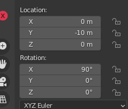

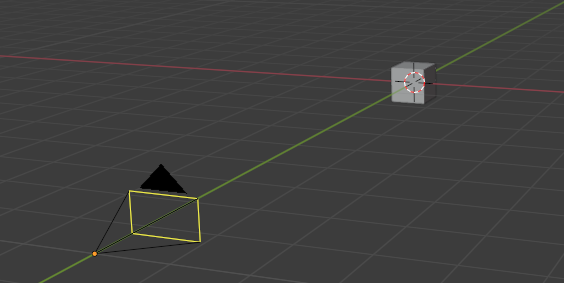

Mover la cámara con nosotros

Si le damos a la n le damos a view y lo que es camera to view. Ahora cuándo movamos la vista también se mueve nuestra cámara. 

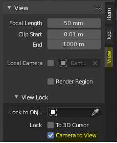

Configuración de la cámara

En la configuración de cámara le damos poner que queremos una distancia focal de 120 milímetros

Vamos a componer nuestra imagen de esta forma vale la animación que quiero que haga la cámara es muy simple simplemente quiero que haga una especie de órbita. 

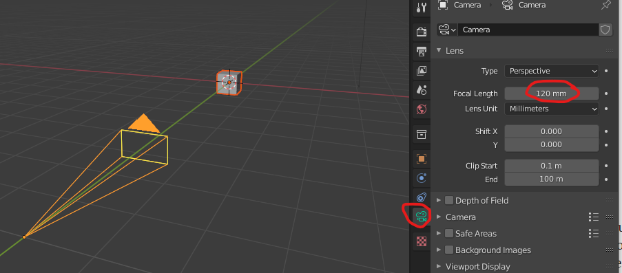

Insertar fotogramas clave

¿Qué es un fotograma clave o keyframe?

Un keyframe es en realidad una marca que guarda la posición, escala, rotación y opacidad de un objeto en un momento específico de la escena. Si creas más de dos keyframes con una variación de posición, escala, rotación y opacidad entre ellos, verás que automáticamente ocurrirá una animación

Si le damos al 0 nos ponemos en la vista la cámara, y veremos que si nos movemos, la cámara nos sigue.

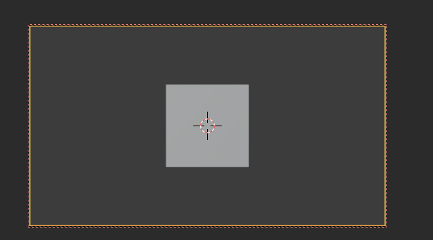

Lo que vamos a hacer para ello va a ser un aquí al primer fotograma le vamos a dar con nuestra cámara seleccionada aquí le damos a la i y esto nos va a insertar un keyframe un fotograma clave le vamos a localización y rotación 

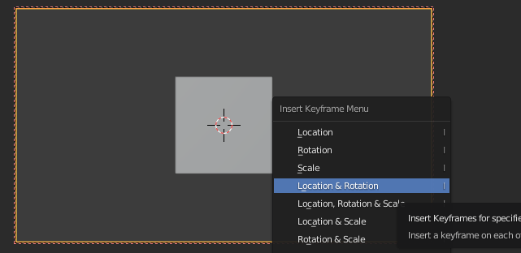

Vamos a avanzar 100 fotograma movemos un poquito la cámara e insertamos otro fotograma localización y rotación

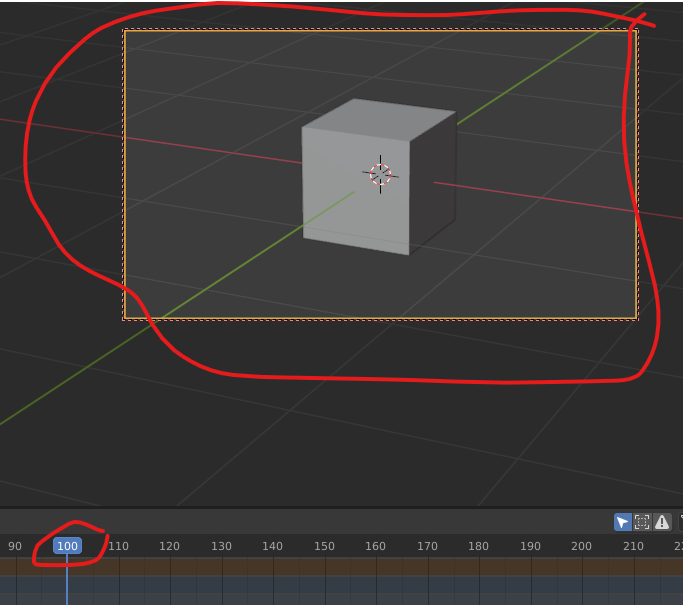

 Si ahora le damos al play ya tendríamos nuestra animación hecha. Veréis que la animación no se detiene en el 100, por lo que la tendremos que parar nosotros.

Analicemos el timeline

Aquí vemos que el único objeto animado ha sido la cámara. De hecho, el cubo sigue en su sitio.

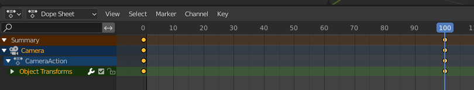

Si ampliamos podemos ver la siguiente información. Tenemos dos keyframes, en el 0 y en el 100. En medio, Blender calculará (extrapolará) todos los frames intermedios que conducirán al movimiento entre esas dos posiciones.

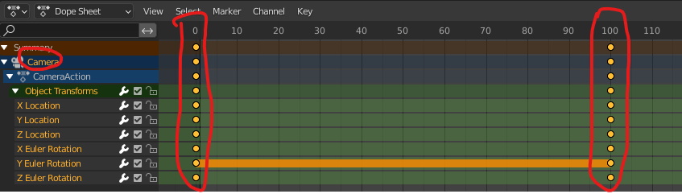

Animando el cubo

Ahora vamos a hacer que el cubo se haga más pequeño poco a poco. Para ello, en primer lugar, debemos seleccionar el cubo.

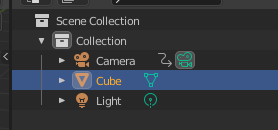

Veremos que el timeline en la parte inferior está vacío, pues no lo hemos animado todavía el cubo (solo habíamos animado la cámara).

El primer keyframe lo ponemos en el 100. En este caso, repetiremos los mismos pasos, pero ahora seleccionamos Posición, rotación y escala.

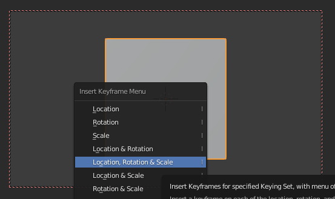

Luego nos posicionamos en el 160, escalamos el cubo y fijamos el segundo keyframe

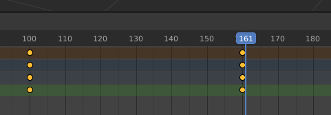

Al tener 160 frames:

En un video de 24 FPS nuestra animación durará: 160 / 24 = 6,67 s

Si fuera de 60 FPS, duraría 2,6 s

Si seleccionamos tanto la cámara como el cubo, veremos en el timeline ambos objetos, y sus correspondientes keyframes.

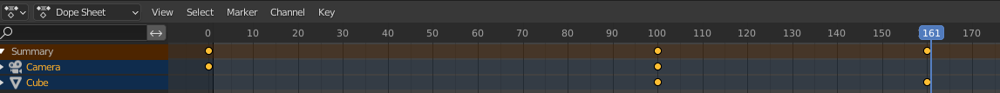

Enfoque y desenfoque

Lo que vamos a hacer es que nuestra cámara enfoque y desenfoque. Para ello nos vamos a donde pone cámara y donde pone de perfil de profundidad de campo y como veis automáticamente se ha desenfocado todo.

Podemos decirle que enfoque un objeto en concreto en este caso nuestro cepillo rojo y si le bajamos el stop el diafragma de la cámara que por ejemplo f1 pues este fondo se nos desenfoque vale, pero cómo podemos hacer que pase el enfoque de aquí allí a lo lejos pues lo vamos a hacer de una forma muy simple 

Lo primero voy a desactivar en la m lo de que la cámara se quede ahí enlazada y lo que vamos a hacer va a ser crear un objeto vacío en ti que es este de aquí lo vamos a ver en el eje x y esta va a ser el punto de enfoque entonces le vamos a decir que en el fotograma 20 su posición sea junto a esta taza para que la cámara enfoque esta taza le damos a la y fotograma para la localización y el fotograma 80 lo va a mover allá al fondo hasta que esté a la altura de la segunda taza y la vamos a dar otro fotograma clave de localización.

Como veis ahora se mueve pues lo vamos hacer va a ser enlazar el enfoque de nuestra cámara a ese emitir a ese objeto vacío así que una vez más no vemos nuestra cámara voy a poner la priorización del material y le digo que el objeto que enfoque sea el empty que lo tenemos aquí en ti ha pasado ahora y como veis en este primer fotograma en el principio tenemos enfocado este mientras que ese no voy a hacer un poco más de acción para que lo veáis y al final enfoca al azul y al rojo lo desenfoque vale pues así es como se haría el rack focus que sería el cambiar de enfoque. 

Ya lo tenemos casi todo preparado para irnos a renderizar, pero primero tengo que ajustar como queremos renderizar esta imagen. 

