# PRÁCTICAS MODELADO

- Modelando una taza: https://youtu.be/h4hZzPCOMKs?t=933
- Modelando un personaje: https://youtu.be/eFowqayoSKc?t=779
- Photo bashing: https://www.youtube.com/watch?v=s7Ej6SES7YY

CHULETA MODELADO

# Cambiar vistas

Teclado numérico para cambiar entre vistas

Introducción

Cuando empiezas un nuevo proyecto, lo que vas a ver siempre en pantalla es:

un cubo

- El cursor 3D (que veremos más adelante) en medio
- A la izquierda la **cámara principal**
- A la derecha la **luz** que viene por defecto. 

# Modo objeto y modo edición

Cuando colocas un objeto en Blender, entra en escena en **Modo objeto**. Básicamente hay 2 estados en Blender: Modo de edición y Modo de objeto. 

El modo de edición está diseñado para modificar la forma del objeto seleccionando vértices en el objeto. 

El modo de objeto afecta al objeto como un entero.

El botón de **tabulación** cambia entre los dos. También puede ver y cambiar su modo en la parte inferior de la ventana gráfica. 

Después de insertar un objeto en tu escena, siempre asegúrate de estar en **Modo de objeto**. De lo contrario, el siguiente objeto que crear se unirá a esa malla

# Seleccionar

- Seleccionar vértice / arista / cara: **1, 2, 3**
- Seleccionar todos los objetos: **A**
- **Ctrl** apretado y **clic izquierdo** para varios objetos
- Invertir selección: **Ctrl + I**
- Para seleccionar con rectángulo **B**, con círculo **C**
- Con **W** cambiamos entre diferentes modos de selección.

# Transformación

Lo siguiente que vamos a ver es cómo modificar las propiedades básicas de los objetos 3d esto como os digo vale para absolutamente cualquier programa de 3d no sólo para Blender y es que los objetos tridimensionales tienen tres características básicas que son:

- La posición 
- La rotación
- La escala 

Para modificarlas:

- G para la posición
- R para la rotación 
- S para escalar (cambiar tamaño)

- Extruir: E
- Inset (insertar una cara dentro de otra): I

Si queremos hacer alguna operación en un plano concreto:

- S y X: Escalar en el eje X
- G y Z: Mover en el eje Z

Colocar el puntero lejos del centro del plano para poder tener más recorrido.

- Borrar objeto seleccionado: X

Duplicar objeto

- Shift + D crea objetos independientes
- Alt + D para objetos conectados. Los cambios que hagas en uno afectarán al otro.

# Ejes

- Eje X representado por la línea roja
- Eje Y con la línea verde
- Eje Z representado por una línea azul que no puedes ver.

# Vistas

Vamos a ver el tema de la cámara si en nuestro en un pad le damos al uno tenemos una visión frontal desde el infinito vale 

- Si le damos al 3 tenemos visión lateral desde la derecha
- Si le damos al 7 tenemos una visión desde arriba 
- Si estaba en cualquiera de estas visiones por ejemplo en la frontal y le damos al 9 nos lleva a la justo contraria 
- Vamos tomar el 8 el cuadro el 2 y el 6 como si fuese mover la vista en un videojuego como las teclas de arriba abajo izquierda derecha 
- si le damos al 6 la cámara se ha movido hacia la derecha al 8 y al 2 y por último 

Para cambiar de modo perspectiva que es como ve el ser humano las cosas a verlo en modo ortográfico que como la ven los arquitectos sería de 5 

Si por lo que sea tenemos nuestra vista súper lejos ya no se muestra nuestro elemento que estamos intentando modificar podemos seleccionarlo aquí a la derecha en este panel tenemos aquí a susan 

- Si le damos a la coma nos la centra en la vista 

Para entrar en la cámara le damos al cero esto nos lleva a esta cámara que teníamos aquí el cero nos mete en la cámara y el cero otra vez pues nos saca 

# Cambiar el cursor

seleccionando un objeto y pulsando Mayúsculas + S y seleccionando Cursor to selected o pulsando la tecla 2, luego vuelve añadir una figura y aparecerá en el centro del cursor

Cortar una figura (Loop cut)

Nota: tenemos que estar en el modo edición

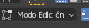

Control + R entras en el modo de corte transversal 

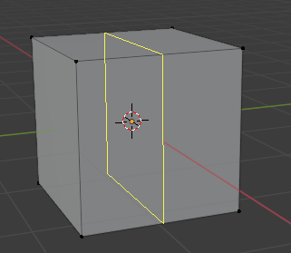

Mueve el ratón para seleccionar uno u otro 

Antes de hacer Clic izquierdo puedes mover la rueda del ratón para añadir o quitar segmentos

Luego confirma con Clic izquierdo y te la la opción de desplazarlos, si los quieres donde estaban pulsa **Clic derecho** y se crean los cortes

# Modo cuchillo

Con la K entras en el modo cuchillo que hace aparecer una línea que separa las caras por donde dibujes la línea.

Si dejas pulsado el ratón sobre la opción de cuchillo puedes seleccionar la herramienta de bisección. 

También puedes hacerlo pulsando:

Mayús + Espacio (que muestra las herramientas)

A continuación, Mayúsculas + 2.

# Suavizar

En cualquier momento, puedes seleccionar un objeto, y con el **Clic derecho** seleccionar entre **Shade Smooth** para suavizar y **Shade Flat** para volver a ver sus caras, esto también afecta a la hora de exportarlo.

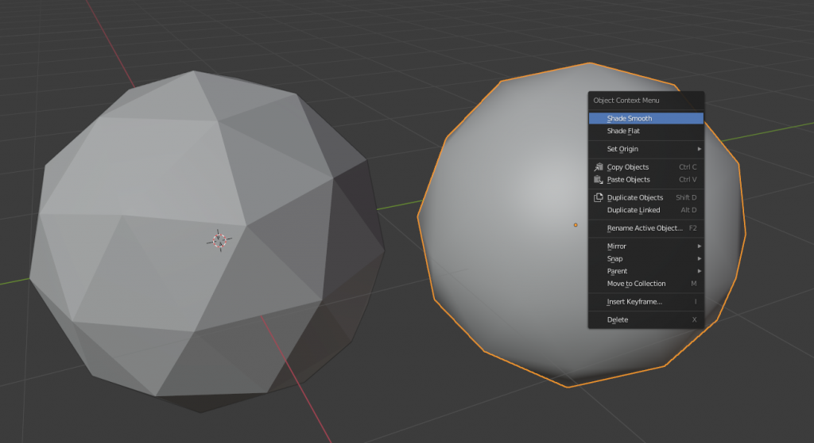

# Subdividir

Otra opción de gran utilidad puede ser subdividir las caras de un objeto, para ello limpia la escena y crea un cubo, luego entra en modo edición con **Tabulación**.

Después activa el modo selección de cara con 3 selecciona todo con L estando encima del objeto, y pulsando **Clic derecho** sobre subdividir. Hazlo un par de veces para que te siga comentando algunos consejos. Debe quedar algo así.

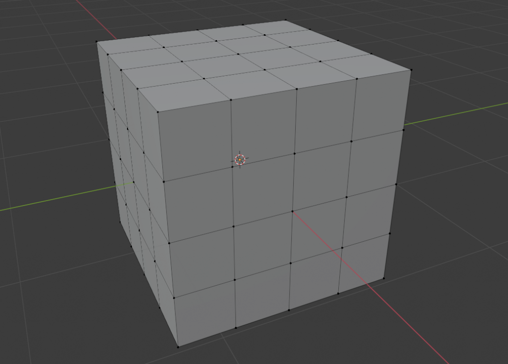Creando subdivisiones en un cubo.

Para seleccionar varias caras, como ya hemos visto, puedes pulsar sobre una de ellas y luego con Mayúsculas ir seleccionando el resto, pero si quieres seleccionar una fila completa, puedes pulsar sobre una cara y con Control pulsando en la final te seleccionaría todo.

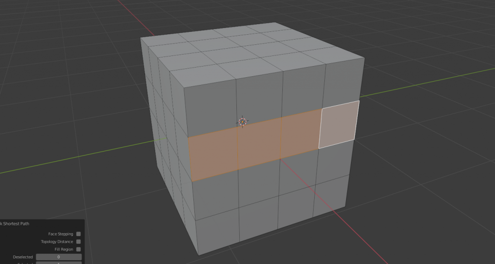Seleccionando una fila con Control.

Ahora vamos a ver otra cosa, quita la selección y selecciona solo las 4 caras del medio de la vista frontal, luego con X selecciona Borrar caras para eliminar esas 4 caras y poder ver el interior del cubo.

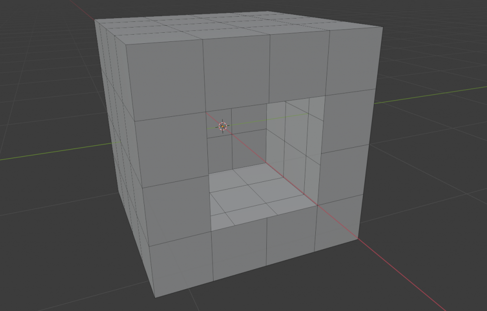Eliminando las 4 caras del medio en nuestra vista frontal.

Ahora una forma fácil de rellenar esa cara es entrando en modo arista con 2 y luego pulsando Alt + CI sobre uno de los vértices del agujero creado, de esta forma te seleccionará automáticamente todos los vértices que estén unidos alrededor del agujero. Luego pulsando F, directamente te rellenará el espacio vacío entre la selección con una nueva cara.

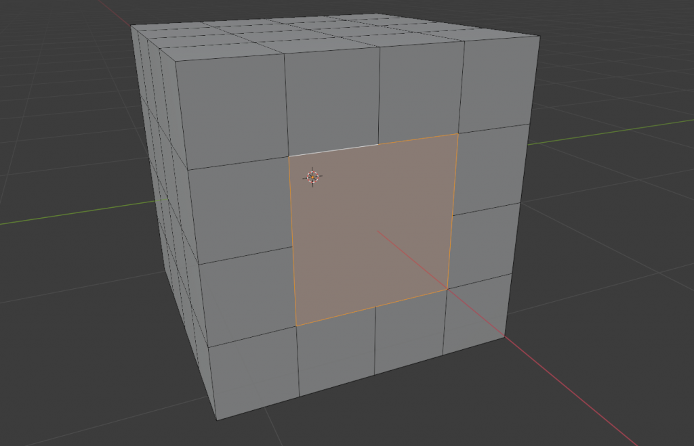Rellenando el espacio vacío creando una nueva cara.

Si quisieras crear una nueva línea entre 2 vértices, lo puedes hacer seleccionando los vértices que quieras y pulsando J para crear una nueva arista.

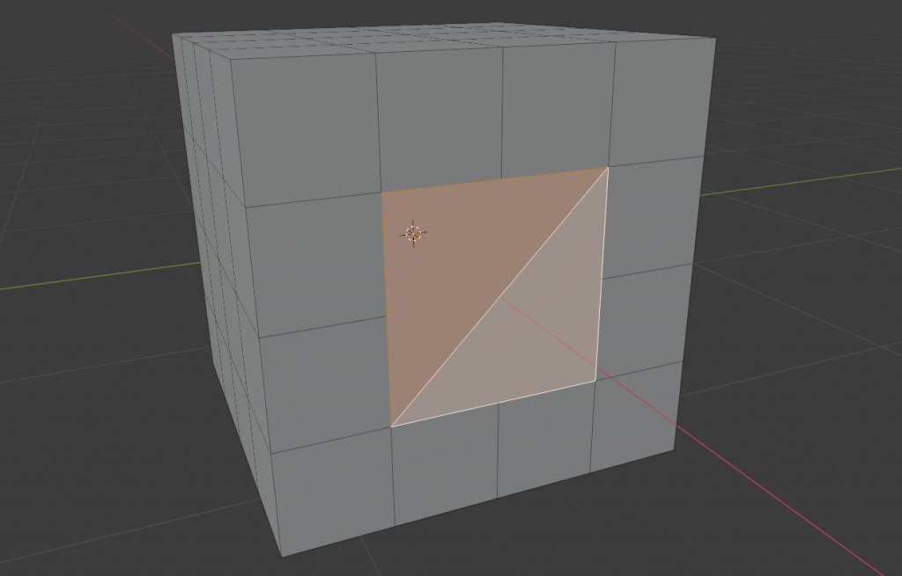Creando una nueva arista desde 2 vértices y dando lugar a 2 caras.

Hay muchos más pequeños consejos que podría darte, pero prefiero hacerlo en los siguientes tutoriales y no alargar de forma innecesaria este.

Pirámide

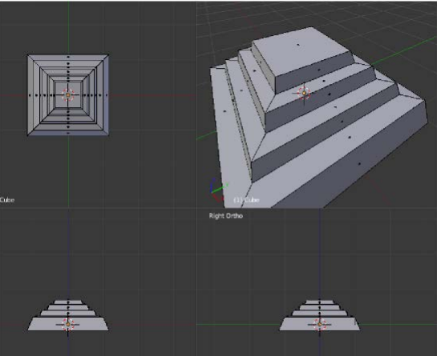

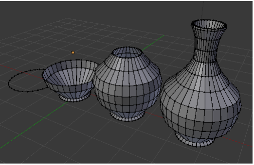

Tutorial taza

## Descarga Blender

Lo primero que tenemos que hacer es descargar el programa donde lo hacemos pues en blender.org como un programa de código abierto un programa totalmente gratuito.

Lo descargamos de su propia página y le damos a descargar. lo podemos usar en windows en Linux y es Mac. El programa funciona exactamente igual en los tres sistemas operativos así que debemos descargar, lo instalamos y vamos a configurar un par de cosas antes de empezar a hacer nada.

# Configuración inicial

Lo que nos encontramos la primera vez que abrimos **blender**, pero como he dicho antes de empezar a modificar nada vamos a ir a edit > preferences > addons y aquí vamos activar un par de plugins o de addons pero van a servir muchísimo nos van a ayudar a ser artistas de 3d mucho más rápido.

El primero de ellos out wrangler para activarlo simplemente le da a esta casilla de aquí que esté activado 

También uno que se llama images as plains 

# Moverse por el entorno

Lo primero de todo en cualquier programa de 3d es aprender a moverse por el entorno 3d podemos usar estas herramientas de aquí para movernos y a la cámara se ha ido las cámaras verón ortográfico veloz perspectiva un montón de cosas pero realmente lo más útil en este tipo de software es hacerlo todo con el ratón aprender a jugar como si fuese un videojuego a ver a movernos por este entorno como si fuese un videojuego entonces cómo lo hacemos pues con la rueda central del ratón rueda para arriba a zoom para adentro rodar para atrás quitamos zoom si hacemos clic o sea si pulsamos en la rueda podemos rotar así y si le damos a shift y hacemos clic en la rueda del ratón podemos movernos de esta manera muy bien otra forma de moverse muy común y que yo uso un montón cuando estoy editando en blender creando algo sería con el nunca del teclado esta parte creemos a la derecha en muchos teclados es súper útil en blender entonces antes de nada voy a enseñar un par de comandos para entender bien estos movimientos de cámara así que creo que va a hacer va a ser eliminar este cubo para ello la mara x y borramos le damos a shift aquí abajo dni la chuletilla y vamos a añadir un monkey un mono que se llama susan de blanc der de toda la vida vale entonces 

Los ejes

Otra cosa interesante sería usar los ejes como veis tenemos aquí una línea roja una verde y una azul que no estáis viendo esa es un poco más imaginaria que son los ejes que nos valen para mover, rotar y escalar nuestro objeto en base a ese eje.

Si no sabéis cuál es cuál:

- El rojo el **eje X**
- El verde es el **eje Y**
- El **eje z** que es azul 

Si le doy a rotar para que gire no mira hacia mí nunca, pero tengo que rotar sobre el eje z que el vertical le doy a la R D rotar le doy a la zeta para que lo haga sobre el eje z y lo giro vale lo voy a poner por ejemplo mirando así y si ahora quiero que mira hacia arriba le doy a **tecla R**le doy al eje y que sería el verde y lo giró para que mire hacia arriba deciros que también cuando nosotros nos metemos esta configuración de rotar algo de escalar algo de bien 

## Rotar por grados

podemos meter cifras si yo por ejemplo ahora mismo le dado a **tecla R**para rotar en el eje y que el verde y quiero que rote 90 grados escribo 90 en el teclado y ha mirado 90 grados hacia abajo lo que quería era para arriba así que lo mismo rotar efe y menos 90 y ahora sí mira para arriba y así es como se usa esta herramienta de rotación escala y posición que también es algo básico en el mundillo 3d tanto en este programa como en cualquier otro o que hay más cosas básicas de blender puesto que había y en el centro se llama cursor 3d y es como como nuestro ratón pero está estático en el entorno 3d y cualquier objeto que yo añade se añade dónde está ese si yo quiero por ejemplo tengo aquí mi cubo y quiero añadir en este caso un cono siempre al menos ha añadido está ese cursor 3d pero ese cursor 3d no siempre está en el centro de la escena yo por ejemplo por tener seleccionado mi cubo darle a shift s y decirle que mueva el cursor el objeto seleccionado cursor tú selective o puedo darle al 2 y no lo mueve ahí si yo ahora shift para añadir objetos le doy a añadir un cono no le añade dónde estáis y si ahora quiero moverlo hacia arriba le doy a lage para mover y al acepta para mover hacia arriba y así es como podemos jugar también con nuestro cursor 3d si creo que el cursor 3d vuelva a su punto original al centro del mundo por así decirlo le doy a shift ese y luego cursor world origin y vuelve allí por lo tanto ahora todo lo que añade se vuelve a añadir allí en el centro por cierto he preparado unas chuletas que creo que va a ser súper interesante con todos los comandos del teclado y las cosas que hace así con el ratón que son como he dicho ya 20 veces como 

**Paneles**

Los siguientes son los paneles y como veis aquí tenemos unos cuantos así que voy a abrir una nueva escena para enseñaros las diferencias que tienen estos estos distintos paneles

Si nosotros tenemos seleccionado un cubo no aparecen todas estas propiedades pero si seleccionamos una cámara nos aparecen estas mientras que si tenemos una luz nos aparecen estas como veis 

Esta de aquí nunca se modifican pero las de abajo sí así que voy a enseñar rápidamente para qué sirve cada una aunque entraremos más a fondo esta sería para las propiedades del renderizado está para la imagen que vamos exportar o el vídeo estas serían las capas la escena y el mundo que esto lo veremos para iluminar con age digáis y luego tenemos las propiedades esas serían del mundo estas serían del objeto que tenemos seleccionado en este caso propiedades del cubo su posición su rotación separadas por eje y su escala los 

Tenemos modificadores no destructibles o sea que no se cargan nuestra geometría por ejemplo vamos a añadir uno de wireframe y nos coge lo que sería sólo las aristas puedo modificar los hacerlos más gordos etcétera pero si nosotros entramos en modo edición que ahora os enseñaré seguimos teniendo nuestro cubo 

También tenemos para crear partículas crear simulaciones físicas de que esto caiga al suelo y rebote como en la realidad porque ahora mismo son cubos que flotan y están estáticos en el aire tenemos constraints que esto es para hacer que un objeto por ejemplo siempre apunte a otro objeto por ejemplo tenemos vertex groups que esto también lo usaremos para hacer que ciertos efectos que le apliquemos a nuestra geometría sólo se apliquen en algunas partes y luego 

Por último que miramos los materiales yo por ejemplo digo que éste sea de color rojo es diciendo que mi cubo sea de color rojo pero como veis no está funcionando porque además de todos estos paneles que he enseñado dentro cada paneles tenemos más configuraciones en este caso aquí arriba a la derecha para ver cómo sería solo la malla para ver cómo sería el objeto puramente dicho todos los objetos nos van a salir grises y yo por ejemplo añade otra vez aquí a mi monito pues y podemos ver su malla aquí podemos ver dónde queda el objeto sin ningún tipo de material aquí la previsualización de material como veis este ya es rojo y 

Aquí un renderizado según yo muevo la luz pues ya sí que le afecta mientras que antes aquí no le afectaba 

En este modo 3d también tenemos diferentes modos de modificar nuestro objeto ha demostrado en modo objeto también tenemos por ejemplo modo esculpir para esculpir como si fuese una obra de arte vertex paint weight paint text to spain para pintar texturas pero 

El que más vamos a usar es el **edit mode** modo edición que 

Para cambiar de uno a otro lo hacemos con el **Tabulación** 

Aquí podemos seleccionar puntos, vértices y aristas y podemos modificarlo ahora en vez de modificar el objeto entero estamos modificando una en sus caras

Si queremos volver al modo objeto lo haríamos aquí y por último decir que si nosotros queremos esculpir aquí ya no viene por defecto diferentes escenas o espacios de trabajo preparados ya para esculpir si yo por ejemplo quiero añadirle este tipo de deformaciones de meterle algo para abajo para adentro para afuera sacarle un cuerno lo haríamos aquí en sculpting tenemos juve editing texture luego tenemos también para añadir nuestros materiales modificarlo tenemos un montonazo de cosas pero bueno intentaremos ver todas las posibles y con esto terminamos lo que sería la parte de interfaz 

# MODELADO TAZA Y CEPILLO

Vamos a pasar ahora al modelado y vamos a empezar a modelar una taza y un cepillo de dientes Una forma de aprender mucho más rápida y eficiente que sería modelo algo que ya exista, o salir a la calle o en tu propia casa hacer fotos de diferentes objetos y tenerlos de referencia.

Vamos a empezar a modelar algo como veis tenemos aquí nuestra escena principal que básicamente un cubo y lo que vamos hacer va a ser entre al modo edición pulsando **Tabulación**. 

Podemos seleccionar los vértices podemos seleccionar las aristas y podemos seleccionar las caras

ins que para crear una nueva cara que se escale hacia adentro la y es para excluir tanto para afuera como para adentro luego podemos hacerlo por ejemplo otro in set y luego volverlo a destruir hacia afuera qué más cosas podemos hacer con esto pues con sanciones por ejemplo una de las caras en este caso ya seleccionar esta y podemos hacerle un bevel el que se hace con control bet y si nosotros ahora hacemos así con nuestro ratón y lo alargamos como veis nos crea ese suavizado ahora mismo tiene usual izado de uno pero si con la rueda del ratón lo ampliamos a como si metiésemos zoom vamos creando un suavizado pues muchísimo más suave 

También deciros que todos los comandos que hemos hecho con el objeto en general también los podemos hacer con cada cara por ejemplo cuando darle la s para escalar lo podemos darle a la **tecla R**y a la y para rotarlo en el eje y podemos destruirlo de nuevo y rotarlo en el x por ejemplo ir creando pues lo que nosotros queramos entonces básicamente la ahí para crear una cara dentro la e para destruir y control b para suavizar esos bordes como veis se pueden suavizar también diferentes de las caras y no desde la arista otra cosa que vamos a hacer en vez de hacer extruido se hace así y alargarlo podemos darle control y **Clic derecho** y esto nos lo va excluyendo según donde pongamos nuestro cursor y así es como creamos pues esta especie de objetos este objeto era simplemente una prueba para enseñar esas técnicas básicas 

Otra técnica también sería si nosotros por ejemplo eliminamos una cara por lo que sea le damos a la X y la hemos eliminado y queremos volver a crearla lo que vamos a hacer sería:

Darle a **ALT** y hacemos CBI lo que nos selecciona todas estas aristas

Si le damos la**tecla F**lo une y nos crea una nueva cara

## Comenzamos la taza

Vamos entrar ya así hacer nuestro ejercicio vamos a hacer una taza para ello:

Shift>a>mesh y vamos a añadir un círculo como veis el círculo sólo tiene si me meto en modo de edición sólo tiene vértices y aristas, pero no tiene ninguna cara creada

- **tecla F** y nos crea esa primera cara
- **tecla 3** para pasar a ese modo y vamos a empezar a crear nuestra taza 
- Poner la visión en el modo 1 

Extruir hacia afuera hacia arriba y ahora a esta capa la parte de abajo que es más suave de la taza entonces la extruyo y le doy a la s para ampliarlo 

Luego voy a obstruir hasta arriba del todo y voy a crear el seguimos suavizado

Una vez que estamos ya aquí arriba entonces le voy a dar a la e para crear una capa más arriba a la s para hacerla más pequeña ahora a la y para hacerlo en la misma altura y ahora otra vez a la e para hacer la parte de dentro y a la s para meterlo hacia abajo 

Ahora vamos a hacer el interior de la de la taza que sería simplemente bajarlo pero no sabemos todo no hay que bajarlo entonces para ello lo que vamos a hacer va a ser entrar en este modo que nos enseña el interior y ahora sí podemos darle a la G para mover y a la Z para moverlo en ese eje y así tendríamos nuestro interior de la taza vale ahora para el exterior necesito que esto estas caras que como visión tan alargada tengan sus divisiones como lo podemos hacer pues si hacemos control r nos crea un **loop cut**que es como un corte en mitad de este cilindro si yo lo hago control r y le doy con la rueda para arriba no crea todavía más sus divisiones pues vamos a una de ellas una por ejemplo que esté en el perfil en este caso va a ser esto de aquí de hecho va a  estas dos 

Le voy a dar a la equis y la voy a borrar

Ahora le damos a alt y seleccionamos esto de aquí y le doy a la f entonces hemos unido donde ante había dos caras ahora va a haber una y

Si me voy al modo uno a la vista 1 y CBD vamos a ir excluyendo esta parte exterior de nuestra taza

Aquí lo encontramos con un problema y es que si quiero unirlo aquí dentro necesito volver a eliminar dos caras. Para ello vamos a seleccionar aquí y le damos a eliminar las caras a las X

Ahora vamos a ir seleccionando aristas con arista que se vaya a unir y le damos a la**tecla F**para crear una nueva cara.

Otra forma de hacerlo sería seleccionando con alt este círculo y ahora con mayor **ALT** este de aquí dentro también y si ahora le damos a la barra espaciadora y en caso de que no salga esto le dais a F3 y buscamos BRIDGE nos crea este túnel y ya crea esa unión 

Aquí tendríamos nuestra taza muy simplificada. 

# Subdivisión

Subdivisión es un **modificador** que lo que hace es suavizar nuestra geometría creando caras nuevas.

Podemos aplicarle más subdivisión o menos y como veis nos lo crea mucho más suave le ponemos shaders move y tendríamos nuestra taza pero 

Como veis el interior está pasando algo raro y es que cómo funciona esto voy a desactivarlo es que hace en la media entre nuestros polígonos vale por lo tanto aquí fuera como veis tenemos un montón de polígonos muy cuadrados que como hay que tenerlo pero aquí tenemos este que es muy estirado muy vertical y este último

Entonces lo que tendríamos que hacer para que no salga si es suave así de suave sería añadir otro **loop cut** allí abajo y si ahora lo activo veis que ya no está ese suavizado que teníamos antes ok pues ya tendríamos nuestra taza.

## CEPILLO DE DIENTES

Lo que voy a hacer va a ser crear un cepillo de dientes y realmente el proceso es el mismo así que lo pondré a cámara rápida pero básicamente el truco que os quería dar con esto es que vayáis de lo general a lo particular osea que primero consigáis la forma general de lo que sería el cepillo de dientes la forma más básica y una que tengamos la forma más básica empezamos a añadir detalles como esta curvatura suavizamos esa curvatura con un bebé le insertamos una cara para luego usarla como emisión de esos pelillos que tiene el cepillo de dientes etcétera 

Otra forma de hacer esta tasa sería usando el sol y defy si yo por ejemplo voy a simplificarlo mucho tengo este cubo y esta cara de arriba no la tengo este cubo las caras son no tienen grosor entonces si le añado un modificador de sol y defy puede añadirle es el grosor al cubo que sería por lo mismo que el interior de nuestra taza vale aquí podemos activar y desactivar estos modificadores para que se vean o no y así es como hacemos nuestra taza aunque cuatro cepillos de dientes le hemos aplicado el modificador de subdivisión surface igual que antes a la taza le vamos a dar a aplicar 

## Pelos del cepillo

Ahora vamos a seleccionar las caras sobre las cuales queremos que se generen esos pelillos así que vamos a la herramienta de selección aquí arriba la tenéis por si le dais a la W también podéis cambiar y vamos a seleccionar todas estas caras que queremos que tengan esos pelillos. 

Una vez tengamos seleccionadas lo que vamos a hacer va a ser irnos a este icono de aquí y vamos a añadir un nuevo vertex group que se va a llamar pelos y le damos a asignar 

Una vez le hemos dado a eso básicamente hemos creado un grupo de vértices de caras que tienen una información tiene un nombre forman parte de un grupo y luego cuando creamos nuestra simulación de partículas vamos a hacer que ahí se generen pues esos pelillos que tiene el cepillo pero antes de crear esa parte y esa generación de partículas vamos a crear los propios pelillos para ello cómo lo vamos a hacer pues muy sencillo shift>a otra vez vamos a crear un círculo entro en modo edición le dé al a efe le doy a la y hacemos que la punta de arriba del pelillo sea mucho más pequeña y ahora le damos a control r para crear unas cuantas divisiones en este cilindro y ahora lo que vamos a hacer va a ser seleccionar la cara de arriba del todo esta de aquí y si ahora lo muevo como veis sólo se mueve a este hasta este primer corte pero si activo esta herramienta de aquí que se llama proporcional editing y le doy a lage y le doy la rueda para arriba este círculo indica hasta dónde va a afectar este este suavizado de este movimiento que hemos aplicado de esta rotación para dar cif de vamos a crear una copia para montar en modo de edición y amo volver a moverlo ahora pues en otro eje y vamos a crear una última copia para tener pelillo muy distinto y vamos a hacer lo mismo vamos aquí le damos a crear nueva colección le vamos a llamar pelos y como he dicho los seleccionamos y los metemos dentro de esta colección por ahora vamos a pagar su visibilidad y ahora vamos a hacer va a ser irnos a nuestro cepillo nos vamos al sistema de partículas y le creamos un nuevo sistema de partículas o sistema de partículas básicamente pues partículas que se emiten de nuestro objeto y tenemos dos tipos primeras serían éstas que son partículas físicas que tienen pues tienen su gravedad y en su resistencia al aire etcétera y lo tendríamos partículas que son como los pelos que se generan del objeto pero que no se separan a esto también le podemos activar por ejemplo que sean dinámicas que sea que le afecte la gravedad etcétera pero en este caso no lo vamos a hacer así activamos un sistema particular en modo pelo y ahora nos vamos a ver text group y en densidad vamos a elegir pelos y como veis nos lo genera únicamente donde teníamos hecha esa selección ok eso por un lado ahora nos vamos a ir a render y donde dice render queremos que esos pelillos sean parte o sea lo que se genere sea nuestra colección que hemos creado pues objetos así que aquí se decíamos colección y dentro de la colección la colección perros y ahí como veis ha multiplicado nuestros tres objetos por un montón de veces justo en la zona que nosotros queríamos de hecho si ahora nosotros seleccionamos nuestros pelos que los teníamos desactivados y le damos a la s también se escalan en nuestro sistema de partículas pues lo vamos a escalar hasta que tengan sentido de tamaño más o menos ahí la proporción está bien pero ahora tenemos que arreglarle la orientación cómo lo vamos a hacer pues nos vamos a ir donde dice advanced y aquí elegimos rotación y dentro de rotación elegimos en qué eje queremos que se emitan en este caso es global y para que se emitan hacia arriba el agua le podemos poner un poco de random si le ponemos mucho pues se van hacia todos lados pero si le ponemos un poquito vamos a conseguir porque no se vean tan repetitivos nuestros cepillos y si ahora le doy a alt h tendríamos ya tanto nuestra taza como nuestros pelillos de hecho ahora que lo tenemos con la escala lo que vamos a hacer va a ser escalarlo para que tenga un sentido entonces lo escalo hacia abajo y tendríamos nuestro cepillo dentro de nuestra taza pero como veis los pelos se han ido bueno de aquella manera una vez y donde se han ido y eso es porque la rotación le hemos dicho que haga caso al eje y global ya lo que tiene que hacerle caso es al eje y del objeto así que o bien y ahí lo tenemos una vez más voy a volver a seleccionar esto ahora que más tienen que reescalar todo lo voy a escalar para que tengan sentido y ahora ya sí que sí tendríamos ya modelado modelada nuestra escena va a añadir una última cosa que va a ser el suelo para ello creamos un plano nos aseguramos de sacar ese plano fuera de la colección de pelos que sea que se está multiplicando y lo vamos a escalar para que hagan las veces de suelo lo vamos a colocar todo de forma que esté ahí en contacto y ya tendríamos nuestra escena a falta de materiales y un par de cosillas más para renderizar así que pasamos a la siguiente parte que es crear materiales oye si te gustan de este tutorial no lo estás pasando bien empiece ya que así te agradecería muchísimo que te suscribiese o que interacciones de alguna forma con este vídeo ya dejando un me gusta o un comentario porque a mí me ayudó un montón saber si os gustan este tipo de vídeos este uno tutoriales que más tiempo me ha llevado a hacer porque como habéis visto un tutorial de blender pero al mismo tiempo estoy explicando cosas que se pueden aplicar a cualquier programa de 3d e intentar simplificar todos los conceptos del 3d en este vídeo así que si te está gustando recomendarte también que en mi canal tengo otros vídeos que algo de efectos especiales como se hace un efecto especial de las películas de los creadores que lo están pesando etcétera así cuando termine este vídeo echarle un ojo también esto el ojillo con el dedo watch continuamos pues ya llegado hasta aquí decirte que ya tienes más de la mitad de este tutorial superado

## Colorear

Tenemos estos modos los que podemos ver la proyección del material sólido solamente la malla pues no va a poner en modo pre disolución de materiales vale y

Vamos a empezar dándole color por ejemplo al cepillo nos vamos a esta herramienta de aquí y aquí donde creamos los materiales creamos un nuevo material y aquí podemos elegir diferentes cosas el surface sería la parte de fuera y aquí abajo tendremos el ball yum que sería el interior 

En beige color podemos elegir por ejemplo el color si yo quiero que sea amarillo ahora prods este cepillo podría seleccionarlo ahí o rojo azul verde el que yo quiera 

## Reflejar

Puedo decirle si quiero que sea muy reflexivo o no aquí tenemos que fijarnos sobre todo en referencias reales eso se cambia aquí en especular. Si le sube la especular va a reflejar más y si se lo pongo en cero pues no refleja nada.

Una vez que hemos cambiado especular puedo decirle si queremos que se reflejo sea súper nítido y súper claro o si queremos que sea duro nítido sería llevándonos al cero y muy difuso será llevándonos los alumnos yo voy a poner cerca del 0,3 y el brillo si ha bajado el 0,5 en mi caso pero vuestro cepillo puede ser como vosotros queráis 

Todo esto que estamos haciendo también se puede hacer con nodos si nos vamos a ding aquí lo tendríamos y este es el nodo que os he dicho el principal vi ese 10 que nos da todas estas opciones y aquí vamos engancharle un montón de nodos pero yo sé que la primera vez que ve esto te asusta porque es verdad que da miedo entonces 

Voy a intentar enseñar alguna cosilla básica de nodos para que le pille yo sea para que le cause quita y el miedo a los nodos y si me lo pedía los comentarios pues haré un vídeo sobre los nodos para por fin quitarnos el miedo todo el mundo vale una vez más crear ese material 

## Material pelos

Vamos crear uno nuevo ahora para lo que serían nuestros pelillos, vamos a seleccionar el primero de ellos creamos nuevo material nuevo y vamos a ponerle de nombre pelillo aquí vamos elegirle un color yo voy a ponerle que sea un poquitín amarillento porque está un poco sucio y que refleje muy poco que sea más bien difuso y eso lo hemos hecho con uno de los tres pelos que están multiplicando por lo tanto.

Si vamos al círculo dos en vez de tener que crearlo de cero podemos darle aquí y seleccionar el material pelillos que ya hemos creado no se habla hoy y lo mismo con el tercero seleccionamos el material pelillo si no sabíamos por ejemplo el material 3 que sería el de nuestro nuestro cepillo pues tendríamos que uno de esos pelillos bases de color rojo pero no queremos eso así que pelillos vale ya teníamos los pelillos también ha hecho que va a ser lo siguiente 

## Logo en la taza

Lo siguiente va a ser la taza y para esto si queremos usar los nodos y vamos a usar el rubí editing pero de una forma muy sencilla vale esta taza yo quiero que tenga mi logo que tenga el logo de aura prods como lo hacemos podemos crear un nuevo material le voy a llamar táctica gráfica para citas y en color podemos seleccionar un color por ejemplo una taza azul pero también podemos seleccionar todo esto de aquí esto es que infinito no me daría tiempo a explicarlo ahora pero voy a enseñar cómo poner una imagen en vuestro taza le damos a y mix texture 

Le damos a open nos vamos a la carpeta en la que lo tenemos y seleccionamos aquí mi logo

Cuando le aplicamos nuestra imagen como veis no está pasando absolutamente nada esto por qué pues porque no le hemos dado las instrucciones todavía a este material de donde queremos que aparezca cada parte nos vamos a ir al modo y ubi editing y esto uy a ebay que tengo un par de caras seleccionadas ahora vaya sabes por qué vamos a ir al modo de edición vamos a darle a la a para que se seleccione todo 

Le vamos a dar a la uv y le vamos a dar a proyección de vista. 

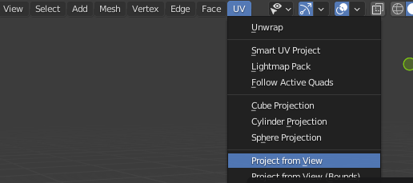

Esto nos genera encima nuestra imagen nuestra misma malla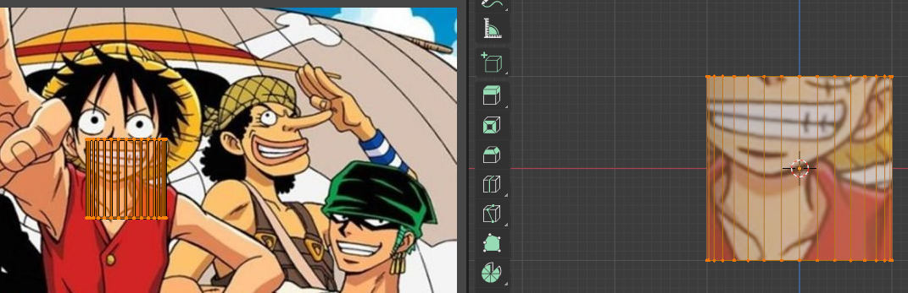

Escalamos la malla del lado izquierdo y así ajustaremos la imagen al objeto

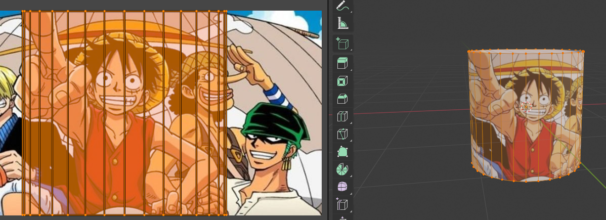

Se está aplicando por delante y por detrás está distorsionando y está saliendo muy mal entonces nosotros queremos limitar esta imagen a que sólo salga en una zona como hacemos esto pues está que la proyección la posición de vista.

Tengo muchas otras proyecciones también teníamos por ejemplo la cilíndrica, la cúbica, etc. Vamos a elegir proyección de vista y vamos a irnos a una zona que sea totalmente blanca quiero que toda mi taza sea blanca ahí lo tendríamos vale una vez que tengo toda la taza blanca estamos las mismas que antes 

Me voy a la vista número a la inversa del 3 o sea lateral izquierdo dándole al 3 y luego al 9 modo edición le doy dos veces a la hora de seleccionar y ahora selecciono en qué caras quiero que aparezca para seleccionar le doy a la vez vale 

Ahora que tenemos esto seleccionado como veis aquí nos enseña qué parte es la correspondiente le vamos a dar a la proyección de vista otra vez como veis se queda cuadrada y 

Si yo ahora escalo aquí y los centros tenemos nuestro logo ya puesto en un sitio que tiene sentido en este caso va a ser ahí y si yo le doy la vuelta a mi taza sólo se aplica el logo en ese lado.

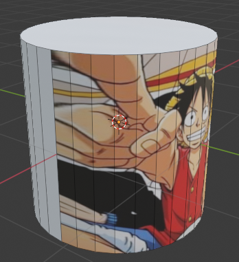

Tendría nuestro material con nuestra imagen y ahora si nosotros le modificamos por ejemplo el brillo como enseñaban te voy a subir este un poquitín a modificar el especular que el brillo se lo pongo al máximo que refleje mucho y que se reflejó sea como un espejo pues como veis está la taza por completo reflejando de la misma manera tanto la parte blanca como la negra como podemos cambiar esto pues si enlazamos el nodo externo de nuestra imagen vale de nuestra taza si lo enlazamos al racing es que la dureza de ese reflejo lo que va a hacer es que las partes negras sean como un espejo mientras que lo blanco sea súper súper duro o sea que es el reflejo ahí apenas se nota ese reflejo como podemos conseguir lo contrario que los blancos sea más difuso y lo blanco como un espejo pues le damos asif y buscamos un nuevo que se llama invertir también podríamos hacer con un ramo pero bueno aplicamos a invertir y ahora los blancos como un espejo y lo negro súper difuso y si aquí le cambiamos la fuerza de esa inversión podemos llegar a un punto medio y ahora tenemos pues que ambas superficies son reflectantes pero una vez más como un espejo y otra es algo más duro volvemos al layout y aquí tendríamos nuestra escena que va a ser lo siguiente por 

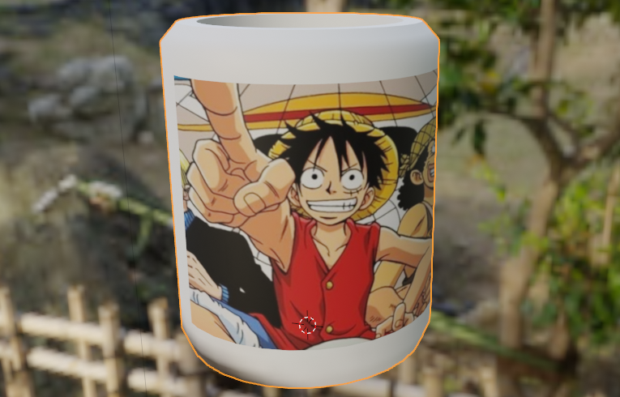

# Texturizar

## Descargar texturas

Lo siguiente va a ser añadirle una textura y lo vamos a hacer con una herramienta que se llama **poly haven**. Es una página web en la que tenemos texturas totalmente gratuitas. 

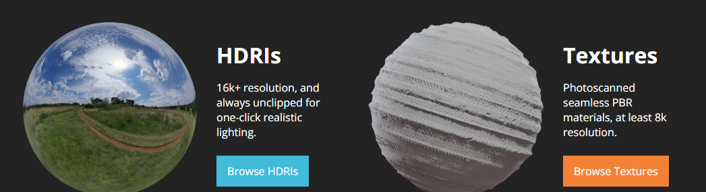

Nos vamos a **textures** aquí como veis tenemos un montón de tipos de texturas, y elegimos la que nos convenga.

Crear nuevo material con textura

Ahora nos vamos a blender. seleccionamos nuestro plano creamos un nuevo material y aquí vamos otra vez la imagen en el beige color como de seleccionar la image dexter

Le damos a open nos vamos a descargas que es donde se ha descargado estas imágenes que acabamos de meter aquí la tenemos y la abrimos 

Como ves ya tenemos nuestra madera pero aquí pasa algo raro porque es igual de reflexiva por todas partes y en la realidad los materiales no son iguales de reflectivos por todas partes. 

## Arreglar reflexión

De hecho, si le doy así pues añadir una luz que no lo había presentado todavía pero podría añadir luces y como veis el material refleja igual por todos lados 

Lo que le vamos a aplicar es en zaidín seleccionamos nuestro suelo le va a aplicar un mapa para que unas partes igual que antes mucho con la taza una reflejen más y otras menos también deciros que podemos arrastrar desde cualquier carpeta yo por ejemplo que aquí mi carpeta de descargas puede arrastrar aquí dentro y es play ralph

Después conectó el color al ratón es así de simple y ahora si vemos ese reflejo veis que ahora mucho más realista esto es con el nodo que acabamos de conectar y esto es sin ese nodo como veis esta tontería ya ha hecho que quede mucho más realista y luego también tendríamos un mapa que sería el normal que lo podemos aplicar como un desplazamiento o como un bum en mi caso voy a hacer como un bum para que no explote mi ordenador añadimos un nodo que se llame pump y lo conectamos el morado al morado el normal al normal y el color de esta imagen lo aplicamos al hate you save como se llame y lo que va a hacer es modificar nuestra imagen o sea añadirle elevación o meter la imagen hacia adentro en base a esa imagen y podemos decir con cuánta fuerza le voy a poner 0.1 y así pues no aplica una especie de grietas hacia adentro y grietas hacia afuera para que quede más realista nuestro material y si nos volvemos aquí ya tendríamos todos nuestros materiales más cosas sobre el tema materiales nosotros por ejemplo 

## Duplicar los objetos

Podemos duplicar en este caso y duplicar tanto la taza como el cepillo de asif de nosotros tenemos este material conectado este material que rojos y yo lo cambio y lo pongo azul ambos se cambian al azul como hacemos 

Para que sólo se cambie uno de ellos seleccionamos el que queremos cambiar y como veis nuestro material nos dice cuántas veces se ha usado en este caso dice que dos veces aquí y aquí si le damos al 2 lo que hace es generar un material nuevo exactamente idéntico pero si ahora nosotros lo cambiamos se cambia uno de ellos y el otro no ahora serían dos materiales por separado diferentes ok pues esa sería otra cosa muy interesante a tener en cuenta cuando cuando estemos usando blender 

## Modelar en base a imágenes

Aunque te enseñado a modelar en base a la referencia o en base a una taza imaginaria también podemos modelar en base a imágenes o planos que ya tienen la textura sé que suena un poco raro pero básicamente si tú tienes una foto por ejemplo de una pared puedes importar eso directamente como una imagen plana y luego a esa imagen empezar a añadirle detalles ya tendría el modelo y la textura al mismo tiempo a esta técnica más o menos se le llama **foto bashing** y aunque suena que una técnica un poco marrón era o cortijera es una técnica que lo usan algunos de los artistas más grandes por ejemplo unam y artistas favoritos y han hubert hace un montón de trabajo de esta forma tomando fotografías de cosas que le parece interesante y en base a esa foto extrae modelos en 3d que ya tienen su textura su iluminación y todo de hecho esta escena que estáis viendo es completamente creada en 3d y cada uno de esos objetos ha sido completamente creado en base a fotografías que él ha tomado por la calle lo cual hace que nuestro un workflow en nuestro proceso creativo sea aún más rápido así que vamos tomar una foto de una puerta de un cortijo en una pared y vamos a enseñarte cómo se hace vamos estoy yo aquí solo hay alguien más por aquí o que 

## Photo Bashing

Voy a enseñar una técnica que a mí me parece una pasada cuando la conocí se llama bueno es como el photo bashing más o menos pero básicamente modelar en base a texturas imágenes que ya existen. Es decir, a partir de imágenes y extraer objetos 3d.

La técnica que usa para crear esos vídeos que habéis visto es la siguiente voy a borrarlo todo negra vista 7 le dé añadir y añadimos una web no la encuentro y mitch explain seamos activado el add-on al principio diría a parecernos y aquí vamos a seleccionar esa imagen y ahora vamos al modo edición vamos a usar la herramienta de laca que es para cortar es como un cuchillo y vamos a seleccionar la parte que nos interesa lo voy a hacer de forma un poco rápida vale y marrón era la parte que nos interesa en este caso es la parte frontal de mi cortijo selecciono y le doy a enter y ahora puedo seleccionar esta cara borrarla y me quedo solo con esto y ahora puedo simular cortes tridimensionales en esta imagen.

Vuelvo a ir al modo edición y aquí hay un marco que luego está metido hacia adentro yo le doy al acá como de edición perdón acá hago click aquí aquí aquí abajo aquí abajo y lo volvemos arriba esto nos crea esta nueva capacidad esto era un insecto nos crearía esta que estáis viendo aquí que coincidiría más o menos con la puerta en caso de que no coincida podéis darle a lage y al abrir la sip o escalarla vale el caso que una vez que tenemos esta capa que también lo primero hecho con la que podemos seleccionarla nos vamos a la edición lo movemos en el eje z y lo metemos hacia atrás como veis no se ve como un renderizado extraño porque se ve la cara de atrás simplemente nos vamos a textura y abajo del todo desactivamos el show back face y como veis ya no aparece bien la voy a orientar en el eje x para que esté de forma totalmente vertical a mover aquí arriba y una vez que tenemos esto básico podemos ir sacando diferentes cosas con laca por ejemplo voy a sacar este este pequeño agujero que hay en la pared lo seleccionamos le hace un poco de forma rápida le damos a enter le damos a la iss y lo movemos hacia el fondo y ya tiene tridimensionalidad lo mismo podemos hacer pues con todos estos agujeritos podemos sacar diferentes elementos y de una simple imagen ya tenemos un modelo 3d totalmente texturizado para crear pues por ejemplo una ciudad otra cosa que podemos hacer también si nos vamos al modo rating podemos aplicarle un material de bump como el que he enseñado hacia delante y esto como veis le da todavía más detalle en base pues a los niveles de luminosidad que tiene si lo ponemos aquí o ya tendríamos una imagen perfectamente tridimensional y hemos tardado nada en hacerlo pues como digo está técnica lo usan muchísimo y además artistas muy grandes así que echarle un ojo también porque puede ser muy interesante para vuestro workflow.

## Entornos con HDRIs

Los **HDRIs** son básicamente imágenes 360° raw de alto rango dinámico que nos sirven para iluminar.

Nosotros podemos iluminar nuestra escena poniendo por ejemplo una luz de punto que aquí le podemos cambiar la fuerza le podemos cambiar también el color. 

Hay diferentes tipos de luces estoy a echarle un ojo tenemos una que sería spot pero está que subirle mucho la fuerza también tendríamos una luz de sol que la podemos rotar podemos cambiarle la fuerza el color bueno ya hacéis una idea pero para conseguir el resultado realista a la hora de intentar crear una imagen pues fotorrealista 

Lo que vamos a usar son los y resulta que son del mismo creador de poly haven tenemos hey ven y aquí tenemos por un montón de HDRi que podemos usar totalmente de forma gratuita en nuestros renders 

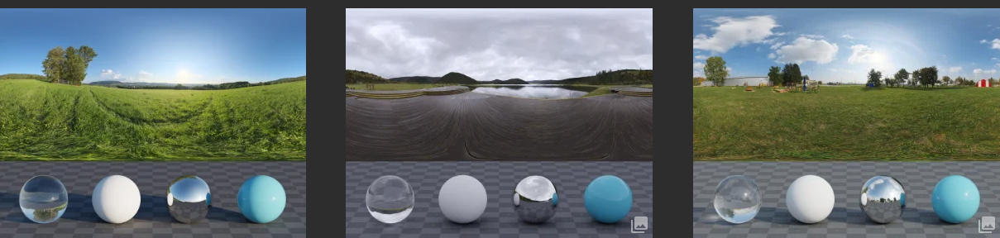

Vamos a elegir uno que nos interese. Nos vamos aquí abajo la descargamos como 2k 

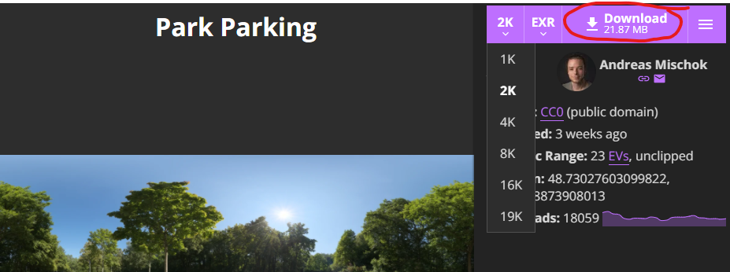

Ahora en descargas tendremos el archivo, con extensión exr.

Ahora lo que vamos a hacer es seleccionar esta bola del mundo que todavía no habíamos visto que básicamente es el entorno eso gris que veía al fondo es esto de aquí si le cambiamos el color y nos vamos al modo renderizado como veis se cambia

Si lo tuviésemos blanco pues iluminaría o si estuviésemos verdes pues iluminaría de color verde pues lo que queremos que me dé un color o una y más textura que sería esta de aquí queremos una environment dexter que es como una textura que engloba de forma esférica.

## Agregando el HDRI 

Le damos a environment texture

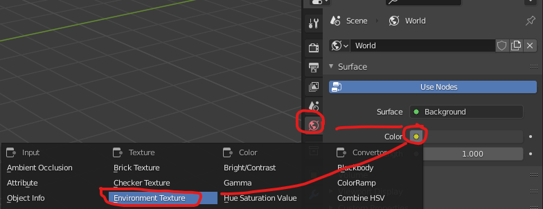

Le damos a **open** y seleccionamos **HDRI** que acabamos de descargar que es este de aquí le damos a **abrir**.

Buscamos el archivo exr y lo abrimos.

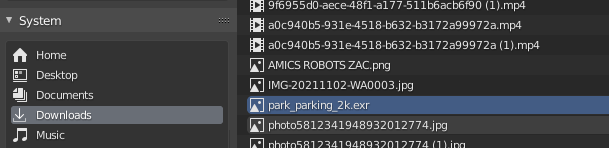

Veremos que ahora nuestro objeto está dentro de un entorno que lo ilumina como si estuviera ahí.

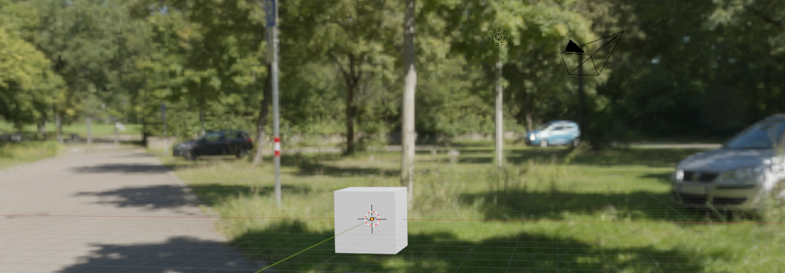

Si yo por ejemplo ahora añadiese una esfera y la aplicó a esta esfera un material súper metálico básicamente la llevo el metallic al máximo y el roughness se lo bajo

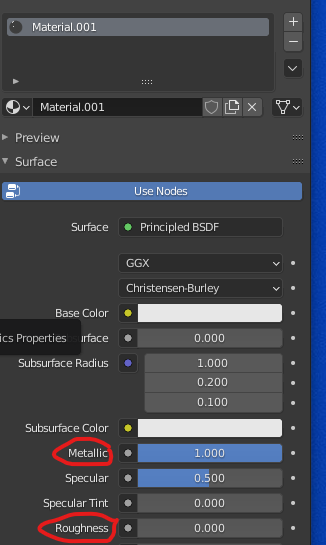

Si hacemos CBD y shade smooth se vería como una esfera perfecta y ahí veis todo lo que está reflejando. Ahora la esfera estaría reflejando perfectamente este entorno veis que se ve como una bola de disco porque se ven todas sus caras por separado. 

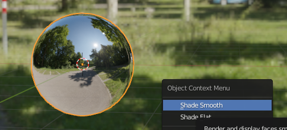

Esta sería una forma hiperrealista de iluminar nuestra escena

Podemos añadir una pared y preparar una escena un poco más compleja así que voy a hacer eso rápidamente y un truquillo también para poder manejar más a fondo nuestro hd rey sería y tampoco enseña cómo se hace abrir un nuevo panel simplemente arrastrando desde esta esquina nos vamos a donde pone shader editor aquí le damos la n para ocultar eso de ahí y aquí tenemos el editor de este material pero también podemos editar veamos a world y aquí tenemos nuestra imagen de hecho le puedo cambiar la intensidad de ese fondo se va a poner al 1 y si hemos activado el lado aunque hemos dicho al principio le damos a control t nos crea estos nuevos dos nodos que son básicamente la posición rotación y escala del fondo así que si yo roto el eje z puedo hacer que la luz venga desde otra parte 

En este caso le voy a poner desde ahí y para cerrar este panel hacemos así y aquí no ha pasado nada ok 

# Agregar Bloom (resplandor)

 tirar por ejemplo bloom que esto lo que hace es aplicar un pequeño destello en las partes que brillan más de nuestra imagen o en el caso de que tuviésemos un objeto con un material emisivo en este caso y añadir este cubo voy a aplicarle un nuevo material y ante dicho teníamos principal 10 10 pero tenemos un montón si le cojo una emisión emita una luz de color verde con una fuerza de 20 así se vería con el bloom activado y así desactivado es como ese pequeño resplandor.

En mi caso se lo voy a activar porque me gusta este resplandor que le saca a la taza a ese reflejo y luego pues si tenemos un movimiento de cámara más exageraba tiraríamos motion blur vamos a activar screen space reflections como veis nos va a activar pues réflex réflex no se habla lo que no hace es que las reflexiones de la luz o sea los reflejos sean más realistas así sería desactivado como veis esta taza no se está reflejando en el suelo pero si lo activo sí que lo que la refleja cambiaría un poquitín la luz y un par de cosas incluso añadiría un pequeño marco porque en la vida normal no se encuentra un suelo de madera pegado a una pared de este estilo pero bueno es básicamente un render de prueba y una vez que tengamos todo esto listo lo tenemos que hacer sería irnos a render y render animation y con eso ya estaría listo.

