Partículas

Crearemos un árbol de navidad y crearemos un efecto de nieve para practicar los sistemas de partículas. 

La simulación con sistemas de partículas permite obtener animaciones complejas de objetos que responden a fuerzas gravitatorias y acciones como las que produce el viento o un campo magnético. De esta forma podemos recrear lluvia, nieve, y otros.

Vista lateral del resultado

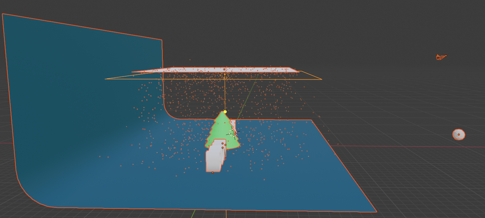

 Crear el objeto que va a caer como si fuera un copo

El copo que vamos a crear es una icosfera y, a partir de ella se crearán múltiples copias.

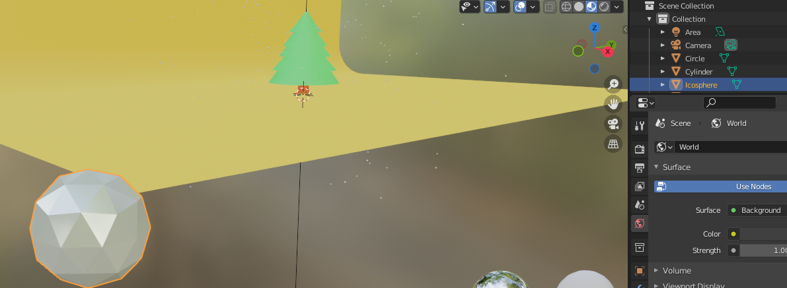

Colocamos una icosfera con shift a mesh

Con G nos la colocamos en un sitio que no vea la cámara, fuera de plano. Esto que véis es desde  shading

Le damos material y color para que se vea. Vamos a crear un material nuevo y le vamos a cambiar el nombre a nieve.

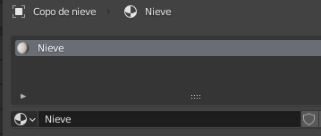

Le damos las características que queramos, que hagan que los copos se vean lo más similares posibles a la nieve real.

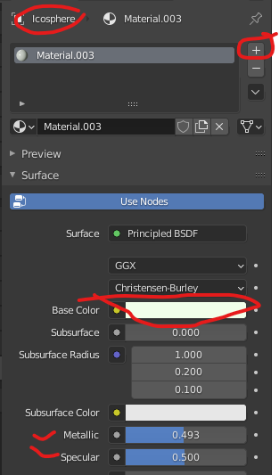

Crear un plano con emisiones

Shift+a plano, y colocamos un plano

Lo pondremos encima del árbol, pero que no salga en el plano de la cámara. con GZ lo movemos hacia arriba, para colocarlo sobre la escena. 

Con S escalamos para que cubra toda la zona en la que queremos que nieve.

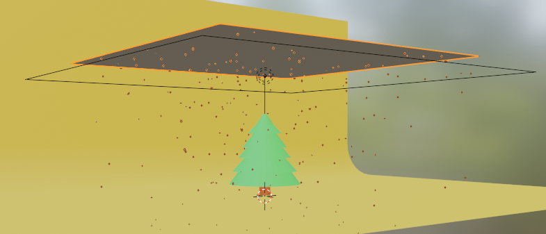

Al plano que lanza nieve le he cambiado el nombre para poder luego identificarlo más fácilmente.

Configuramos el plano para que emita partículas

Seleccionamos el plano generador de nieve

Le agregamos un particlesystem y configuramos los parámetros necesarios. Yo le he cambiado el nombre con F2 a partículas de nieve para identificarlo.

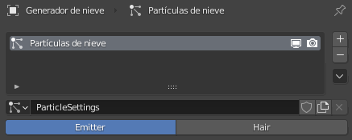

Configuramos los parámetros necesarios como número de copos, frames de inicio y fin y vida de los copos (cantidad de frames hasta que desaparecen).

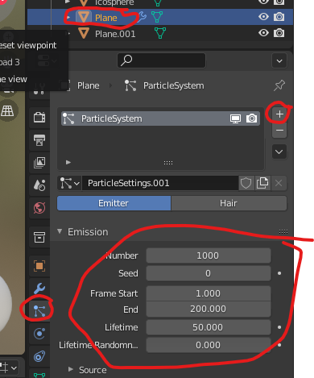

Podemos ver la animación (tecla espacio), y veremos el efecto creado. De todos modos, tal como está en el render final no aparecerían las partículas.

Cambiamos el tipo de emisión para emitir objetos

Por último, 

Elegimos más abajo en render elegimos render as object

Revisamos que show emitter esté marcado

En el submenú object seleccionamos en instance object la icosfera que habíamos creado. De este modo, le estamos diciendo que cree todos los objetos a partir de este.

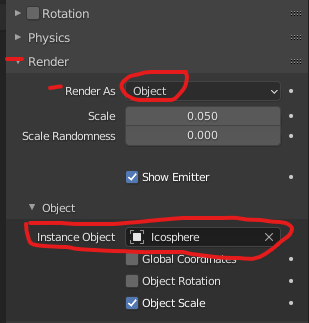

También cambiaremos velocity y physics para ajustar el comportamiento de los copos  y que este sea más realista.

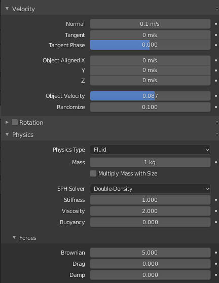

Volved a simular la animación y veréis que ya se comportan más como copos de nieve.

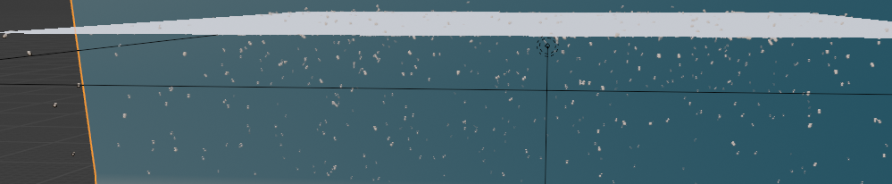

Colisiones y amortiguación

Al fondo hay que ponerle un modificador de colisión para que las partículas no lo atraviesen.

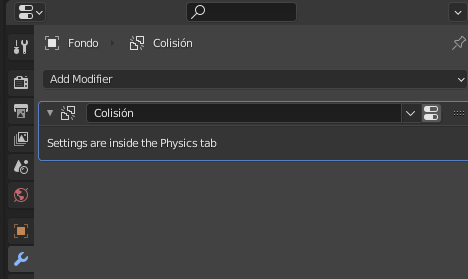

Veréis que los copos rebotan como si fueran canicas, esto se puede modificar. En Physics podéis cambiar el comportamiento para que amortigüe los copos al tocar el suelo.

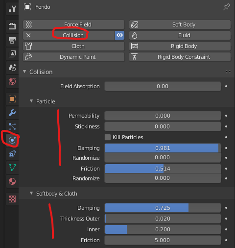

Ahora los copos ya no atraviesan el plano y no rebotan, sino que se quedan parados en el suelo.

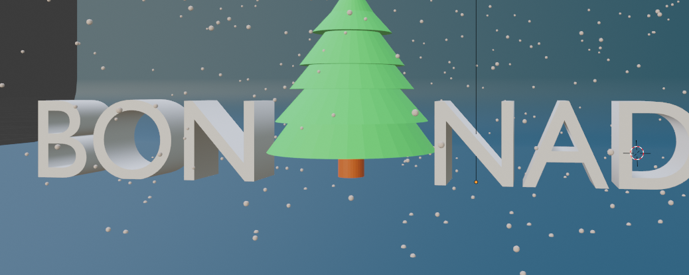

Luz iluminación

Vamos a colocar una luz sobre la escena a fin de iluminar correctamente todos los objetos.

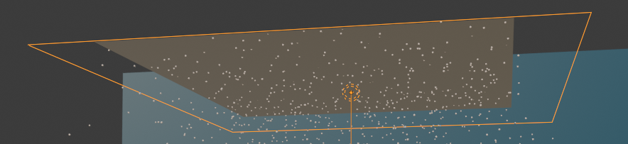

Insertar un a luz de área que esté justo encima de los objetos que queremos iluminar

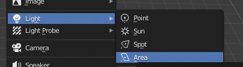

Propiedades de la luz. En mi caso le he puesto 1000 W de potencia y me ha parecido suficiente.

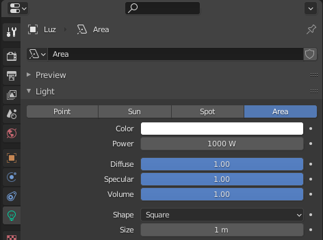

En mi caso he colocado la luz a 12 metros de altura, como referencia, por si lo queréis hacer así, y centrado en origen de coordenadas para la x y la y.

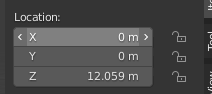

Cámara

La cámara la podéis poner donde queráis. Yo la he modificado a ojo y en una posición en la que se vea bien la escena.

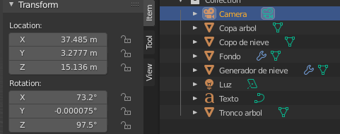

Escena final

Aquí podéis ver un resumen de cómo queda la escena, con todos los elementos.

Copo de nieve

Árbol

Cámara

Plano emisor de la nieve

Luz que ilumina la escena

Fondo

Render final

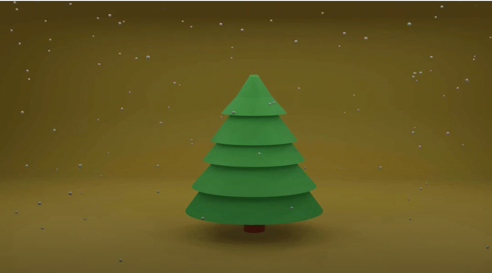

