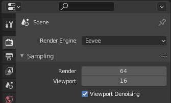
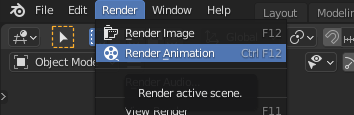

# Renderizado

Renderizar es el proceso mediante el cual se crea un archivo de imagen o película definitivo a partir del diseño que estamos realizando.

Motor de renderizado

Para renderizar estamos usando el motor de renderizado eevee que es el más rápido, aunque también tendríamos el cicles que éste es más realista pero también lleva mucho más tiempo de renderizado 

Parámetros de renderizado

Lo que vamos a hacer va a ser irnos a este segundo icono aquí tenemos el tamaño, los fotogramas, fotogramas por segundo, cuánto queremos que dure. 

Vamos a configurar los siguientes parámetros

Resolución FullHD

Frame inicio y finalización

Ubicación del archivo guardado

Formato

Contenedor

Códec de video

Calidad

Renderizar animación

Por último, vamos a renderizar el vídeo. Aquí es cuando tendremos que esperar más o menos tiempo, en función de la duración del vídeo, calidad y la tasa de frames, entre otros factores.

