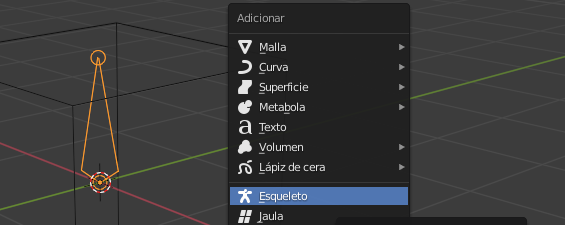
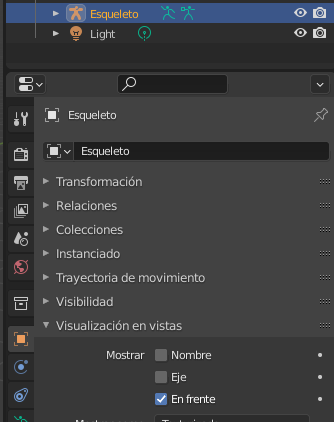
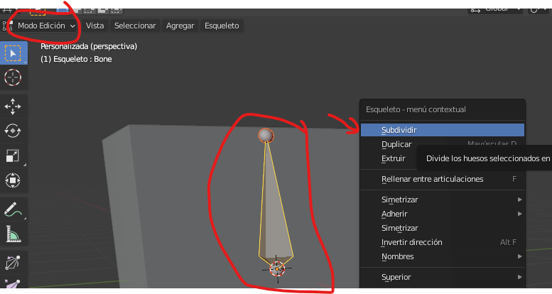
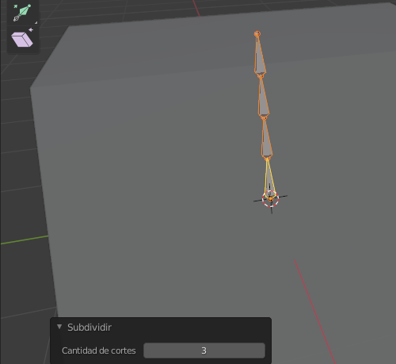

# Animación con esqueleto

## Inicio

Para animar nuestro personaje tendremos que dotarle, además del modelo, de un esqueleto. Al mover los huesos de este esqueleto, el modelo se moverá acorde a ellos.

## Crear un hueso

Con **shift**+a vamos a abrir el menú y vamos a crear el primer hueso en modo objeto.

El hueso ahora no lo veremos porque está dentro de mi figura. Vamos a activar esta opción para que se vea siempre por delante del personaje, aunque no lo está realmente.

Desde la vista frontal con el hueso seleccionado y la **tecla s** lo vamos a escalar hasta que tenga el tamaño del cuerpo

## Columna vertebral

Ahora para editar el hueso hay que entrar en el **edit mode**. Lo que quiero es hacer lo que sería la columna vertebral así que vamos a seleccionar el hueso y **clic derecho** le vamos a dar a subdivide por defecto sólo se subdivide una vez.

Aquí abajo podemos cambiar el número de subdivisiones en total le vamos a dejar tres huesos para el cuerpo. O sea, le metemos dos subdivisiones desde la vista frontal pulsando 1 del teclado numérico 

## Cadera

Vamos a seleccionar el circulito debajo del hueso y le vamos a dar a la para escribir el hueso y sacarlo que sería la cadera con la **tecla G** lo movemos y con R lo rotamos yo lo coloca donde más o menos iría la cadera para que luego todo funciona lo mejor posible.

## Pierna

De esa cadera vamos a sacar la pierna igual que antes seleccionamos el circulito y con la **tecla E** extremos para que tenga rodilla necesitamos otro hueso más así que como ante CBD encima del hueso y los dividimos una vez desde la vista lateral pulsando la **tecla 3** del teclado numérico de coloco los huesos siguiendo un poco mejor la forma del personaje hacer con la tecla G o las flechitas.

Vamos a duplicar los huesos del lado izquierdo, pero para que funcione correctamente se tienen que renombrar en este caso nos sirve esta opción automática 11seleccionamos el hueso pulsamos CBD encima y dentro de names pulsamos en auto name let bright 

Se hace lo mismo con los tres huesos y hecho esto lo seleccionamos pulsamos CBD encima y le damos a la opción de simetría y ahí lo tenemos le toca un poco el hueso de la columna que creo que está un poco bajo y ya nos queda duplicar el hueso de arriba con sic depara el cristal y duplicar el hueso del medio para poder mover la mochila también esto no tiene que ver con eltuto pero lo voy a poner rápidamente al otro lado por si me está molestando con los cuadrados que salen ahí a veces 

## Terminar

ya tenemos todos los huesos necesarios así que vamos a salir del **edit mode** con **Tabulación** al offset mount y lo que hacemos es seleccionar todas las partes del personaje primero manteniendo la tecla **shift** pulsada y por último seleccionamos los huesos.

A continuación, pulsamos Ctrl+P y elegimos esta opción para unir los huesos al personaje de forma automática para comprobar que no ha funcionado seleccionamos los huesos en esta esquina le damos a la opción pose mode donde podemos mover los huesos para apoyar a nuestro personaje.

Comprobamos que todo funciona[Música]y ahora vamos a mejorar un par de cosas para que nuestro rey funciones aún mejor

Cambiamos del modo pose al **edit mode** seleccionamos el hueso de la mochila y luego el de la espalda. El orden es importante una vez seleccionado pulsamos Ctrl+P y le damos aquí offset así cuando movamos ese huevo ese huevo ese huevo y así cuando movamos ese hueso la mochila lo seguirá y con el cristal podemos hacer lo mismo.

Primero seleccionamos el hueso del cristal y luego el hueso de la cabeza lo ponemos todo un poco para asegurarnos de que funcione bien y para volver atrás pulso ctrl+z obviamente todos los ríos tienen un límite y si hacéis los movimientos muy extremos se os va a romper, pero la verdad que me ha quedado bastante bien y creo que soporta posturas extremas ya podemos mover todas las partes del personaje 

## Mover todo el personaje

Necesitamos un último hueso que nos permita moverlo todo a la vez así que volvemos a **edit mode** con la parte de abajo del hueso seleccionada pulsamos la E para extruir un nuevo hueso y lo colocamos por aquí.

Ahora lo tenemos que conectar así que primero seleccionamos el hueso de la columna y luego el del suelo pulsamos Ctrl+P y le damos a keep offset. Como veis ya está conectado así que ahora hacemos lo mismo con los huesos de la cadera recordad desde el **edit mode** primero seleccionamos el hueso de la cadera y después el del suelo pulsamos Ctrl+P y tipo offset desde el pose mode comprobamos que funciona volvemos **edit mode** y hacemos exactamente lo mismo con el hueso de la otra cadera y ya tenemos nuestro gris completo listo para ser animado. 

## Animación

Ahora os voy a enseñar una pequeña introducción de cómo funciona la línea de tiempo y cómo crear fotogramas clave antes de enseñar cómo animar al personaje corriendo 

Voy aponer un ejemplo con el hueso que mueve todo el personaje con este seleccionado situado en el fotograma 1 vamos a pulsar la I y le damos a la opción location rotation and scale para crear un fotograma.

Como veis se no crea este puntito amarillo es una clave que nos guarda la posición la rotación y la escala actual del hueso que tenemos seleccionado y ahora si nos vamos al fotograma 80 por ejemplo desplazamos el personaje y le creamos otro aquí como antes estaremos guardando esa posición y 

Si le damos al **play** vemos cómo el personaje va de una a otra esto funciona igual con todos voy a crear un aquí con todos los huesos seleccionados para que me guarde la pose completa del personaje quieto en el fotograma 1 y en el timeline vamos creando keys por cada movimiento que hacemos.
