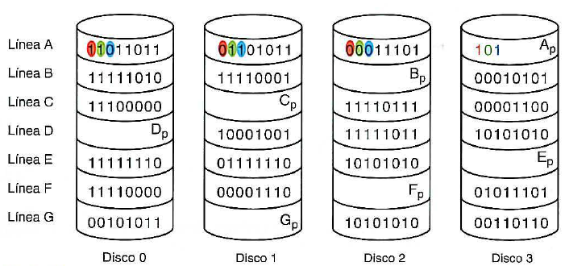
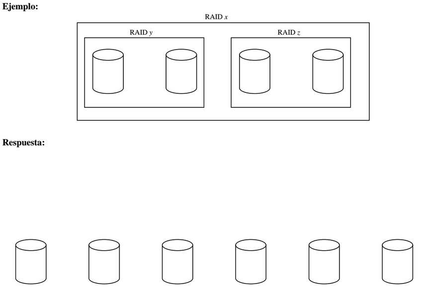
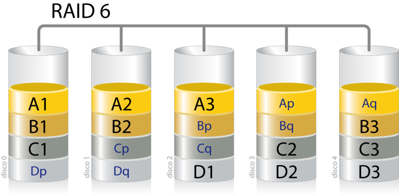

# Ejercicios raid

- [Ejercicios raid](#ejercicios-raid)
  - [Cuestionario](#cuestionario)
  - [Test de RAID](#test-de-raid)
  - [EJERCICIO 1: RAID 5](#ejercicio-1-raid-5)
  - [Ejercicio 2](#ejercicio-2)
  - [Ejercicio 3: raid 6](#ejercicio-3-raid-6)

## Cuestionario

1. ¿Es posible usar un sistema en RAID 5 para Instalar el sistema operativo?
2. ¿Es posible usar un sistema en RAID 1 para instalar el sistema operativo?
3. ¿Qué diferencia hay entre romper el espejo y quitar el espejo en un RAID 1?
4. Cuando rompemos un espejo de un sistema con RAID 1, ¿podemos acceder al disco reflejado como si fuese otro disco cualquiera?
5. En un sistema con cinco discos para datos de 100 Gb cada uno. ¿qué cantidad de espacio perderíamos al montar un sistema RAID 5?
6. ¿A qué tipo de RAID nos referimos cuando hablamos de “¿RAID mirroring”, o “en espejo”?
7. ¿A qué conjunto de bandas corresponde el volumen seccionado y a qué RAID equivale?
8. Si usamos un disco de 200 Gb para nuestro equipo informático y queremos instalar un volumen RAID 1, ¿qué requisitos necesitaríamos y qué ventajas e inconvenientes verías?
9. En un sistema RAID 0, tenemos 3 discos, uno de 200 Gb, otro de 150 Gb y otro de 175 Gb. ¿Cuál sería la capacidad de almacenamiento del volumen RAID 0? (Sol. 450, 3 discos a 150 del disco menor)

## Test de RAID

1. Un volumen en RAID 1 tiene la característica de:
    1. Cuando escribimos lo hacemos en uno solo y al leer, lo hacemos de los dos discos para que estén sincronizados.
    2. Cuando escribimos lo hacemos en los dos discos para que estén sincronizados y al leer, solo hace falta leer de uno de ellos.
    3. Escribimos y leemos de un solo disco porque el otro está de respaldo y se usa solo si falla el primero.
    4. Escribimos y leemos de los dos, solo si está roto el espejo.
2. Señala la frase incorrecta:
    5. Si perdemos un disco en un RAID 0, perdemos toda la información.
    6. Si perdemos dos discos en un RAID 0, perdemos toda la información.
    7. Si perdemos un disco en un RAID 5, perdemos toda la información.
    8. Si perdemos dos discos en un RAID 5, perdemos toda la información.
3. ¿Cuántos discos son necesarios para poner un sistema en RAID 5?
    9. 2 como mínimo.
    10. 2 como máximo.
    11. 3 como mínimo.
    12. 3 como máximo.
4. ¿Cuántos discos son necesarios para poner un sistema en RAID 1?
    13. 1 como mínimo.
    14. Obligatoriamente 2.
    15. Obligatoriamente 1.
    16. 1 o 2
5. Marca las respuestas que sean válidas si hablamos de los RAID que se han estudiado:
    17. El RAID 0 necesita como mínimo 5 discos.
    18. En el RAID 1 se perdería toda la información si fallasen todos los discos que lo componen.
    19. El RAID 5 necesita un mínimo de 3 discos.
6. ¿Cuál de los siguientes RAID NO podría montar con dos discos?
    20. RAID 0
    21. RAID 1
    22. RAID 5
    23. Ninguna de las respuestas anteriores es correcta.
7. Si montamos un sistema RAID 0 con tres discos de 50« GBytes, 450 Gbytes y 300 Gbytes, respectivamente. Nuestro nivel RAID 0 presentará una única unidad lógica con una capacidad de:
    24. 1250 GBytes.
    25. **900 GBytes.**
    26. 300 GBytes.
    27. Ninguna es correcta.
    
## EJERCICIO 1: RAID 5

Dado el conjunto de 4 discos que monta un volumen RAID 5. Calcula los bloques de paridad y completa la figura

1. Imagina que se perdiera el disco 1. Llega una petición de lectura de la línea F, ¿podría realizarse? ¿Qué información devolvería?

2. Cuando aún no se ha recuperado el disco, llega una petición de escritura para la línea F: hay que escribir el valor 10001111 00001110 01011101. ¿Crees que se podrá realizar esta operación? Haz las modificaciones que sean necesarias.

3. Una vez que se ha conseguido un disco con las características adecuadas, se decide sustituir el disco dañado y recuperar el funcionamiento normal de la unidad utilizando los cuatro discos. Recupera la información de dicho disco utilizando solo la información de los discos 0, 2 y 3.
    
## Ejercicio 2

En un servidor, disponemos de 6 discos duros de 100 GB. Necesitamos crear con ellos un volumen RAID con 300 GB de espacio disponible, de manera que se maximice el rendimiento en escrituras aleatorias y los datos estén protegidos contra el fallo total de 1 disco cualquiera. 

Se pide: Hacer un diagrama de cómo se debe crear el volumen, usando los niveles RAID clásicos (RAID  0 a RAID 6) y/o sus combinaciones, siguiendo el ejemplo.

## Ejercicio 3: raid 6

Discos necesarios mínimo: 4

Se trata de una evolución del Raid 5, donde se busca ampliar la tolerancia frente a fallos, este aumento de tolerancia se consigue usando una **doble banda de paridad **(que también se distribuye entre todos los discos) y aumentando a 4 el número mínimo de discos necesarios para un Raid.

Como resultado de las modificaciones introducidas los Raid 6, toleran el fallo de dos discos (incluso durante la reconstrucción de uno de ellos), sin pérdida de datos.

El principal problema del Raid 6 es su bajo ratio de utilización de espacio en conjuntos de discos pequeño, pensad que, si de 4 discos el espacio equivalente a 2 se dedica a paridad, nuestro raid tendrá un 50% de la capacidad máxima teórica de los discos. Afortunadamente conforme aumentamos el número de discos la ratio de utilización mejora.

**Ventajas:**

*   Tolerancia a fallos dobles de discos (incluso durante reconstrucción de HS)

**Inconvenientes:**

*   Porcentaje de pérdida de espacio en conjuntos pequeños de discos.
*   Lentitud en escritura (en realidad esto es inapreciable en el 99% de los entornos)

<table>
  <tr>
   <td>
<strong>Discos</strong>
   </td>
   <td>
   </td>
   <td><strong>Espacio útil</strong>
   </td>
   <td><strong>Vel lectura</strong>
   </td>
   <td><strong>Vel escritura</strong>
   </td>
  </tr>
  <tr>
   <td>1
   </td>
   <td>Disco
   </td>
   <td>NA
   </td>
   <td>NA
   </td>
   <td>NA
   </td>
  </tr>
  <tr>
   <td>2
   </td>
   <td>Discos
   </td>
   <td>NA
   </td>
   <td>NA
   </td>
   <td>NA
   </td>
  </tr>
  <tr>
   <td>3
   </td>
   <td>Discos
   </td>
   <td>NA
   </td>
   <td>NA
   </td>
   <td>NA
   </td>
  </tr>
  <tr>
   <td>4
   </td>
   <td>Discos
   </td>
   <td>50%
   </td>
   <td>4x
   </td>
   <td>2x
   </td>
  </tr>
  <tr>
   <td>5
   </td>
   <td>Discos
   </td>
   <td>60%
   </td>
   <td>5x
   </td>
   <td>3x
   </td>
  </tr>
  <tr>
   <td>6
   </td>
   <td>Discos
   </td>
   <td>67%
   </td>
   <td>6x
   </td>
   <td>4x
   </td>
  </tr>
  <tr>
   <td>7
   </td>
   <td>Discos
   </td>
   <td>71%
   </td>
   <td>7x
   </td>
   <td>5x
   </td>
  </tr>
  <tr>
   <td>8
   </td>
   <td>Discos
   </td>
   <td>75%
   </td>
   <td>8x
   </td>
   <td>6x
   </td>
  </tr>
  <tr>
   <td>9
   </td>
   <td>Discos
   </td>
   <td>78%
   </td>
   <td>9x
   </td>
   <td>7x
   </td>
  </tr>
  <tr>
   <td>10
   </td>
   <td>Discos
   </td>
   <td>80%
   </td>
   <td>10x
   </td>
   <td>8x
   </td>
  </tr>
</table>

## Práctica 1

1. En una máquina virtual de Windows Server 2008 con 20 Gb de disco duro crea un volumen reflejado.
2. En una máquina virtual de Windows 2008 Server, agregar tres discos duros de 10 Gb cada uno. Convertir los 3 discos a dinámicos y posteriormente hacer un volumen seccionado (RAID 0). Crear un fichero dentro del volumen
3. En primer lugar, paramos la máquina virtual, si estuviese en funcionamiento, y agregamos un nuevo disco, del mismo tamaño del que contiene al sistema operativo (véase Figura 3.26).
