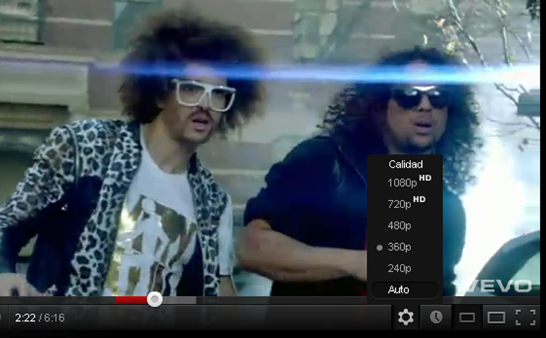

# Video digital

- [Video digital](#video-digital)
- [Características del video](#caracter%C3%ADsticas-del-video)
- [Relación de aspecto](#relaci%C3%B3n-de-aspecto)
- [Resolución](#resoluci%C3%B3n)
- [Flujo de bits](#flujo-de-bits)
- [Fotogramas por segundo](#fotogramas-por-segundo)
- [Video entrelazado y progresivo](#video-entrelazado-y-progresivo)
- [Formatos de vídeo](#formatos-de-v%C3%ADdeo)
- [Compresión: Códecs de video](#compresi%C3%B3n-c%C3%B3decs-de-video)
- [Captura de vídeo digital](#captura-de-v%C3%ADdeo-digital)
- [Edición de video](#edici%C3%B3n-de-video)
- [Vídeo HD e Internet](#v%C3%ADdeo-hd-e-internet)
- [Alta definición](#alta-definici%C3%B3n)
- [Calidad de vídeo en youtube](#calidad-de-v%C3%ADdeo-en-youtube)
- [Video 3D](#video-3d)

# Características del video

- Relación de aspecto
- Resolución
- Flujo de bits

# Relación de aspecto

- Proporción entre anchura (x) y altura (y)
- Se expresa como x:y
- Televisión tradicional relación 4:3
- Debido a la  alta definición 
- Formato panorámico
- Diferentes relaciones de aspecto
- Por ejemplo: 16:9

# Resolución

- Define el máximo detalle que se puede obtener de la imagen
- Determina su calidad
- Tamaño de la imagen
- Producto de los píxeles horizontales y los píxeles verticales de la imagen

Ejemplo: Imagen de 1280 x 720

- 1280 píxeles en horizontal
- 720 píxeles en vertical

#  Flujo de bits

- Cantidad de información que contiene cada segundo de vídeo
- Se mide en bits/s
- Más bits/s: Mayor calidad pero mayor tamaño
- 2 tipos principalmente
- Flujo constante de bits (CBR)
- Cada segundo contiene exactamente el mismo número de bits
- Flujo variable de bits (VBR)
- El número de bits por segundo va cambiando según la escena.
- Mayor movimiento, más bits/s
- Menor movimiento, menos bits/s

# Fotogramas por segundo

- Un vídeo está formado por una secuencia de imágenes
- A cada imagen se le llama frame
- La medida es frames por segundo (**fps**)

Habitualmente: 

- Televisión: 25 fps
- Cine: 24 fps
- Dibujos animados: 15 fps

Suficientes para “engañar” al ojo humano

# Video entrelazado y progresivo

Cada fotograma (frame) se divide en líneas horizontales

Según como se muestran estas líneas el video puede ser:

- Entrelazado
- Progresivo

Video **entrelazado** (i):

- Se visualiza solo la mitad de las líneas en cada barrido
- Primero las impares, luego las pares
- Debido al fenómeno de persistencia de la visión el ojo las ve como si fueran una sola imagen

Video **progresivo** (p):

- Se muestran todas las líneas de una sola vez
- Mayor calidad y menor cansancio de la vista

# Formatos de vídeo

Tipos de archivos de vídeo
AVI
Formato más extendido. Utilizado inicialmente en Windows
MOV
De Apple
Necesita reproductor específico
WMV
Formato de microsoft
Permite añadir protección de copyright
RV (Real video)
Muy utilizado en streaming (transmisión por internet en tiempo real)
Necesita reproductor específico

DivX

DivX en Vídeo = MP3 en Audio

# Compresión: Códecs de video

Los **codec** realizan dos tareas:

- Comprimen el vídeo para ser almacenado
- Descomprimen para su reproducción

Más característicos:

- WMV (Windows Media Video)
- Ogg
- FLV (flash video)
- Real Video
- DivX / Xvid
- MKV (Matroska Video)

# Captura de vídeo digital

¿Cómo capturar vídeo digital?

Dispositivos digitales:

- Cámaras miniDV
- Cámaras DVD
- Cámaras de memoria
- Otros dispositivos: Webcam, móviles

Tarjeta capturadora de vídeo

- Entradas de vídeo

Permiten transmitir y ver el vídeo en el ordenador

# Edición de video

Programas informáticos especializados
Algunos gratuitos y otros de pago

Permiten:

- Cortar  y pegar
- Añadir transiciones
- Editar títulos y subtítulos

Ejemplos:

- Windows Movie Maker
- Pinnacle Studio
- Etc.

# Vídeo HD e Internet

- Características de video
- Para indicar la resolución de una imagen
- Se utilizan los píxeles de la vertical
- Seguidos de una letra
- P si el video es progresivo
- I si el video es entrelazado
- Ejemplo: 1080p
- La imagen mide 1080 píxeles en vertical
- Y el video es del tipo progresivo
- Los píxeles horizontales se obtienen a partir de la relación de aspecto

# Alta definición

Equipos que pueden 
procesar y reproducir video en alta definición
Se etiquetan con
HD ready (720p)
Resolución 720p
HD ready 1080p, True HT, Full HD
Resolución 1080p

# Calidad de vídeo en youtube

# Video 3D

Tecnología 3D
Basada en diferencia de percepción de los dos ojos
Ven 2 imágenes levemente diferentes
Producen visión estereoscópica
Sensación de profundidad 
Medida de resolución en 3D
Se mide en Voxels

