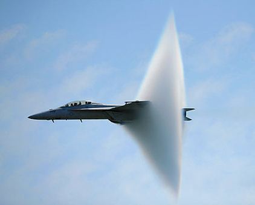
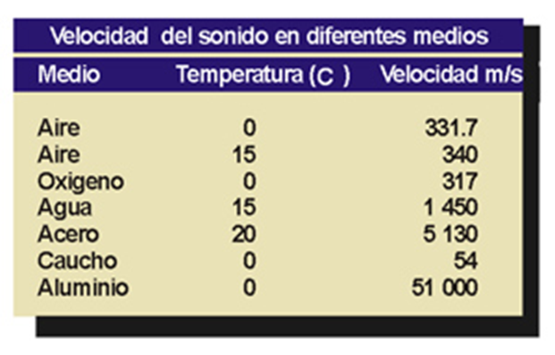

# Sonido digital

- [Sonido digital](#sonido-digital)
- [El sonido](#el-sonido)
- [Velocidades de propagación](#velocidades-de-propagaci%C3%B3n)
- [Características del sonido](#caracter%C3%ADsticas-del-sonido)
- [Cualidades básicas del sonido](#cualidades-b%C3%A1sicas-del-sonido)
- [Captura de sonido. Equipos informáticos](#captura-de-sonido-equipos-inform%C3%A1ticos)
- [Tarjeta de sonido PCI](#tarjeta-de-sonido-pci)
- [Altavoces](#altavoces)
- [Digitalización del sonido](#digitalizaci%C3%B3n-del-sonido)
- [Digitalización. Paso 1: Muestreo](#digitalizaci%C3%B3n-paso-1-muestreo)
- [Formatos de audio digital](#formatos-de-audio-digital)
- [Formatos de audio más comunes](#formatos-de-audio-m%C3%A1s-comunes)
  - [Formatos PCM](#formatos-pcm)
  - [Formatos comprimidos](#formatos-comprimidos)
- [Códec de audio](#c%C3%B3dec-de-audio)
- [Códecs de audio](#c%C3%B3decs-de-audio)
- [Parámetros principales del audio digital](#par%C3%A1metros-principales-del-audio-digital)
- [Parámetros principales del audio digital](#par%C3%A1metros-principales-del-audio-digital-1)
- [Midi](#midi)
- [Reproductores de sonido](#reproductores-de-sonido)
- [SONIDO EN LA WEB Y PODCAST](#sonido-en-la-web-y-podcast)
- [Podcast](#podcast)
- [Recorrido de un podcast](#recorrido-de-un-podcast)
- [Propiedad intelectual](#propiedad-intelectual)

# El sonido

¿Qué es?
Sensación producida en el oído por un movimiento vibratorio
Es una vibración que se propaga (generalmente por el aire)
Las moléculas del aire transmiten la vibración hasta nuestro oído
¿Cómo se propaga?
Por un medio físico elástico
Sólido, líquido o gaseoso
No se propaga en el vacío

# Velocidades de propagación

- Aire: 343 m/s
- Agua salada: 1,500 m/s
- Agua dulce: 1,435 m/s
- Acero: 5,148 m/s.

# Características del sonido

Frecuencia
Número de vibraciones por segundo
Se mide en Herzios (Hz)
Generalmente: KHz, MHz
Sonido agudo
Mayor frecuencia
Sonido grave
Menor frecuencia
Oído humano percibe
Entre 20 Hz y 20 KHz

# Cualidades básicas del sonido

Cuatro cualidades básicas 

Tono: 

- Frecuencia de la onda
- Nos permite diferenciar un sonido grave de uno agudo.

Timbre: 
Cualidad que permite distinguir dos sonidos, por ejemplo,
Entre la misma nota (tono) con igual intensidad producida por dos instrumentos musicales distintos
Intensidad: 
Corresponde con la amplitud de la onda
Cantidad de energía acústica que contiene un sonido
Lo fuerte o suave de un sonido (volumen).
Duración: 
Tiempo durante el cual se mantiene un sonido. 
Podemos escuchar  sonidos largos, cortos, muy cortos, etc. 

# Captura de sonido. Equipos informáticos

# Tarjeta de sonido PCI

Dispositivo que procesa entrada y salida de audio
Entre otras funciones
Digitaliza el sonido del micrófono
Convierte sonido en analógico para salir por los altavoces
Captura de sonido
Actualmente integrada
Tarjeta de sonido no independiente
Está integrada en la placa base

# Altavoces

Vibran mediante un electroimán según el sonido
El movimiento de aire que realizan produce el sonido

# Digitalización del sonido

Proceso en que se transforma
Un sonido de naturaleza analógica
En un formato digital

Para ello son necesarios dos procesos

- Muestreo
- Cuantificación

# Digitalización. Paso 1: Muestreo

Ordenador toma muestras de la señal sonora cada cierto tiempo
Mayor calidad en el sonido digital cuanto mayor sea el número de muestras tomadas
Frecuencia de muestreo 
Se suele expresar en Khz

Algunas medidas típicas son 

- 11 KHz (calidad baja), 
- 22 KHz (calidad media), 
- 44,1 KHz (calidad alta)
- 96 KHz (calidad muy alta).

# Formatos de audio digital

Indican la estructura con la que el sonido es almacenado
PCM
Contienen toda la información. 
Mejor calidad pero mayor tamaño
Comprimidos
Utilizan códecs de audio para reducir el tamaño descartando parte de la información
Menor calidad pero menor tamaño

# Formatos de audio más comunes

## Formatos PCM

Wav
Microsoft
Aprox 10 MB por minuto
Aif
Apple
CD-A
Formato de CD de música
44.1 Khz, 16 bits i stereo
DVD-A
Sonido de alta definición para DVD

## Formatos comprimidos

MP3
Aprox 1 MB por minuto
RA
RealAudio
WMA
Windows Media Audio
Permite proteger derechos de autor
OGG
Libre distribución
AAC

# Códec de audio

Conjunto de algoritmos
Permiten codificar y decodificar sonido digital
Para reproducir un archivo
Primero el codec lo decodifica

# Códecs de audio

Codec: 
Acrónimo de codificador-decodificador
Programa 
Conjunto de algoritmos (operaciones matemáticas)
diseñado para compresión y descompresión de sonido
Para
Almacenamiento
Transmisión por Internet
Función
Reducir la cantidad de datos necesarios, reducir el tamaño

# Parámetros principales del audio digital

Canales
Frecuencia de muestreo
Tamaño de muestra

# Parámetros principales del audio digital

Canales
Número de pistas que forman un sonido.
Ejemplos
Sonido mono: 1 pista.
Sonido estéreo: 2 pistas.
Sonido 5.1: 5 pistas (Sonido envolvente).

# Midi

Interfaz digital de instrumentos musicales
Lo utilizan ordenadores, sintetizadores y dispositivos electrónicos musicales para comunicarse
Guarda descripción musical de un audio
Notas, instrumentos, etc
El sonido final depende del instrumento que lo reproduzca

# Reproductores de sonido

Aplicación que permite escuchar audio digital
Algunos incluyen funcionalidades
Crear listas de reproducción
Escuchar emisoras online
Sincronizar archivos entre ordenador y dispositivos portátiles
Añadir etiquetas ID3
Ejemplos de reproductores
iTunes, Winamp, XMMS, etc.
Reproductores multimedia
Windows Media Player, VLC, 
    Real player, etc.

# SONIDO EN LA WEB Y PODCAST

Plataformas de streaming
Streaming
Transmisión de sonido digital en la web
Permite escuchar música a la carta sin descargar todo el archivo previamente
¿Cómo se financian las plataformas de streaming?
A través de publicidad
Tiendas online de música

# Podcast

- Archivo de sonido digital creado para ser difundido por Internet
- Cualquiera puede escucharlo en el momento que desee
- Desde un ordenador o un reproductor portátil

# Recorrido de un podcast

1) Productor graba el archivo
2) Comprime el archivo en un formato apto para el podcast
3) Lo cuelga en Internet
4) El usuario final lo descarga y reproduce

# Propiedad intelectual

¿Qué es?
Formada por derechos de autor
Se atribuyen al autor de una obra
Protege las creaciones originales
El autor establece el uso que se puede hacer de la obra
Más habituales
Copyright
Solo se puede usar con autorización previa del autor
Pago de licencia o canon
Creative commons
Uso delimitado por los términos de cada variante
Actividad
Para ello deberás
Buscar la dirección de la página web de la emisora
Entrar en la web y buscar el acceso para escuchar la retransmisión en directo
Programas grabados
Algunas emisoras ofrecen la posibilidad de escuchar programas o partes de programas emitidos con anterioridad.
Busca emisoras de radio online
