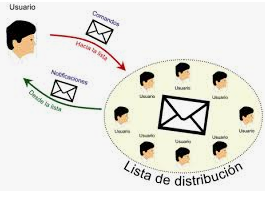

# Servicio de correo electrónico

- [Servicio de correo electrónico](#servicio-de-correo-electr%C3%B3nico)
  - [Qué entendemos por correo electrónico](#qu%C3%A9-entendemos-por-correo-electr%C3%B3nico)
  - [Terminología](#terminolog%C3%ADa)
    - [Cuenta de correo](#cuenta-de-correo)
    - [Buzón de usuario](#buz%C3%B3n-de-usuario)
    - [Alias](#alias)
    - [Lista de distribución](#lista-de-distribuci%C3%B3n)
  - [Componentes principales](#componentes-principales)
    - [MUA o agente de usaurio](#mua-o-agente-de-usaurio)
      - [Tipos de clientes](#tipos-de-clientes)
        - [Clientes instalados en el ordenador:](#clientes-instalados-en-el-ordenador)
        - [Clientes vía web:](#clientes-v%C3%ADa-web)
        - [Cliente en el servidor](#cliente-en-el-servidor)
    - [MTA o agente de transferencia de correo](#mta-o-agente-de-transferencia-de-correo)
    - [MDA o agente de entrega](#mda-o-agente-de-entrega)
  - [Ejemplo de transmisión](#ejemplo-de-transmisi%C3%B3n)
  - [Protocolos de correo electrónico](#protocolos-de-correo-electr%C3%B3nico)
    - [SMTP](#smtp)
    - [Formato petición - respuesta](#formato-petici%C3%B3n---respuesta)
    - [IMF](#imf)
      - [Cabeceras](#cabeceras)
      - [Cuerpo](#cuerpo)
      - [Campos relacionados con el transporte](#campos-relacionados-con-el-transporte)
      - [Campos relacionados con el mensaje](#campos-relacionados-con-el-mensaje)
    - [MIME](#mime)
      - [Nuevas cabeceras](#nuevas-cabeceras)
      - [Tipos y subtipos MIME](#tipos-y-subtipos-mime)
    - [POP (Post office protocol)](#pop-post-office-protocol)
      - [Funcionamiento](#funcionamiento)
      - [Inconvenientes](#inconvenientes)
      - [Fases o estados de POP](#fases-o-estados-de-pop)
        - [Fase de conexión](#fase-de-conexi%C3%B3n)
        - [Fase de autenticación](#fase-de-autenticaci%C3%B3n)
        - [Fase de transacción](#fase-de-transacci%C3%B3n)
        - [Fase de actualización](#fase-de-actualizaci%C3%B3n)
    - [IMAP (Internet message Access protocol)](#imap-internet-message-access-protocol)

## Qué entendemos por correo electrónico

El funcionamiento del correo electrónico es muy similar al postal, pero trasladado al mundo virtual.

De forma general, sus características son las siguientes:

- No es interactivo: no espera una contestación inmediata
- No es intrusivo: se lee cuando se quiere o puede
- Es modular: sigue el modelo cliente-servidor

## Terminología

### Cuenta de correo

Elemento identificador de un usuario

### Buzón de usuario

Espacio en el servidor de correo asociado a una cuenta de usuario donde se almacenan los mensajes dirigidos a este

### Alias

Permiten asignar una cuenta principal de correo diferentes cuentas o alias.
La cuenta `informacion@dominio.es` puede tener los siguientes alias

- information@dominio.es
- dudas@dominio.es

### Lista de distribución

- Es una cuenta virtual, no es una cuenta como tal, no tiene buzón.
- Engloba a varios usuarios, en lugar de hacerlo individualmente, para intercambiar información de forma simultánea.
- Se pueden utilizar para suscripción a diferentes temáticas.

## Componentes principales

3 componentes necesarios para el funcionamiento de un sistema de correo:

- Mail User Agent (MUA)
- Mail Transfer Agent (MTA)
- Mail delivery Agent (MDA)

### MUA o agente de usaurio

Programa que ejecuta el usuario para leer el correo y enviar mensajes
Permite crear, editar y enviar un mail
Permite guardar los correos recibidos y enviados
Aplicaciones: Outlook, Thunderbird, etc.
Un MUA para funcionar necesita:
Un servidor de correo saliente para enviar mensajes
Un servidor de correo entrante para leerlos

#### Tipos de clientes

##### Clientes instalados en el ordenador: 
Se ejecutan directamente desde el ordenador y permiten la descarga de correo al equipo local desde el servidor

##### Clientes vía web:

Desde el navegador se accede a una página correspondiente al servidor y se puede acceder a los mensajes recibidos, así como enviar nuevos

##### Cliente en el servidor

Para leer el correo hace falta conectarse al servidor mediante una conexión segura como ssh o una conexión simple como telnet.

### MTA o agente de transferencia de correo

- Servidor de correo electrónico, útil cuando los buzones de correo están en diferentes servidores.
- Realiza el envío de los mensajes entre máquinas a través del protocolo SMTP
- Se ocupa de encaminar el mensaje entre diferentes MTA (si el mensaje no pertenece a su dominio)
- Localizado este, se realizará una conexión MTA-MTA que entregará el mensaje al MTA donde se encuentra el buzón del cliente.

Ejemplos:

- sendmail
- postfix
- qmail
- exim

### MDA o agente de entrega

- No transporta mensajes entre sistemas, ni es una interficie de usuario
- Actua como puente entre el MTA y el MUA
- Es el encargado de copiar  los mensajes de correo del servidor al buzón del usuario 
- Ejemplos: qpopper, Cyrus, etc

## Ejemplo de transmisión

- El remitente (pepe@iesfbmoll.org) utiliza su cliente de correo (MUA) para escribir el correo y establece como destinatario a manolo@gmail.com (TO)
- El MUA de pepe envía el mensaje al servidor de correo. Para ello se coloca en la cola de correos salientes
- El cliente SMTP del servidor de Pepe abre una conexión TCP con el servidor de correo de Manolo.
- El cliente SMTP envía el mensaje de Pepe a través de la conexión TCP
- El servidor de correo de Manolo coloca el mensaje en el buzón de correo de Manolo.
Manolo, a través de su cliente de correo accede a los mensajes entrantes (utilizando IMAP o POP3)

## Protocolos de correo electrónico

Permiten que diferentes máquinas con diferentes sistemas operativos y diferentes clientes de correo electrónico puedan comunicarse y intercambiar correos entre ellos.

Los más utilizados son:

- SMTP
- IMF
- MIME
- POP
- IMAP

Puertos utilizados por los diferentes protocolos:

- El primer número es el protocolo no seguro
- El segundo es el protocolo seguro (similar a HTTPS

### SMTP

- Protocolo cliente-servidor basado en texto para el envío de correo electrónico.
- Conexión a través de puerto TCP 25 
- Se utiliza para intercambio de mensajes de correo electrónico entre ordenadores o diferentes tipos de dispositivos electrónicos
- SMTP permite no mantener una conexión online para almacenar los correos y poderlos enviar de forma diferida.

### Formato petición - respuesta

Se trata de un protocolo comando-respuesta

Comandos en texto ASCII:

- HELO: saludo tras aceptar conexión
- MAIL FROM: Identifica al remitente
- RCPT TO: Indica el destinatario
- DATA: Indica el inicio del mensaje y cierra la conexión con .
- QUIT: Cierra la sesión

Respuesta:

- Texto libre y código de estado
- 4XX error temporal
- 5XX error permanente

### IMF

IMF describe el formato que tienen que tener los mensajes electrónicos que se envían entre diferentes ordenadores a través de email.

#### Cabeceras

Permiten identificar información de un mensaje, independientemente del idioma.

- El asunto SUBJECT:
- La fecha: DATE:
- El remitente: FROM:
- El destinatario: TO:

#### Cuerpo

Texto simple ASCII hasta 998 caracteres

#### Campos relacionados con el transporte

#### Campos relacionados con el mensaje

### MIME

- Añaden nuevas funcionalidades (extensions)
- Permite adjuntar archivos a mensajes de correo electrónico (gráficos, texto, sonido) utilizando - ASCII extendido
- Especifica el tipo de archivo enviado y el método para devolverlo a su formato original.
- Archivos enviados se codifican como texto de tal forma que se pueden ver en formato texto

#### Nuevas cabeceras

- Mime-version
- Content-type (text/plain por defecto, multipart para adjuntos)
- Content-description
- Content-transfer-encoding

#### Tipos y subtipos MIME

### POP (Post office protocol)

Es un protocolo que permite la gestión, acceso y transferencia de mensajes de correo electrónico entre un servidor remoto y la máquina cliente. Se utiliza para descargar mensajes de correo.
En general, las conexiones a los servidores de correo son temporales y, mediante un programa cliente, el usuario solicita la lectura o descarga del correo
Actualmente se utiliza una versión llamada POP3
POP3 transmite las claves en texto plano. Por este motivo, es importante utilizar el protocolo POP3 seguro (pop3s), que es similar pero encriptado con SSL.

#### Funcionamiento

Conexión. El servidor se mantiene a la espera en el puerto 110, esperando la conexión de un cliente de correo
El cliente solicita la conexión
El usuario se valida en el servidor a través de una cuenta de usuario y una clave.
Una vez validado el usuario, el buzón queda bloqueado para no producir inconsistencias en los datos, y queda disponible para ser consultado
El usuario descarga, lee, borra, sus correos
Cuando el usuario se desconecta, el servidor actualiza su buzón (borra mensajes) y lo desbloquea (ya puede recibir correos nuevos)

#### Inconvenientes

No permite al usuario organizar el correo en el servidor.
El usuario no puede tener diferentes carpetas en el servidor
No permite al usuario comprobar los contenidos del email antes de descargarlos.

#### Fases o estados de POP

##### Fase de conexión

El servidor escucha en el puerto 110, esperando la conexión de un cliente de correo

##### Fase de autenticación

El servidor espera un nombre y contraseña de una cuenta. No es posible pasar a la fase siguiente si la validación del usuario no ha sido correcta (comandos USER y PASS)

##### Fase de transacción

Una vez que el usuario se ha validado se bloquea su buzón en el servidor para evitar inconsistencias, y queda disponible para ser consultado. Los comandos LIST, RETR y DELE permiten mostrar, descargar y eliminar mensajes del servidor, respectivamente. El comando QUIT permite pasar a la siguiente fase.

##### Fase de actualización

El usuario se desconecta y el servidor actualiza su buzón, elimina los mensajes que se han marcado para borrar y se bloquea el buzón (ya pueden entrar mensajes nuevos)

### IMAP (Internet message Access protocol)

- Protocolo de descarga de correo. Similar a POP3, pero con más características, más potente y complejo
- El usuario puede comprobar las cabeceras de correos antes de descargarlos.
- Se puede descargar parte del correo únicamente. Especialmente útil cuando la conexión es limitada y los correos contienen multimedia.
- Los mensajes pueden ser organizados en carpetas de correo. El usuario puede crear, borrar o renombrar carpetas en el servidor.
- También puede crear una jerarquía de carpetas para guardar en ellas correo.
- Está diseñado para que el correo electrónico permanezca en los servidores de correo.
