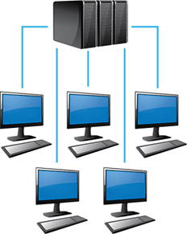
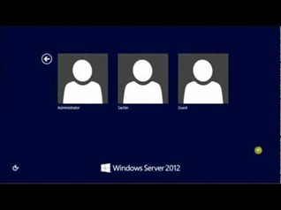
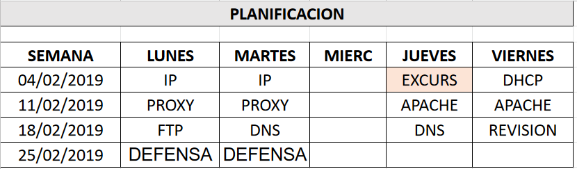

# Proyecto integrador

- [Proyecto integrador](#proyecto-integrador)
  - [Introducción](#introducci%C3%B3n)
  - [Situación actual](#situaci%C3%B3n-actual)
  - [Direccionamiento IP](#direccionamiento-ip)
  - [Nombres de equipos](#nombres-de-equipos)
  - [Nombres de usuarios](#nombres-de-usuarios)
  - [Servidores](#servidores)
  - [Acceso remoto](#acceso-remoto)
  - [Filtrado de contenidos](#filtrado-de-contenidos)
  - [Servicios web](#servicios-web)
  - [Almacenamiento](#almacenamiento)
  - [Correo electrónico](#correo-electr%C3%B3nico)
  - [Servidor físico](#servidor-f%C3%ADsico)
  - [Nombres de dominio y servidores](#nombres-de-dominio-y-servidores)
  - [Tareas a realizar](#tareas-a-realizar)
  - [Anexos](#anexos)
    - [Anexo 1: rangos de direcciones](#anexo-1-rangos-de-direcciones)
    - [Anexo 2: recomendación de servidores](#anexo-2-recomendaci%C3%B3n-de-servidores)
    - [Anexo 3: nombres de dominio](#anexo-3-nombres-de-dominio)
  - [Calendario orientativo](#calendario-orientativo)

## Introducción

Nos encargan la tarea de implementar y mantener diversos servicios informáticos para el funcionamiento del centro de secundaria IES Francesc de Borja Moll.

Para ello se nos indicarán las necesidades del centro, y será nuestra labor llevar a cabo la implementación de las soluciones informáticas necesarias.

## Situación actual

El instituto está dividido en varios edificios, que contienen cada uno de ellos uno o más departamentos, bibliotecas, clases, secretaría y jefatura de estudios, entre otros espacios.

Deberemos implementar un centro de procesamiento de datos (CPD) que de soporte a todos los servicios que requiere el instituto para su correcto funcionamiento.

Para ello, se tendrán que comprar servidores, para instalar y configurar todos los servicios que sean necesarios para el funcionamiento del centro.

## Direccionamiento IP

El instituto requiere diferentes equipos, en cada uno de los departamentos que la conforman. 

Para poder conectar los equipos en una red y poder acceder a Internet y a los demás servicios, se deberán configurar correctamente a través de direcciones IPv4. 

Cada grupo dispondrá de un espacio de direcciones para asignar a sus equipos. 

Es obligatorio crear un documento en el que se documenten las IPs de todos los equipos más importantes, así como el rango de direcciones en caso de equipos menores. (Excel, p.e.)

Deberéis crear subredes según creáis conveniente, teniendo en cuenta factores posteriores como la creación de listas de acceso a determinados servicios basados en direcciones IP (permitir o denegar accesos a clases enteras, por ejemplo).

Muchos profesores y alumnos traen sus propios equipos, por lo que habrá que tenerlo en cuenta.

## Nombres de equipos

La estructura del instituto se tiene que desarrollar en el dominio correspondiente. Nuestros servidores tienen que implementar un servicio para que todas las máquinas del instituto sean accesibles a través de su nombre de máquina.

Todos las impresoras, ordenadores y portátiles fijos deberán tener un nombre identificativo dentro de la red.

Decidid el formato más adecuado para nombrar los diferentes equipos.

Los equipos de que dispone el centro son los siguientes:
PORT = portátiles, PC = ordenadores de sobremesa, IMP = impresoras

## Nombres de usuarios

Cada alumno deberá autenticarse en los equipos para poder utilizarlos, por lo que hay que crear una estructura de nombres de usuarios.

No es obligatorio implementar un servicio de controlador de dominio, pero sí tener en cuenta qué servidores utilizaremos y qué estructura seguiremos para crear los nombres de usuario, contraseñas y perfiles de los alumnos

## Servidores

Para implementar la solución escogida se utilizarán tantos servidores como creáis conveniente.

Los servidores se crearán mediante máquinas virtuales. Si lo consideráis necesario, podéis implementar más de un servidor en cada máquina virtual.

En cada uno de ellos deberéis implementar los servicios que creáis necesarios para realizar todas las tareas que necesita el instituto.

Deberéis elegir el SO sobre el que realizarlo, los programas y versiones a utilizar, así como las necesidades hardware y software de cada servidor.

## Acceso remoto

La administración de los servidores se realiza de forma remota, y además el intercambio de información se realizará de forma cifrada.

Por lo tanto, los servidores tienen que implementar dos servicios que nos permitan administrar de forma remota y segura, mediante intérprete de comandos, los servidores. 

Se tiene que acceder a todos los servidores con clave pública, que tiene que estar almacenada en todos ellos.

Desde un cliente determinado se tiene que tener acceso a todos los servidores. Se tienen que configurar todas las conexiones para poder acceder a todos los servidores clicando en cada uno de ellos

## Filtrado de contenidos

El profesorado del instituto tiene interés en proteger el acceso de los alumnos a la red en la medida de lo posible.

Será necesario que se pueda limitar su acceso a diferentes sitios web, en función del tipo de trabajador o tipo de alumno.

## Servicios web

Hoy en día la presencia en Internet es un requisito casi imprescindible. Por lo tanto, el instituto necesita implementar:

- Una página web basada en WordPress
- Una plataforma Moodle

Dichos servicios web deberán estar implementados mediante páginas seguras. (HTTPS)
Se debe contratar un nombre de dominio para el instituto

## Almacenamiento

Otro servicio que necesitará el instituto, será un espacio de almacenamiento para compartir información. Sus características son:
Se tiene que poder compartir información entre los diferentes departamentos, alumnos, ciclos formativos, etc. que creáis necesaria.
Cada departamento debe tener un espacio propio solo para él.
El servidor de datos tiene que permitir la conexión, de forma segura, de usuarios que tienen que poder transferir archivos entre su máquina y el servidor.

## Correo electrónico

Se debe disponer de un servicio de correo electrónico para los usuarios del instituto. El correo electrónico se montará en base a Google Suite para empresas. 
No deberéis montar el servicio de correo electrónico, únicamente investigar cómo se debería de implementar y los pasos a seguir para tener los servicios de Google en el instituto.
Valorar una estructura de direcciones de correo de distribución y alias acorde a la estructura del centro, en función de las necesidades. 

## Servidor físico

- Tendréis que valorar la compra de un servidor que permita ejecutar todos los servicios que necesitéis.
- La máquina ejecutará las máquinas virtuales necesarias, por lo que debe tener capacidad suficiente para ello.

## Nombres de dominio y servidores

En lugar del dominio del instituto (iesfbmoll.org), utilizaréis cada grupo uno diferente. 
Toda la configuración de DNS se basará en el dominio indicado para cada grupo. 

## Tareas a realizar

- Investigar las necesidades informáticas del centro.
- Implementar en servidores GNU/Linux todos los servicios que sugiere el enunciado del proyecto.
- Realizar algún tipo de documentación donde queden plasmadas todas las decisiones tomadas para realizar la tarea, no como memoria a entregar, sino para apuntar la información que creáis necesarias.
- Presentar vuestra solución al profesor una vez terminada la realización del proyecto, en la hora a la que se os convoque.

## Anexos

### Anexo 1: rangos de direcciones

- Grupo 1:     172.16.0.0/16
- Grupo 2:     172.17.0.0/16
- Grupo 3:     172.18.0.0/16
- Grupo 4:     172.19.0.0/16
- Grupo 5:     172.20.0.0/16
- Grupo 6:     172.21.0.0/16
- Grupo 7:     172.28.0.0/16
- Grupo 8:	172.22.0.0/16
- Grupo 9:	172.23.0.0/16
- Grupo 10:	172.24.0.0/16
- Grupo 11:	172.25.0.0/16
- Grupo 12:	172.26.0.0/16
- Grupo 13:	172.27.0.0/16
- Grupo 14:	172.29.0.0/16

### Anexo 2: recomendación de servidores

Crear una red NAT en VirtualBox con vuestra subred: 172.20.0.0/16. Cambiar el 20 por vuestra subred. Todas las MV deben estar en esa red NAT. El Gateway de la red NAT tocaría ser la primera IP

- Servidor 1: web
  - IP: 172.20.0.2
  - MASK: 255.255.0.0
  - GW: 172.20.0.1
- Servidor 2: datos
  - IP: 172.20.0.3
  - MASK: 255.255.0.0
  - GW: 172.20.0.1
- Servidor 3: dhcp y proxy
  - IP: 172.20.0.4
  - MASK: 255.255.0.0
  - GW: 172.20.0.1
- Servidor 4: dns
  - IP: 172.20.0.5
  - MASK: 255.255.0.0
  - GW: 172.20.0.1

### Anexo 3: nombres de dominio

- Grupo 1:     iesrocadragon.org
- Grupo 2:     iesinvernalia.org
- Grupo 3:     iesaltojardin.org
- Grupo 4:     iesdesembarcodelrey.org
- Grupo 5:     ieselmuro.org
- Grupo 6:     iesdorne.org
- Grupo 7:     iesislasdelhierro.org
- Grupo 8:     iesnidodeaguilas.org
- Grupo 9:     iesrocacasterly.org
- Grupo 10:     iesharrenhal.org
- Grupo 11:     iescastillonegro.org
- Grupo 12:     iesmeereen.org
- Grupo 13:     ieslanzadelsol.org
- Grupo 14:     iesbraavos.org

## Calendario orientativo

