ContenIDOS {#contenidos .TOCHeading}
==========

[1 Instrucciones para entregar la práctica
4](#instrucciones-para-entregar-la-práctica)

[2 Escenario de prácticas 5](#escenario-de-prácticas)

[2.1 Configuración de servidor Ubuntu Server
5](#configuración-de-servidor-ubuntu-server)

[2.2 Configuración del cliente Ubuntu Desktop
6](#configuración-del-cliente-ubuntu-desktop)

[2.3 Dominios y subdominios 6](#dominios-y-subdominios)

[3 Instalación 7](#instalación)

[3.1 Instalar apache 7](#instalar-apache)

[3.2 usuario www-data y el grupo www-data
8](#usuario-www-data-y-el-grupo-www-data)

[3.3 Directorio contenedor de páginas
8](#directorio-contenedor-de-páginas)

[3.4 Configuración 8](#configuración)

[3.4.1 Directorios de configuración de módulos
9](#directorios-de-configuración-de-módulos)

[3.4.2 Directorios de configuración de sitios virtuales
10](#directorios-de-configuración-de-sitios-virtuales)

[3.4.3 Directorio de configuraciones locales
10](#directorio-de-configuraciones-locales)

[3.5 Estado del servicio 12](#estado-del-servicio)

[3.5.1 Comprobación de que el servidor está INICIADO
12](#comprobación-de-que-el-servidor-está-iniciado)

[3.5.2 Arrancar, parar y estado del servicio
12](#arrancar-parar-y-estado-del-servicio)

[3.5.3 Reiniciar y recargar servicio 12](#reiniciar-y-recargar-servicio)

[3.5.4 Reinicio del servidor con apachectl
13](#reinicio-del-servidor-con-apachectl)

[4 Puertos 14](#puertos)

[4.1 Comprobación de puertos 14](#comprobación-de-puertos)

[4.2 Configuración de puertos 14](#configuración-de-puertos)

[4.2.1 Directiva Listen 15](#directiva-listen)

[4.2.2 Configuración de cortafuegos 16](#configuración-de-cortafuegos)

[5 Sitios web 17](#sitios-web)

[5.1 Configuración de sites 17](#configuración-de-sites)

[5.1.1 Sites disponibles 17](#sites-disponibles)

[5.1.2 Sites habilitados 19](#sites-habilitados)

[5.1.3 Habilitar y deshabilitar sites
19](#habilitar-y-deshabilitar-sites)

[5.1.4 Crear nuestro propio site 19](#crear-nuestro-propio-site)

[5.1.5 Habilitar el nuevo site 20](#habilitar-el-nuevo-site)

[5.2 Acceder desde el navegador al servidor
21](#acceder-desde-el-navegador-al-servidor)

[5.3 Configurar un hostname para el servidor
21](#configurar-un-hostname-para-el-servidor)

[6 Crear estructura de páginas web 22](#crear-estructura-de-páginas-web)

[6.1 Comprobar archivo de índice 22](#comprobar-archivo-de-índice)

[6.2 Crear más archivos y carpetas 22](#crear-más-archivos-y-carpetas)

[6.3 Comprobar funcionamiento desde cliente
23](#comprobar-funcionamiento-desde-cliente)

[6.3.1 Acceder con IP 23](#acceder-con-ip)

[6.3.2 Acceder con nombre de dominio 23](#acceder-con-nombre-de-dominio)

[6.4 Abrir páginas desde el shell 23](#abrir-páginas-desde-el-shell)

[6.4.1 Comprobar con el navegador las URLs
23](#comprobar-con-el-navegador-las-urls)

[6.4.2 Navegador en shell 23](#navegador-en-shell)

[7 Secciones 24](#secciones)

[7.1 Tipos de secciones 24](#tipos-de-secciones)

[7.2 Sección directory 24](#sección-directory)

[7.2.1 Ejemplo de configuración de directory
24](#ejemplo-de-configuración-de-directory)

[7.2.2 Permitir solo acceso a directorio a una red concreta
25](#permitir-solo-acceso-a-directorio-a-una-red-concreta)

[7.2.3 Permitir solo acceso a directorio a un equipo concreto
25](#permitir-solo-acceso-a-directorio-a-un-equipo-concreto)

[7.3 Sección files 26](#sección-files)

[7.3.1 Denegar acceso a un archivo concreto
26](#denegar-acceso-a-un-archivo-concreto)

[7.3.2 Utilización conjunta de directory y files
26](#utilización-conjunta-de-directory-y-files)

[7.3.3 Especificar un conjunto de archivos al que aplicará una
configuración
26](#especificar-un-conjunto-de-archivos-al-que-aplicará-una-configuración)

[7.4 Sección location 27](#sección-location)

[7.5 Sección ifmodule 27](#sección-ifmodule)

[7.6 Sección ifdefine 28](#sección-ifdefine)

[8 Directivas 29](#directivas)

[8.1 Directiva ServerRoot 29](#directiva-serverroot)

[8.2 Conexiones persistentes 29](#conexiones-persistentes)

[9 Ficheros a servir por defecto (Directory Index)
30](#ficheros-a-servir-por-defecto-directory-index)

[9.1 Comprobar página por defecto 30](#comprobar-página-por-defecto)

[9.2 Renombrar fichero de índice 30](#renombrar-fichero-de-índice)

[9.3 Cambiar directiva DirectoryIndex
31](#cambiar-directiva-directoryindex)

[10 Opciones sobre directorios 32](#opciones-sobre-directorios)

[10.1 Configurar la carpeta DATOS para mostrar index.html y no listar
contenido de la carpeta
32](#configurar-la-carpeta-datos-para-mostrar-index.html-y-no-listar-contenido-de-la-carpeta)

[11 Logs (ErrorLog, CustomLog, LogFormat)
34](#logs-errorlog-customlog-logformat)

[11.1 Consultar logs 34](#consultar-logs)

[11.2 Consultar en internet 34](#consultar-en-internet)

[11.3 Conocer donde se guardan los archivos de log
34](#conocer-donde-se-guardan-los-archivos-de-log)

[11.4 Consulta del fichero log de errores
35](#consulta-del-fichero-log-de-errores)

[11.5 Consulta del fichero log de accesos
35](#consulta-del-fichero-log-de-accesos)

[12 Códigos de error (ErrorDocument)
36](#códigos-de-error-errordocument)

[12.1 Configurar directiva ErrorDocument
36](#configurar-directiva-errordocument)

[12.1.1 Configurar mensaje 36](#configurar-mensaje)

[12.1.2 Crear archivo para error no encontrado
36](#crear-archivo-para-error-no-encontrado)

[13 Directorios virtuales 38](#directorios-virtuales)

[13.1 Directorios Virtuales (Directiva Alias)
38](#directorios-virtuales-directiva-alias)

[Iniciar sesión como usuario alumno y crear directorio
38](#iniciar-sesión-como-usuario-alumno-y-crear-directorio)

[Iniciar sesión como administrador y crear el Alias /wiki
38](#iniciar-sesión-como-administrador-y-crear-el-alias-wiki)

[Acceder a la página wiki 39](#acceder-a-la-página-wiki)

[13.2 Directorios Virtuales (usando enlaces simbólicos)
39](#directorios-virtuales-usando-enlaces-simbólicos)

[14 Módulos 41](#módulos)

[14.1 Instalación y carga de módulos
41](#instalación-y-carga-de-módulos)

[14.1.1 Comprobar los módulos que se han cargado estáticamente
41](#comprobar-los-módulos-que-se-han-cargado-estáticamente)

[14.1.2 Comprobar los módulos que se han cargado dinámicamente
41](#comprobar-los-módulos-que-se-han-cargado-dinámicamente)

[Carpetas de módulos 41](#carpetas-de-módulos)

[14.1.3 Módulos activados por defecto
42](#módulos-activados-por-defecto)

[14.1.4 Directiva LoadModule 42](#directiva-loadmodule)

[14.1.5 Archivos de configuración de módulos
42](#archivos-de-configuración-de-módulos)

[14.1.6 Consultar los módulos disponibles
43](#consultar-los-módulos-disponibles)

[14.1.7 Listar mods para Apache 43](#listar-mods-para-apache)

[14.2 Mod USEDIR 44](#mod-usedir)

[14.2.1 Directorios personales de usuarios (módulo userdir)
44](#directorios-personales-de-usuarios-módulo-userdir)

[14.2.2 Comprobar que el módulo no está habilitado
44](#comprobar-que-el-módulo-no-está-habilitado)

[14.2.3 Habilitar el módulo ejecutando el comando: a2enmod userdir
44](#habilitar-el-módulo-ejecutando-el-comando-a2enmod-userdir)

[14.2.4 Verificar que se ha cargado el módulo
45](#verificar-que-se-ha-cargado-el-módulo)

[14.2.5 Consultar fichero de configuración de userdir
45](#consultar-fichero-de-configuración-de-userdir)

[14.2.6 Crear directorio personal 46](#crear-directorio-personal)

[14.2.7 Asignar permisos a la carpeta
46](#asignar-permisos-a-la-carpeta)

[14.3 Modulo modsecurity 46](#modulo-modsecurity)

[15 Control de acceso 47](#control-de-acceso)

[15.1 Control de acceso por IP y nombre de dominio
47](#control-de-acceso-por-ip-y-nombre-de-dominio)

[15.2 Autenticación HTTP Basic 47](#autenticación-http-basic)

[15.2.1 Comprobar módulo auth<site>_basic habilitado
47](#comprobar-módulo-auth_basic-habilitado)

[15.2.2 Usar autenticación básica en Apache
47](#usar-autenticación-básica-en-apache)

[15.3 Habilitar uso de .htaccess 50](#habilitar-uso-de-.htaccess)

[16 Configurar un site seguro con https
51](#configurar-un-site-seguro-con-https)

[16.1 Configurar servidor HTTPS 51](#configurar-servidor-https)

[16.1.1 Habilitar mod<site>_ssl 51](#habilitar-mod_ssl)

[16.1.2 Comprobar carga del módulo 51](#comprobar-carga-del-módulo)

[16.1.3 Ver contenido de port.conf 51](#ver-contenido-de-port.conf)

[16.1.4 Comprobar puertos con netstat
52](#comprobar-puertos-con-netstat)

[16.1.5 Comprobar puertos con nmap 52](#comprobar-puertos-con-nmap)

[16.1.6 Habilitar servidor virtual por defecto para SSL
54](#habilitar-servidor-virtual-por-defecto-para-ssl)

[16.2 Crear un servidor virtual https
55](#crear-un-servidor-virtual-https)

[16.2.1 Crear un certificado digital 55](#crear-un-certificado-digital)

[16.2.2 Crear un nuevo site seguro 56](#crear-un-nuevo-site-seguro)

Instrucciones para entregar la práctica
=======================================

Tenéis que demostrar que habéis realizado las prácticas de la 4 a la 15.

**Corrección**

-   Se dará 1 punto por apartado demostrado (del 5 al 15).

-   No es necesario indicar cada captura, únicamente las que sean
    necesarias para demostrar que se ha hecho el ejercicio.

-   El apartado 16 completo da 1 punto extra en el examen. Solo se dará
    el punto si se han hecho los 10 anteriores.

**Personalización de la práctica**

En las capturas tenéis que demostrar que la configuración es diferente a
la de los compañeros. Por ello:

-   Siempre que podáis adaptarlas a vuestros nombres

-   Cuando os pidan IPs a vuestro rango de IP.

-   Si tenéis que crear carpetas o archivos, inventaros nombres que sean
    diferentes

-   Es necesaria una pequeña explicación de lo que habéis hecho.

**Formato**

-   Se debe presentar en formato Google Docs presentación, máximo 2
    diapositivas por apartado.

**Entrega**

-   Tendréis 5 horas más: lunes 1, martes 2 y jueves 2 más.

-   Plazo máximo para la entrega: Domingo 13

Escenario de prácticas
======================

Para estas prácticas de web, vamos a montar una red de toda la clase
para poder compartir nuestro trabajo y hacer pruebas entre nosotros.

Vamos a partir de la red 172.16.254.0/24, y cada uno de vosotros tendrá
5 IPs asignadas:

-   2 IP para servidores

-   3 IP para clientes

Las IP las tendréis que sacar de un Excel que yo os facilitaré. Todos
los equipos se configurarán con IPs estáticas.

Configuración de servidor Ubuntu Server
---------------------------------------

Para ello, seguiremos una serie de pasos:

1.  Abrimos el Excel de asignación de IPs y nos anotamos en algún sitio
    nuestro rango de IPs

2.  Abrimos nuestra MV ubserver01 y configuramos el archivo interfaces

    a.  Solo debe estar la interfaz enp0s3 que va a tener asignación
        estática

    b.  La configuración IP se coloca a partir de la información del
        Excel

    c.  Apagamos la MV

{width="2.7948720472440947in"
height="0.9857436570428696in"}

**Ojo cambiar:** dns-nameservers 172.16.254.1 8.8.8.8

3.  Desde el menú de VBox, accedemos a las propiedades de red de la MV
    ubserver01 y dejamos solo activo el primer adaptador de red
    configurado como **adaptador puente**.

4.  Arrancamos la MV

5.  Comprobamos que la interfaz está habilitada desde VBox

{width="2.5169772528433945in"
height="0.5833333333333334in"}

6.  Lanzamos ping contra el servidor DNS (172.16.254.1)

{width="3.8269225721784776in"
height="0.8294805336832896in"}

7.  Intentamos resolver la IP de un nombre de dominio

{width="3.961538713910761in"
height="0.7618339895013123in"}

Configuración del cliente Ubuntu Desktop
----------------------------------------

Repetimos los pasos con un cliente Ubuntu Desktop, y configuramos sus
parámetros IP:

{width="4.735999562554681in"
height="1.641227034120735in"}

No está de más comprobar que no tenemos un proxy configurado en Firefox
que nos esté impidiendo que todo funcione.

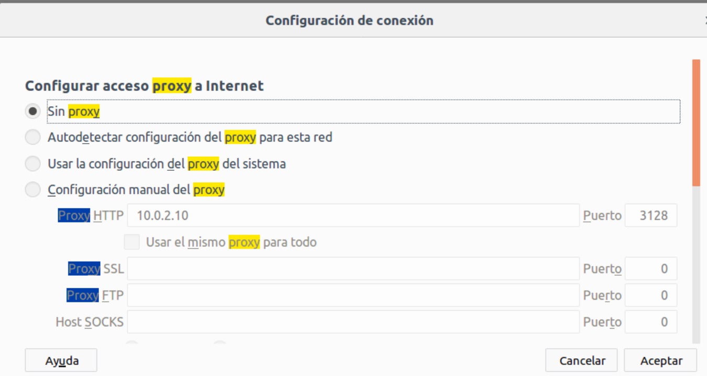{width="5.025640857392826in"
height="2.6824300087489066in"}

Reiniciamos el servidor: sudo systemctl restart apache2

Dominios y subdominios
----------------------

Cada uno de vosotros tendrá un subdominio creado que apuntará a vuestra
MV ubserver01. Deberéis acceder remotamente al servidor DNS y editarlo
para agregar vuestro subdominio. Yo os iré avisando por turnos.

-   El dominio de la clase será smx2.org.

-   Cada máquina tendrá un nombre de subdominio con vuestra inicial de
    nombre y el primer apellido. Por ejemplo: jalzamora.smx2.org.

-   Si todo va bien, con vuestro nombre de dominio particular se podrá
    acceder a vuestro servidor web.

Instalación
===========

Disponer de un servidor web en el centro nos permitirá alojar nuestras
propias páginas y aplicaciones web de forma que den servicio tanto desde
dentro de la intranet como desde Internet.

Instalar apache
---------------

Comprobar si apache está instalado

{width="5.905555555555556in"
height="0.6479166666666667in"}

Actualizamos la información de los paquetes para comprobar las últimas
versiones

{width="5.905555555555556in"
height="2.629166666666667in"}

Instalamos apache

{width="5.905555555555556in"
height="1.9986111111111111in"}

Podemos comprobar versión de apache que tenemos instalada

{width="3.1119991251093615in"
height="0.5607917760279965in"}

Instalamos opcionalmente paquete de documentación

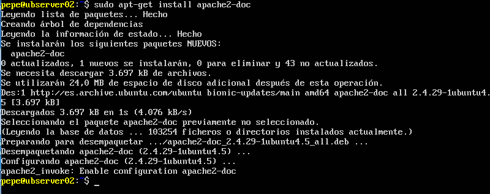{width="5.905555555555556in"
height="2.3402777777777777in"}

usuario www-data y el grupo www-data
------------------------------------

Por seguridad se recomienda no utilizar el usuario root como usuario
propietario del proceso apache2.

Hay que disponer de un usuario y grupo para ello. En Ubuntu se dispone
del usuario y grupo www-data.

-   cat /etc/passwrd <site>| grep www-data para comprobar la creación del
    usuario www-data

-   cat /etc/group <site>| grep www-data para comprobar la creación del grupo
    www-data

{width="5.905555555555556in"
height="0.6180555555555556in"}

Directorio contenedor de páginas
--------------------------------

Por defecto las páginas web se encuentran en /var/www/html/.

Cualquier carpeta y archivo dentro de esta carpeta será visible desde
fuera. Por ejemplo:

-   La carpeta /var/www/html/hola/quetal.html

-   Se vería accediendo a: http://localhost/ hola/quetal.html

{width="2.383999343832021in"
height="1.015566491688539in"}

Configuración
-------------

El servidor HTTP Apache se configura mediante archivos de texto simples.
Estos archivos pueden ubicarse en cualquiera de una variedad de lugares,
dependiendo de la forma exacta en que instaló el servidor.

El archivo de configuración predeterminado generalmente se llama
httpd.conf. Esto también puede variar en las distribuciones de terceros
del servidor.

La configuración se divide con frecuencia en varios archivos más
pequeños, para facilitar la administración. Estos archivos se cargan a
través de la directiva Include. Los nombres o ubicaciones de estos
subarchivos no son mágicos y pueden variar mucho de una instalación a
otra.

### Directorios de configuración de módulos

Mods disponibles

    /etc/apache2/mods-available/

{width="4.60799978127734in"
height="0.23462707786526685in"}

{width="5.103999343832021in"
height="2.348535651793526in"}

Mods habilitados

    /etc/apache2/mods-enable/

{width="5.905555555555556in"
height="4.072916666666667in"}

### Directorios de configuración de sitios virtuales

Sites available

{width="5.905555555555556in" height="0.90625in"}

Sites enabled

{width="5.905555555555556in"
height="0.7756944444444445in"}

### Directorio de configuraciones locales

    /etc/apache2/conf-available/

{width="5.905555555555556in"
height="1.3756944444444446in"}

    /etc/apache2/conf-enabled/

{width="5.905555555555556in"
height="1.5902777777777777in"}

    /etc/apache2/envars

{width="5.905555555555556in" height="4.05625in"}

Estado del servicio
-------------------

### Comprobación de que el servidor está INICIADO

Podemos comprobar listando los procesos en ejecución y filtrando con
pipes, que existen varios procesos Apache abiertos, síntoma de que está
en marcha el servidor.

{width="5.905555555555556in"
height="0.9152777777777777in"}

### Arrancar, parar y estado del servicio

Existen scripts en /etc/init.d/ que nos permiten arrancar, parar y
reiniciar el servicio apache2, entre otras cosas.

{width="5.905555555555556in"
height="3.011111111111111in"}

### Reiniciar y recargar servicio

Diferencia:

-   Restart: para e inicia el servicio

-   Reload: el servicio sigue funcionando y se vuelven a leer los
    archivos de configuración

{width="5.905555555555556in"
height="1.0222222222222221in"}

### Reinicio del servidor con apachectl

**Apachectl** es una interfaz para el servidor del Protocolo de
transferencia de hipertexto de Apache (HTTP). Está diseñado para ayudar
al administrador a controlar el funcionamiento del demonio httpd de
Apache.

El programa /usr/sbin/apache2ctl es el programa de línea de comandos
para manejar Apache en Ubuntu. La sintaxis del comando es bastante
sencilla. También se puede lograr la misma funcionalidad con el script
de inicio apache2. Por lo tanto, los tres comandos que hacen la misma
cosa son los siguientes:

```
sudo apache2ctl restart
sudo /etc/init.d/apache2 restart
sudo service apache2 restart
```

Parar servicio

{width="5.905555555555556in"
height="0.5840277777777778in"}

Arrancar servicio

{width="5.905555555555556in"
height="0.5458333333333333in"}

Puertos
=======

Comprobación de puertos
-----------------------

-   El protocolo HTTP tiene asociado el puerto 80 por defecto

-   Podemos comprobar con netstat que el servidor está escuchando
    peticiones en ese puerto

{width="5.905555555555556in"
height="1.4631944444444445in"}

Configuración de puertos
------------------------

El archivo **ports.conf** contiene la información necesaria para que
Apache2 escuche en direcciones IP y puertos específicos.

Cuando Apache2 se inicia comienza a esperar peticiones entrantes en
determinados puertos y direcciones de la máquina en la que se está
ejecutando.

Sin embargo, si se quiere limitar la escucha a:

-   Un determinado puerto (o varios)
-   En unas determinadas direcciones
-   En una combinación de ambos

Hay que especificarlo en los archivos de configuración

Utilización de puertos para crear hosts virtuales

Esto se puede, además, combinar con la posibilidad de usar hosts
virtuales, funcionalidad con la que un servidor Apache puede responder a
peticiones en diferentes direcciones IP, diferentes nombres de hosts y
diferentes puertos.

Consultar el fichero `/etc/apache2/ports.conf`

-   Comprobar que están habilitados los servidores virtuales por nombre
    en todas

-   las direcciones IP y en el puerto 80

### Directiva Listen

La directiva Listen indica al servidor que acepte peticiones entrantes
solamente en los puertos y en las combinaciones de puertos y direcciones
IP que se especifiquen.

Si sólo se especifica un número de puerto en la directiva Listen el
servidor escuchará en ese puerto, a través de todas las interfaces de
red de la máquina.

Si se especifica una dirección IP y un puerto, el servidor escuchará
solamente en la interfaz de red a la que pertenezca esa dirección IP y
solamente en el puerto indicado.

Se pueden usar varias directivas Listen para especificar varias
direcciones IP y puertos de escucha. El servidor responderá a las
peticiones de todas las direcciones y puertos que se incluyan.

Ejemplos

Por ejemplo, para hacer que el servidor acepte conexiones tanto en el
puerto 80 como en el puerto 8000, desde cualquier interfaz, se puede
usar:

```
Listen 80
Listen 8000
```

Para hacer que el servidor acepte conexiones en dos interfaces de red y
puertos específicos, usar

-   Listen 192.168.1.1:80
-   Listen 192.168.1.5:8000

{width="5.28in" height="2.335145450568679in"}

En este caso, Apache escuchará en todas las IP de sus adaptadores:

-   Abre el puerto 80
-   Si el módulo `ssl_module` está cargado, también abre el 443
-   Si el módulo `mod_gnutls.c` está cargado, también abre el 443

### Configuración de cortafuegos

Recordemos que Ubuntu Server trae firewall por defecto. Conviene tenerlo
en cuenta, puesto que nuestro servidor va a escuchar en un puerto
concreto, y tiene que poder atravesar el Firewall.

-   Al instalar algunos paquetes, se crean perfiles de aplicación con
    reglas predefinidas para el cortafuegos UFW.

-   Comprobamos que se crean 3 apps para Apache

{width="5.905555555555556in"
height="0.78125in"}Información de la configuración de app

{width="5.9006944444444445in"
height="1.0069444444444444in"}

Sitios web
==========

Configuración de sites
----------------------

Un mismo servidor puede alojar más de un sitio web diferente. Para cada
uno de ellos, podemos crear un site para, entre otras cosas:

-   Tener una configuración específica diferente para cada sitio web
-   Habilitar y deshabilitarlos de forma separada.

### Sites disponibles

En Apache podemos crear tantos sitios web como queramos. Todos los
sitios (sites) están definidos por archivos en la carpeta de sitios
disponibles. Podemos ver el archivo de configuración (**.conf**) de cada
site en la ruta /etc/apache2/sites-available/. Por defecto vienen dos
sites de ejemplo creados:

Mostrar carpeta de sitios disponibles

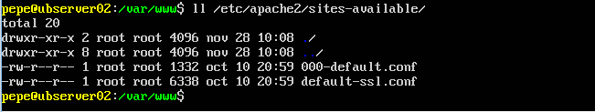{width="5.303999343832021in"
height="1.0016721347331583in"}

Estos sites que aparecen en esta carpeta están creados y disponibles,
pero no significa que se estén ejecutando. Para ello hay que hacer
algunos cambios. Como podemos comprobar, vienen 2 sites creados a modo
de ejemplo.

Ver el contenido del sitio por defecto

Abrimos el primer site y podemos ver la configuración del mismo.

{width="5.905555555555556in" height="4.35625in"}

### Sites habilitados

Para activar (habilitar) un site y que se pueda ver:

-   Se ejecuta el comando a2ensite mysite (donde el archivo se llama
    mysite.conf)

-   El sistema crea un enlace simbólico en el sistema de archivos en la
    carpeta de sitios habilitados (sites-enabled).

-   Los sites que aparezcan en esta carpeta estarán activados y son
    **visibles** a priori.

Podemos comprobar que en /etc/apache2/sites-enabled existe el fichero
**000-default.conf** y es un enlace simbólico al que se encuentra en
**sites-available**

{width="5.905555555555556in"
height="0.7729166666666667in"}

### Habilitar y deshabilitar sites

Para habilitar o deshabilitar un sitio alojado con Apache, puede usar
los comandos <site>'a2ensite<site>' y <site>'a2dissite<site>', respectivamente. Ambos
comandos usan esencialmente la misma sintaxis:

```
a2ensite <site>
a2dissite <site>
```

donde `<site>` es el nombre del archivo de configuración del host
virtual de su sitio, ubicado en `/etc/apache2/sites-available/`, menos la
extensión `.conf`.

### Crear nuestro propio site

Vamos a copiar el site de ejemplo y vamos a crear uno nuestro, que
llevará como nombre el nombre de nuestro subdominio.

{width="4.127999781277341in"
height="0.8845713035870516in"}

Lo vamos a modificar para que coincida con nuestra configuración.

{width="5.383999343832021in"
height="1.2934514435695539in"}

Necesitaremos crear la carpeta `/var/www/xxx.smx2.org/` y copiar dentro un
archivo HTML

### Habilitar el nuevo site

Deshabilitamos el site por defecto y recargamos

{width="5.905555555555556in"
height="1.3972222222222221in"}

Habilitamos el site nuevo que hemos creado:

{width="5.905555555555556in"
height="1.2583333333333333in"}

Accedemos desde un navegador para ver que funciona todo correctamente.

Comprobación de log

En el archivo de log veremos que la petición se ha guardado
correctamente dos peticiones. Una para el archivo html, y otra para
enviar la imagen que necesita el html para mostrarse correctamente.

Por otro lado, podemos ver los códigos de estado y la IP del ordenador
que ha hecho la solicitud

{width="5.84799978127734in"
height="0.7084711286089239in"}

Acceder desde el navegador al servidor
--------------------------------------

Comprobamos desde un navegador de un equipo que tenga acceso al servidor
que se abre la página por defecto. Esto lo podemos hacer de varias
formas:

Utilizando la interfaz de red local

Si ejecutamos el navegador en la misma máquina en la que está corriendo
el servidor podemos hacer lo siguiente:

```
<http://localhost>
<http://127.0.0.1>
```

Utilizando la IP del servidor

-   Si estamos en otra máquina diferente a la del servidor, cambiando la
    IP por la del servidor donde se encuentra instalado Apache

-   Si el servidor se encuentra tras una red NAT, deberemos
    redireccionar los puertos.

<!-- -->

-   **Ejemplo:** <http://172.6.254.1>

Utilizando un nombre de dominio

Si existe un servidor DNS o tenemos configurado el archivo de host
local. Si no existe ninguna de estas dos configuraciones, deberemos
conectar utilizando la IP

-   <http://smx2.org>

En cualquier caso, al principio y hasta que lo cambiemos, el navegador
nos mostrará la página que trae por defecto Apache, la cual podremos
cambiar posteriormente.

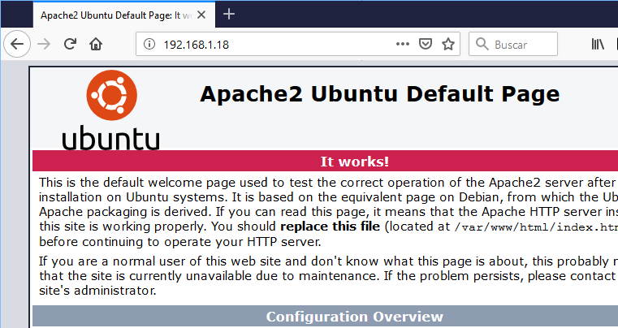{width="5.905555555555556in"
height="2.0159995625546805in"}

Configurar un hostname para el servidor
---------------------------------------

Editar `/etc/hostname` y `/etc/hosts` configurar el nombre FQDN del equipo.

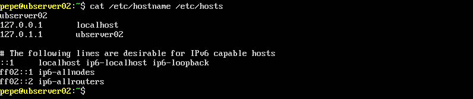{width="5.905555555555556in"
height="1.2465277777777777in"}

Crear estructura de páginas web
===============================

Comprobar archivo de índice
---------------------------

{width="4.975694444444445in"
height="0.5833333333333334in"}Acceder a /var/www/xxx.smx2.org/ y
comprobar de que existe index.html. Este es el archivo que se sirve por
defecto si no se especifica en el navegador ninguno.

Crear más archivos y carpetas
-----------------------------

A continuación, vamos a crear más archivos y directorios para hacer
pruebas.

Crear archivo red.html

Crear el fichero de texto /var/www/xxx.smx2.org/red.html

{width="5.905555555555556in"
height="1.7777777777777777in"}

Crear un nuevo directorio

Crear el directorio /var/www/xxx.smx2.org/datos/ y dentro colocar el
archivo datos1.html

Crear el archivo datos.html

{width="5.6in" height="2.0841961942257217in"}

Comprobar funcionamiento desde cliente 
---------------------------------------

Podemos comprobar si la web está funcionando correctamente desde un
cliente con interfaz gráfica, que disponga de un navegador. No importa
el SO del que se trate, siempre que tenga conexión con el servidor y se
pueda comunicar con el

### Acceder con IP

Podemos acceder a un servidor HTTP tanto a través de su IP como de su
nombre de dominio. En este primer caso, podemos visitar
http://172.168.254.1. Tendremos que poner en nuestro caso la IP del
servidor. Si está tras una red NAT, deberemos redireccionar los puertos.

### Acceder con nombre de dominio

También podemos comprobar que podemos navegar utilizando el nombre de
dominio del servidor: <http://smx2.org/red.html>

Para qué funcione, en algún sitio se tiene que resolver la IP
correspondiente al nombre de dominio. Lo podemos hacer en nuestra
máquina localmente, o a través de un servidor DNS.

Para esta opción, deberemos modificar el servidor DNS y agregar la
siguiente entrada:

```
www IN A 192.168.0.10
```

Esto no hace falta hacerlo porque ya está configurada la zona en el
servidor

Abrir páginas desde el shell
----------------------------

### Comprobar con el navegador las URLs

<http://localhost>
<http://172.6.254.1/red.html>
<http://smx2.org/datos/datos.html>

Si no disponemos de navegador, podemos
utilizar WGET. Wget es un paquete de software gratuito para recuperar
archivos usando HTTP, HTTPS, FTP y FTPS.

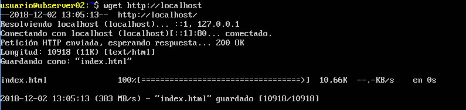{width="5.905555555555556in"
height="1.4041666666666666in"}

### Navegador en shell

Podemos también utilizar un navegador para shell, como Lynx, si queremos
ver de una manera aproximada como queda la página.

Secciones 
==========

Las directivas presentes en los ficheros de configuración pueden ser de
aplicación para todo el servidor, o puede que su aplicación se limite
solamente a determinados directorios, ficheros, hosts, o URLs.

Las secciones de configuración y los ficheros .htaccess para modificar
el ámbito de aplicación de las directivas de configuración.

Tipos de secciones
------------------

Existen **dos tipos básicos** de secciones de configuración.

-   Por un lado, la mayoría de las secciones de configuración **se
    evalúan para cada petición** que se recibe y se aplican las
    directivas que se incluyen en las distintas secciones solamente a
    las peticiones que se adecúan a determinadas características.

-   Por otro lado, las secciones de tipo <site><IfDefine<site>> e <site><IfModule<site>>, se
    evalúan **solamente al inicio o reinicio del servidor**.

Si al iniciar el servidor las condiciones son las adecuadas, las
directivas que incluyen estas secciones se aplicarán a todas las
peticiones que se reciban. Es caso contrario, esas directivas que
incluyen se ignoran completamente

Sección directory
-----------------

La sección directory engloba una o más directivas de configuración que
sólo se aplican al directorio y subdirectorios especificados.

Se especifica: `<Directory /path/a/directorio ></Directory>`

El argumento `/path/a/directorio` puede ser:

-   Un nombre de directorio (ruta absoluta)
-   Una expresión regular

Dentro de una sección podemos incluir tantas directivas como queramos.

### Ejemplo de configuración de directory

Este es un ejemplo de configuración, no hay que hacerlo. Las líneas
tomadas del archivo `/etc/apache2/apache2.conf`. Partes importantes:

-   `Options` especifica Indexes (mostrará el contenido de la carpeta si
    es necesario)

-   `AllowOverride` indica si se pueden sobrescribir las opciones de esta
    carpeta a través de un archivo externo (.htaccess). Lo veremos
    luego.

-   `Allow from all` nos indica que cualquiera puede acceder al contenido
    de esta carpeta desde el navegador.

```xml
<Directory "/usr/share/apache2/icons<site>"<site>>
Options Indexes MultiViews
AllowOverride None
Order allow,deny
Allow from all
</Directory<site>>
```

### Permitir solo acceso a directorio a una red concreta

Crear un directorio llamado clase en `/var/www/xxx.smx2.org/`. En este
directorio:

-   Denegar la entrada a todo el mundo
-   Permitir a los ordenadores de nuestra red.

Si hacemos esto, todos los equipos desde 172.16.254.1 hasta
172.16.254.255 podrán ver la carpeta. El testo, no. Para ello editamos
el archivo **apache2.conf**

{width="4.471999125109361in"
height="0.7920166229221347in"}

Si probamos a acceder desde el navegador desde un ordenador fuera de
esta red:

{width="2.83200021872266in"
height="1.1404888451443569in"}

### Permitir solo acceso a directorio a un equipo concreto

Puedo hacer que solo yo pueda ver esta carpeta desde un equipo en
concreto:

{width="2.903999343832021in"
height="0.8519630358705161in"}

En este caso, el equipo 192.168.1.2 será el único que tenga acceso a la
carpeta.

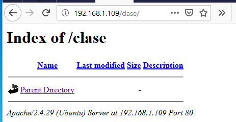{width="2.6718339895013123in"
height="1.327584208223972in"}

Sección files
-------------

Las directivas incluidas en una sección Files se aplican al archivo
especificado sin tener en cuenta en qué directorio se encuentra. Es
decir, la directiva Files limita el ámbito de aplicación de las
directivas que incluye según el nombre de los archivos.

### Denegar acceso a un archivo concreto

En el ejemplo siguiente las directivas de configuración, cuando se
colocan en la sección principal del archivo de configuración, deniegan
el acceso:

A cualquier archivo llamado **privado.html** de cualquier carpeta

{width="3.3919991251093613in"
height="0.6134470691163605in"}

Podéis crear varios archivos privado.html en diferentes carpetas y
comprobar que no podemos acceder a través del navegador a ninguno de
ellos.

### Utilización conjunta de directory y files

También se pueden utilizar de forma conjunta las secciones <site><Directory<site>>
y <site><Files<site>> para referirse a archivos que se encuentran en un
determinado lugar del sistema de archivos. Por ejemplo:

-   Denegará el acceso a `/var/www/xxx.smx2.org/clase/privado.html`

-   Cualquier otra aparición de privado.html que se encuentre en
    `/var/www/xxx.smx2.org/` o cualquiera de sus subdirectorios si que se
    mostrará.

{width="4.655999562554681in"
height="0.8801979440069991in"}

### Especificar un conjunto de archivos al que aplicará una configuración

El argumento de <site><Files<site>> puede ser un nombre de archivo, o una
expresión regular. Por ejemplo, para indicar que el argumento es
cualquier archivo con formato gif, jpg, jpeg o png utilizaríamos la
**siguiente** expresión regular:

    <Files <site>~ <site>"<site><site>.(gif<site>|jp?g<site>|png)<site>$<site>"<site>>

donde

-   <site>'?<site>' sustituye 0 o una ocurrencia de la expresión regular anterior
    (1 carácter)

-   <site>'<site>*<site>' equivale a cualquier secuencia de caracteres

-   <site>'<site>$<site>' indica final de línea

-   <site>'<site><site><site>' se utiliza para escapar el carácter <site>'.<site>'

Se puede utilizar la sección FilesMatch para trabajar con expresiones
regulares.

Sección location
----------------

La sección Location está relacionada con el espacio web y cambia la
configuración para el contenido del espacio web. Por ejemplo:

```xml
<Location /privado>
Order Allow,Deny
Deny from all
</Location>

Esta configuración evita que se acceda a cualquier URL que empiece por
`/privado`, utilizándose la palabra privado como expresión regular. Por
ejemplo, se aplicaría a peticiones que comiencen o contengan /privado en
su URL (<http://localhost/privado123>).

Sección ifmodule
----------------

La sección IfModule engloba directivas que se procesarán si el módulo
dado como argumento se compila con Apache2.

Esta sección solo se comprueba al iniciar el servidor

Una de las directivas permitidas en IfModule es UserDir.

```xml
<IfModule mod_userdir.c>
Userdir directorio
</IfModule>
```

En este caso, si el módulo **usedir** está activado, se aplica la
directiva de dentro. En cambio, si no está activado, se ignora.

Sección ifdefine
----------------

IfDefine engloba directivas que serán procesadas sólo si se cumple una
determinada condición (test) al iniciar el servidor.

```xml
<IfDefine <site>[!<site>]nombre<site>_parametro<site>>

</IfDefine<site>>
```

IfDefine se usa para marcar directivas que son condicionales.

Las directivas que hay dentro de una sección IfDefine se procesan sólo
si el test devuelve un resultado positivo.

Si el test produce un resultado negativo todo lo que haya entre los
marcadores de comienzo y final será ignorado.

El test puede ser:

-   nombre-parámetro: las directivas se procesan sólo si el parámetro
    llamado nombre-parámetro está definido.

-   !nombre-parámetro: hace lo contrario, y procesa las directivas sólo
    si nombre-parámetro no está definido.

Paso por parámetro

Podemos pasar parámetros por línea de comandos al ejecutar Apache, en
lugar de incluirlos en un archivo de configuración. De esta forma, sólo
se utilizarán esos parámetros cuando así se utilice en la llamada al
servicio. El argumento nombre-parámetro se define cuando se ejecuta
Apache2 por la línea de órdenes con la opción -Dparametro, al iniciar el
servidor.

Ejemplo: 

    apache2 -DReverseProxy <site>...

<site># en el archivo apache2.conf

Como hemos pasado el argumento `ReverseProxy`, en la sección `Ifdefine` lo
verá, y el servidor utilizará las directivas que hay dentro.

```xml
<site><IfDefine ReverseProxy<site>>
LoadModule rewrite<site>_module modules/mod<site>_rewrite.so
LoadModule proxy<site>_module modules/libproxy.so
<site></IfDefine<site>>
```

Indica que se cargan los módulos `mod_rewrite` y `libproxy`, ya que, en el
archivo de configuración existe la directiva IfDefine relativa al
parámetro `ReverseProxy` con el que se ha lanzado la ejecución de Apache
(-D).

Directivas
==========

Los archivos de configuración de apache2 se encuentran en la carpeta
`/etc/apache2`. El archivo principal de configuración es
`/etc/apache2/apache2.conf.` Antes de realizar cualquier cambio en este
archivo, es conveniente realizar una copia de seguridad del mismo ya que
si apache encuentra algún error en el archivo de configuración, no
arrancará.

Directivas

El servidor se configura colocando directivas de configuración en estos
archivos de configuración. Una directiva es una palabra clave seguida de
uno o más argumentos que establecen su valor.

Las directivas se pueden colocar en muchos sitios, generalmente se
responde al considerar dónde desea que una directiva sea efectiva.

-   Si se trata de una configuración global, debe aparecer en el archivo
    de configuración, fuera de cualquier <site><Directory<site>>, <site><Location<site>>,
    <site><VirtualHost<site>> u otra sección.

-   Si se aplica solo a un directorio en particular, debe ir dentro de
    una sección <site><Directory<site>> que se refiera a ese directorio, y así
    sucesivamente.

Directiva ServerRoot 
---------------------

La directiva ServerRoot es el directorio raíz donde se almacenan los
distintos ficheros que utiliza el servidor Apache salvo que se indiquen
rutas absolutas como se indicaba con anterioridad.

Podemos comprobar la directiva en `/etc/apache2/apache2.conf`

{width="4.895999562554681in"
height="1.6782502187226596in"}

Conexiones persistentes
-----------------------

KeepAlive indica si se permiten o no las conexiones persistentes, es
decir más de una petición por conexión. Puede tomar los valores On u
Off. El valor predeterminado es On.

{width="4.703999343832021in"
height="2.115250437445319in"}

Ficheros a servir por defecto (Directory Index)
===============================================

Comprobar página por defecto
----------------------------

Acceder a http://IPdelServidor y mirar qué página se está sirviendo por
defecto. Podemos utilizar el comando wget para descargar un contenido
web a través de HTTP

{width="5.905555555555556in"
height="1.3611111111111112in"}

Renombrar fichero de índice
---------------------------

Renombrar el fichero index.html a indice.html

{width="5.905555555555556in"
height="0.17430555555555555in"}

Acceder a http://IPdelServidor. Como no se encuentra index.html, muestra
una lista con el contenido del directorio.

{width="3.855999562554681in"
height="2.2580850831146106in"}

Cambiar directiva DirectoryIndex
--------------------------------

Podemos configurar un índice de directorio para llamar a varios archivos
usando el siguiente texto:

Ejemplo: 

    DirectoryIndex index.html index.cgi index.php

Las líneas anteriores le indican al servidor web Apache que:

1.  muestre el archivo <site>'index.html<site>' como el índice de directorio.
2.  Si este archivo no está disponible, entonces muestre <site>'index.cgi<site>'
3.  Si no está disponible, entonces muestre <site>'index.php<site>'.

Si no está disponible uno de los archivos especificados, el servidor web
Apache volverá a su configuración predeterminada, ya sea mostrando un
mensaje de error, un mensaje de lista de directorios no disponible o
mostrando las listas de directorios de archivos y directorios

Editar `/etc/apache2/sites-available/xxx.smx2.org.conf` e incluir la
directiva `DirectoryIndex` para que muestre como índice el archivo
índice.html

{width="4.903999343832021in"
height="2.3009120734908137in"}

Reiniciamos el servidor: `sudo systemctl restart apache2`

Accediendo a la página web en <http://IPdelServidor/>, aplicando la
directiva **DirectoryIndex**, podemos hacer que se muestra la página
**red.html.**

Opciones sobre directorios
==========================

Editar /etc/apache2/sites-available/xxx.smx2.org.conf y modificar la
siguiente sección directory, para hacer que el archivo a servir por
defecto sea red.html

Aquí debajo cambiar /var/www/ por /var/www/xxx.smx2.org/

{width="3.135513998250219in"
height="0.8720002187226596in"}

Tal como indica la sección, a no ser que otra diga lo contrario, todas
las carpetas que cuelgan de /var/www/xxx.smx2.org

-   Van a buscar un archivo red.html para servirlo como página por
    defecto (DirectoryIndex)

<!-- -->

-   De no encontrarlo, mostrarán el contenido del directorio (Options
    Indexes)

Comprobación

Cuando accedamos a <http://IPdelServidor> sin especificar ningún
archivo, se nos mostrará el documento **red.html**.

Al acceder a la carpeta datos, <http://IPdelServidor/datos/>, al no
existir ningún documento dentro llamado **red.html**, muestra el
contenido del directorio.

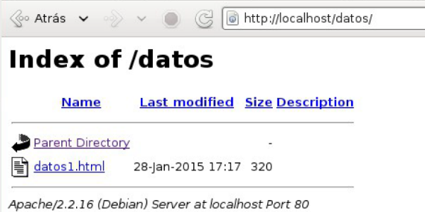{width="3.0833333333333335in"
height="1.2762981189851268in"}

Configurar la carpeta DATOS para mostrar index.html y no listar contenido de la carpeta
---------------------------------------------------------------------------------------

Imaginemos que no queremos que para la carpeta datos se aplique la
configuración de `/var/www`. Deberíamos crear una nueva sección Directory
para `/var/www/datos`. Todo lo que pongamos aquí, afectará ahora a la
carpeta datos y todas sus subcarpetas. Si alguna directiva no la
ponemos, aplicará las opciones de la carpeta padre (/var/www)

{width="2.863999343832021in"
height="0.9288462379702537in"}

**En este caso:**

1.  Hemos definido que el archivo por defecto en esta carpeta será
    index.html. Por lo tanto, este es el archivo que se servirá cuando
    accedamos a <http://IPdelServidor/datos/>

2.  En la directiva Options ya no aparece Indexes. Por lo que cuando el
    servidor no encuentre los ficheros definidos en DirectoryIndex, no
    listará el contenido del directorio.

Reiniciamos el servidor: sudo systemctl restart apache2

**Comprobaciones**

Acceder a <http://IPdelServidor/> muestra el archivo red.html.

Acceder a <http://IPdelServidor/datos>**/** Al no existir el fichero
red.html en /var/www/datos y no se permite el listado del directorio, el
servidor retorna el código 403 Forbbiden. Nos muestra un mensaje de
prohibido porque la carpeta datos SI existe, pero no nos la quiere
enseñar.

Acceder a
[http://IPdelServidor/datos**/meloinvento.html**](http://IPdelServidor/datos/meloinvento.html)**.**En
este caso lo que pasa es que no existe la página que pedimos, nos dará
un mensaje de NOT FOUND

Logs (ErrorLog, CustomLog, LogFormat)
=====================================

Se nos plantea la cuestión ¿y qué hacer cuando algo no funciona? En
primer lugar, se debe consultar el registro de errores o logs: es
posible que el problema pueda deducirse de un mensaje de error.

Los logs son archivos que guardan los datos de todos los acontecimientos
que tienen que ver con un programa en concreto, anotando el momento en
que ocurrió cada acción.

Consultar logs
--------------

Por defecto Apache crea sus propios logs, pese a que se pueden crear
otros que sean más convenientes. Por defecto el archivo de registro de
errores se encuentra en `/var/log/apache2/error.log`.

Se recomienda mostrar los archivos de registro en una consola mientras
se accede al servidor para ver cómo reacciona éste en cada momento. Con
este fin, ejecute en una consola el siguiente comando como root.

Ejecutar la orden:

    tail -f /var/log/apache2/<site>*.log

Mientras mantengamos abierto el shell, se irán mostrando por pantalla
solo las nuevas líneas que se añadan al log a partir del momento en que
ejecutemos el comando, hasta que decidamos cancelarlo.

Consultar en internet
---------------------

Otra opción que tenemos, partiendo de la información recogida en los
logs, es la de consultar en diferentes sitios en Internet en los que
podemos encontrar soluciones o recomendaciones, como por ejemplo:

-   Consultar la base de datos de fallos en la página web
    <http://httpd.apache.org/bug_report.html.>

-   Consultar en las listas de correo y los foros de noticias.

-   La lista de correo para los usuarios de Apache:
    <http://httpd.apache.org/userslist.html.>

-   Los foros de noticias, se recomienda
    [comp.infosystems.www.servers.unix](https://groups.google.com/forum/#!forum/comp.infosystems.www.servers.unix).

Conocer donde se guardan los archivos de log
--------------------------------------------

El lugar donde se guardan los archivos de log está configurado dentro
del fichero `/etc/apache2/sites-available/xxx.smx2.org.conf`

{width="5.905555555555556in"
height="1.1659722222222222in"}

En general, los ficheros de log se encuentran por defecto en
/var/log/apache2/ (la localización habitual). <site>$(APACHE<site>_LOG<site>_DIR) hace
referencia a esta carpeta.

{width="5.905555555555556in"
height="1.2666666666666666in"}

Consulta del fichero log de errores
-----------------------------------

Los archivos de log de apache tienen líneas muy largas y conviene
visualizarlos con la pantalla completa. Podemos utilizar `grep` para
hilar más fino y filtrar los logs, o bien utilizar `more` y `less`
para navegar por el resultado.

El log de errores general se suele llamar error.log

{width="5.905555555555556in"
height="0.9256944444444445in"}

Consulta del fichero log de accesos
-----------------------------------

En este archivo se guardan los accesos que se han realizado al servidor
junto con las peticiones y respuestas.

El log de accesos se suele llamar `accesos.log`

{width="5.72967738407699in"
height="0.6783617672790901in"}

Como podemos ver en este caso, las últimas solicitudes han sido
peticiones GET a la URL `/privado/`. Al no tener permiso, el servidor nos
ha contestado con un "Error HTTP **401** No autorizado"

Códigos de error (ErrorDocument)
================================

En el caso que suceda un error porque el documento solicitado no existe,
se nos mostrará un aviso en el navegador ligado al error HTTP 404.

Configurar directiva ErrorDocument
----------------------------------

### Configurar mensaje 

Podemos configurar el servidor virtual por defecto cambiando la
directiva ErrorDocument para que presente un texto de aviso.

Para ello se debe modificar
/etc/apache2/sites-available/xxx.smx2.org.conf para que cuando retorne
el código de error 404 (página no encontrada) envíe el texto "Página no
encontrada en el servidor de la red".

{width="5.905555555555556in" height="0.76in"}

Reiniciamos el servidor: 

    sudo systemctl restart apache2

Podemos comprobar que funciona accediendo a una página cualquiera
inexistente, por ejemplo <http://IPdelServidor/noesta.html>. Así podemos
forzar un error *not found 404* que desencadene la configuración que
hemos hecho.

Nos debería mostrar el mensaje personalizado para el error.

{width="5.905555555555556in"
height="0.7520002187226597in"}

### Crear archivo para error no encontrado

En lugar de una frase, quedaría mejor mostrar un documento HTML cada vez
que no se encuentre un archivo. Para ello, podemos configurar el
servidor virtual por defecto cambiando la directiva ErrorDocument para
que presente una página de aviso en un archivo html que tengamos en el
servidor.

Crear fichero personalizado

- Crearemos el archivo en `/var/www/xxx.smx2.org/no_encontrada.html`
- Escribiremos su contenido en lenguaje HTML

{width="5.207999781277341in"
height="1.4453062117235345in"}

Modificar archivo de configuración del site

Deberemos de modificar el archivo de configuración
/etc/apache2/sites-available/xxx.smx2.org.conf para que cuando retorne
el código de error 404 (página no encontrada) presente el contenido del
archivo /var/www/no_encontrada.html

{width="5.905555555555556in"
height="0.8208333333333333in"}

Reiniciamos el servidor: sudo systemctl restart apache2

Probar que se muestra el archivo creado

Podemos acceder a una página que no exista, como
<http://IPdelServidor/noesta.html> y comprobar que se muestra el archivo
creado para este fin.

{width="5.905555555555556in"
height="1.2948720472440944in"}

Directorios virtuales
=====================

Directorios Virtuales (Directiva Alias)
---------------------------------------

Podemos hacer que se pueda acceder a otras carpetas fuera de la carpeta
/var/www utilizando alias. Estos alias, redirigirán una ruta de la URL a
una carpeta concreta en el servidor.

-   Por defecto, <http://IPdelServidor/wiki> lleva a la carpeta
    /var/www/wiki.

-   También podríamos alojar nuestros documentos en otra carpeta, como
    por ejemplo /home/alumno/wiki, y podríamos conseguir, por ejemplo,
    que <http://IPdelServidor/wiki/> redirigiera las peticiones a esta
    carpeta.

Para poder conseguir esto, una de las estrategias posibles es la de
utilizar alias. Viene a ser un acceso directo que nos lleva de una
carpeta a otra.

### Iniciar sesión como usuario alumno y crear directorio  {#iniciar-sesión-como-usuario-alumno-y-crear-directorio .ListParagraph}

Pasos

-   Crear una cuenta llamada `alumno` e iniciar sesión con este
    usuario
-   Crear la carpeta `/home/alumno/wiki`
-   Dentro crear una página `wiki1.html` que contenga <site>"PÁGINA WIKI
    1<site>"

{width="5.905555555555556in"
height="0.26319444444444445in"}

Documento /home/alumno/wiki/wiki1.html

{width="5.905555555555556in"
height="1.5027777777777778in"}

### Iniciar sesión como administrador y crear el Alias /wiki {#iniciar-sesión-como-administrador-y-crear-el-alias-wiki .ListParagraph}

Gracias al alias, cuando visitemos
[http://IPdelServidor/wiki](http://xxx.smx2.org/wiki), nos redirigirá al
contenido de la carpeta /home/alumno/wiki.

{width="3.504348206474191in"
height="1.1405653980752406in"}

Además, deberemos buscar y cambiar en la sección directory / (raíz) de
apache2.conf para que ponga require from all. Sino no funcionará

Reiniciamos el servidor: 

    sudo systemctl restart apache2

### Acceder a la página wiki {#acceder-a-la-página-wiki .ListParagraph}

[http://IPdelServidor/wiki](http://xxx.smx2.org/wiki)

Nos daremos cuenta de que aparece el listado del directorio
/home/alumno/wiki ya que la directiva **DirectoryIndex** está en
**index.html** y al no existir el archivo index.html, siguiendo la
directiva Indexes lista el directorio.

{width="3.9239905949256344in"
height="1.9439993438320209in"}

Directorios Virtuales (usando enlaces simbólicos)
-------------------------------------------------

Un **enlace simbólico** es un tipo de archivo especial que contiene una
ruta a otro archivo. De esta forma, cuando accedemos a un enlace
simbólico desde un editor de texto u otro programa, lo redirige al
archivo indicado por la ruta del enlace.

Sintaxis:

-   **Para crearlo:**

    ln -s <site><destination file or directory<site>> <site><name of the symlink<site>>

-   **Para borrarlo:** 

    rm <site><name of the symlink<site>>

Nota: Al borrar el enlace simbólico no se borra el archivo destino

Pasos a realizar:

1.  Iniciar sesión como usuario alumno.
2.  Crear directorio `/home/alumno/blog/`
3.  Dentro crear el archivo blog1.html con el texto <site>"PÁGINA BLOG 1<site>"

{width="5.905555555555556in"
height="0.29930555555555555in"}

4.  Iniciar sesión como administrador

5.  Si no tenemos a **alumno** como *sudoer*, desde una cuenta que lo
    permita

    a.  Ejecutar sudo adduser alumno sudo

6.  Crear el enlace simbólico `/var/www/blog` que apunte a
    `/home/alumno/blog`

    b.  Ejecutar `sudo ln -s /home/alumno/blog /var/www/blog`

7.  A continuación, podemos ver el enlace creado

{width="5.0175448381452314in"
height="0.8195395888013999in"}

Modificar /etc/apache2/sites-available/xxx.smx2.org.conf y configurar el
sitio para el directorio /home/alumno/blog

{width="4.7894739720035in"
height="1.0188331146106737in"}

Opción followsymlinks

Verificar que está definida la opción FollowSymLinks en la configuración
del directorio `/var/www`

{width="4.930435258092738in"
height="0.8337215660542432in"}

Reiniciamos el servidor: sudo systemctl restart apache2

Acceder a <http://IPdelServidor/blog>

Módulos
=======

Apache es un servidor **modular**. Esto implica que en el servidor
básico se incluyen únicamente las **funcionalidades** **más**
**básicas**. Otras funcionalidades se encuentran disponibles a través de
módulos que pueden ser cargados por Apache.

Por defecto, durante la compilación se incluye en el servidor un juego
de módulos base.

-   Si el servidor se compila para usar **carga dinámica** de módulos,
    entonces los módulos pueden ser compilados por separado, e incluidos
    en cualquier momento usando la directiva LoadModule.

-   En caso contrario, Apache deberá ser recompilado para agregar o
    eliminar módulos.

Las directivas de configuración se pueden incluir de forma condicional
dependiendo de la presencia de un módulo particular, poniéndolas dentro
de un bloque <site><IfModule<site>> como veremos más adelante

Instalación y carga de módulos
------------------------------

### Comprobar los módulos que se han cargado estáticamente

Iniciar sesión como Administrador y comprobar los módulos estáticos que
se han cargado

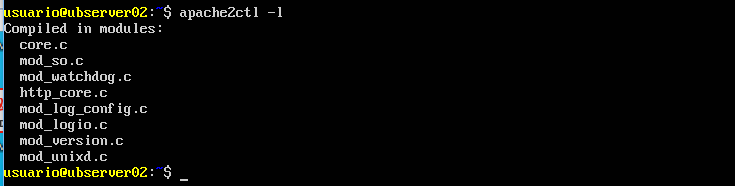{width="5.8863243657042865in"
height="1.4944444444444445in"}

### Comprobar los módulos que se han cargado dinámicamente 

Los módulos dinámicos cargados se comprueban consultando el directorio
`/etc/apache2/mods-enabled`, que son enlaces simbólicos a ficheros de
`/etc/apache2/mods-available`.

### Carpetas de módulos {#carpetas-de-módulos .ListParagraph}

`mods-available`: Este directorio contiene una serie de archivos .load
y .conf.

-   Los archivos. load contienen directivas de configuración de Apache
    necesarias para la carga del módulo en cuestión.

-   El correspondiente archivo .conf contiene directivas de
    configuración necesarias para la utilización del módulo en cuestión.

`mods-enabled`: para activar un módulo para Apache2 es necesario crear
un enlace simbólico en este directorio a los

### Módulos activados por defecto

Por defecto la instalación de Apache2 deja <site>'activados<site>' un grupo de
módulos.

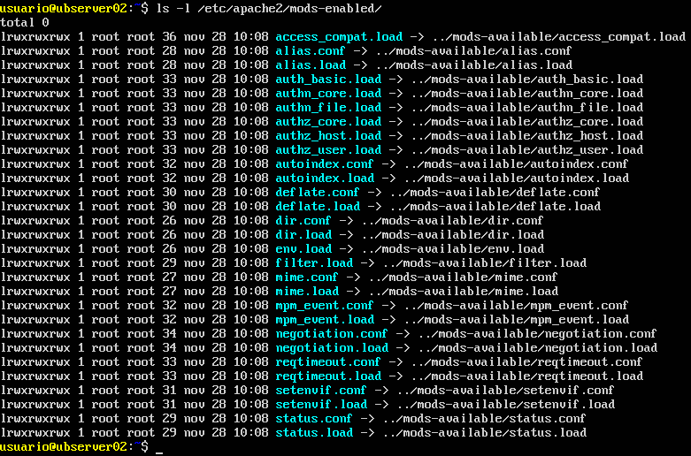{width="5.905555555555556in"
height="3.902083333333333in"}

### Directiva LoadModule

Editar un archivo. load. Observar cómo se utiliza la directiva
LoadModule

{width="5.905555555555556in"
height="0.4284722222222222in"}

### Archivos de configuración de módulos

Editar un fichero .conf y observar cómo se añaden directivas dentro de
una declaración <site><IfModule nombre modulo<site>><site>...<site></IfModule<site>> que se
ejecutarán si se carga el módulo

{width="5.905555555555556in"
height="3.001388888888889in"}

Este es el módulo gracias al cual hemos podido crear alias en ejercicios
anteriores.

### Consultar los módulos disponibles

Consultar el directorio /usr/lib/apache2/modules para ver los módulos
disponibles para cargar. Estos módulos están instalados, pero no tienen
por qué estar habilitados.

{width="5.905555555555556in"
height="1.6847222222222222in"}

No son los únicos mods disponibles, puesto que se pueden descargar e
instalar muchos más a través del gestor de paquetes (apt).

### Listar mods para Apache

Comando para mostrar los paquetes disponibles en los repositorios para
cargar módulos adicionales en Apache.

Apt-cache search libapache2-mod

{width="5.905456036745407in"
height="1.2260564304461943in"}

Mod USEDIR
----------

### Directorios personales de usuarios (módulo userdir)

El objetivo de esta actividad es configurar en nuestro Web Server para
que pueda ofrecer un espacio web para usuarios de nuestro sistema y que
estos puedan tener un espacio web.

Cada uno de estos usuarios disfrutará de un espacio web que se
almacenará en la carpeta /public<site>_html, dentro de su carpeta home
(/home/nombreusuario/public<site>_html)

Para que Apache procese los espacios web de los usuarios es necesario
activar el módulo **userdir**

### Comprobar que el módulo no está habilitado

Lo podemos hacer consultando el directorio /etc/apache2/mods-enabled que
el módulo userdir no está habilitado.

En esta carpeta nunca tocaremos nada, puesto que todo lo que hay en ella
lo crea automáticamente Apache.

{width="5.905555555555556in"
height="1.8830413385826772in"}

### Habilitar el módulo ejecutando el comando: a2enmod userdir

Para habilitar o deshabilitar cualquier módulo de los que dispone Apache
debemos utilizar los comandos:

-   **a2enmod** para habilitar un módulo que nos interese
-   **a2dismod** para deshabilitar el módulo.

Los módulos disponibles se encuentran en el directorio
/etc/apache2/mods-available

{width="5.905555555555556in"
height="0.3611111111111111in"}

Vamos a buscarlo

{width="5.905555555555556in"
height="0.5027777777777778in"}

Y lo instalamos: 

    sudo apt install libapache2-mod-ldap-usedir

{width="5.905555555555556in"
height="2.2472222222222222in"}

Vemos que me los ha creado:

{width="5.905555555555556in"
height="0.49583333333333335in"}

Lo cargamos

{width="5.905555555555556in"
height="0.6423611111111112in"}

### Verificar que se ha cargado el módulo

Verificar dentro del directorio /etc/apache2/mods-enabled que se han
creado enlaces simbólicos del módulo userdir (ficheros .conf y. load)
hacia /etc/apache2/mods-available

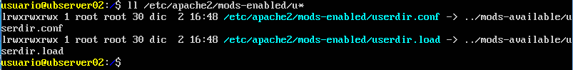{width="5.905555555555556in"
height="0.7208333333333333in"}

Reiniciamos el servidor: 

    sudo systemctl restart apache2

### Consultar fichero de configuración de userdir

Consultar el fichero /etc/apache2/mod<site>_enabled/userdir.conf

{width="5.905555555555556in" height="1.575in"}

### Crear directorio personal

Iniciar sesión como usuario y crear el directorio
`/home/pepe/public_html`

Por defecto la carpeta `public_html` no está creada en ninguna carpeta
home de ningún usuario. Por lo que debemos crear y asignar los permisos
necesarios.

### Asignar permisos a la carpeta

Es necesario asignar permisos 755 para que el grupo de usuarios y el
resto de usuarios tengan acceso de lectura y puedan visualizar las
páginas allí almacenadas.

Para cambiar permisos: 

    chmod -R 755 /home/pepe/public<site>_html

Dentro crear el archivo personal1.html con el texto <site>"PÁGINA PERSONAL
DEL USUARIO ALUMNO<site>"

Acceder a
[http://IPdelServidor/<site>~pepe/personal1.html](http://xxx.smx2.org/~pepe/personal1.html)

Modulo modsecurity
------------------

Opcional por si queréis investigar qué es y cómo funciona. Si vais mal
de tiempo, ignorarlo.

Instalar el mod y configurar:

```
sudo apt-get install libapache2-mod-security2
sudo apachectl -M | grep --color security2
sudo mv /etc/modsecurity/modsecurity.conf-recommended modsecurity.conf
sudo service apache2 reload
```

Control de acceso
=================

Control de acceso por IP y nombre de dominio
--------------------------------------------

1.  Iniciar sesión como administrador
2.  Crear el directorio /var/www/xxx.smx2.org/privado
3.  Crear dentro la página privado1.html con el texto <site>"PÁGINA PRIVADA<site>"

Editar /etc/apache2/sites-available/xxx.smx2.org.conf y utilizar la
sentencia <site><Directory<site>> para denegar el acceso al directorio a todos los
equipos excepto al local y a la MV Ubuntu Desktop

Reiniciamos el servidor: sudo systemctl restart apache2

Comprobar el acceso a
[http://IPdelServdor/privado](http://xxx.smx2.org/privado) desde varias
ubicaciones

Autenticación HTTP Basic
------------------------

### Comprobar módulo auth<site>_basic habilitado

Miramos en `/etc/apache2/mods-enabled`, que el módulo **auth<site>_basic** está
habilitado

{width="5.905555555555556in"
height="2.144000437445319in"}

### Usar autenticación básica en Apache

Crear el fichero `/etc/apache2/passwd `y añadir el usuario mortadelo.

Ejecutando el comando `htpasswd -c mortadelo`. La opción -c creará el
fichero.

{width="5.905555555555556in"
height="0.8173611111111111in"}

Fichero passwd creado en `/etc/apache2`

{width="5.905555555555556in"
height="2.3569444444444443in"}

**Añadir el usuario filemon**

Ejecutando el comando htpasswd. La opción c ya no es necesaria para
añadir nuevos usuarios al fichero passwd

{width="5.905555555555556in"
height="1.0993055555555555in"}

**Permitir accesos a mortadelo y filemon**

-   Editar `/etc/apache2/sites-available/xxx.smx2.org.conf`

-   Permitir el acceso al directorio `/var/www/privado` a los usuarios
    mortadelo y filemon

{width="5.905555555555556in"
height="1.6381944444444445in"}

Reiniciamos el servidor: sudo systemctl restart apache2

**Comprobación de los cambios realizados**

Accediendo a la página web, veremos que no nos dejará acceder a ella, y
nos pedirá un usuario y contraseña válidos para dejarnos continuar.

{width="4.792173009623797in"
height="2.72799978127734in"}

**Acceso con usuario no autorizado **

Conectando a
[**http://IPdelServidor/privado/**](http://IPdelServidor/privado/)

En caso de que los datos proporcionados no sean correctos, nos mostrará
una captura indicando que el acceso no ha sido autorizado.

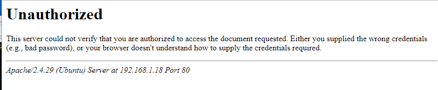{width="5.905555555555556in"
height="1.2236111111111112in"}

Habilitar uso de .htaccess
--------------------------

Los ficheros `.htaccess` (o <site>"ficheros de configuración distribuida<site>")
facilitan una forma de realizar cambios en la configuración en contexto
directorio.

Se trata de un archivo, que contiene una o más directivas, se coloca en
un directorio, y estas directivas aplican a ese directorio y todos sus
subdirectorios.

Generalmente, los ficheros `.htaccess` usan la misma sintaxis que los
ficheros de la configuración principal. Lo que puede utilizar en estos
ficheros lo determina la directiva AllowOverride. Esta directiva
específica, en categorías, qué directivas tendrán efecto si se
encuentran en un fichero `.htaccess`.

Generalmente, solo se debería usar ficheros `.htaccess` cuando no tiene
acceso al fichero principal de configuración del servidor.

-   Como administrador, editar el fichero
    `/etc/apache2/sites-available/xxx.smx2.org.conf`

-   Habilitar el uso de ficheros `.htaccess`

**AllowOverride** va a permitir que se puedan sobrescribir parámetros
desde un archivo externo

{width="5.905555555555556in"
height="0.7340277777777777in"}

Reiniciamos el servidor: sudo systemctl restart apache2

**Crear un archivo .htaccess**

-   Iniciar sesión como usuario alumno
-   Crear el fichero `/home/alumno/wiki/.htaccess`

Configuración mediante .htaccess

Pasos:

-   Crear el fichero `/home/alumno/wiki/.htpassw` y añadir al usuario wiki
-   Editar el fichero /home/alumno/wiki/.htaccess y añadir las
    directivas para realizar autenticación básica

Acceder a [http://IPdelServdor/wiki](http://xxx.smx2.org/wiki)

Configurar un site seguro con https
===================================

Configurar servidor HTTPS
-------------------------

**mod<site>_ssl** es un módulo opcional para el servidor HTTP Apache.
Proporciona criptografía para el servidor a través de los protocolos
criptográficos Secure Sockets Layer) y Transport Layer Security.

### Habilitar mod<site>_ssl

{width="5.905555555555556in"
height="1.5391305774278214in"}

Reiniciamos el servidor: 

    sudo systemctl restart apache2

### Comprobar carga del módulo

{width="5.905555555555556in" height="1.2in"}

### Ver contenido de port.conf

En este caso, al estar habilitado el módulo SSL<site>_module, el servidor
abrirá, además del puerto 80, el puerto 443.

-   Las peticiones HTTP llegarán por defecto por el puerto 80
-   Las peticiones HTTPS llegarán por defecto por el puerto 443

{width="5.0879997812773405in"
height="1.9474879702537182in"}

### Comprobar puertos con netstat

{width="4.751999125109362in"
height="0.9890682414698163in"}

### Comprobar puertos con nmap

Nmap es un programa de código abierto que sirve para efectuar rastreo de
puertos. Instalar si no lo está: 

    sudo apt install nmap

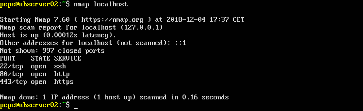{width="5.905555555555556in"
height="1.8076388888888888in"}

Con la opción -A podéis averiguar mucha más información:

{width="5.793556430446194in"
height="5.560416666666667in"}

Para más información y comandos de nmap:
<https://hackertarget.com/nmap-cheatsheet-a-quick-reference-guide/>

### Habilitar servidor virtual por defecto para SSL

Comprobamos que existe un site por defecto para SSL, pero no está
habilitado. Se llama default-ssl

{width="5.905555555555556in"
height="1.46875in"}

Habilitamos y comprobamos que se carga el site.

{width="5.905555555555556in"
height="1.5348337707786526in"}

Comprobar si puedo cargar la página web por HTTPS

{width="5.905555555555556in"
height="1.2347222222222223in"}

Comprobaremos que no podemos descargar la página

El servidor apache utiliza por defecto un **certificado digital auto
firmado** creado al instalar apache. Un certificado auto firmado no está
firmado por una autoridad de certificación (3a parte de confianza) y por
tanto no existen mecanismos automáticos que garanticen su autenticidad.
Por eso los navegadores pedirán confirmación cuando el servidor se lo
envíe.

**Conectar al site SSL sin comprobar certificado**

{width="5.905555555555556in"
height="1.8434787839020121in"}

Crear un servidor virtual https
-------------------------------

Creo la carpeta "seguro" y dentro la página index.html que lo
identifique.

    sudo mkdir /var/www/seguro
    sudo nano /var/www/seguro/index.html

### Crear un certificado digital

Creo un certificado digital auto firmado usado openssl. Para ello:

-   Me voy al directorio home del usuario
-   Creo una clave privada RSA (en este caso de 2048 bits)

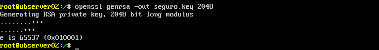{width="5.905555555555556in"
height="0.7930555555555555in"}

Una vez generada la clave privada, puedo generar una solicitud de
certificado csr (relleno los datos)

{width="5.905555555555556in"
height="2.6493055555555554in"}

Esta solicitud de certificado creada, la podría enviar a una autoridad
de certificación para generase el certificado crt. En este caso lo
firmamos nosotros, es decir creamos un certificado auto firmado usando
la clave privada. {width="5.905555555555556in"
height="0.75in"}

Lo siguiente que haremos es mover la clave y el certificado creados a
los directorios que utiliza por defecto apache y configurar los permisos
adecuados (se habrán creado en el directorio en el que estuviéramos al
ejecutar los comandos anteriores).

{width="5.905555555555556in"
height="0.8076388888888889in"}

Cat seguro.key seguro.crt <site>> nombre-sitio.pem

Copy nombre-sitio.pem /etc/ssl/private/

### Crear un nuevo site seguro

Creo el archivo de configuración seguro (hago una copia del default-ssl
con el nombre seguro)

{width="5.905555555555556in"
height="0.5541666666666667in"}

Configuración del nuevo site

Modificar la configuración del site **seguro.** Dado que lleva la
sección ifmodule delante, este site no se cargará si el módulo SSL no
está cargado, pese a que si aparezca en sites-enabled.

{width="5.905555555555556in"
height="2.73043416447944in"}

Agregar las directivas dentro de virtualhost:

    SSLEngine on
    SSLCertificateFile /etc/ssl/private/nombre-sitio.pem

Hay que comentar la opción SSLCertificateKeyFile

Dentro de la carpeta html debe aparecer la siguiente configuración:

<site><Directory /var/www/html<site>>

SSLRequireSSL

<site>...

<site></Directory<site>>

Por defecto tenemos activado el site HTTPS que viene por defecto con
apache, por lo que deberemos deshabilitarlo y habilitar el site nuevo:

Deshabilito el servidor virtual SSL que venía por defecto (default-ssl): 
    
    a2dissite default-ssl

Habilitamos el site que hemos creado (seguro): 

    a2ensite seguro

####  Conexión al servidor HTTPS desde el navegador

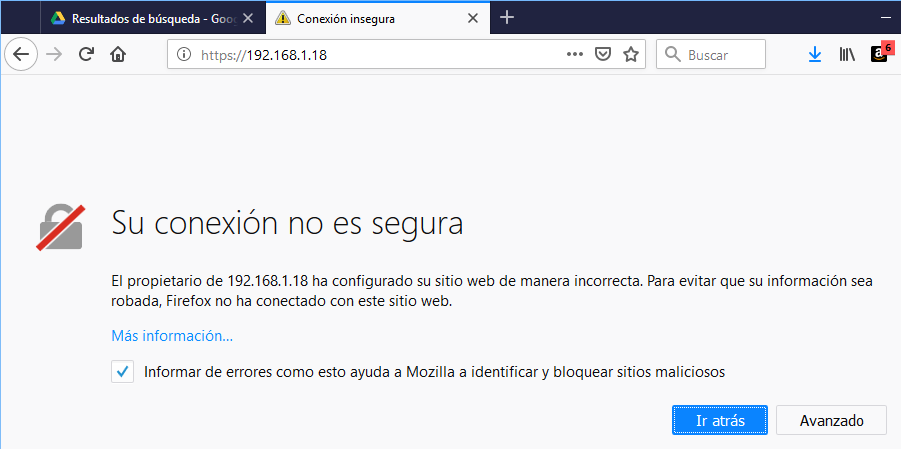{width="5.21599956255468in"
height="2.5994127296587926in"}

Como el certificado es autofirmado nos saltará un aviso, y podremos
comprobar el certificado antes de darle validez

{width="4.5759995625546805in"
height="2.661979440069991in"}

Consultar certificado en el cliente

{width="4.0879997812773405in"
height="2.879271653543307in"}

Una vez aceptado el certificado, podemos acceder a la página

{width="5.905555555555556in"
height="0.6956528871391076in"}
