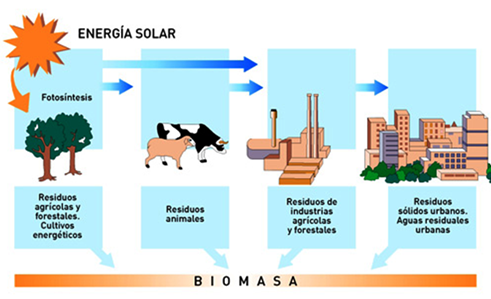
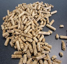
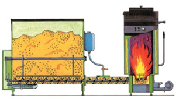

# BIOMASA

Es el conjunto de materia orgánica de origen animal o vegetal procedente de la transformación de los restos de seres vivos. Las plantas captan la energía solar y la transforman en energía química de la biomasa  (fotosíntesis) que utilizan para sus funciones vitales y crecimiento. Esta energía almacenada se libera por combustión.

Se puede conseguir:

- Por cultivos agrícolas, de rápido crecimiento y alto contenido energético (Ej. Maíz, cardos, remolacha y cereales)
- Aprovechando residuos

Los residuos pueden ser:

- Domésticos (papel, cartón, restos de alimentos y aguas residuales)
- Agrícolas (paja, malas hierbas) 
- Ganaderos (excrementos de animales), 
- Forestales (ramas, hojas, etc.)
- De la industria alimentaria (orujo de la oliva y  uva, cáscara de almendra, restos de frutas, etc.) 
 

La biomasa fresca ocupa granes volúmenes (gran contenido en agua), por lo que  antes de ser utilizados debe someterse a procesos de secado y compactación que faciliten el trasporte, almacenamiento y manipulación Ej. pellets

 
La biomasa se puede quemar directamente para obtener energía (biomasa energética), o se puede transformar en biocombustibles (biodiésel, bioetanol y biogás). Actualmente la obtención de biogás es la principal aplicación.
 

## Biocombustibles

Los biocombustibles se obtienen de la transformación de ciertos productos vegetales.
Obtención

1.	De cultivos oleaginosos (colza, girasol o soja) , se obtienen aceites vegetales que se transforman en biodiésel para motores y turbinas. Pueden usarse solo en motores diésel preparados o en cualquier motor normal, mezclado con el diésel clásico. Suponen una drástica reducción  de las emisiones de CO2 y SOx y partículas en suspensión, aunque aumentan las emisiones de NOx y los motores son más difíciles de arrancar en frío y la potencia del motor disminuye.
2.	De cultivos ricos en almidón, como cereales, caña de azúcar o remolacha, por fermentación se obtiene bioetanol. Puede utilizarse directamente en motores sin rectificar, pero son más difíciles de arrancar en frío y su rendimiento es menor que la gasolina
3.	La biomasa húmeda (restos orgánicos de cualquier tipo) (>60 % agua) se convierte biológicamente en biogás, por fermentación, proceso realizado por bacterias en condiciones anaerobias.

### Ventajas

Los biocombustibles son menos contaminantes que los combustibles fósiles ya que se supone que compensan el CO2 que genera su combustión con el CO2 consumido previamente por la planta de la cual se obtiene. 

### Desventajas

Su obtención requiere grandes extensiones de terreno agrícola, gran consumo de agua, fertilizantes y otros químicos. Esto está provocando la disminución de terrenos para cultivos alimentarios y la destrucción de hábitats naturales.

Además se desvían gran parte de la producción agrícola a la fabricación de biocombustibles, con lo que los precios de los alimentos implicados aumentan debido a su escasez. 

Una solución sería obtener los biocombustibles de cultivos no alimentarios, o aún mejor, de la parte no comestible de los cultivos alimentarios, con lo que en el mismo terreno y con el mismo consumo de agua, etc., se obtendrían los dos productos que no entrarían en competición.
