# ENERGÍA EÓLICA

Es una forma de energía cinética producida por el viento. El viento se origina por efecto de las diferencias de insolación entre distintas zonas del planeta. 
Se puede utilizar: 

- Directamente (barcos de vela, molinos de viento para moler)

- Transformada en electricidad, mediante aerogeneradores. 

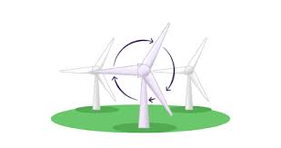

## Molinos antiguos

Antes de la invención de la electricidad los molinos de viento se utilizaban para extraer agua de los pozos, o bien para moler el trigo para hacer harina. En Mallorca todavía se conservan muchos de estos molinos, aunque la mayoría de ellos ya no están operativos.

## Molinos de extracción de agua

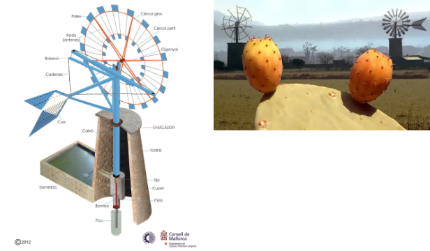

## Molinos harineros

Un molino impulsado por un burro (entrada de energía de 300 W) producía 10-25 kg/h de harina.

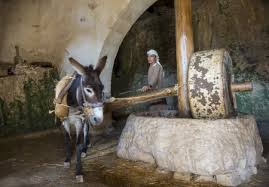

Las piedras de molino equipadas de una pequeña noria (1,5 kW) molían 80-100 kg/h. 

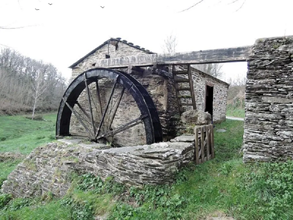

La harina se utilizaba para hornear pan, suministrando como mínimo la mitad de toda la energía alimentaria consumida (el pan solía representar más del 70% de la misma). 
En 10 h un molino producía harina para 2.500-3.000 personas, es decir, una ciudad medieval de tamaño considerable. 

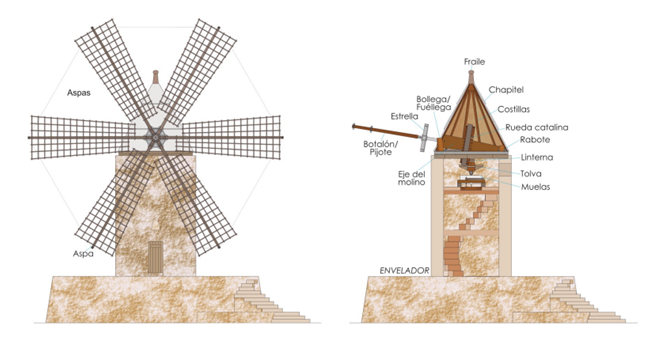

Son aparatos que disponen de unas palas que giran gracias al viento, y en su interior un generador transforma la energía mecánica del viento en energía eléctrica, que es transferida a la red de distribución. Por sus características, España es uno de los países de Europa donde el uso de la energía eólica está más extendido.
Ventajas e inconvenientes de la energía eólica

## Ventajas

- Es inagotable
- Aerogeneradores son de Bajo coste de instalación y mantenimiento 
- Se consigue un alto rendimiento 
- Reduce la dependencia energética de los combustibles fósiles

## Inconvenientes

- Es intermitente, aleatoria y difícil de almacenar. 
- Los aerogeneradores son un peligro para las aves. 
- Los parques eólicos ocupan grandes extensiones y producen impacto paisajístico y ruido. 
- Genera interferencias con radares, TV y radio.

## Aerogeneradores

Componentes más relevantes de un aerogenerador

- Torre: Soporte sobre el que se realiza el montaje de todo el sistema. Lo mantiene a una determinada altura de tierra Sobre los 5m los generadores de 850 W y hasta 50 m los generadores superiores a 600 kW.
- Rotor: Parte móvil de la máquina que gira por la acción del viento Transforma la energía eólica en energía mecánica.
- Palas: Son los elementos encargados de captar la energía del viento. Suelen estar fabricadas de vidrio y poliéster. + diámetro de las palas, + potencia suministrada por la máquina.
- Generador eléctrico: Transforma la energía mecánica, obtenida en el eje del rotor, en electricidad.
- La góndola: Situada sobre la torre. Es el elemento estructural, y está formado por el bastidor y el armazón. El bastidor es la pieza sobre la que se ensamblan los elementos mecánicos principales.

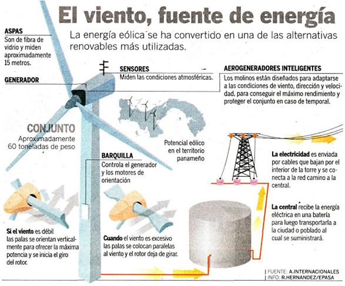

Aquí podemos ver en detalle el interior de un aerogenerador.

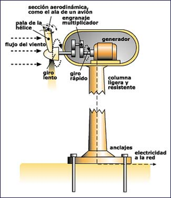

## Instalaciones eólicas

### Instalaciones aisladas

No conectadas a la red eléctrica. Se utilizan para aplicaciones tales como electrificaciones rurales, aplicaciones agrícolas, señalización, repetidores de comunicaciones, bombeo de agua, etc.

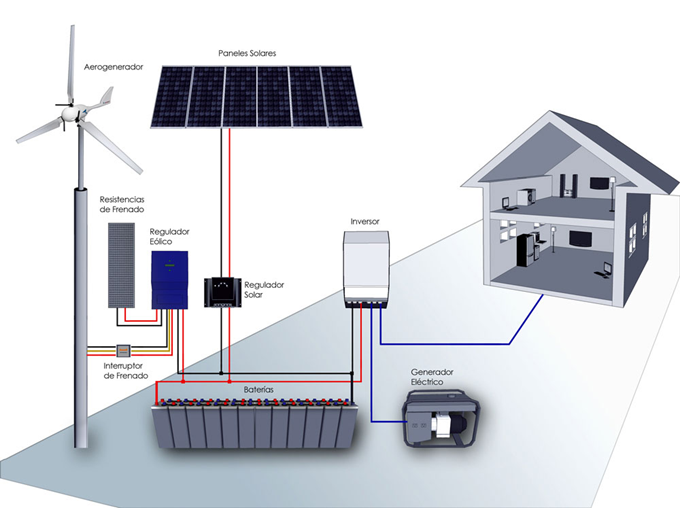

Utilizan, en la mayoría de los casos aerogeneradores de pequeña potencia.  Tienen que disponer de un sistema de acumulación (baterías) para asegurar el suministro eléctrico

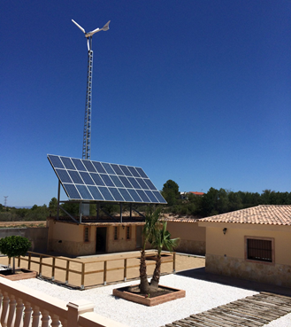

### Parques eólicos

Conjunto de aerogeneradores que producen energía eléctrica de forma conjunta trabajando en paralelo. Los aerogeneradores suelen ser iguales y de elevadas potencias.

Parques eólicos que generan importantes cantidades de energía eléctrica, con potencias superiores a 1 MW, también reciben el nombre de centrales eólicas. 
Para poder instalar un parque eólico es necesario un emplazamiento donde sople el viento con determinadas características: Velocidad (superior a 6 m/s), la continuidad y la estabilidad.

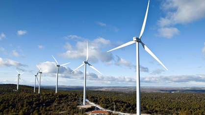

Energía eólica marina
La energía eólica es más fuerte en el océano que en tierra, de ahí el desarrollo de la energía eólica marina en los últimos años. 

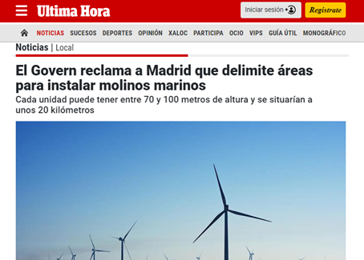

Hasta hace poco tiempo, al basarse en estructuras fijas, no podían instalarse en lugares de fondos marinos muy profundos o complejos, algo que ha cambiado con la aparición de las estructuras flotantes. Sobre estas plataformas ya se pueden instalar aerogeneradores, que se anclan al fondo marino mediante anclajes flexibles, cadenas o cables de acero.

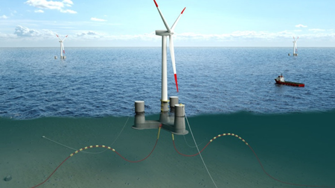

### Vídeos

- ¿Cómo funciona un aerogenerador?  | Sostenibilidad - ACCIONA
- SUBIMOS num GERADOR EÓLICO #Boravê
- ¿Sabías que la harina es inflamable al volatilizarse?
- ¿Qué pasa si combinas HARINA con FUEGO?
