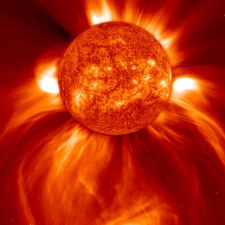
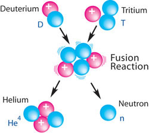
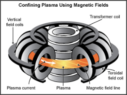

# Fusión nuclear

Consiste en reproducir, a pequeña escala, lo que ocurre en el **Sol**: La fusión de dos núcleos ligeros par formas otro más pesado. El proceso libera una gran cantidad de energía y no genera contaminantes. 

De todas las reacciones posibles, se han seleccionado los elementos que no producen residuos radiactivos y son abundantes en la naturaleza : el deuterio y el tritio

Para producirse, los núcleos deben aproximarse mucho entre sí y eso sólo es posible a enormes temperaturas, como ocurre en el Sol (10 millones de ºC). 

A estas temperaturas la materia se encuentra en estado de **plasma**: núcleos desnudos, de carga positiva  (los electrones se han separado) que se repelen entre sí.

No existe ningún material capaz de contener el plasma, por lo que sólo se puede mantener por confinamiento magnético o inercial:

- **Confinamiento magnético:** consiste en una estructura toroidal que permite la circulación del plasma hasta alcanzar la temperatura de reacción.
- **Confinamiento inercial:** Esfera de reactivos sometida a potentes láseres que la hacen reaccionar (implosión)

Una micro-cápsula empleada como combustible en el confinamiento inercial de fusión (a menudo denominada "microballón") que se rellena con una mezcla de gas deuterio y tritio en helio. La cápsula es introducida en el hohlraum y es implosionada por el pulso de láser.

## Ventajas

- Ausencia de residuos radiactivos 
- Se necesitan cantidades minúsculas de deuterio y tritio, por lo que hay reservas para miles de años

## Desventajas

- El tritio es radiactivo, pero su vida media es de 12 años )para evitar su almacenamiento, en algunos reactores se genera el momento de su uso)
- Los materiales de construcción de los reactores absorben gran número de los neutrones liberados en la reacción y pueden transformarse en radiactivos

## Fusión fría

Se llama fusión fría a cualquier reacción nuclear de fusión que puede ser producida a temperaturas y presiones cercanas a las normales, utilizando un equipamiento de muy bajo costo y casi nulo consumo eléctrico en su producción. Hasta ahora, es solo una ilusión, ya que parece totalmente imposible.
