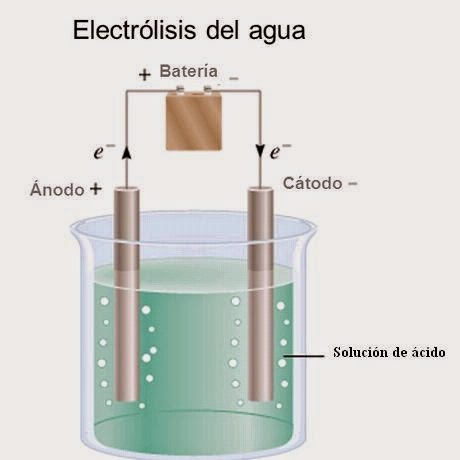
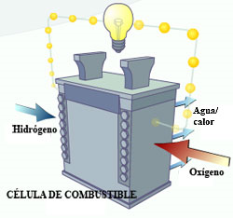
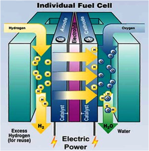

# Hidrógeno

La reacción de formación de agua a partir del hidrógeno produce gran cantidad de energía, por lo que podría utilizarse el hidrógeno como combustible:

```
H2 + ½ O2 = H2O (g) + Energía
```

## Características

- El hidrógeno es muy abundante (75% Universo), pero en la Tierra se encuentra combinado formando agua y otras moléculas.
- Debido a su abundancia se considera un combustible eterno y también muy eficiente, ya que produce el **triple de energía calorífica que el petróleo**. 
- Su combustión no produce residuos, solo agua. 

## Obtención del hidrógeno

El hidrógeno se puede obtener por la **hidrólisis** del agua, mediante una corriente continua, pero generar esta corriente requiere energía. 



El problema es que se gasta más energía en descomponer el agua y producir hidrógeno de la se extrae luego en la combustión y no rentable cuando esta energía viene de combustibles fósiles.

Solo seria rentable si la energía procede del Sol, bien mediante células fotovoltaicas o por fotolisis del agua (proceso aun en investigación) u otra energía renovable


En la actualidad la mitad del hidrógeno utilizado se extrae del gas natural, tras hacerlo reaccionar con vapor de agua en un convertidor catalítico. El proceso libera CO2

```
La ventaja que presenta es que permite utilizar toda la infraestructura actual del gas natural
```

## Pilas de combustible

Otra forma de utilización del H2 es en la pilas de combustible. Son una especie de **baterías** que no se gastan porque convierten en electricidad la energía química del combustible, el H2,  que entra en ellas junto con el O2 (aire). 

- En el cátodo (polo-) se produce la ruptura del H2 en H+ y electrones. 
- Los electrones son conducidos al ánodo produciendo una corriente eléctrica. 
- Los H+ atraviesan la pila y reaccionan con el O2 liberando agua




