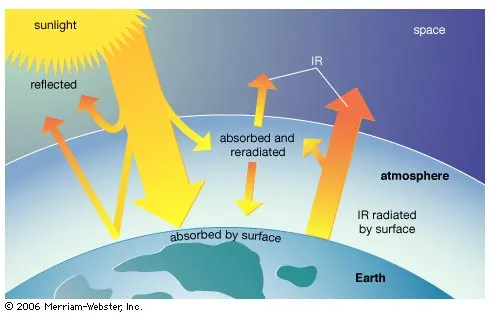
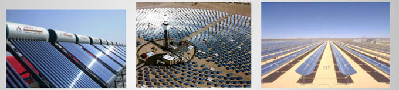
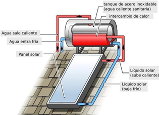
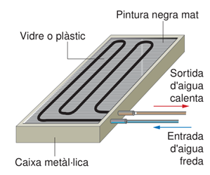
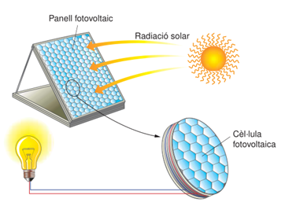
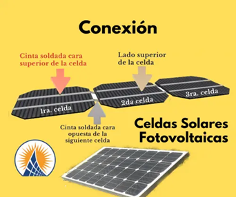
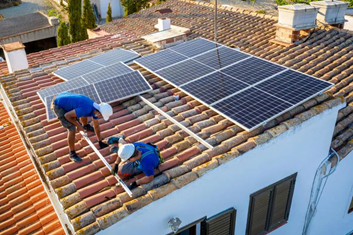
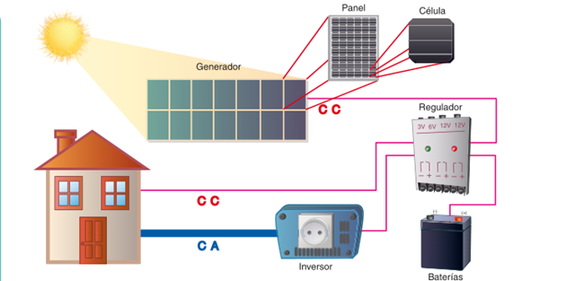

# ENERGÍA SOLAR

Llega del Sol en forma de radiaciones electromagnéticas. España, por su elevado número de horas de Sol al año, tiene un gran potencial de aprovechamiento de esta energía. 

 
Se puede aprovechar de formas diferentes: la solar térmica y la fotovoltaica

- La energía solar térmica consiste en utilizar la energía solar para calentar un fluido, generalmente agua. El proceso tiene lugar en aparatos denominados colectores. La energía obtenida se utiliza fundamentalmente para obtener agua caliente y calefacción. En el caso de los hornos solares, se obtienen altas temperaturas que se utilizan también para generar energía eléctrica.

 
- La energía solar fotovoltaica permite la transformación directa de la energía solar en energía eléctrica, mediante unos dispositivos especiales fabricados con silicio (células fotovoltaicas). Esta energía se puede utilizar directamente para consumo doméstico o bien transferirla a la red de distribución

## Energía solar térmica

Se utiliza, principalmente, para la producción de agua caliente sanitaria (duchas, cocinas, etc.) y para la calefacción de viviendas y piscinas. 

Una instalación solar térmica consiste, básicamente, en:

-	Un captador solar (también llamado panel solar) que capta la radiación solar
- Un depósito acumulador que almacena la energía térmica obtenida
- Unos elementos auxiliares (tuberías, bombas, válvulas, etc.) que se encargan de la distribución del calor hasta los sitios de consumo.

 
El captador solar térmico plano de cubierta acristalada es uno de los tipos más populares y utilizados. Los elementos que lo forman son: cubierta transparente, tubos de circulación, superficie absorbente y material aislante.

 
Su funcionamiento se basa en el efecto invernadero: la radiación solar que atraviesa la cubierta transparente y captada por la superficie absorbente, y es transmitida en forma de calor en el fluido que circula.

El vidrio o plástico de la cubierta impiden que la radiación salga al exterior, lo que provoca el aumento de la temperatura en el interior de la caja

## Energía solar fotovoltaica

Consiste en transformar directamente la radiación luminosa del Sol en energía eléctrica. Para llevar a cabo esta conversión se realizan servir unas células solares o fotovoltaicas. 

 
Las células fotovoltaicas son el principal componente de una instalación solar fotovoltaica y están constituidas por una lámina de material semiconductor, normalmente de silicio, que tiene la propiedad de producir electricidad cuando incide la luz. Este fenómeno se conoce con el nombre de efecto fotovoltaico.
Una célula individual normal tiene una superficie de 75 cm2 y una potencia aproximada de 1 W para una radiación de 1000 W/m2. Suele suministrar una tensión de 0,5 V y una corriente continua de unos 2 A. 
Para obtener potencias superiores, se unen un determinado número de células, formando un plano fotovoltaico. Uniendo entre 24 y 48 células, podemos producir corriente continua de 12 o 24 V
 

 

Además de las células fotovoltaicas, forman parte de una instalación solar fotovoltaica, como componentes habituales, los siguientes elementos:

-	Batería o acumulador. Se utiliza en instalaciones autónomas no conectadas a la red eléctrica para almacenar energía eléctrica.
- Inversor. Tiene la función de transformar la corriente continua generada por la instalación solar fotovoltaica en corriente alterna, para así poder utilizar aparatos de consumo más habituales, de 220 V en corriente alterna, o bien para poder entregar la energía a la red eléctrica.
- Regulador de carga. En instalaciones autónomas, tiene la función de proteger a los acumuladores contra la sobrecarga y la descarga excesiva.
 

