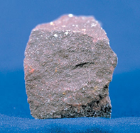
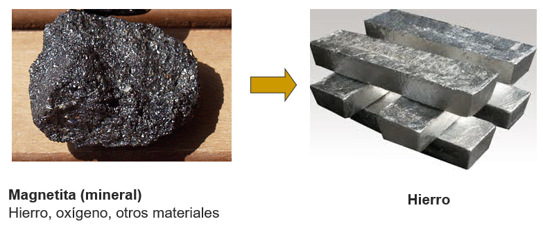
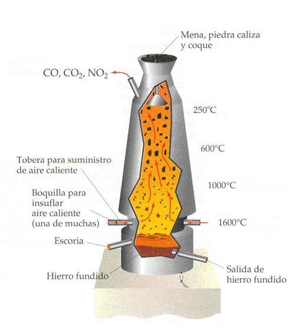
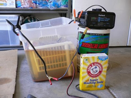
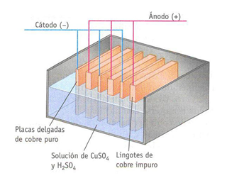

La mayoría de metales deben extraerse 
de los minerales que los contienen. 

Una vez obtenidos estos en la naturaleza, se pueden utilizan dos procesos para extraer el metal:
En el horno a altas temperaturas:
Por electrolisis; mediante una corriente eléctrica

## Forn a altes temperatures:

Els minerals es trituren i s'introdueixen en el forn altes temperatures on es fon el metall
Es recull el metall fos

## Electròlisi

Mitjançant un corrent elèctric s'introdueix mineral en un recipient amb líquid conductor. Es fa circular un corrent elèctric a través del líquid. S'incrementa la temperatura, provocant que el metall es foni. A continuació, es recull el metall fos.

Un cop el metall s'ha desprès de l'mineral per fusió, es conforma el metall (se li dóna la forma) per diferents processos:

- Fosa: S'aboca el metall fos en un motlle i es deixa refredar.
- Laminat: El metall fos passa per uns rodets, formant làmines.