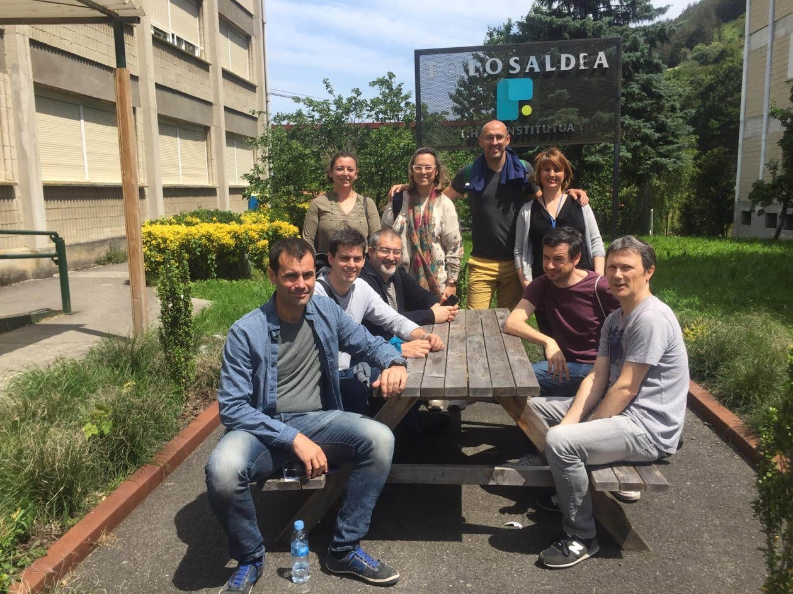
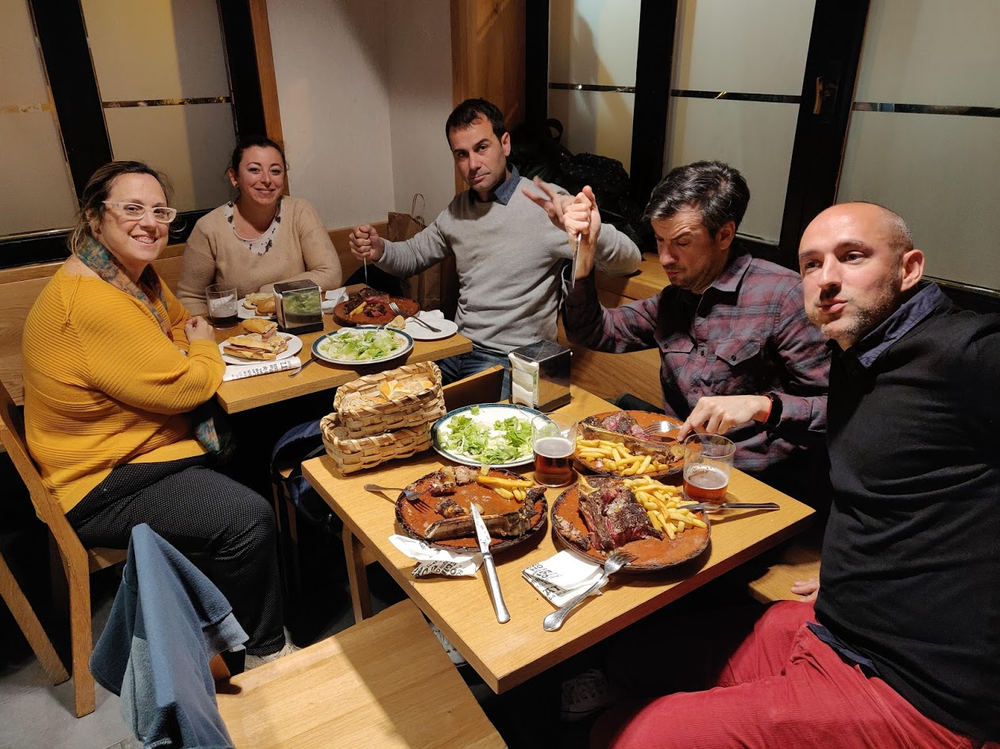
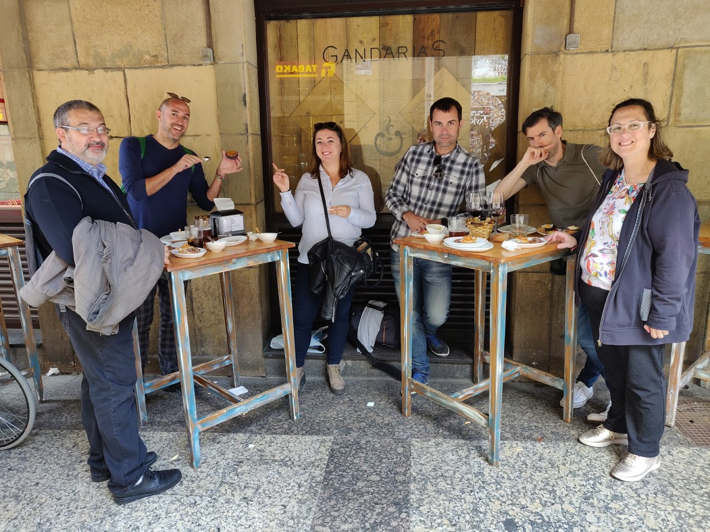
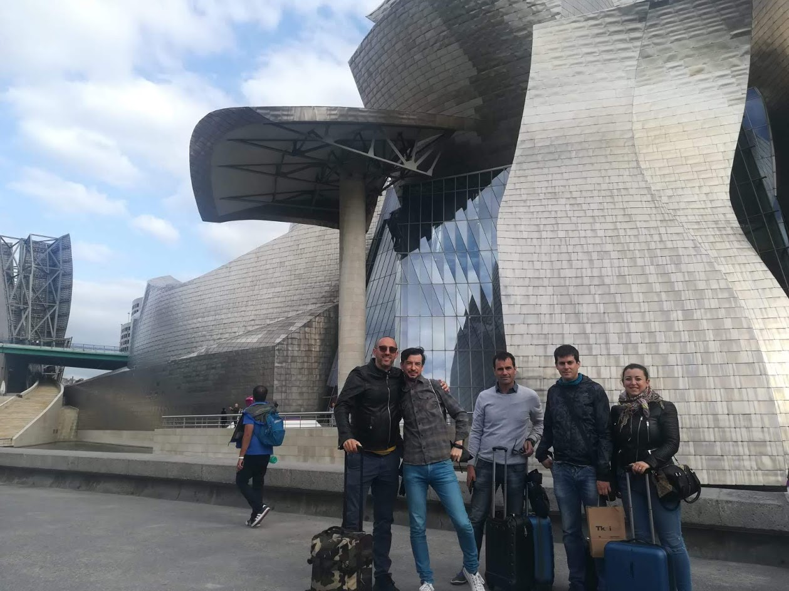

Viaje San Sebastián

- [3 de junio](#3-de-junio)
- [4 de junio](#4-de-junio)
  - [Visita Tolosaldea](#visita-tolosaldea)
  - [Vuelta a San Sebastián](#vuelta-a-san-sebasti%C3%A1n)
  - [Cena](#cena)
- [5 de junio](#5-de-junio)
  - [Congreso](#congreso)
  - [monte urgull](#monte-urgull)
  - [Cena en arrak](#cena-en-arrak)
- [6 de junio](#6-de-junio)
  - [Congreso](#congreso-1)
  - [Comida](#comida)
  - [Cena](#cena-1)
- [7 de junio: vuelta a palma](#7-de-junio-vuelta-a-palma)
  - [Vista a tknika](#vista-a-tknika)
  - [Comida y taxi de vuelta](#comida-y-taxi-de-vuelta)
  - [Bilbao](#bilbao)
  - [Avion](#avion)

# 3 de junio

- Cogemos la furgoneta en Avis 
- Nos vamos hasta el hotel Olarraín de San Sebastián.

# 4 de junio

## Visita Tolosaldea

- Vamos con el coche hasta el centro Tolosaldea
- Nos hacen una visita a las diferentes instalaciones que tienen para formación profesional.

## Vuelta a San Sebastián

- Tras el incidente del coche nos hemos vuelto a San Sebastián unos cuantos y otros se han ido al aeropuerto de Bilbao.
- Los de San Sebastián hemos ido a caminar por la ciudad y a la estación de autobuses donde llegaban los que habían ido a Bilbao.

## Cena

- Cenamos en un bar de pinchos muy céntrico.
- Después de cenar hay gente que ha querido volver al hotel directamente y tres de nosotros hemos preferido ir a tomar unos txacolí a una tasca que había en el casco antiguo llamado `Ganbara` http://www.ganbarajatetxea.com
- Después de tomar algo hemos contado el hotel caminando por el lado del mar

# 5 de junio

## Congreso

- A las 8:45 hemos cogido un taxi del hotel que nos ha llevado al `Kursaal` para asistir al Congreso. Unos 15 euros porque también había atasco.
- Sobre las 11 se ha hecho una pausa para café han puesto cruasanes pastas y café.
- Después del café hemos visto una ponencia sobre cocina 4.0 y nos hemos ido.

## monte urgull

- Hemos subido al monte urgull caminando 
- Hemos visitado la exposición que hay arriba y hemos subido a para ver las vistas luego
- Hemos vuelto caminando por otro lado de la montaña que lleva hasta el puerto y el principio de la plaza de la concha.
- Finalmente hemos caminado toda la playa en dirección al hotel.
- Algunos se han ido al hotel y otros hemos visitado el `peine del viento`, que se encuentra al final de la playa.

## Cena en arrak

- Para cenar hemos ido al `restaurante Arrak`
- Está en la zona de el hotel tiene parte de bar y parte del restaurante 
- Hemos estado en la parte del restaurante se puede comer un chuletón con patatas fritas y ensalada por unos 15 € con un par de cañas salido unos 20 
- Los bocatas también eran muy grandes y muy buenos por unos 6 €
- Finalmente hemos vuelto caminando al hotel

# 6 de junio

## Congreso

- Por la mañana hemos cogido un autobús cerca del hotel para ir al kursaal.
- Hemos cogido la línea 5 y nos ha costado 1 o 75 € el billete.
- Luego hemos estado en el Congreso hasta las 11 y poco de la mañana que ha habido pausa para café.
- Sobre las 12 hemos ido a hacer unas compras por la parte vieja y a las 12 hemos quedado en la plaza de la Constitución.

## Comida

- Comemos en  `restaurante gandarias` de pinchos en una de las barras de fuera.
- Hemos pedido unos cuántos pinchos calientes y fríos y unos txakolis y nos ha salido sobre unos 25 o 30 € en función de lo que quieras comer
- Después hemos ido a un restaurante que hay cercano que tiene especialidad un postre que es tarta de queso vienen dos porciones grandes de tarta de queso y cuesta 5 € y está bien para compartir
- De allí hemos ido directamente hacia la costa y hemos hecho todo el paseo de La Concha hasta el final.
- Al final algunos hemos visitado el peine de los vientos ahí nos hemos quedado un rato hablando hasta que hemos decidido de ir otra vez al hotel

## Cena

- A las 6 hemos vuelto a quedar para subir al `monte Igueldo` seguramente subiremos con el funicular (2,2 euros) 
- Yo bajo corriendo pero los demás bajan a pie. Hay unos 2-3 km hasta abajo del funicular
- Vamos a tomar algo al `bar campus`, que tenemos frente al hotel.
- Cenamos allí de hamburguesas y bocatas.

# 7 de junio: vuelta a palma

## Vista a tknika

- Cogemos un taxi que nos lleva a `Tknika` por unos 35 euros desde el hotel Olarrain.
- Hacemos una visita a las diferentes instalaciones que tienen, y nos van explicando en cada zona los proyectos que tienen en marcha.

## Comida y taxi de vuelta

- Comemos cerca de `Tknika` un menú por 11 euros muy bueno, en el `restaurante Zamalbide` (en Errenteria). Vamos caminando por el arcén desde Tknika.
- Al terminar pedimos que nos venga a recoger un taxi, que nos costará 195 euros hasta Bilbao.

## Bilbao

- El taxi nos deja en la estación de autobuses de Bilbao para meter las maletas en consigna, pero al final no lo hacemos.
- Caminamos por la ría y hacia el Guggenheim (una media hora)
- Finalmente cogemos un autobús detrás del hotel Domine que nos lleva al aeropuerto en unos 15 minutos por 3 euros cada uno.

## Avion

- En el aeropuerto cenamos de Burguer king.
- Salimos con el avión a Palma puntuales y nos recogen en el aeropuerto.
