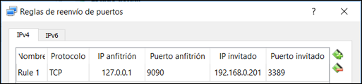

# PSCP

## Qué es PSCP

pscp es un comando de terminal que funciona en Windows
Funciona casi  de la misma manera que el comando scp de los sistemas operativos tipo Unix.

Lo primero que se debe hacer es bajar el software. Una vez descargado puede ser invocado desde la terminal de comandos de Windows Para hacer eso, ir a menú inicio, luego ejecutar y escribir  el comando

## Ejecución de comandos

Una vez en la línea de comandos, asegurarse de estar en el directorio donde pscp fuera descargados
También podemos  agregar dicho directorio a la variable PATH, supongamos que está en el Downloads, se debe ejecutar este comando.

```bat
SET PATH=C:\Users\Guillermo\Downloads;%PATH%
```

Debe cambiarse el usuario de acuerdo a la configuración particular de cada PC.

## Uso de pscp

pscp [options] [user@]host:source target
pscp [options] source [source...] [user@]host:target
pscp [options] -ls [user@]host:filespec

Opciones

-V        print version information and exit
-pgpfp    print PGP key fingerprints and exit
-p        preserve file attributes
-q        quiet, don't show statistics
-r        copy directories recursively
-v        show verbose messages
-load sessname  Load settings from saved session
-P port   connect to specified port
 Options:
 -l user   connect with specified username
 -pw passw login with specified password
 -1 -2     force use of particular SSH protocol version
 -4 -6     force use of IPv4 or IPv6
 -C        enable compression
 -i key    private key file for authentication
 -noagent  disable use of Pageant
 -agent    enable use of Pageant
 -batch    disable all interactive prompts
 -unsafe   allow server-side wildcards (DANGEROUS)
 -sftp     force use of SFTP protocol  -scp      force use of SCP protocol

## Copiar archivos

### De Windows a Linux

Se puede utilizar scp para copiar archivos de Windows a Linux

    pscp c:\path\to\file user@remote-server:/path/to/remote-folder

### De Linux a Windows

Igualmente se puede copiar archivos de Linux (FreeBSD o Max OS X) a Windows.

    pscp user@remote-server:/path/to/remote-file c:\path\to\local-folder\

## Conexión a través de NAT

Cuando la máquina remota a la que queremos acceder está en otra red, y es una red NAT

No podemos crear conexiones a una máquina de dentro de la red 
El router no sabe a qué máquina enviar las conexiones que le llegan del exterior
Necesitamos configurar el reenvío de puertos o port forwarding

Solución: port forwarding

Asociar puerto del router con una máquina y un puerto dentro de la red NAT.

Las conexiones entrantes al router (127.0.0.1) al puerto 9090  se redirigen a 192.168.0.201 en el puerto 3389
Configurar la red NAT en VirtualBox


