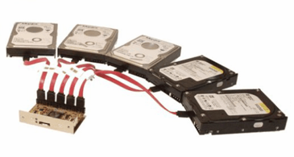
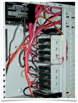
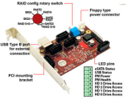
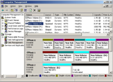
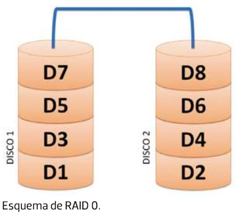
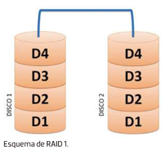
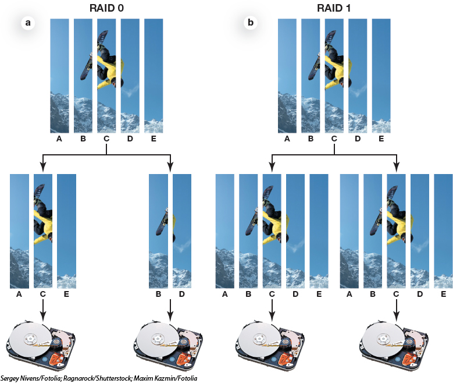
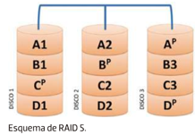
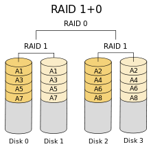

# RAID

## Qué es un sistema RAID

Conjunto redundante de discos independientes
En algunos entornos la solución de la copia de seguridad no es suficiente. 

Se necesita:
Alta disponibilidad de la información
Mayor seguridad e integridad de los datos

En un sistema RAID combinan dos o más discos físicos en una unidad lógica
Se tratan como si fuera un único disco 

Se considera que hay redundancia cuando la misma información se almacena más de una vez en una unidad lógica

Requisitos para montar un RAID
No es necesario que sean discos iguales
No tienen porque tener la misma capacidad
El equipo (placa y sistema) deben soportar RAID 
En los sistemas RAID el espacio se sacrifica para 
Proporcionar disponibilidad
Garantizar integridad en los datos
estado anterior en tiempo mínimo.
¿Qué ocurre si falla un disco?
Se suele disponer de discos de respaldo
Empiezan a funcionar cuando falla un disco principal

## RAID software y hardware

RAID por hardware 
La controladora de discos se encarga de que la agregación de discos sea totalmente transparente para el sistema operativo
El SO solo ve un disco donde realmente hay varios. 
Todo el trabajo extra de gestión del RAID lo hace la controladora
No hay sobrecarga para la CPU.
RAID por software
Sistema operativo es el que tiene acceso directo a los discos 
Es él el que monta el RAID a partir de esos discos de forma transparente para las aplicaciones 
Las aplicaciones ven sólo un disco donde realmente hay varios. 
El trabajo de gestión del RAID lo tiene que hacer enteramente la CPU

## Tipos de raid

### RAID 0 (Stripping)

Distribuye los datos equitativamente entre dos o más discos (stripping)
Distribuye porciones de información entre varios discos para 
Incrementa la velocidad de lectura/escritura al hacerlo de más de un disco a la vez

### RAID 1 (Mirroring)

Tradicionalmente el RAID 1 está compuesto por dos discos: 
- Disco principal: donde se aloja la información, 
- Disco espejo (mirror): donde se hace una copia exacta de los datos del disco principal

En entornos de alta disponibilidad, donde los sistemas están siempre en funcionamiento

El RAID 1 permite utilizar el espejo para hacer la copia de seguridad del sistema sin detenerlo

### Stripping vs mirroring

## Raid 5

Necesita al menos 3 discos para ser implementado. 
Distribuye bloques de información entre los discos del RAID
Añadiendo un bloque de paridad por banda
Puede utilizarse para corregir los bloques de información en caso de un fallo en la operación de escritura.

## Raid 6

Discos necesarios mínimo: 4

Se trata de una evolución del Raid 5, donde se busca ampliar la tolerancia frente a fallos, este aumento de tolerancia se consigue usando una **doble banda de paridad** (que también se distribuye entre todos los discos) y aumentando a 4 el número mínimo de discos necesarios para un Raid.

Como resultado de las modificaciones introducidas los Raid 6, toleran el fallo de dos discos (incluso durante la reconstrucción de uno de ellos), sin pérdida de datos.

El principal problema del Raid 6 es su bajo ratio de utilización de espacio en conjuntos de discos pequeño, pensad que, si de 4 discos el espacio equivalente a 2 se dedica a paridad, nuestro raid tendrá un 50% de la capacidad máxima teórica de los discos. Afortunadamente conforme aumentamos el número de discos la ratio de utilización mejora.

Ventajas:

- Tolerancia a fallos dobles de discos (incluso durante reconstrucción de HS)
Inconvenientes:
- Porcentaje de pérdida de espacio en conjuntos pequeños de discos.
- Lentitud en escritura (en realidad esto es inapreciable en el 99% de los entornos)

## Raid anidados

Los sistemas RAID pueden combinarse generando RAID anidados. 
Los más utilizados son 

### RAID 0+1 

Un RAID 1 compuesto por dos RAID O)
Para entornos profesionales

### RAID 1+0 

Un RAID 0 compuesto por dos RAID 1
Para entornos de alta disponibilidad.

## Elección de RAID

Los factores a tener en cuenta al elegir un nivel RAID son:

- Costo económico extra de los requisitos de almacenamiento en disco.
- Requisitos de rendimiento en términos del número de operaciones E/S.
- Rendimiento cuando falla un disco.
- Rendimiento durante la reconstrucción (esto es, mientras los datos del disco averiado se reconstruyen en un nuevo disco).

## Duplexing vs mirroring

En la configuración de RAID 1, cada vez que el ordenador realiza una actualización de un disco, puede organizar la duplicación de esa actualización en un segundo disco, reflejando así el original.

**Ventajas**

- Cualquiera de los discos puede fallar y aún se puede acceder a los datos.
- Se puede satisfacer una solicitud de lectura desde cualquiera de los dispositivos, lo que mejora el rendimiento y la velocidad de transferencia.

**Inconvenientes**

La duplicación es una forma costosa de proporcionar protección contra la pérdida de datos, ya que duplica la cantidad de almacenamiento de disco necesario (ya que solo el 50% del disco instalado está disponible para el almacenamiento de datos).

### Diferencia entre duplexing y mirroring

La duplicación de discos implica duplicar los datos de un disco en un segundo con un solo controlador.

En el mirroring la creación del espejo es igual en todos los aspectos, excepto que los discos están conectados a dos controladores separados.

**¿En qué afecta depender de un controlador o de varios?**

En mirroring el servidor ahora puede tolerar la pérdida de un controlador de disco, así como también, sin pérdida de la disponibilidad del subsistema de disco o de los datos del cliente. Como cada disco está conectado a un controlador independiente, el rendimiento y puede mejorarse aún más.
