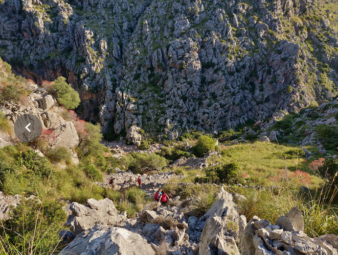
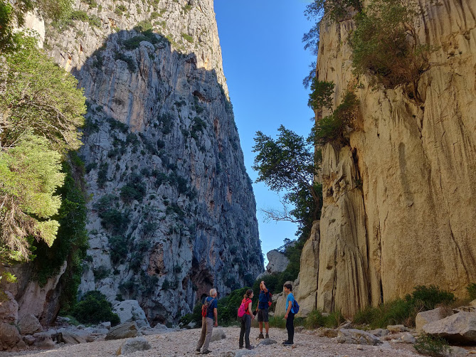
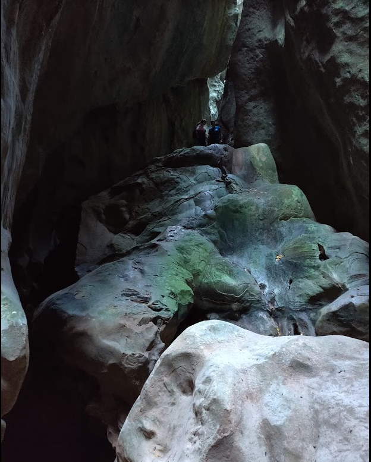
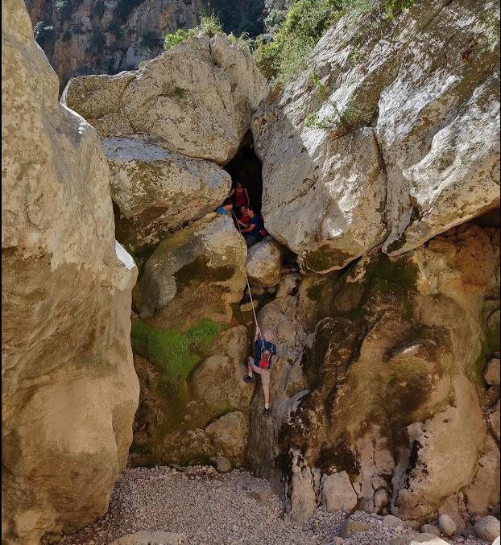
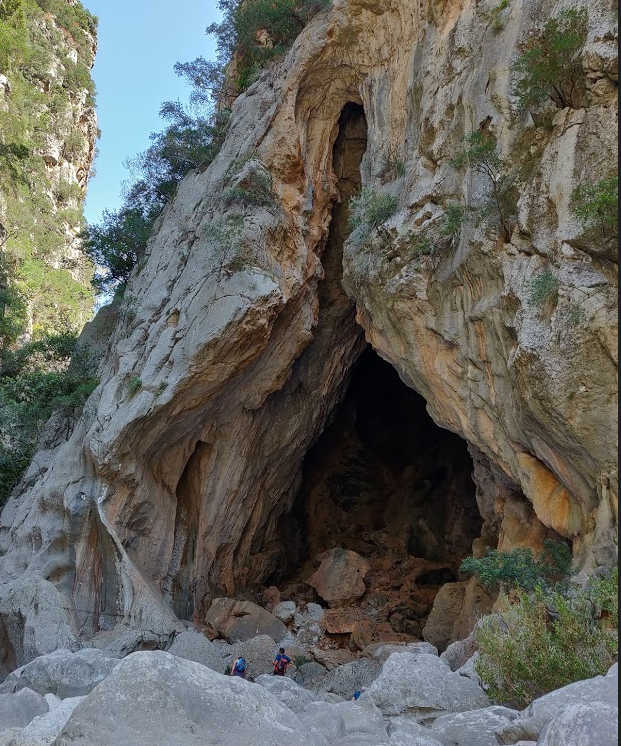
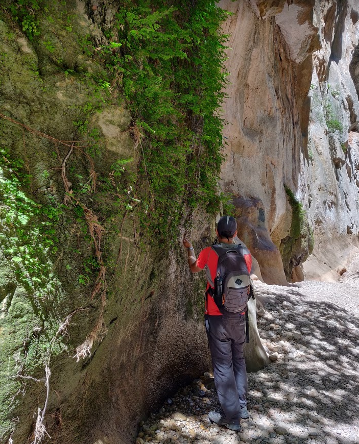
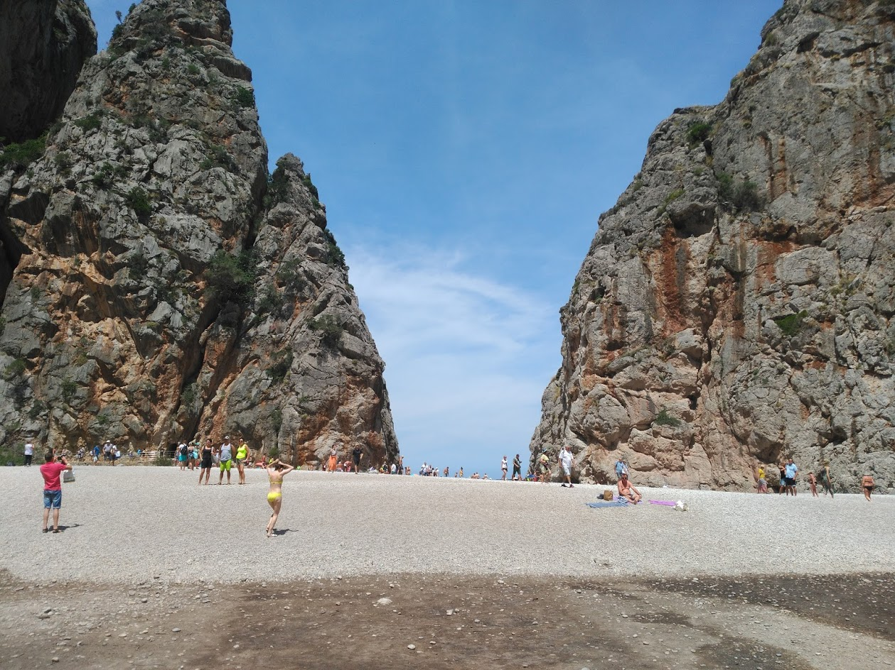
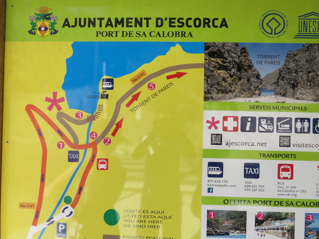

# Excursió torrent de Pareis

- [Excursió torrent de Pareis](#Excursi%C3%B3-torrent-de-Pareis)
  - [Preparación](#Preparaci%C3%B3n)
  - [Salida de Palma](#Salida-de-Palma)
  - [Coll de sa batalla](#Coll-de-sa-batalla)
  - [Salida de la excursión](#Salida-de-la-excursi%C3%B3n)
  - [Sa penya foradada](#Sa-penya-foradada)
  - [8:45 Entreforc](#845-Entreforc)
  - [9:00 Sa fosca](#900-Sa-fosca)
  - [11:15 Bajada con cuerda](#1115-Bajada-con-cuerda)
  - [11:25 Cova](#1125-Cova)
  - [12:00 Font des degotis](#1200-Font-des-degotis)
  - [Llegada](#Llegada)
  - [Túnel](#T%C3%BAnel)
  - [Vuelta](#Vuelta)
  - [Comer](#Comer)

## Preparación

- Conviene llevar una cuerda de unos 10 m
- Por lo menos 2 litros de agua por persona
- Los mejores meses son Mayo Junio Septiembre y Octubre

## Salida de Palma

- Haremos la salida temprano para evitar las horas de más calor
- Nos levantamos sobre las 5:30.
- Salida Palma sobre las 6:15. Vamos a **Lluc** por Inca, Selva y Caimari.

## Coll de sa batalla

Llegada a la gasolinera del **coll de sa batalla** sobre las 7:10. 
Ahí esperamos los coches para irnos hacia el aparcamiento donde empieza la excursión.
Ya nos ponemos crema antes de salir.

## Salida de la excursión

- Salida de la excursión a las 7:30
- Baixant per **cami des Burgar**

## Sa penya foradada

No la llegamos a ver, pero podemos coger un desvío para poder verla.

## 8:45 Entreforc

- En el **Entreforc** paramos a comer algo

## 9:00 Sa fosca

- Salimos hacia Sa fosca para verla.
- La temperatura baja bastante y hay un momento en el que se puede subir arriba de las rocas, pero con bastante dificultad.

## 11:15 Bajada con cuerda

En este punto nos podemos meter por un agujero que hay en la roca y acabar bajando utilizando una cuerda.

Alternativamente a la izquierda hay una senda que bordea este paso mucho más sencilla de hacer.

## 11:25 Cova

De camino podemos ver la **Cova des Romagueral**.

## 12:00 Font des degotis

## Llegada

- Llegada a **sa calobra** sobre las 12:45

## Túnel

- La cala está muy masificada por lo que vamos a tomar algo y bañarnos al port.

## Vuelta

- Hay un bus de vuelta que sale sobre las 15:00
- Nosotros volvemos en coche. Hay un aparcamiento de pago en Sa calobra. Iniciamos la vuelta sobre las 14:00.

## Comer

Para comer vamos a los merenderos de **Lluc**. En el aparcamiento hay que pagar 5 euros, pero se quedan en 2 euros si somos residentes y enseñamos el DNI.

