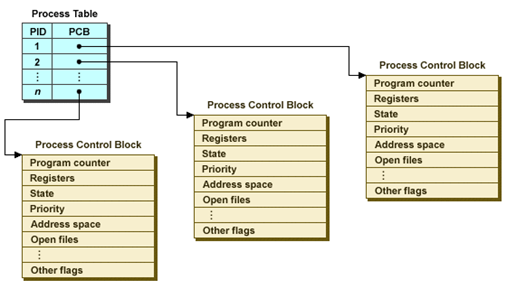
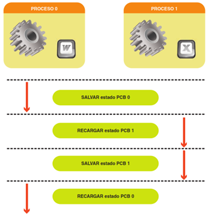

# SO. Gestión de procesos

- [SO. Gestión de procesos](#so-gesti%C3%B3n-de-procesos)
  - [Introducción](#introducci%C3%B3n)
    - [Relación entre el SO y los procesos](#relaci%C3%B3n-entre-el-so-y-los-procesos)
  - [Concepto de proceso](#concepto-de-proceso)
    - [Ejecución de un proceso](#ejecuci%C3%B3n-de-un-proceso)
    - [Partes de un proceso](#partes-de-un-proceso)
  - [Estados de un proceso##](#estados-de-un-proceso)
  - [Características de un proceso](#caracter%C3%ADsticas-de-un-proceso)
  - [Procesos padres e hijos](#procesos-padres-e-hijos)
  - [Bloque de control de procesos](#bloque-de-control-de-procesos)
    - [Control de procesos](#control-de-procesos)
    - [Estructura del bloque de control de procesos](#estructura-del-bloque-de-control-de-procesos)
    - [En programas multihilo o multihebra:](#en-programas-multihilo-o-multihebra)
  - [Cambio de contexto](#cambio-de-contexto)
  - [Planificación de procesos](#planificaci%C3%B3n-de-procesos)
    - [Fases de la planificación](#fases-de-la-planificaci%C3%B3n)
    - [Planificación](#planificaci%C3%B3n)
    - [Planificador](#planificador)
    - [Prioridades](#prioridades)
    - [Aspectos a comparar](#aspectos-a-comparar)
    - [Algoritmos de planificación](#algoritmos-de-planificaci%C3%B3n)
      - [Tipos](#tipos)
        - [Algoritmo FIFO (First In First Out) o FCFS (First Come First Serve)](#algoritmo-fifo-first-in-first-out-o-fcfs-first-come-first-serve)
        - [Algoritmo Round Robin](#algoritmo-round-robin)
        - [Colas multinivel](#colas-multinivel)
    - [Selección del algoritmo optimo](#selecci%C3%B3n-del-algoritmo-optimo)
  - [Comunicación entre procesos](#comunicaci%C3%B3n-entre-procesos)
    - [Sección crítica](#secci%C3%B3n-cr%C3%ADtica)
    - [Exclusión mutua](#exclusi%C3%B3n-mutua)
    - [Semáforos](#sem%C3%A1foros)
    - [Interbloqueos](#interbloqueos)
    - [Sincronización en Java](#sincronizaci%C3%B3n-en-java)
  - [Threads o hilos](#threads-o-hilos)
    - [Ejemplo (Word)](#ejemplo-word)

## Introducción

Un proceso puede ser pensado como un programa en ejecución.

Un proceso necesitará ciertos recursos -como tiempo de CPU, memoria, archivos y dispositivos de
E/S para realizar su tarea.

Estos recursos se asignan al proceso ya sea cuando se crea o mientras se está ejecutando.

Un proceso es la unidad de trabajo en la mayoría de los sistemas. Los sistemas consisten en una
colección de procesos: los procesos del SO ejecutan el código del sistema y los procesos del usuario
ejecutan el código del usuario.

Todos estos procesos pueden ejecutarse simultáneamente.

Aunque tradicionalmente

Un proceso contenía sólo un único hilo de control a medida que se ejecutaba, la mayoría de los
sistemas operativos modernos ahora soportan procesos que tienen múltiples subprocesos.

### Relación entre el SO y los procesos

EL SO responsable de varios aspectos importantes de la gestión de procesos y hilos:

La creación y eliminación de procesos de usuario y sistema

La programación de los procesos

La provisión de mecanismos para la sincronización, la comunicación y la gestión de
interbloqueo de procesos.

## Concepto de proceso

Un proceso es un concepto manejado por el SO y que referencia un programa en ejecución.

A los procesos, dependiendo especialmente del SO utilizado, se les denomina flujos de control, tareas, threads o hilos, según el contexto.

Cuando se ejecuta más de un proceso de forma concurrente en un sistema

Todos necesitan que el propio sistema les suministre una serie de recursos.

El SO, gracias a la CPU (Unidad Central de Proceso), se encarga de asignar estos recursos en un
orden adecuado y atendiendo a unas prioridades.

También realiza funciones de sincronización de todos los procesos, para que se ejecuten en el orden
adecuado y según la prioridad decidida.

### Ejecución de un proceso

Cuando se ejecuta un programa:

- El programa se convierte en proceso
- Se ubica en memoria las instrucciones que lo componen y sus datos asociados
- Se le asocia a dicho proceso se le asocia una estructura de datos.

### Partes de un proceso

- Programa ejecutable
- Datos
- Pila
- Registros
- Contador de programa

Procesos padres e hijos

## Estados de un proceso## 

- Nuevo: si es admitido pasa al estado de preparado
- Preparado: procesos admitidos,  interrumpidos o que vienen de estar en bloqueo
- En ejecución: seleccionado por el  planificador de la cola de preparados para ejecutarse
- Bloqueado: a la espera de una operación de E/S o de completarse un evento
- Terminado: cuando se ha terminado de ejecutar el proceso

## Características de un proceso

Todos los procesos dentro de cualquier SO tienen unas características que los identifican.

Cada proceso, tiene un identificador que lo discrimina de los demás.

Es un número asignado por el SO que sirve para identificar el proceso, lanzarlo a ejecución,
detenerlo, cancelarlo, reanudarlo, etc.

Este identificador de proceso se nombra con la abreviatura PID.

## Procesos padres e hijos

En cada SO, los procesos los lanzan normalmente otros procesos.

Cada proceso que se lanza a ejecución depende, en la mayoría de los casos, de otro proceso
denominado proceso padre. Así, al nuevo proceso lanzado se le denomina proceso hijo.

## Bloque de control de procesos

### Control de procesos

Los sistemas operativos disponen de los servicios necesarios para la gestión de los procesos, tales como su creación, terminación, ejecución periódica, cambio de prioridad, etc. 

Durante su existencia, los procesos pasan por distintos estados cuyas transiciones están controladas por el SO.

Toda la información de un proceso que el SO necesita para controlarlo se mantiene en una estructura de datos: el bloque de control de procesos o BCP. 

En SO multiproceso, el SO mantiene listas de bloques de control de procesos para cada uno de los estados del sistema.

### Estructura del bloque de control de procesos

Esta estructura de datos, que es única para cada proceso, identifica el proceso respecto de los demás y sirve para controlar su correcta ejecución. 
Es lo que se llama el bloque de control del proceso

Partes:

- Estado del proceso
- Identificador o PID. Dependiendo del SO, a cada proceso se le asigna un PID.
- Contador de programa
- Prioridad. La asignada por el planificador.
- Ubicación en memoria. Dirección de memoria en la que se carga el proceso
  - Puntero a la zona de memoria
- Recursos utilizados. Recursos hardware y software para poder ejecutarse.
  - Puntero a los recursos asignados
- Zona de almacenamiento de registros en CPU

### En programas multihilo o multihebra:

El BCP puede contener además el PPID, o Process Parent IDentif¡catión. 

Este dato referencia el PID del proceso padre dentro del BCP, de tal forma que desde el propio BCP se pueden identificar todos los procesos que son hijos de otro, siempre y cuando tengan el mismo PPID.

En procesos convencionales, este dato en el BCP no existirá.

## Cambio de contexto

En un sistema multiproceso o multihebra

Cuando un proceso o hilo pasa de un estado a otro (por ejemplo, de espera a ejecución) se producirá es un cambio de contexto.

El cambio de contexto puede ser

- Parcial: si se realiza entre hilos del mismo proceso.
- Completo:
  - En caso de que el cambio de contexto sea entre hilos de diferentes procesos
  - El cambio afectará a memoria, hardware, ficheros comunes, etc.

## Planificación de procesos

### Fases de la planificación

Una vez cargado el proceso, el SO asigna a través del planificador la prioridad 
del nuevo proceso respecto de los que hay en ejecución.

De esta forma, cada proceso atraviesa varias fases. En un momento dado, el 
proceso se estará ejecutando; posteriormente estará en espera, mientras la UCP 
ejecuta otro; otros procesos estarán preparados para ser lanzados; otros podrán 
estar bloqueados, etc. 

En estos cambios de proceso, el SO tiene que saber qué ficheros están abiertos 
en cada proceso, qué periféricos se están utilizando, etc.

Cuando se están ejecutando varias tareas a la vez (procesos)

Es necesario compartir el tiempo de trabajo de la CPU. 

El tiempo compartido consiste en dividir el tiempo de ejecución del procesador en minúsculos intervalos de tiempo (quantum) e ir asignando cada uno de esos intervalos de ejecución a cada proceso que está en ejecución.

### Planificación

Con esta técnica conseguimos indicar al ordenador los procesos que deben ejecutarse y los estados que estos deben adoptar. Gracias a los algoritmos de planificación podemos decidir qué proceso ha de ejecutarse en cada momento y por qué. 

Algunas características de estos algoritmos son la imparcialidad, la equidad, la eficiencia, el tiempo de respuesta y el rendimiento

### Planificador

Se denomina planificador a aquella parte del SO encargada de asignar los recursos del sistema, de manera que se consigan unos objetivos de comportamiento especificados.

### Prioridades

- Los diferentes estados tienen una relación directa con lo que vamos a denominar prioridades
- Son aquellas que el administrador del sistema, o el propio sistema, asignan a cada proceso. 
- De ello dependerá que un proceso se ejecute en más o menos tiempo.
- Se pueden establecer prioridades en función de la necesidad de ejecución de - algunos programas.
- Los programas que más se ejecutan, es decir, los más necesarios, tendrán prioridad de ejecución sobre aquellos que se ejecutan muy de cuando en cuando.
Es ahora cuando hemos de hablar de la planificación

### Aspectos a comparar

- Tiempos de respuesta
- Cambios de contexto
- Dificultad de implementación

### Algoritmos de planificación

Gracias a los algoritmos de planificación, especialmente en sistemas operativos multi-proceso o en sistemas operativos en red, 
Siempre y cuando se ejecuten varios procesos en el mismo equipo, 

La CPU se encarga de asignar tiempos de ejecución a cada proceso según 

- El tipo de algoritmo
- La prioridad de cada proceso

#### Tipos

- FIFO
- SJF
- Prioridad
- Round Robin
- Colas multinivel

##### Algoritmo FIFO (First In First Out) o FCFS (First Come First Serve)

Los ciclos de UCP asignados a cada proceso se asignan en función de una cola FIFO. 
Al primer proceso que llega se le asignan tiempos o ciclos de UCP hasta que termina completamente. 
A continuación, se ejecuta completo el siguiente proceso que hay en la cola FIFO y así sucesivamente hasta terminar con el último proceso. 
Este algoritmo de planificación normalmente se utiliza para la gestión de trabajos en colas de impresión, respecto de los trabajos que van llegando a la impresora.

##### Algoritmo Round Robin

Asigna rotativamente tiempos de ejecución a los diferentes procesos. 
También se llama algoritmo de Round-Robin y en él la asignación de tiempos de ejecución a los procesos es la misma y de forma secuencial. 
A cada uno se le asigna el mismo quantum o intervalo de tiempo de ejecución. 
Selección de proceso mediante cola FIFO 
Es el algoritmo utilizado normalmente en la asignación de tiempos en sistemas operativos multiusuario y multiproceso 
En la actualidad se puede decir que es el utilizado en sistemas operativos monousuario y que trabajan en multitarea.

##### Colas multinivel

Principales características
Determinar cuantas colas tendrá el sistema y el algoritmo de planificación de cada una
Debe existir un planificador de nivel superior para determinar que cola será atendida
Cuando llega un proceso se clasifica para determinar en qué cola se introduce
Definir cuando un proceso puede cambiar de tipo de cola

### Selección del algoritmo optimo

- Evaluación analítica
- Modulación determinista
- Modelos de colas
- Simulación

## Comunicación entre procesos

Variables compartidas

Condiciones de carrera

### Sección crítica

Secuencia de instrucciones que se debe ejecutar de forma indivisible.

Operaciones de 2 secciones críticas respecto a la misma variable no se deben entrelazar

### Exclusión mutua

Forma de sincronización para proteger sección crítica

### Semáforos

- Variable que toma valores enteros no negativos. 2 operaciones (up y down)
- Toma valores 0 o 1
- Un semáforo binario se llama mutex

### Interbloqueos

Cuando cada proceso espera una condición o recurso que depende del otro

### Sincronización en Java

- Para aplicar exclusión mútua utilizar palabra synchronized en declaración de atributos, métodos o en un bloque de ódigo
- Todos los métodos definidos con  synchronized se ejecutarán en exclusión mútua
- Cuando se ejecuta un método sincronizado el resto de métodos sincronizados no se puede ejecutar, y tendrán que esperar a que acabe el proceso que se está ejecutando

## Threads o hilos

Un thread es un subproceso de un proceso:

- Consume recursos propios
- Depende del proceso padre que lo ha ejecutado.

Una hebra es un punto de ejecución de un proceso.

Un proceso tendrá siempre una hebra, en la que corre el propio programa, pero puede tener más hebras.

Las hebras representan un método software para mejorar el rendimiento y eficacia de los sistemas operativos.

Las hebras de un mismo proceso compartirán:

- Memoria
- Archivos
- Recursos hardware, etc.

### Ejemplo (Word)

Si ejecutamos el procesador de textos Word, con un solo documento abierto, el programa Word convertido en proceso estará
ejecutándose en un único espacio de memoria, tendrá acceso a determinados archivos (galerías de imágenes, corrector
ortográfico, etc.), tendrá acceso al hardware (impresora, disquetera), etc.

En definitiva, este proceso, de momento, solamente tiene una hebra.

Si en esta situación, sin cerrar Word, abrimos un nuevo documento, Word no se vuelve a cargar como proceso.

Simplemente el programa, convertido en proceso, tendrá a su disposición dos hebras o hilos diferentes, de tal forma que el
proceso sigue siendo el mismo (el original).

Word se está ejecutando una sola vez

El resto de documentos de texto que abramos en esta misma sesión de trabajo no serán procesos propiamente dichos.

Serán hilos o hebras del proceso principal, que es el propio procesador de textos.

Antes de hablar de prioridades, y teniendo muy en cuenta lo comentado anteriormente, vamos a ver los
diferentes estados en los que pueden estar los procesos.

Hoy en día existen gran cantidad de programas diseñados en multihilo o multihebra. De esta forma, si un
programa puede realizar varias cosas, como analizar el registro del equipo, desfragmentar el disco duro y
realizar copias de seguridad, todas ellas se podrán ejecutar a la vez. En programas convencionales,
solamente se podría ejecutar una tras otra, pero no todas a la vez.
