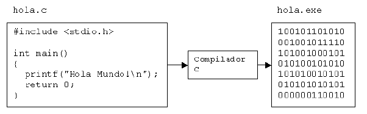

# Apuntes de programación

- [Apuntes de programación](#Apuntes-de-programaci%C3%B3n)
- [Conceptos de programa, aplicación y lenguaje de programación](#Conceptos-de-programa-aplicaci%C3%B3n-y-lenguaje-de-programaci%C3%B3n)
  - [Software](#Software)
  - [Aplicaciones](#Aplicaciones)
  - [Algoritmos](#Algoritmos)
    - [Formas de representación de un algoritmo](#Formas-de-representaci%C3%B3n-de-un-algoritmo)
  - [Lenguajes de programación](#Lenguajes-de-programaci%C3%B3n)
- [Tipos de lenguaje de programación](#Tipos-de-lenguaje-de-programaci%C3%B3n)
  - [Nivel de abstracción](#Nivel-de-abstracci%C3%B3n)
    - [Lenguajes de bajo nivel](#Lenguajes-de-bajo-nivel)
    - [Lenguajes de nivel medio](#Lenguajes-de-nivel-medio)
  - [Propósito](#Prop%C3%B3sito)
  - [Evolución histórica](#Evoluci%C3%B3n-hist%C3%B3rica)
  - [Forma de ejecutarse](#Forma-de-ejecutarse)
  - [MANERA DE ABORDAR LA TAREA A REALIZAR](#MANERA-DE-ABORDAR-LA-TAREA-A-REALIZAR)
  - [Paradigma de programación](#Paradigma-de-programaci%C3%B3n)
  - [Lugar de ejecución](#Lugar-de-ejecuci%C3%B3n)
  - [CARACTERÍSTICAS DE LOS LENGUAJES MÁS DIFUNDIDOS](#CARACTER%C3%8DSTICAS-DE-LOS-LENGUAJES-M%C3%81S-DIFUNDIDOS)
    - [C](#C)
    - [C++](#C)
    - [`Java`,](#Java)
    - [`PHP`,](#PHP)
    - [Python](#Python)
- [Tipos de código](#Tipos-de-c%C3%B3digo)
  - [Código fuente](#C%C3%B3digo-fuente)
  - [Código objeto](#C%C3%B3digo-objeto)
  - [Código ejecutable](#C%C3%B3digo-ejecutable)
  - [TRADUCTORES DE UN LENGUAJE DE PROGRAMACIÓN](#TRADUCTORES-DE-UN-LENGUAJE-DE-PROGRAMACI%C3%93N)
- [Obtención de código ejecutable](#Obtenci%C3%B3n-de-c%C3%B3digo-ejecutable)
  - [Compilador](#Compilador)
  - [Intérprete](#Int%C3%A9rprete)
  - [COMPILADOR + INTÉRPRETE](#COMPILADOR--INT%C3%89RPRETE)
  - [DIFERENCIA ENTRE COMPILADOR E INTÉRPRETE](#DIFERENCIA-ENTRE-COMPILADOR-E-INT%C3%89RPRETE)
  - [DEPURADORES](#DEPURADORES)
- [Paradigmas de programación](#Paradigmas-de-programaci%C3%B3n)
  - [Lenguajes](#Lenguajes)
    - [Lenguajes que soportan un paradigma](#Lenguajes-que-soportan-un-paradigma)
    - [Lenguajes que soporten múltiples paradigmas de programación](#Lenguajes-que-soporten-m%C3%BAltiples-paradigmas-de-programaci%C3%B3n)
    - [Lenguajes que soportan muchos paradigmas de programación](#Lenguajes-que-soportan-muchos-paradigmas-de-programaci%C3%B3n)
  - [Programación Imperativa](#Programaci%C3%B3n-Imperativa)
  - [Programación declarativa](#Programaci%C3%B3n-declarativa)
  - [Diferencias principales](#Diferencias-principales)
  - [¿Y qué hay de la programación orientada a objetos?](#%C2%BFY-qu%C3%A9-hay-de-la-programaci%C3%B3n-orientada-a-objetos)
  - [Conclusión](#Conclusi%C3%B3n)

# Conceptos de programa, aplicación y lenguaje de programación

## Software

La definición de software o programa informático es la siguiente: el software es un 
conjunto de programas elaborados por el hombre, que controlan la actuación de la 
computadora, haciendo que ésta siga en sus acciones una serie de pasos lógicos 
predeterminados.

El software es el nexo entre el hardware (computadora) y el hombre (usuario). La 
computadora, por sí sola, no puede comunicarse con el usuario y viceversa, ya que los 
separa la barrera del lenguaje. El software trata de eliminar esa barrera, 
estableciendo procedimientos de comunicación entre el hombre y la máquina; es decir, 
el software obra como un intermediario entre el hardware y el hombre.

Existen diferentes tipos de software: software de sistema y software de aplicación

## Aplicaciones

Una **aplicación** es un tipo de programa informático diseñado para facilitar al usuario la realización de un determinado tipo de trabajo. Esto lo diferencia principalmente de otros tipos de programas (sistema) que realizan tareas más avanzadas y no pertinentes al usuario común, como los sistemas operativos (que hacen funcionar al ordenador, como Windows, Mac o Linux), las utilidades (que realizan tareas de mantenimiento o de uso general), y los lenguajes de programación (con el cual se crean los programas informáticos).

Las aplicaciones suelen diseñarse para la **automatización** de ciertas **tareas** complicadas
o tediosas como pueden ser la contabilidad, la redacción de documentos, o la gestión de un almacén. Algunos ejemplos de programas de aplicación son los procesadores de textos, hojas de cálculo, y base de datos.

De modo que una aplicación informática es un programa o consta de varios programas relacionados entre sí. Pero un programa no siempre es una aplicación, porque hay diferentes tipos de programas y los programas de aplicación son solo uno de ellos.

## Algoritmos

Cuando queremos resolver un problema a través de la creación de un programa informático habremos de diseñar previamente lo que se denomina un algoritmo. Un **algoritmo** es la forma de resolver un problema, los pasos a seguir para resolver un problema estándar. 

Se llama algoritmo a la secuencia de pasos organizados a seguir para resolver un problema. Cualquier algoritmo debe tener las siguientes características:

- La descripción de cada paso no debe llevar a ambigüedades, los pasos son absolutamente explícitos y no inducen a error.
- El número de pasos debe ser finito, de forma que el algoritmo se pueda ejecutar en un tiempo finito.

Los algoritmos son independientes de la sintaxis de cada lenguaje de programación en particular, siendo evidente que el algoritmo que lleve a la solución de un determinado problema puede ser expresado utilizando distintos lenguajes de programación.

### Formas de representación de un algoritmo

Hay distintas formas de escribir un algoritmo, bien usando un lenguaje específico de descripción de algoritmos (**pseudocódigo**), bien mediante representaciones gráficas (organigramas o **diagramas de flujo**).

- En los **diagramas de flujo** existen símbolos estandarizados que permiten reflejar distintos tipos de pasos en un algoritmo.
- El **pseudocódigo** es una forma de escribir los pasos, pero de la forma más cercana al lenguaje de programación que vamos a utilizar, es como un falso lenguaje muy cercano al lenguaje humano.

Independiente del lenguaje de programación que vaya a usarse, un algoritmo que esté escrito en pseudocódigo o con un diagrama de flujo es fácilmente traducible a muchos lenguajes de programación.

## Lenguajes de programación

Un **lenguaje de programación** es un lenguaje diseñado para describir el conjunto de acciones consecutivas que un equipo debe ejecutar. Por lo tanto, un lenguaje de programación es un modo práctico para que los seres humanos puedan dar instrucciones a un equipo. Hay muchísimos, de toda clase de tipos y características, inventados para facilitar el abordaje de distintos problemas, el mantenimiento del software, su reutilización, mejorar la productividad, etc.

# Tipos de lenguaje de programación

Los lenguajes de programación se pueden clasificar según varios criterios. Hay que tener en cuenta también, que, en la práctica, la mayoría de lenguajes no pueden ser puramente clasificados en una categoría, pues surgen incorporando ideas de otros lenguajes y de otras filosofías de programación, pero no importa al establecer las clasificaciones, pues el auténtico objetivo de las mismas es mostrar los rangos, las posibilidades y tipos de lenguajes que hay.

## Nivel de abstracción

Según el nivel de abstracción, es decir, según el grado de cercanía a la máquina:

### Lenguajes de bajo nivel

La programación se realiza teniendo muy en cuenta las características del procesador. Cadenas interminables de secuencias de 1s y 0s que conforman operaciones que la máquina puede entender. 

Ejemplo: Lenguajes ensamblador.

### Lenguajes de nivel medio

Permiten un mayor grado de abstracción pero al mismo tiempo mantienen algunas cualidades de los lenguajes de bajo nivel. 

Ejemplo: C puede realizar operaciones lógicas y de desplazamiento con bits, tratar todos los tipos de datos como lo que son en realidad a bajo nivel (números), etc.

###	Lenguajes de alto nivel

Más parecidos al lenguaje humano. Manejan conceptos, tipos de datos, etc., de una manera cercana al pensamiento humano ignorando (abstrayéndose) del funcionamiento de la máquina. 

Ejemplos: `Java, Ruby.`

Hay quien sólo considera lenguajes de bajo nivel y de alto nivel, (en ese caso, C es considerado de alto nivel).

## Propósito

Según el propósito, es decir, el tipo de problemas a tratar con ellos:

- Lenguajes de propósito general: Aptos para todo tipo de tareas: Ejemplo: C. `Java`.
- Lenguajes de propósito específico: Hechos para un objetivo muy concreto. Ejemplo: Csound (para crear ficheros de audio).
- Lenguajes de programación de sistemas: Diseñados para realizar sistemas operativos o drivers. Ejemplo: C.
- Lenguajes de script: Para realizar tareas varias de control y auxiliares. Antiguamente eran los llamados lenguajes de procesamiento por lotes (batch). Se subdividen en varias clases (de shell, de GUI, de programación web, etc.). Ejemplos: bash (shell), mIRC script, `JavaScript` (programación web).

## Evolución histórica

Con el paso del tiempo, se va incrementando el nivel de abstracción, pero en la práctica, los de una generación no terminan de sustituir a los de la anterior:

- Lenguajes de **primera generación** (1GL): Código máquina.
- Lenguajes de **segunda generación** (2GL): Lenguajes ensamblador.
- Lenguajes de **tercera generación** (3GL): La mayoría de los lenguajes modernos, diseñados para facilitar la programación a los humanos. Ejemplos: C, `Java`.
- Lenguajes de **cuarta generación** (4GL): Diseñados con un propósito concreto, o sea, para abordar un tipo concreto de problemas. Ejemplos: SQL, matlab, Mathematica.
- Lenguajes de **quinta generación** (5GL): La intención es que el programador establezca el problema qué ha de ser resuelto y las condiciones a reunir, y la máquina lo resuelve. Se usan en inteligencia artificial. Ejemplo: Prolog.

## Forma de ejecutarse

Según la manera de ejecutarse:

- Lenguajes compilados
- Lenguajes interpretados
- También los hay mixtos

## MANERA DE ABORDAR LA TAREA A REALIZAR

Según la manera de abordar la tarea a realizar, pueden ser:

- Lenguajes **imperativos**: Indican cómo hay que hacer la tarea, es decir, expresan los pasos a realizar. Ejemplo: C.
- Lenguajes **declarativos**: Indican qué hay que hacer. Ejemplos: Lisp, Prolog. Otros ejemplos de lenguajes declarativos, pero que no son lenguajes de programación, son HTML (para describir páginas web) o SQL (para consultar bases de datos).

## Paradigma de programación

El paradigma de programación es el estilo de programación empleado. Algunos lenguajes soportan varios paradigmas, y otros sólo uno. 

- Lenguajes de programación **estructurado**: Divide el problema en partes más pequeñas, que serán realizadas por subprogramas (subrutinas, funciones, procedimientos), que se llaman unas a otras para ser ejecutadas. Ejemplos: C, Pascal.
- Lenguajes de programación **orientada a objetos**: Crean un sistema de clases y objetos siguiendo el ejemplo del mundo real, en el que unos objetos realizan acciones y se comunican con otros objetos. Ejemplos: C++, `Java`.
- Lenguajes de programación **funcional**: La tarea se realiza evaluando funciones, (como en Matemáticas), de manera recursiva. Ejemplo: Lisp, Scala.
- Lenguajes de programación **lógica**: La tarea a realizar se expresa empleando lógica formal matemática. Expresa qué computar. Ejemplo: Prolog.

## Lugar de ejecución

En sistemas distribuidos, según dónde se ejecute:

- Lenguajes de **servidor**: Se ejecutan en el servidor. Ejemplo: `PHP` es el más utilizado en servidores web.
- Lenguajes de **cliente**: Se ejecutan en el cliente. Ejemplo: `JavaScript` en navegadores web.

## CARACTERÍSTICAS DE LOS LENGUAJES MÁS DIFUNDIDOS

Algunos de los lenguajes más difundidos son: 

- BASIC, que durante mucho tiempo se ha considerado un buen lenguaje para comenzar a 
aprender, por su sencillez, aunque se podía tender a crear programas poco legibles. A 
pesar de esta "sencillez" hay versiones muy potentes, incluso para programar en 
entornos gráficos como Windows. 

- COBOL, que fue muy utilizado para negocios (para crear software de gestión, que 
tuviese que manipular grandes cantidades de datos), aunque últimamente está bastante 
en desuso. 

- FORTRAN, concebido para ingeniería, operaciones matemáticas, etc. También va 
quedando desplazado. 

- Ensamblador, muy cercano al código máquina (es un lenguaje de "bajo nivel"), pero 
sustituye las secuencias de ceros y unos (bits) por palabras más fáciles de recordar, 
como MOV, ADD, CALL o JMP. 

### C

- Uno de los mejor considerados actualmente (junto con C++ y `Java`, que 
mencionaremos a continuación), porque no es demasiado difícil de aprender y 
- Permite un grado de control del ordenador muy alto, combinando características de lenguajes de 
alto y bajo nivel. 
- Es muy transportable: existe un estándar, el ANSI 
- Asegura que se pueden convertir programas en C de un ordenador a otro o de un sistema 
operativo a otro con bastante menos esfuerzo que en otros lenguajes. 

### C++

- Un lenguaje desarrollado a partir de C, que 
- permite Programación Orientada a Objetos, por lo que resulta más adecuado para proyectos de una cierta envergadura. 
- Creado por Bjarne Stroustrup.

### `Java`, 

- Desarrollado a su vez a partir de C++
- Elimina algunos de sus inconvenientes
- Ha alcanzado una gran difusión gracias a su empleo en Internet. 

### `PHP`, 

- Es un lenguaje de programación interpretado, diseñado originalmente para la 
creación de páginas web dinámicas.
- Se usa principalmente para la interpretación del lado del servidor (server-side scripting) 
- Actualmente puede ser utilizado desde una interfaz de línea de comandos o en la creación de otros tipos de programas.

### Python
  
- Es un lenguaje de programación de alto nivel 
- Filosofía hace hincapié en una sintaxis muy limpia y que favorezca un código legible. 
- Se trata de un lenguaje de programación multiparadigma ya que soporta orientación a objetos, programación imperativa y, en menor medida, programación funcional

# Tipos de código

## Código fuente

Se le da el nombre de **código fuente** a los programas escritos en un determinado lenguaje de programación y que está compuesto por instrucciones escritas por un programador.

## Código objeto

Se llama **código objeto** al código que resulta de la compilación del código fuente. Consiste en lenguaje máquina o bytecode y se distribuye en varios archivos que corresponden a cada código fuente compilado. 

## Código ejecutable

Para obtener un **código ejecutable** se han de enlazar todos los archivos de código objeto con un programa llamado enlazador.

## TRADUCTORES DE UN LENGUAJE DE PROGRAMACIÓN

Al programador y a la máquina les cuesta hablar el mismo idioma. Por eso se inventaron los programas traductores.

Los traductores son programas que traducen los programas en código fuente, escritos en lenguajes de alto nivel, a programas escritos en lenguaje máquina.

# Obtención de código ejecutable

## Compilador

El programa original (fichero fuente) sólo se traduce una vez, creando un nuevo archivo (fichero ejecutable) que puede ejecutarse cuantas veces se desee.
Como una parte fundamental de este proceso de traducción, el compilador le hace notar al usuario la presencia de errores en el código fuente del programa. Vea la siguiente figura.

Los lenguajes C y C++ son lenguajes que utilizan un compilador. El trabajo del compilador y su función es llevar el código fuente escrito en C/C++ a un programa escrito en lenguaje máquina. Entrando en más detalle, un programa en código fuente es compilado obteniendo un archivo parcial (un objeto) que tiene extensión obj. Luego  el compilador invoca al “linker” que convierte al archivo objeto en un ejecutable con extensión exe; este último archivo es un archivo en formato binario (ceros y unos) y puede funcionar por sí sólo.

## Intérprete

El programa es traducido cada vez que se vaya a ejecutar.
Los intérpretes no producen un lenguaje objetivo como en los compiladores. Un intérprete lee el código como está escrito e inmediatamente lo convierte en acciones; es decir, lo ejecuta en ese instante.
Existen lenguajes que utilizan un intérprete (como por ejemplo `Java`) que traduce en el instante mismo de lectura el código en lenguaje máquina para que pueda ser ejecutado.
 
## COMPILADOR + INTÉRPRETE

El programa es compilado la primera vez a un formato intermedio. El archivo resultante debe ser interpretado cada vez que desee ejecutarse.

El lenguaje `Java`, primero pasa por una fase de compilación en la que el código fuente se transforma en “bytecode”, y este “bytecode” puede ser ejecutado luego (interpretado)en ordenadores con distintas arquitecturas (procesadores) que tengan todos instalados la misma “máquina virtual” `Java`.

## DIFERENCIA ENTRE COMPILADOR E INTÉRPRETE

Los compiladores difieren de los intérpretes en varios aspectos:

- Un programa que ha sido compilado puede correr por sí sólo, pues en el proceso de compilación se lo transformo en otro lenguaje (lenguaje máquina).
- Un intérprete traduce el programa cuando lo lee, convirtiendo el código del programa directamente en acciones. La ventaja del intérprete es que dado cualquier programa se puede interpretar en cualquier plataforma (sistema operativo). En cambio, el archivo generado por el compilador solo funciona en la plataforma en donde se le ha creado. Sin embargo, hablando de la velocidad de ejecución, un archivo compilado es más rápido que un archivo interpretado. ¿Cuánto? Investigad.

## DEPURADORES

El **depurador** (debugger) es un programa independiente del editor, el compilador y el enlazador. Suele estar integrado con los otros tres, de modo que desde el entorno de programación se puede lanzar cualquiera de los programas, pero también se puede usar por separado.

El depurador es una herramienta fundamental para localizar y corregir los errores en tiempo de ejecución.

# Paradigmas de programación

Existen muchos paradigmas de programación diferentes, cada uno de ellos tiene sus propias características y tratan de solucionar los problemas clásicos del desarrollo de software desde diferentes perspectivas y filosofías. Hoy vamos a ver algunas diferencias entre paradigmas de programación populares.

Los paradigmas de programación solo son propuestas tecnológicas adoptadas por la Comunidad de desarrolladores que se enfocan a resolver uno o varios problemas definidos y delimitados. Existen muchos paradigmas de programación diferentes, posiblemente el más ampliamente utilizado hoy en día sea el de la programación orientada a objetos.

## Lenguajes

### Lenguajes que soportan un paradigma

Algunos lenguajes han sido diseñados para soportar un único paradigma de programación

Smalltalk que soporta únicamente la programación orientada a objetos

`Haskell` que solo soporta la programación funcional

Algunos paradigmas prohíben el uso de ciertos mecanismos o técnicas.

En la programación funcional se elimina el uso del efecto secundario en las funciones

En la programación estructurada se desaprueba o incluso elimina el uso de la sentencia 
goto

### Lenguajes que soporten múltiples paradigmas de programación

Estos lenguajes son aquellos que soportan al menos dos paradigmas. 

Dentro de esta categoría podemos encontrar nuevas caras y viejos conocidos:

- Scala: Imperativo, orientado a objetos, funcional, genérico y concurrente
- Erlang: Funcional, concurrente y distribuido
- Perl: Imperativo, orientado a objetos y funcional
- `PHP`: Imperativo, orientado a objetos, funcional y reflexivo
- `Java`Script: Imperativo, orientado a objetos (prototipos) y funcional
- `Java`: Imperativo, orientado a objetos, reflexivo y genérico
- Python y Ruby: Imperativo, orientado a objetos, reflexivo y funcional
- C++: Imperativo, orientado a objetos, funcional y genérico
- C#: Imperativo, orientado a objetos, funcional (lambda), reflexivo y genérico

### Lenguajes que soportan muchos paradigmas de programación

Existen lenguajes como `Oz` que soporta nueve paradigmas de programación

Para algunos es un acierto y para otros un error

## Programación Imperativa

En la programación **imperativa** se describen sentencias que modifican el estado de un
programa.

En muchos sentidos la programación imperativa es la programación natural para las CPUs
que se basan en ese paradigma al nivel más básico.

En este paradigma se expresa como debe solucionarse un problema especificando una
secuencia de acciones a realizar a través de uno o más procedimientos denominados
subrutinas o funciones.

Dentro de esta categoría se engloban:

- La programación estructurada que restringe el uso de la instrucción goto
- La programación modular
- La programación orientada a solución

## Programación declarativa

La solución es alcanzada a través de mecanismos internos de control.

No se especifica exactamente como llegar a ella.

Las variables son utilizadas con transparencia referencial, es decir una expresión 
puede ser sustituida por el resultado de ser evaluada en el programa sin alterarlo 
semánticamente.

Dentro de esta categoría se engloban 

- La programación `funcional` cuyo lenguaje más expresivo y culmen sea seguramente el 
lenguaje `Haskell`. 
- La programación `lógica` donde sin duda el campeón es Prolog (ampliamente usado en 
ambientes académicos) 
- La programación `restringida` o con restricciones entre otras.

En los lenguajes funcionales puros como `Haskell`, todas las funciones son puras, es decir, no tienen efectos secundarios, y los cambios de estado están solo representados como funciones que transforman el estado. Aunque no son imperativos, por norma general proporcionan algún mecanismo por el que describir el efecto de una función como una serie de pasos.

## Diferencias principales

La principal diferencia entre ambos paradigmas es que en la programación imperativa se describe paso a paso un conjunto de instrucciones que han de ejecutarse con la finalidad de variar el estado del programa y resolver un problema para hallar una solución. Es decir, se describe un algoritmo en el que se detallan los pasos secuenciales necesarios a seguir para la resolución de un problema.

Y en la programación declarativa solo se describe el problema pero no los pasos necesarios para llegar a su solución, la cual es hallada mediante mecanismos internos de inferencia de información a partir de la descripción del problema en si.
La programación imperativa se basa en la máquina de Turinq mientras que la programación declarativa se basa en el cálculo lambda.

¿Cómo diferenciar una de la otra?

Podemos diferenciarlas sin temor a equivocamos en los siguientes supuestos:

-	Un programa que describe que problemas deben resolverse pero no como, está programado con programación declarativa.
- Cualquier programa que evita los efectos secundarios o es referencialmente transparente, está programado con programación declarativa
- Todo lo que no cuadre con las dos afirmaciones anteriores usa programación imperativa o una mezcla de ambas

## ¿Y qué hay de la programación orientada a objetos?

La programación orientada a objetos es una forma de programación imperativa

Al programar orientando a objetos se describe la secuencia que debe seguir el programa para resolver un problema dado.

La diferencia con otras formas de programación imperativas como la programación estructurada es que en la orientación a objetos se hace uso de estructuras de datos llamadas objetos.

Estos objetos son estructuras que aglutinan propiedades y métodos conjuntamente.

## Conclusión

Aunque la diferencia entre la programación estructurada y la programación orientada a 
objetos es grande, realmente la mayor diferencia se encuentra en las ramas superiores. 

Las diferencias entre programación imperativa y programación declarativa es mucho más 
severa y compleja que las diferencias entre diferentes sub-paradigmas dentro de la 
programación imperativa.

Sobre lo que nos depara el futuro, no estoy seguro, ni siquiera tengo una opinión 
propia bien formada al respecto, pero es aconsejable no perder la pista de lenguajes 
como `Haskell` e intentar comprender el paradigma de la programación declarativa para 
crecer como profesionales del desarrollo de software y sobre todo mantener una postura 
abierta y alejar los talibanismos y la polémica estéril.

