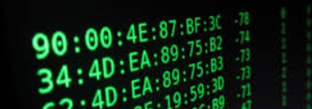
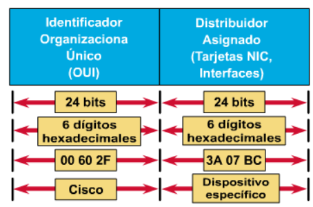
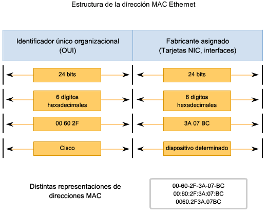
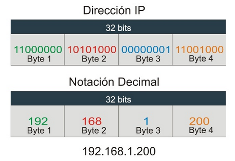
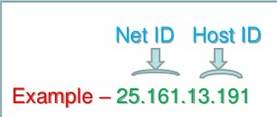

- [Teoría redes](#teor%C3%ADa-redes)
- [Dirección MAC](#direcci%C3%B3n-mac)
- [Estructura dirección MAC](#estructura-direcci%C3%B3n-mac)
- [Direccion IP](#direccion-ip)
- [Formatos de dirección IP](#formatos-de-direcci%C3%B3n-ip)
  - [Direección IPv4](#direecci%C3%B3n-ipv4)
  - [Dirección IPv6](#direcci%C3%B3n-ipv6)
- [Formato dirección IPv4](#formato-direcci%C3%B3n-ipv4)
- [Jerarquía de direcciones](#jerarqu%C3%ADa-de-direcciones)
- [Reglas IP e interfaces](#reglas-ip-e-interfaces)
- [Sistema con clases (direccionamiento classful)](#sistema-con-clases-direccionamiento-classful)
- [Classes de direcciones](#classes-de-direcciones)
- [CLASE A](#clase-a)
- [CLASE B](#clase-b)
- [CLASE C](#clase-c)
- [Tipos de direcciones IP](#tipos-de-direcciones-ip)
- [Direcciones IP públicas](#direcciones-ip-p%C3%BAblicas)
- [Direcciones IP privadas (reservadas)](#direcciones-ip-privadas-reservadas)
- [Bloques de redes privadas](#bloques-de-redes-privadas)
- [Traducción IP pública y privada](#traducci%C3%B3n-ip-p%C3%BAblica-y-privada)
- [NAT](#nat)
- [Direcciones estáticas y dinámicas](#direcciones-est%C3%A1ticas-y-din%C3%A1micas)
- [Direcciones IP estáticas (fijas)](#direcciones-ip-est%C3%A1ticas-fijas)
- [Direcciones IP dinámicas](#direcciones-ip-din%C3%A1micas)
- [Direcciones especiales](#direcciones-especiales)
- [Dirección de red](#direcci%C3%B3n-de-red)
- [Dirección del router o puerta de enlace](#direcci%C3%B3n-del-router-o-puerta-de-enlace)
- [Dirección broadcast](#direcci%C3%B3n-broadcast)
- [Máscara de red](#m%C3%A1scara-de-red)
- [Direcciones reservadas](#direcciones-reservadas)
- [Interfaces especiales](#interfaces-especiales)
  - [¿Qué es el loopback?](#%C2%BFqu%C3%A9-es-el-loopback)
- [Utilización](#utilizaci%C3%B3n)
- [Obtención de direcciones IP](#obtenci%C3%B3n-de-direcciones-ip)
- [Obtención de direcciones públicas](#obtenci%C3%B3n-de-direcciones-p%C3%BAblicas)
- [ICANN (IANA)](#icann-iana)
- [RIR](#rir)
- [Repartición de direcciones](#repartici%C3%B3n-de-direcciones)
- [Cálculo de parámetros de redes](#c%C3%A1lculo-de-par%C3%A1metros-de-redes)
- [Subredes](#subredes)
- [Problemática](#problem%C3%A1tica)
- [Segmentación](#segmentaci%C3%B3n)
- [Subnetting o creación de subredes](#subnetting-o-creaci%C3%B3n-de-subredes)
- [Máscara de subred](#m%C3%A1scara-de-subred)
- [Agotamiento del espacio de direcciones](#agotamiento-del-espacio-de-direcciones)
- [Ejercicio](#ejercicio)
- [Preguntas](#preguntas)
- [Ejercicio](#ejercicio-1)
- [Ejercicio](#ejercicio-2)
- [Ejercicio](#ejercicio-3)
- [Ejercicio](#ejercicio-4)

# Teoría redes

# Dirección MAC

- Direcciones físicas exclusivas de cada - tarjeta de red. 
- Todas las tarjetas de red tienen un - identificador único denominado dirección - MAC (independiente del medio) 
- Formato
- Formada por 48 bits
- 24 primeros = fabricante 
- 24 siguientes = número de serie que el - fabricante  ha asignado a la tarjeta de red
- No pueden existir en el mundo dos tarjetas de red con igual MAC.

# Estructura dirección MAC

# Direccion IP

- ¿Para qué necesitamos una dirección nueva?
- Para navegar por Internet es necesario un - identificador:
- Además de la dirección física MAC un - ordenador necesita una dirección IP - exclusiva para formar parte de la Internet
- TCP/IP surge ante la necesidad de disponer - de ese identificador para navegar por - Internet.
- ¿Qué es una dirección IP?
- Dirección de protocolo IP
- Identificador único que se asigna a un - ordenador
- Número de serie especial para identificación
- Permite al ordenador ser localizado por otros ordenadores en la red

# Formatos de dirección IP

## Direección IPv4

- Dirección IPv4 está formada por un número de 32 bits (4 bytes) 
- 4 numeros deciimalees separados por puntos
- Por ejemplo: 192.168.0.2.
- Cada byte representado como en decimal

## Dirección IPv6

- Número de 128 bits (16 bytes) separado por - dos puntos
- Por ejemplo: `8000:0000:0000:0000:0123:4567:89AB:CDEF`. 
- Usualmente cada byte es representado por su equivalente hexadecimal y cada dos bytes se utiliza el símbolo como separador.

# Formato dirección IPv4

# Jerarquía de direcciones

- IP dividida en dos partes:
- Network ID y Host ID
- Jerarquía de 2 niveles. Optimiza - enrutamiento de paquetes.
- Network ID o Net ID: Prefijo identifica la - red
- Host ID: Identifica al host en esa red.
- Dos redes diferentes no pueden tener el - mismo NetID
- Dos hosts de la misma red no pueden tener el mismo HostID

# Reglas IP e interfaces

- Cada interfaz solo puede tener una IP (IPv4)
- Las IP no se pueden repetir en la misma - subred o red
- Cada dirección IP es única para cada - interfaz de red de cada host.
- Interfaces
- Una interfaz de red es una conexión entre 
  - un host
  - Un enlace físico conectado a la red (ejemplo: entre ordenador y cable de - red)
- Interfaz de red = NIC = tarjeta de red
- Un dispositivo puede tener una o más 

# Sistema con clases (direccionamiento classful)

- ¿Cómo definimos qué parte es la de red y - cual la de host?
- Al comienzo de Internet
- 8 primeros bits = identificador de red. 
- Especificaba la red particular a la que - estaba conectado un host. 
- 24 bits restantes = host conectado a esa - red. 
- Problemática
- Formato suficiente en ese momento (pocas - redes grandes)
- Amplia proliferación de redes LAN
- Espacio de direcciones solo admite 254 redes independientes

# Classes de direcciones

- Una red con clase (classful) es una arquitectura de direccionamiento de red 
- utilizada en Internet desde 1981 hasta la 
- Introducción del enrutamiento entre - dominios sin clase en 1993. 
- ¿Cómo se divide el espacio de direcciones?
- En IPv4 se divide en cinco clases de - direcciones 
- Clases basadas en los 4 primeros bits de - dirección 
- Clases A, B y C proporcionan direcciones de - unidifusión para redes de tres tamaños de - red diferentes. 
- La clase D es para redes de multidifusión 
- Rango de direcciones de clase E está reservado para fines futuros o experimentales.

# CLASE A

- El primer bit es un 0, así quedarán 7 bits - para definir la red.
- Empiezan por un valor entre 00000000 y - 01111111. 
- Es decir 0 y 127
- 0 y el 127 reservados (entre 1 y 126 en realidad).
- La red 127.0.0.1 es para loopback.

# CLASE B

- 2 primeros bits de la red son 10, quedando 6+8=14 bits para definir las redes.
- IP de clase B empezarán por un valor entre 10000000 y 10111111
- Direcciones que comienzan entre 128 y 191.

# CLASE C

- 3 primeros bits de la red son 110, quedando 5+8+8=21 bits para definir las redes.
- Empezarán por un valor entre 11000000 y 11011111
- Entre 192 y 223.

# Tipos de direcciones IP

Las direcciones también pueden ser:

- Públicas o privadas
- Estáticas o dinámicas
- Dirsecciones especiales

# Direcciones IP públicas

- Son visibles en todo Internet. 
- Un ordenador con una IP pública es - accesible (visible) desde cualquier otro - ordenador conectado a Internet. 
- Para conectarse a Internet es necesario - tener una dirección IP pública.
- Las direcciones IP públicas son exclusivas:
- 2 máquinas conectadas a internet no pueden - tener la misma IP
- Hay que obtener las IP públicas de un ISP
Públicas y privadas

# Direcciones IP privadas (reservadas)

- Son visibles únicamente por otros hosts de su propia red o de otras redes privadas interconectadas por routers. 
- Se utilizan en las empresas para los - puestos de trabajo. 
- Los ordenadores con direcciones IP privadas - pueden salir a Internet por medio de un - router (o proxy) que tenga una IP pública. 
- Desde Internet no se puede acceder a ordenadores con direcciones IP privadas.

# Bloques de redes privadas

La Autoridad de números asignados de Internet (IANA) ha reservado el siguiendo tres bloques del espacio de direcciones IP para las redes privadas:

- 10.0.0.0 - 10.255.255.255 (prefijo 10/8) corresponde a 1 IP de **clase A**
- 172.16.0.0 - 172.31.255.255 (prefijo 172.16/12) corresponde a 16 IP de **clase B**
- 192.168.0.0 - 192.168.255.255 (prefijo 192.168/16) corresponde a 256 IP  **clase C**

Estas direcciones IP:

- Se pueden usar sin ninguna coordinación con IANA o registros de internet
- Los rangos de direcciones no se pueden repetir dentro de una misma organización
- Los rangos de direcciones se pueden utilizar en muchas empresas.

# Traducción IP pública y privada

# NAT

- Una opción para compensar el déficit de IPs públicas es el uso de NAT (Network Address Translation).
- NAT cambia la dirección origen y el puerto origen en cada paquete que salga de la red local
- Estas traducciones de dirección se almacenan en una tabla
- Se guarda dirección y puerto que  corresponde a cada dispositivo cliente y así saber dónde deben regresar los paquetes de respuesta.
- En general es el router quien realiza esta traducción NAT.

# Direcciones estáticas y dinámicas

# Direcciones IP estáticas (fijas)

Host siempre se conecta a la red con una misma IP 

Las direcciones IP públicas estáticas son las que utilizan los servidores de Internet con objeto de que estén siempre localizables por los usuarios de Internet 

Estas direcciones hay que contratarlas

# Direcciones IP dinámicas

Un host que se conecte a la red cada vez lo hará con una dirección IP distinta. 

Las direcciones IP públicas dinámicas son las que se utilizan en las conexiones a Internet mediante un módem. 

Los proveedores de Internet utilizan direcciones IP dinámicas debido a que tienen más clientes que direcciones IP (es muy improbable que todos se conecten a la vez).

# Direcciones especiales

# Dirección de red

Para identificar la red en sí: 198.150.11.0

Los datos enviados a cualquier host de dicha red (198.150.11.1- 198.150.11.254) se verán desde fuera de la red LAN con la dirección 198.159.11.0

# Dirección del router o puerta de enlace

- Equipo informático configurado para dotar a las máquinas de una red local (LAN) conectadas a él de un acceso hacia una red exterior
- Generalmente realizando para ello operaciones de traducción de direcciones IP
- Ejemplo: 198.150.12.1

# Dirección broadcast

- Se utiliza para comunicarse con todos los clientes de una red o subred
- La dirección broadcast es una dirección con la porción del host (cliente) configurada solo con 1’s
- 128.192.10.255 para la red 128.192.10.0/24
- 128.192.10.191 para la red 128.192.10.128/26

Broadcasts son necesarios para:

- Establecer comunicación inicial con otro cliente, ejemplo, resolución de direcciones
- Para DHCP y asignación de direcciones

# Máscara de red

La máscara:

- Establece frontera entre la parte de red y la parte de host de una dirección IP
- Permite dividir el campo de host para crear subredes
- Bits parte red y subred = 1 y Bits parte de host = 0

El router debe realizar un AND lógico binario entre la dirección IP de destino del paquete IP que llega y la máscara de red

- Clase A: 255.0.0.0
- Clase B: 255.255.0.0
- Clase C: 255.255.255.0
- Clase D i E: no tienen

# Direcciones reservadas

# Interfaces especiales

## ¿Qué es el loopback?

Se trata de una interfaz de red `virtual`, con las siguientes características:

- Siempre activa.
- No asociado a hardware.
- No conectada a ninguna red real.
- Implementada dentro del sistema operativo

# Utilización

- Usada para emular tráfico de red entre 2 procesos del mismo host. 
- Se suele utilizar como banco de pruebas
- Tráfico enviado a la IP de loopback se pasa como si fuera recibida desde otro dispositivo
- Dirección habitual: 127.0.0.1 o ::1 
- Nombre de host localhost

# Obtención de direcciones IP

# Obtención de direcciones públicas

# ICANN (IANA)

- ICANN = Corporación de Internet para la Asignación de Nombres y Números
- Organización responsable de la asignación de direcciones IP a los distintos proveedores 
- Administra las direcciones IP para garantizar que no se generen repeticiones de direcciones públicas
- Mantener la estabilidad de Internet
- Administra y coordina el sistema de nombres de dominio

# RIR

Asignación IANA: https://www.iana.org/assignments/ipv4-address-space/ipv4-address-space.xhtml

# Repartición de direcciones

- Una organización o cliente obtiene las direcciones IP a través de un Internet Service Provider (ISP).
- El ISP asigna una dirección o rango a la organización o cliente
- El administrador asigna en forma individual o automática las direcciones para cada interfaz de red

# Cálculo de parámetros de redes

Cómo calcular las direcciones:

- La dirección de la red o subred: Todos los bits de host a 0 (en la máscara de Subred)
- La dirección de broadcast: Todos los bits de host a 0 (en la máscara de Subred)
- El primer host de la subred: Todos los bits de host a 0 (en la máscara de Subred) menos el último a 1
- El último host de la subred: Todos los bits de host a 1 (en la máscara de Subred) menos el último a 0

# Subredes

# Problemática

- Sistema de direcciones de clase A, B y C poco flexible.
- Empresa 300 ordenadores = red de clase B 
- Desperdicio de IPs
- Se soluciona con la creación de subredes

# Segmentación

- Mediante el uso de dispositivos físicos de interconexión 
- Podemos dividir una red tipo A, B o C en segmentos más pequeños para incrementar su eficacia.
- Los segmentos de red separados por routers reciben el nombre de subredes. 

# Subnetting o creación de subredes

- Método para administrar las direcciones IP.
- Dividir clases de direcciones de red en partes de menor tamaño.
- Dividir una red en subredes significa:
  - Utilizar una máscara de subred para dividir la red.
  - Convertir una gran red en segmentos más pequeños, eficientes y administrables.

# Máscara de subred

Podemos coger tantos bits de la parte de host para hacer subredes como queramos

Las combinaciones posibles para una IP de clase C son:

# Agotamiento del espacio de direcciones

¿Por qué no quedan direcciones IP disponibles?

IPv4 se diseñó antes de que se produjera la gran demanda de direcciones que existe en la actualidad.

El crecimiento de Internet lleva muchos años amenazando con agotar el suministro de direcciones IP.

La división en subredes, la traducción NAT y el direccionamiento IP han sido algunas soluciones (más bien parches) para extender el direccionamiento sin agotar el suministro.

Por ello existe IPv6, un espacio de direccionamiento mayor.

# Ejercicio

IP asignada: 195.85.8.0
Necesitamos 8 subredes

Calcular los siguientes parámetros.

Clase de dirección:
Máscara de red por defecto:
Máscara de subred:
Cantidad de subredes:
Cantidad de direcciones por subred:

# Preguntas

¿A qué subred pertenece la IP 195.85.8.87?
¿Qué tipo de IP es 195.85.8.95?¿ y 195.85.8.96? 
¿Pertenecen a la misma subred?
¿A qué IP tengo que enviar un paquete para que llegue a todos los hosts de la subred 195.85.8.96?
¿A cuantos hosts puedo asignar IP en toda la red?

# Ejercicio

IP asignada: 218.35.50.0
Necesitamos 5 subredes

Calcular los siguientes parámetros.

Clase de dirección:
Máscara de red por defecto:
Máscara de subred:
Cantidad de subredes:
Cantidad de direcciones:

# Ejercicio

IP asignada: 195.100.5.0
50 máquinas en cada subred

Clase de dirección:
Máscara de red por defecto:
Máscara de subred:
Cantidad de subredes:
Cantidad de direcciones:

# Ejercicio

IP asignada: 172.59.0.0
Necesitamos 10 subredes

Clase de dirección:
Máscara de red por defecto:
Máscara de subred:
Cantidad de subredes:
Cantidad de direcciones:

# Ejercicio

IP asignada: 140.10.0.0
Necesitamos 8 subredes

Clase de dirección:
Máscara de red por defecto:
Máscara de subred:
Cantidad de subredes:
Cantidad de direcciones:

