- [Introducció](#introducci%C3%B3)
  - [Protocol SMB](#protocol-smb)
  - [Samba](#samba)
  - [Dimonis de samba](#dimonis-de-samba)
- [Instal·lació del servidor](#installaci%C3%B3-del-servidor)
- [Connexions](#connexions)
  - [Comprovar els ports](#comprovar-els-ports)
  - [Comprovació del tallafocs](#comprovaci%C3%B3-del-tallafocs)
  - [Arxiu de configuració de Samba](#arxiu-de-configuraci%C3%B3-de-samba)
    - [Editar la configuració](#editar-la-configuraci%C3%B3)
    - [Crear una còpia de seguretat](#crear-una-c%C3%B2pia-de-seguretat)
    - [Comprobar configuración samba](#comprobar-configuraci%C3%B3n-samba)
    - [Seccions](#seccions)
    - [Una secció per a cada carpeta compartida](#una-secci%C3%B3-per-a-cada-carpeta-compartida)
    - [Secció global](#secci%C3%B3-global)
- [GESTIÓ D’USUARIS DE SAMBA](#gesti%C3%B3-dusuaris-de-samba)
  - [3.1	Creació d'un usuari de samba](#31-creaci%C3%B3-dun-usuari-de-samba)
  - [3.3	Eliminar un usuari de samba](#33-eliminar-un-usuari-de-samba)
  - [3.4	Creació de recursos compartits](#34-creaci%C3%B3-de-recursos-compartits)
  - [3.6	Instal·lació del client](#36-installaci%C3%B3-del-client)
  - [3.8 Accés a la carpeta pública des de Windows](#38-acc%C3%A9s-a-la-carpeta-p%C3%BAblica-des-de-windows)
    - [Crear unitat de xarxa](#crear-unitat-de-xarxa)
  - [3.9	Crear arxius a la carpeta compartida](#39-crear-arxius-a-la-carpeta-compartida)
  - [3.10	Comprovar permisos](#310-comprovar-permisos)
  - [3.11	Connectar a un recurs des de Linux](#311-connectar-a-un-recurs-des-de-linux)
  - [3.12	Pujar un arxiu](#312-pujar-un-arxiu)
  - [3.13	Utilitzant l’eina smbclient](#313-utilitzant-leina-smbclient)
  - [Veure i accedir a recursos compartits amb Samba](#veure-i-accedir-a-recursos-compartits-amb-samba)
  - [3.16	Llistar serveis oferts per un servidor](#316-llistar-serveis-oferts-per-un-servidor)
  - [3.17	Muntar recursos compartits amb samba](#317-muntar-recursos-compartits-amb-samba)
  - [-----------------------------------------------](#)
- [Crear recursos compartidos SAMBA](#crear-recursos-compartidos-samba)
  - [Compartir las carpetas home](#compartir-las-carpetas-home)
  - [Compartir una carpeta públicamente](#compartir-una-carpeta-p%C3%BAblicamente)

# Introducció

## Protocol SMB

El protocol `SMB` va ser dissenyat per tal de permetre que els ordinadors llegeixin i escriguin arxius a un ordinador remot a través d’una xarxa local.
Aquest protocol es fa servir principalment entre sistemes Windows.

## Samba

Samba és una col·lecció de diferents aplicacions que quan s’utilitzen al mateix temps permeten que un servidor Linux pugui:

- Servir arxius
- Autenticar-se
- Resolució de noms
- Serveis d’impressió.
  
Samba implementa el protocol SMB, que permet als clients Windows accedir transparentment a carpetes, impressores i arxius d’un sistema Linux, tal com si estiguessin parlant amb un servidor de Windows. 

Existeix una implementació de Samba a Linux, així com a molts altres sistemes operatius. Per a utilitzar samba, és necessari instal·lar els paquets samba i samba-doc.

Samba també permet a un servidor Linux actuar com a controlador de domini, permetent utilitzar els usuaris d’un domini de Windows enlloc d’haver de crear els usuaris a Linux i Windows per separar, i haver de mantenir-los sincronitzats manualment.

Les comandes per a treballar amb recursos compartits de SAMBA també es poden utilitzar per consultar servidors SMB, muntar directoris i compartir-los.

## Dimonis de samba

Essencialment, Samba el constitueix dos dimonis: 

- smdb
- nmdb
  
Aquests dos processos han d’estar en execució per a que samba funcioni correctament.

# Instal·lació del servidor

El primer pas és instal·lar el paquet samba. Des d’un terminal:

    sudo apt install samba

A continuació podem veure com els dimonis ja s’estan executant:

    ps -aux | grep smb
    ps -aux | grep nmb

# Connexions

## Comprovar els ports

També podem veure que els dimonis estan escoltant als ports de samba. Els ports que utilitza SAMBA son:

- Els ports TCP 139 i 445
- Els ports UDP 137 i 138

Comprobación:

    sudo netstat -plunt

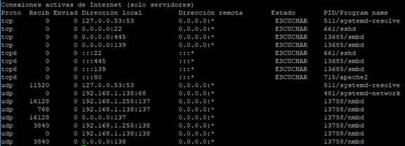

## Comprovació del tallafocs

Si ens trobem darrera un tallafocs, convé comprovar si és actiu i si permet o no els ports que necessita Samba per a funcionar. En cas de UFW:

    sudo ufw app info Samba

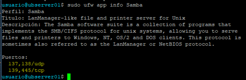

## Arxiu de configuració de Samba

### Editar la configuració

Samba, igual que gairebé totes les aplicacions per a Linux, disposa d'un arxiu de text per a la seva configuració. Es tracta de l’arxiu:

    /etc/samba/smb.conf

Tot i que el fitxer de configuració de samba és força extens, per començar a utilitzar  samba, hem de fer molt pocs canvis. 

### Crear una còpia de seguretat

Crearem una copia de l’arxiu de configuració per si l’hem de necessitar.

    sudo cp /etc/samba/smb.conf /etc/samba/smb.conf.bak

### Comprobar configuración samba

Podemos comprobar que la configuración es correcta:

```
testparm
```

### Seccions

L'arxiu de configuració es divideix en seccions identificades per un nom entre claudàtors. Hi ha tres seccions especials que són [global], [homes] i [printers].

- [global] és la secció principal. Ens permet configurar els paràmetres generals del servei.
- [homes] ens permetrà compartir les carpetes home de cada usuari, perquè cada usuari pugui accedir a la seva carpeta home per la xarxa.
- [printers] ens permetrà compartir impressores.
Per compartir una carpeta, hem de crear una secció nova. El nom de la secció, serà el nom del recurs compartit. Exemple, si volem compartir la carpeta /home/comú-profes i cridar al compartit profes, hem crear una secció anomenada [profes].

### Una secció per a cada carpeta compartida

Cada vegada que es comparteix una carpeta, cal crear una secció denominada com es desitgi ja que aquest nom serà el nom del recurs compartit.

### Secció global

Les entrades relacionades amb la identitat de xarxa del servidor Samba i com ens autentiquem amb ell es troben a la secció `[global]` de l’arxiu de configuració de Samba.

El paràmetre més important per a definir com el servidor Linux interactua amb els sistemes Windows és el workgroup, que identifica el grup de treball o domini de Windows al que pertany el servidor Samba.

# 	GESTIÓ D’USUARIS DE SAMBA

La gestió d'usuaris de samba es realitza amb la comanda smbpasswd. Amb aquesta comanda, entre altres coses podrem crear i eliminar usuaris, canviar la contrasenya, etc.

## 3.1	Creació d'un usuari de samba

Per crear un usuari de samba hem d'utilitzar la comanda smbpasswd, però abans hem d'haver creat l'usuari a Linux. Exemple, suposem que volem crear en Linux a l'usuari sambauser:

Creació d'un usuari en Linux

    sudo adduser sambauser

Permetre que l’usuari utilitzi samba

Si desitgem que pugui gaudir dels serveis samba, hem de crear a com a usuari de samba executant el següent comanda:

    sudo smbpasswd -a sambauser

Amb l'opció -a indiquem que afegeixi a l'usuari. Tot seguit ens preguntarà dues vegades la contrasenya que volem posar a l'usuari. El raonable és que sigui la mateixa contrasenya que té l'usuari en Linux.

##	Consultar usuaris de samba

Amb la comanda:

    sudo pdbedit -v -L


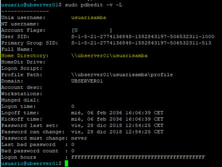

## 3.3	Eliminar un usuari de samba

Per eliminar un usuari de samba hem d'executar smbpasswd amb l'opció -x, exemple:

    sudo smbpasswd -x sambauser
  
Immediatament l'usuari haurà desaparegut de la base de dades de 'usuaris samba' tot i que seguirà sent un usuari de Linux

## 3.4	Creació de recursos compartits

Per a compartir les carpetes de home hi ha una secció que apareix per defecte comentada i l’hem de  modificar:

    sudo vim /etc/samba/smb.conf

El contingut hauria de ser el següent. Segons aquesta configuració:

- Per defecte els directoris home s’exporten com a només lectura.
- Si poguéssim crear arxius o directoris a la carpeta
  - Es faria amb permisos 0700.
  - És a dir, el propietari tendra control total, però ni els altres membres del grup ni la resta d’usuaris podran accedir a res.
- Es pot canviar a 0755 en cas que volguem que la resta d’usuaris de grup puguin escriure i llegir.

```ini
[homes]
Comment = Directoris home
Browseable = yes
Read only = no
Create mask = 0700
Directory mask = 0700
valid users = %S
```

Guardem i reiniciem el servidor:

    sudo systemctl restart smbd

Podem comprovar si hi tenim accés des d’un equip Windows, accedint a:

    \\servidor\sambauser\

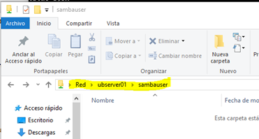

##	Crear un recurs compartit anònim

Podríem crear una carpeta compartida i assignar-li permisos. Es recomana que els arxius de servidors estiguin a `/srv`. Creem la carpeta:

    $ sudo mkdir /srv/samba

Canviem permisos de la carpeta:

    $ sudo chmod 777 /srv/samba/

Modifiquem l’ arxiu `/etc/samba/smb.conf`

```ini
[public]
  comment = accés anònim public
  path = /srv/samba/
  browsable =yes
  create mask = 0660
  directory mask = 0771
  writable = yes
  guest ok = yes
```

Reiniciar el servidor:

    sudo systemctl restart smbd
    sudo systemctl restart nmbd

## 3.6	Instal·lació del client

Podem accedir a una altra MV Linux que es trobi a la mateixa xarxa i configurar-lo com a client

Normalment a un servidor Linux s'instal·la per funcionalitats concretes com FTP, tallafoc, web, però també es pot instal·lar a través del gestor de paquets.

    sudo apt install smbclient

##	Comprovar recursos compartits

Una vegada creats, podem veure si s’han creat correctament o no:

    smbclient -L localhost

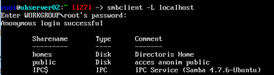

Podem crear qualcuns arxius de proves. Una vegada que haguem muntat correctament els nostres recursos compartits de samba, els arxius haurien d’estar accessibles

    touch /srv/samba/arxiu-public

## 3.8 Accés a la carpeta pública des de Windows

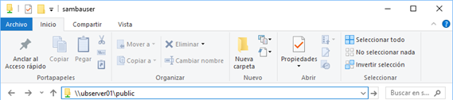

Comprovem que podem accedir sense contrasenya

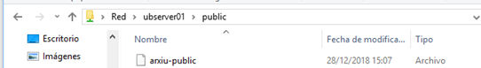

### Crear unitat de xarxa

Pot ser convenient crear una unitat de xarxa connectada a aquesta carpeta del servidor, per a tenir-la disponible com a unitat d’emmagatzemament.

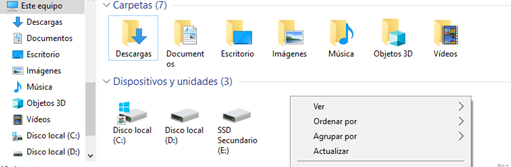

Al finalitzar, la carpeta ens apareixerà com una ubicació de xarxa:

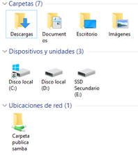

## 3.9	Crear arxius a la carpeta compartida

Podem comprovar si es poden crear arxius dins la carpeta.

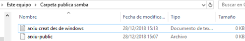

## 3.10	Comprovar permisos

Des del servidor, podem veure que s’ha creat l’arxiu al servidor i els permisos s’adjudiquen als arxius nous creats dins la carpeta:

Podem veure que els permisos son `660` i, per tant:

- El propietari por llegit i escriure
- Els membres del grup el poden veure i escriure
- Però no la resta d’usuaris.

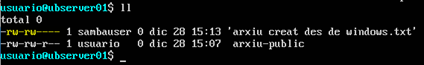

## 3.11	Connectar a un recurs des de Linux

Es pot posar directament l'adreça IP en lloc del nom del PC. Si està protegit amb contrasenya, cal afegir l'opció --user seguida del nom d'usuari i al executar la comanda demanarà la contrasenya.

    smbclient //servidor/public

Ens connectarà amb la carpeta remota i ens donarà una consola per executar comandes?

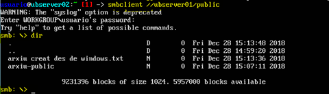

## 3.12	Pujar un arxiu

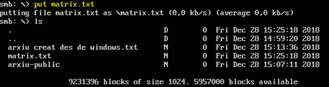

## 3.13	Utilitzant l’eina smbclient

Desde terminal, conectaríamos de la siguiente manera:

    smbclient //servidor/public

También podemos conectar y ejecutar comandos en una línea

Podem executar comandes amb una sola línea:

```
smbclient //servidor/public -c 'put nombredearchivo'
smbclient //servidor/public -c 'ls'
```

##	Descargar y subir archivos

```
smb:\> get archivo
getting file \archivo of size 0 as archivo (0,0 KiloBytes/sec) (average 0.0 KiloBytes/sec) 
```
Podemos comprobar que se ha descargado el archivo. Cabe recordar que, cuando estamos conectados utilizando el cliente samba, los comandos para listar contenidos son:

- `ls` lista el contenido remoto en la carpeta actual del servidor al que estamos conectados.
- `!ls` lista el contenido local del cliente desde el que nos estamos conectando.

Por tanto:

    smb:\> !ls


Luego podemos subir archivos o descargar al estilo FTP

    smb:\> put nombrearchivo

## Veure i accedir a recursos compartits amb Samba

Per escanejar la xarxa i trobar hosts SMB:

    sudo findsmb


Per tal de veure una representació textual dels veïnats de xarxa que tenen carpetes i impressores compartits: 

    sudo smbtree

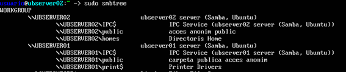

## 3.16	Llistar serveis oferts per un servidor

També podem obtenir una llista de serveis oferts per un servidor:

A un usuari anònim:

    smbclient -L servidor

Per a un usuari en concret:

    smbclient -L servidor -U sambauser

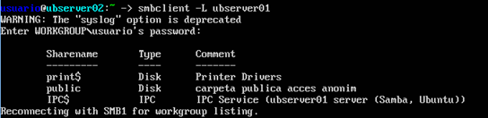

## 3.17	Muntar recursos compartits amb samba

El sistema GNU/Linux només pot treballar amb una jerarquia de directoris. Per tant, si volem accedir a diferents sistemes d’arxius, particions de discos o CD-ROM, entre altres, primer hem de muntar aquests elements en algun punt de la jerarquia.

Necessitem instal·lar un ajudant per a muntar sistemes d’arxius CIFS:

    sudo apt install cifs-utils

Si tenim problemes de bloqueig, podem utilitzar els següents (si no, no fer)

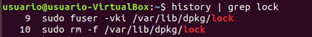

Crear un punt de muntatge a on muntarem el sistema d’arxius de la carpeta compartida per a poder operar des del client.

```bash
sudo mkdir /mnt/sambapublic/
```

Podem muntar-los en el nostre sistema de fitxers local com si fos un altre sistema d’arxius local o un sistema d’arxius NFS remot. Per a muntar-lo:

    sudo mount -t cifs -v //192.168.1.101/public /mnt/sambapublic
    
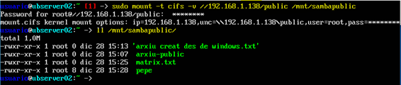

Si per qualsevol motiu necessitem autenticar-nos (no és el cas), podríem fer-ho així:

```bash
sudo mount -t cifs -v \
-o username=sambauser, password=pa$$w0rd,sec=none \
//192.168.1.101/public /mnt/sambapublic
```

Una vegada connectats, podem operar sobre aquesta carpeta com si fos una carpeta del sistema.

Amb la comanda `mount` podríem veure els punts de muntatge del sistema:

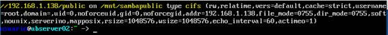

A partir de aquí, una vez montada la carpeta, podemos acceder a ella en `/mnt/sambapublic`, como si de una carpeta local se tratara. Para desmontar el recurso:

    sudo umount /mnt/sambapublic


-----------------------------------------------
-----------------------------------------------

# Crear recursos compartidos SAMBA
## Compartir las carpetas home
Configuración de smb.conf
```
[homes]
Comment = Carpetas home de usuarios
Browseable = yes
Read only = no
Create mask = 0700
Directory mask = 0700
valid users = %S
```
Se puede acceder a través de \\IPdelServer\nombre, donde nombre es el nombre del usuario con el que queremos acceder. Nos llevaría a la carpeta /home/nombre
## Compartir una carpeta públicamente

Crear carpeta en el servidor
```
mkdir -p /srv/samba/public
```
Configuración de permisos
```
sudo chown -R nobody.nogroup /srv/samba/public
sudo chmod -R 777 /srv/samba/public
```
Configuración de smb.conf
```
[isos]
  comment = carpeta compartida pública ISOs de SO
  path = /srv/samba/public
  browsable = yes
  directory mask = 0777
  writable = yes
  guest ok = yes
```
Se puede acceder a través de \\IPdelServer\isos. Nos llevaría a la carpeta del servidor: /srv/samba/public

