# Interconexión de redes públicas y  privadas

# Redes de acceso de fibra

- [Interconexión de redes públicas y privadas](#interconexi%C3%B3n-de-redes-p%C3%BAblicas-y-privadas)
- [Redes de acceso de fibra](#redes-de-acceso-de-fibra)
- [Redes de acceso](#redes-de-acceso)
- [Tecnologia fibra-coaxial](#tecnologia-fibra-coaxial)
- [Tecnología FTTH](#tecnolog%C3%ADa-ftth)
- [Arquitectura GPON](#arquitectura-gpon)
- [Enlace de conexión GPON](#enlace-de-conexi%C3%B3n-gpon)
- [Arquitectura conexión](#arquitectura-conexi%C3%B3n)
- [Instalación en edificios](#instalaci%C3%B3n-en-edificios)
- [Edificios sin ICT](#edificios-sin-ict)
- [Edificios con ICT](#edificios-con-ict)
- [Ventajas de GPON](#ventajas-de-gpon)
- [Ventajas frente a DSL](#ventajas-frente-a-dsl)
- [Inconvenientes](#inconvenientes)
- [Instaladores](#instaladores)
- [Hardware](#hardware)

# Redes de acceso

Resumen de tecnologías de acceso

Sobre par de cobre

- ISDN Red de Digital de Servicios integrados (RDSI)
- Digital Subscriber Line (ADSL, VDSL, etc)

Híbridos

- HFC (Híbrido Fibra-Coaxial)

Sobre fibra

- Redes ópticas pasivas (PON) (redes GPON, EPON)
- Fibra hasta el hogar (FTTH)

Sobre red eléctrica convencional

- Comunicaciones sobre la línea eléctrica (PLC)

# Tecnologia fibra-coaxial

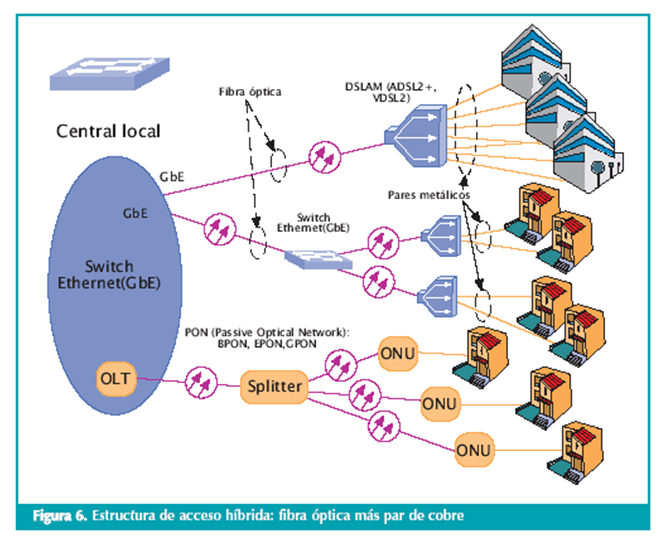

- Las redes HFC son redes formadas por una parte de fibra óptica y una parte de cable coaxial
- El abonado se conecta por cable coaxial a un nodo de zona
- Los nodos de zona se interconectan con fibra óptica
- La fibra termina en un dispositivo que transforma la señal óptica a eléctrica (coaxial)
- El dispositivo en la casa del abonado se conoce como cablemódem
- La velocidad real se aproxima mucho a las velocidades contratadas y baja latencia (ping)

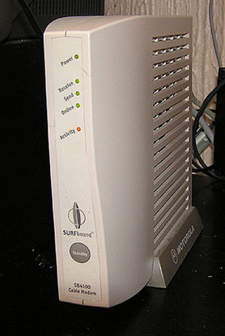

# Tecnología FTTH

Enlaza nuestra casa y la centralita de la operadora mediante un cable de fibra óptica.  
Anteriormente, se realizaba con cable de cobre
Hoy en día uso extendido de fibra para  conexiones domésticas. 
Alcanzan velocidades muy superiores al par de cobre (ADSL, etc.)

La fibra óptica:

- permite más ancho de banda (más velocidad)
- Es más resistente a interferencias
- Más segura

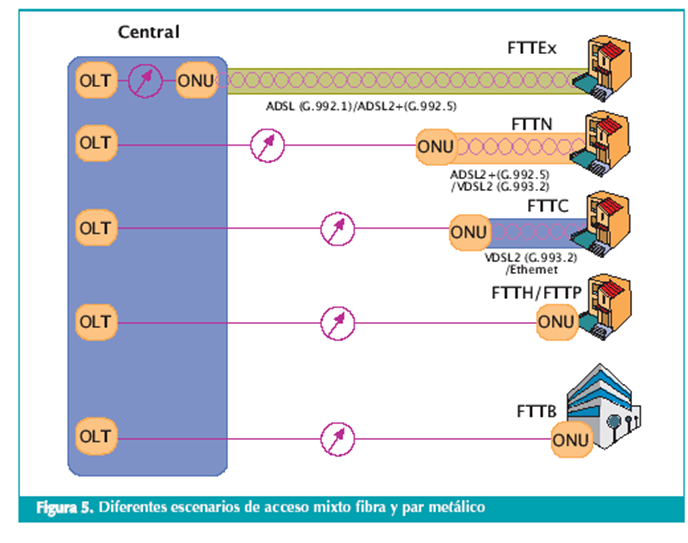

Sin embargo, la fibra es más cara y la instalación es más compleja y las herramientas para la instalación son más caras.

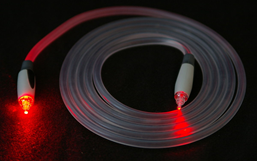
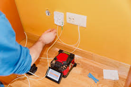
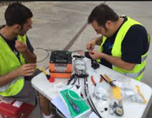

# Arquitectura GPON

Tecnología PON
Las redes FTTH se basan en una tecnología de redes ópticas pasivas conocida como PON (finales 90)
Se crearon varios estándares derivados, en función del funcionamiento, velocidad, etc: 
APON, BPON, GPON y EPON
Tecnología GPON
La más habitual es la GPON = Gigabit-capable passive optical network. 
Es una red óptica pasiva con capacidad gigabit (1Gbps)

# Enlace de conexión GPON

Enlace de conexión GPON

Un dispositivo situado en la centralita 
telefónica llamado OLT

Un dispositivo colocado en nuestra casa 
llamado ONT o ONU

Entre ellos se colocan unos divisores de fibra (splitters)

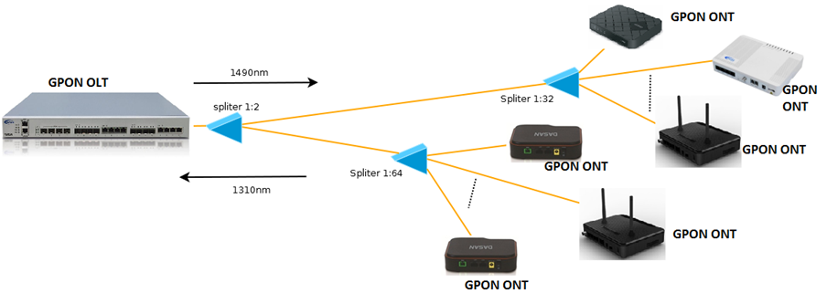

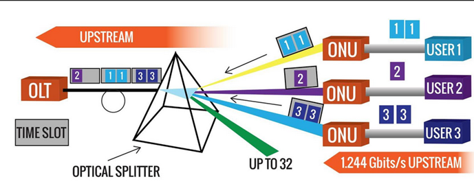

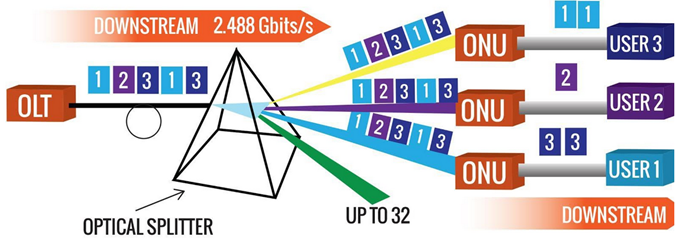

# Arquitectura conexión

En las centrales de las operadoras se encuentra alojado el OLT que envía la señal óptica desde el operador

Cada fibra que sale del OLT se va dividiendo a través de repartidores ópticos  (splitters) en más fibras

Al llegar al usuario, donde se instala un conversor óptico/eléctrico llamado ONT (normalmente integrado en el router)

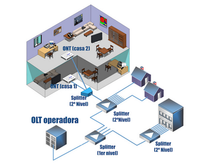

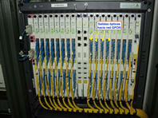

# Instalación en edificios

Dos posibilidades de instalación de equipos en edificio

- Edificios sin ICT
- Edificios con ICT

ICT = Infraestructura común de telecomunicaciones

# Edificios sin ICT

- El operador coloca el CTO en la fachada.
- Desde ella llega una única fibra monomodo hasta el abonado
- En la vivienda se instala una roseta de fibra óptica que se conecta al ONT

# Edificios con ICT

- El operador coloca el CTO en el RITI del edificio
- Mediante pigtail se conecta con las regletas de salida, de las que parten 2 fibras para cada abonado
- En la vivienda se coloca una roseta de fibra con 2 conectores
- Solo la fibra de color verde será la activada y se conectará al ONT. La otra queda de reserva

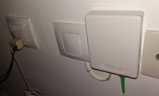

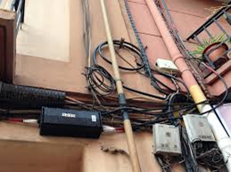

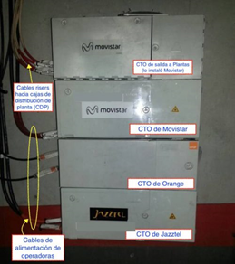

# Ventajas de GPON

Permite conexiones hasta 20 km 

Entre OLT y ONT. Antiguas xDSL hasta 5,5 km y 
velocidad caía rápidamente con la distancia. 
Usuarios alejados sufrían peor conexión en 
comparación con la velocidad contratada

No necesita equipos intermedios activos 

Entre el OLT y el ONT. Simplifica despliegue 
de la fibra y permite tipologías de red más 
sencillas y baratas

Reducción de costes

Permite envío de muchos servicios por la misma 
conexión de fibra

Más seguro 

Puesta que la información viaja encriptada por 
la fibra (AES)

Mantenimiento y operativa 

Más sencilla por parte de la operadora.
Permite gestión remota del ONT (equipo usuario), descarga de actualizaciones, configuración de parámetros de funcionamiento, etc.

# Ventajas frente a DSL

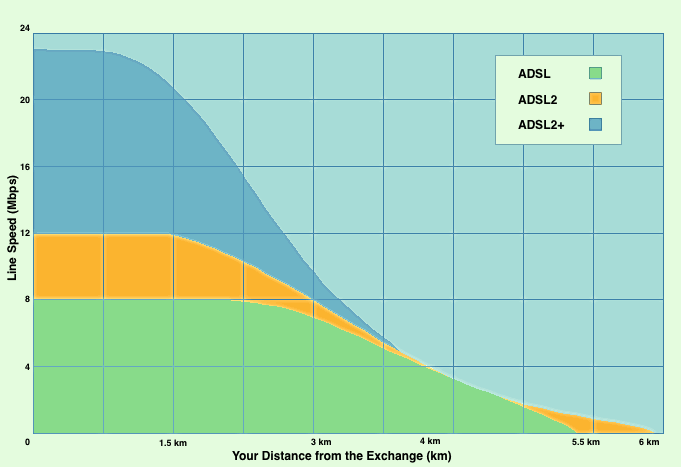

# Inconvenientes

- Instalación
- Hardware

# Instaladores 

- Deben tener cuidado con los empalmes. Se pueden producir pérdidas y atenuaciones
- Necesita personal especializado para trabajar con fibra
- Los conectores sucios o dañados pueden ocasionar problemas

# Hardware

- No podemos colocar el hardware que queramos.  
- En xDSL se podía comprar cualquier router.
- El ONT debe estar registrado en al OLT y no vale cualquier hardware
- Es necesario obtener claves de configuración y seguir un proceso para sustituir el router de la operadora por uno propio
