# Firewalls

- [Firewalls](#firewalls)
- [Concepto de cortafuegos](#concepto-de-cortafuegos)
- [Objetivos de un servicio de cortafuegos](#objetivos-de-un-servicio-de-cortafuegos)
- [Tipos de firewalls](#tipos-de-firewalls)
  - [De capa de red o de transporte (filtrado de paquetes)](#de-capa-de-red-o-de-transporte-filtrado-de-paquetes)
  - [De capa de enlace](#de-capa-de-enlace)
  - [De capa de aplicación](#de-capa-de-aplicaci%C3%B3n)
- [¿Cómo decidimos qué paquetes aceptar y cuales no?](#%C2%BFc%C3%B3mo-decidimos-qu%C3%A9-paquetes-aceptar-y-cuales-no)
- [Creación de reglas](#creaci%C3%B3n-de-reglas)
- [Sockets](#sockets)
- [Puertos](#puertos)
- [Puertos bien conocidos](#puertos-bien-conocidos)
- [Puertos registrados](#puertos-registrados)
- [Puertos privados](#puertos-privados)
- [Políticas](#pol%C3%ADticas)
  - [Política restrictiva](#pol%C3%ADtica-restrictiva)
  - [Política permisiva](#pol%C3%ADtica-permisiva)
- [Política por defecto](#pol%C3%ADtica-por-defecto)
- [Tráfico saliente y entrante](#tr%C3%A1fico-saliente-y-entrante)
- [Tráfico saliente y entrante](#tr%C3%A1fico-saliente-y-entrante-1)
- [Ejemplo práctico](#ejemplo-pr%C3%A1ctico)
- [Acciones](#acciones)
- [Condiciones](#condiciones)
- [Ejemplo](#ejemplo)
- [DMZ](#dmz)
- [DMZ o zona desmilitarizada](#dmz-o-zona-desmilitarizada)
- [Red perimetral](#red-perimetral)
- [DMZ expuesta](#dmz-expuesta)
- [DMZ protegida o cortafuegos compartido](#dmz-protegida-o-cortafuegos-compartido)
- [Posibles trabajos de investigación](#posibles-trabajos-de-investigaci%C3%B3n)

# Concepto de cortafuegos

Un cortafuegos actúa como una barrera o un 
muro de protección situado entre una red 
interna privada (intranet) y otra red externa 
e insegura como es Internet. 

Al instalarlo, se establece un conjunto de 
mecanismos de defensa en la máquina (servidor) 
utilizada para acceder a Internet; de esa 
forma quedan protegidas todas las máquinas que 
hay detrás de dicho servidor.

Hay cortafuegos que funcionan por hardware y 
otros que funcionan por software. 

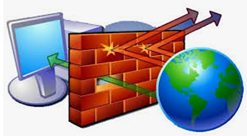

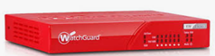

# Objetivos de un servicio de cortafuegos 

Garantizar que no se podrá acceder a los 
recursos internos desde el exterior sin 
permiso (archivos compartidos, impresoras de 
red, etcétera).

Filtrar los paquetes de entrada y salida, 
permitiendo o denegando el acceso según su  
origen o destino, tanto en lo que respecta a 
la IP como a los puertos

Utilizar herramientas de software para llevar 
un control sobre el tráfico de la red

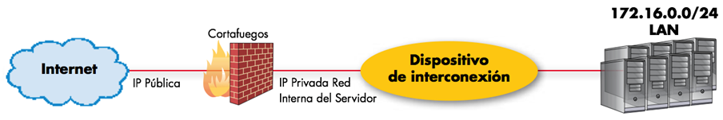

# Tipos de firewalls

## De capa de red o de transporte (filtrado de  paquetes)

Funciona a nivel de red (nivel 3) como filtro 
de paquetes IP

Filtros según los distintos campos de los 
paquetes IP: dirección IP origen. dirección IP 
destino.

Filtros de capa de transporte (nivel 4): 
puerto origen y destino

## De capa de enlace

Filtros a nivel de enlace de datos (nivel 2) 
como la dirección MAC

## De capa de aplicación

Trabaja en el nivel de aplicación (nivel 7), 
por ejemplo, si se trata de tráfico HTTP se 
pueden realizar filtrados según la URL a la 
que se está intentando acceder. 

# ¿Cómo decidimos qué paquetes aceptar y cuales no?

Permite examinar la dirección IP, así como los 
puertos de E/S de origen y destino (TCP o UDP) 
de cada paquete (en concreto, estudia la 
cabecera)

# Creación de reglas

Mediante un conjunto de reglas, el firewall 
acepta o rechaza los paquetes que le llegan a 
través de las interfaces de red. 

Las reglas se utilizan para cerrar el tráfico 
de paquetes hacia determinados puertos, 
mientras solo se dejan abiertos, única y 
exclusivamente, los que necesitan los 
servicios activados. 

# Sockets

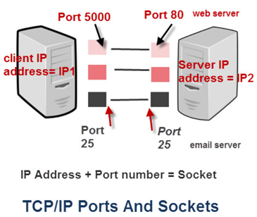

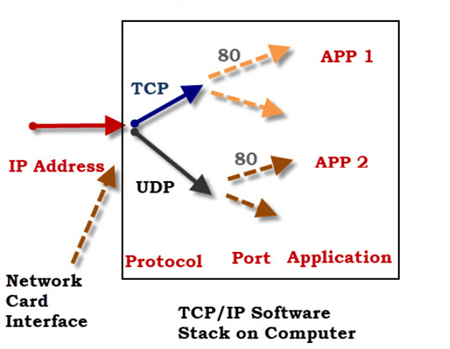

# Puertos

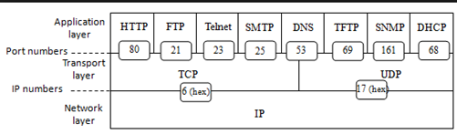

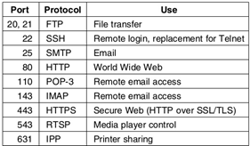

# Puertos bien conocidos

Puertos inferiores a 1024. Están reservados 
para servicios muy definidos, como telnet, 
SMTP, P0P3.

Estas asignaciones son fijas y no pueden ser 
utilizadas por otros servidos. A menudo estos 
puertos son llamados «puertos bien conocidos».

# Puertos registrados

Los puertos entre 1024 y 49151 son puertos 
registrados.

IANA intenta ordenar el uso de este rango, 
pero sin las restricciones que existen para 
los puertos bien conocidos.

# Puertos privados

Puertos numerados entre 49152 y 65535. Son 
puertos privados de los que se puede disponer 
para cualquier uso.

# Políticas

Un firewall se configura para impedir el 
acceso no autorizado a una determinada zona de 
una red o dispositivo

Pero que al mismo tiempo permite el paso a 
aquellas comunicaciones autorizadas.

La implementación puede ser de software o de 
hardware, y ambas tienen dos posibles 
políticas a la hora de aplicarse:

## Política restrictiva

Impide todo el tráfico 
salvo el autorizado expresamente en la 
configuración.

## Política permisiva

Permite el paso de toda 
comunicación salvo la expresamente prohibida.

# Política por defecto

Una cadena de reglas de firewall no suele 
cubrir todas las condiciones posibles. 

Las cadenas de firewall siempre deben tener 
una política predeterminada especificada, que 
consiste solo en una acción (aceptar, rechazar 
o eliminar).

Rechazar por defecto (deny)

Si cualquier computadora fuera de su oficina 
intentara establecer una conexión SSH con el 
servidor, el tráfico se eliminaría porque no 
cumple con las condiciones de ninguna regla.

Aceptar por defecto (allow)

Si la política predeterminada estuviera 
configurada para aceptar, cualquier persona, 
excepto sus propios empleados no técnicos, 
podría establecer una conexión con cualquier 
servicio abierto en su servidor

# Tráfico saliente y entrante

El tráfico puede ser entrante (inbound) o 
saliente (outbound) desde el punto de vista 
del servidor.

El firewall mantiene un conjunto distinto de 
reglas para cada caso. 

El tráfico que se origina en otra parte, el 
tráfico entrante, se trata de manera diferente 
al tráfico saliente que envía el servidor. 

¿Cuándo utilizar o no reglas para tráfico 
saliente?

Es típico que un servidor permita la mayor 
parte del tráfico saliente porque el servidor 
suele ser, en sí mismo, confiable. 

Para evitar la comunicación no deseada en el 
caso de que un atacante o un ejecutable 
malicioso pongan en peligro un servidor.

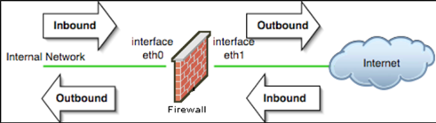

# Tráfico saliente y entrante

Para maximizar los beneficios de seguridad de 
un firewall:

Identificar todas las formas en que desea que 
otros sistemas interactúen con el servidor

Crear reglas que lo permitan explícitamente 

Eliminar todo el tráfico restante 

Las reglas de salida apropiadas deben estar 
implementadas para que un servidor se permita 
enviar acuses de recibo a las conexiones 
entrantes apropiadas. 

Un servidor normalmente necesita iniciar su 
propio tráfico saliente por varias razones, 
por ejemplo, descargar actualizaciones o 
conectarse a una base de datos, es importante 
incluir esos casos en su conjunto de reglas 
salientes.

El tráfico de red que atraviesa un firewall se 
compara con las reglas para determinar si se 
debe permitir o no a través de ellas. 

# Ejemplo práctico

Supongamos que tiene un servidor con esta 
lista de reglas de firewall que se aplican al 
tráfico entrante:

Acepte el tráfico entrante nuevo y establecido 
a la interfaz de red pública en los puertos 80 
y 443 (tráfico web HTTP y HTTPS)

Descarte el tráfico entrante de las 
direcciones IP de los empleados no técnicos en 
su oficina al puerto 22 (SSH)

Acepte el tráfico entrante nuevo y establecido 
desde el rango de IP de su oficina a la 
interfaz de red privada en el puerto 22 (SSH)

Funcionamiento general de un firewall

Interconexión redes públicas y privadas

# Acciones

La primera palabra en cada uno de estos 
ejemplos es "aceptar", "rechazar" o "soltar“ 
(ACCEPT, REJECT, DROP)

Especifica la acción que debe realizar el 
firewall en caso de que una parte del tráfico 
de la red coincida con una regla. 

ACCEPT: Aceptar significa permitir que pase el 
tráfico

REJECT: Rechazar significa bloquear el tráfico 
pero responder con un error "inalcanzable" 

DROP: Descartar significa bloquear el tráfico 
y no enviar ninguna respuesta. 

# Condiciones

El resto de cada regla consiste en la 
condición de que cada paquete coincida.

Funcionamiento general de un firewall

Interconexión redes públicas y privadas

Funcionamiento general de un firewall

El tráfico de red se compara con una lista de 
reglas de firewall en una secuencia, o cadena, 
de la primera a la última. 

Una vez que una regla coincide, la acción 
asociada se aplica al tráfico de red en 
cuestión. 

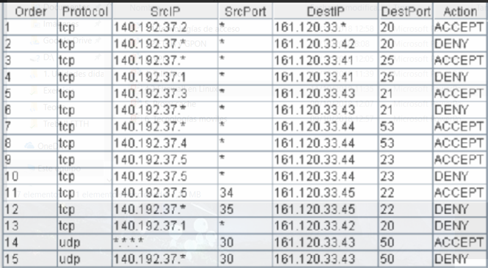

# Ejemplo

Si un empleado de contabilidad intentara 
establecer una conexión SSH con el servidor, 
serían rechazados en base a la regla 2, 
incluso antes de que se verifique la regla 3. 

Sin embargo, se aceptaría un administrador del 
sistema porque solo coincidirían con la regla 
3.

Acepte el tráfico entrante nuevo y establecido 
a la interfaz de red pública en los puertos 80 
y 443 (tráfico web HTTP y HTTPS)

Descarte el tráfico entrante de las 
direcciones IP de los empleados no técnicos en 
su oficina al puerto 22 (SSH)

Acepte el tráfico entrante nuevo y establecido desde el rango de IP de su oficina a la interfaz de red privada en el puerto 22 (SSH)

# DMZ

# DMZ o zona desmilitarizada

Es una red local que se ubica entre la red 
interna de una organización y una red externa, 
generalmente internet

En ella se ubican los servidores HTTP, DNS, 
FTP y otros de carácter publico. 

Habitualmente usa dos cortafuegos, donde la 
DMZ se sitúa en medio y se conecta a ambos 
cortafuegos.

La política de seguridad para la DMZ es la 
siguiente:

El trafico de la red externa a la DMZ esta 
autorizado y a la red interna esta prohibido.

El trafico de la red interna a la DMZ esta 
autorizado y a la red externa esta autorizado.

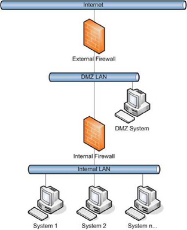

# Red perimetral 

Es el modelo más seguro, costoso y completo. 

Requiere de una experiencia mayor a la hora de 
configurarla, ya que podemos intercalar tantos 
cortafuegos en cascada como la empresa 
requiera. 

Dispone de al menos dos equipos 
estranguladores que encierran la DMZ (Zona 
desmilitarizada) en un espacio intermedio 
menos restrictivo que la intranet.

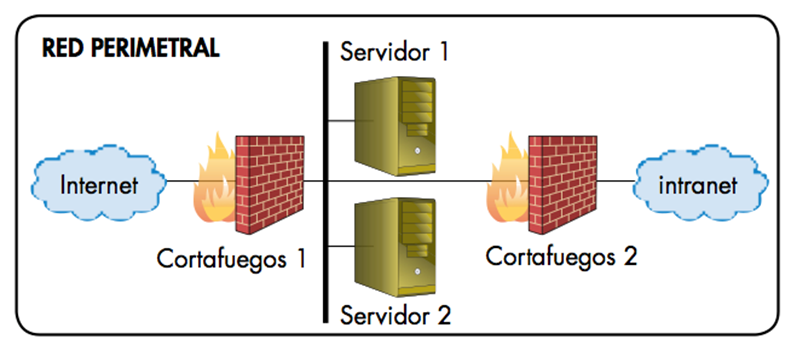

# DMZ expuesta

No dedica recursos a proteger los servidores 
públicos de la empresa

Solo se centra en blindar la intranet.

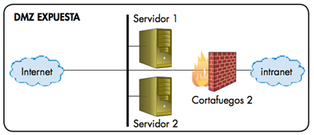

# DMZ protegida o cortafuegos compartido

El modelo más básico y menos costoso, pero 
menos seguro

Exige que la DMZ y la intranet tengan el mismo 
nivel de seguridad. 

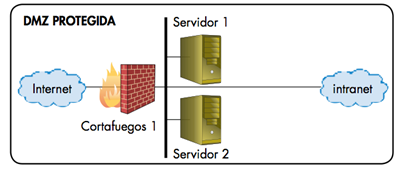

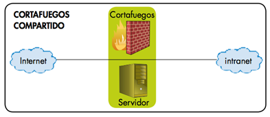

# Posibles trabajos de investigación

- Cable submarino, instalación (Joan, Eduardo, Ángel)
- Fusión de fibra óptica. Proceso (Zacariya, Robert, Miquel)
- Instalación de fibra en el hogar (Helen, José M, Geraldine)
- Instalación y opciones de un router ADSL (Víctor, Ismael, Alejandro)
- Instalación y opciones de un router FTTH (Rafel, Iván, Luis)
- Comparativa ofertas ADSL y fibra óptica (Jordi, Cristian, Fernando, Raúl)
- Conecta balear, fibwi y WiMAX (Arnau, Jaume M, Daniel)
- Fabricación fibra óptica, tipos (José Juan, Daniel, Carlos)
- Instalación redes PLC (Aaron, David, Rafa, Nehuen)
