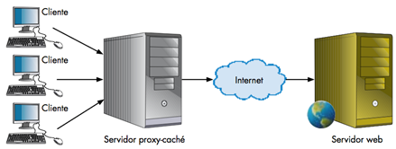
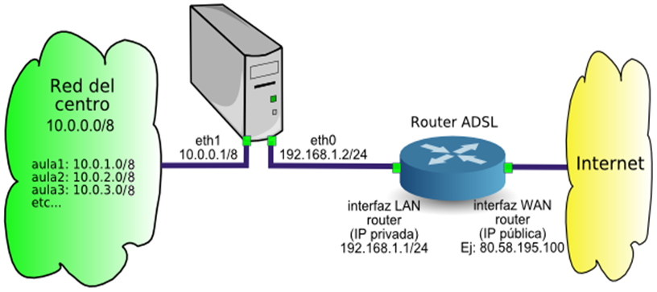
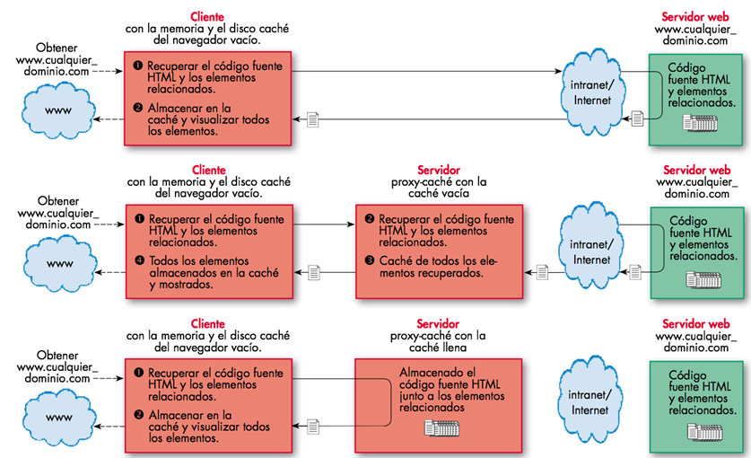

# Introducción

¿Qué es un proxy – caché?

Con esta denominación se conoce al servidor cuyo objetivo es la centralización del tráfico entre Internet y una red local. Actúa como una pasarela a nivel de aplicación. 
Cada uno de los ordenadores de la red local no tiene necesidad de disponer de una conexión directa a Internet. 
También se utiliza para controlar los accesos no permitidos desde Internet hacia la red local. 

## Ventajas de utilizar un proxy - caché

Mayor velocidad de navegación. 
Uso más eficiente de la línea de 
     conexión con Internet. 
Cortafuegos de contenidos. 
Filtrado de servicios. 

## ¿Cómo funciona?

- Un proxy de conexión a Internet es un servidor que hace de intermediario entre los PCs de la red y el router de conexión a Internet
- Cuando un usuario quiere acceder a Internet, su PC realiza la petición al servidor Proxy y es el Proxy quien  realmente accede a Internet. 
- Posteriormente, el proxy enviará los datos al PC del usuario para que los muestre en su pantalla. 
- El PC del usuario no tendrá conexión directa con el router, sino que accederá a Internet por medio del proxy.

# Posibilidades del proxy

Los PCs de los usuarios no tienen acceso al router, todas las comunicaciones exteriores pasarán por el Proxy, 
lo que nos permitirá tener las comunicaciones bajo control. Podemos permitir o denegar el acceso web, ftp, 
email, messenger, p2p, etc...

Las páginas se cachean en la memoria temporal del proxy lo cual acelera la descarga cuando varios usuarios 
acceden a las mismas páginas a la vez. 

Esta circunstancia se da mucho en los centros educativos cuando el profesor está explicando un tema y todos los 
alumnos acceden a la vez a la misma página.

Es fácil crear una lista de urls prohibidas a las que el proxy denegará el acceso.

# ¿Qué podemos hacer con un proxy?

Permite crear una lista de palabras prohibidas en url. El proxy denegará el acceso cuando se introduzcan en 
formularios de búsqueda o en la barra de direcciones.

Se puede permitir o denegar el acceso a subredes o a PCs concretos. Si diseñamos la red de forma que cada aula 
del centro tenga un rango determinado, por ejemplo 10.0.X.Y donde X es el número de aula e Y el número de PC, 
sería posible permitir o denegar la conexión a Internet aula por aula.

El proxy guarda informes de todas las conexiones que hacen los usuarios. Al principio puede ser interesante ver 
a qué páginas de contenido inadecuado acceden nuestros alumnos, para agregarlas a la lista de urls prohibidas.

Los PCs de nuestra red están más seguros de ataques externos ya que el proxy hace de barrera cortafuegos

# Inconvenientes

- Necesario configurar aplicación por aplicación
- Para que las aplicaciones accedan a Internet a través del proxy, es necesario configurar cada aplicación: - navegador web, cliente ftp, cliente de correo, etc...
- Todas las comunicaciones con el exterior pasarán por el servidor. 
- Si el proxy falla, la red se quedará sin conexión a Internet. 
- Es recomendable conveniente disponer de un proxy de repuesto.
- El proxy requiere mantenimiento. 
- Para que todo funcione, es necesario que exista un administrador de la red que se encargue de actualizar, - revisar, mantener y reparar el proxy cuando deje de funcionar.

# Ejemplo de funcionamiento 

# Proxy squid

La herramienta software Squid es el servidor proxy caché más extendido entre las diferentes distribuciones 
basadas en GNU/Linux. 

Puede hacer de Proxy caché con los protocolos HTTP, FTP y SSL, y también de proxy transparente, para lo que se 
puede utilizar como caché para DNS. 

Su principal función, no obstante, consiste en soportar el protocolo ICP (Internet Cache Protocol), que permite 
la integración y comunicación de servidores caché. 

Además, puede establecer una jerarquía, de manera que el fallo de un servidor caché se supla con la colaboración de los restantes. 

# Monitorizar proxy

Existen varios mecanismos con los que llevar a cabo un seguimiento de la actividad de Squid, como los propios archivos de log y herramientas específicas que, haciendo uso de la información almacenada, generan informes completos de actividad. 

# Log principal

Archivo `/var/log/squid/cache.log`

Para saber si Squid funciona de manera correcta, basta con visualizar las últimas entradas de este archivo, en el que se reflejan todas las incidencias en el arranque del servicio, así como diversos problemas de funcionamiento e incidencias en la parada del servicio. Para visualizar las últimas entradas del archivo se utiliza la orden: # tail /var/log/squid/cache.log

# Log de acceso

Archivo `/var/log/squid/access.log`

Contiene todas las peticiones servidas por el proxy a los navegadores web (clientes). Se puede consultar de la forma siguiente: # more access.log | grep DENIED

Las líneas de este archivo de log contienen una serie de códigos que empiezan por TCP_ para indicar que se trata de peticiones HTTP. 

Los códigos más usuales son los siguientes: 

