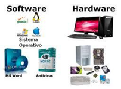
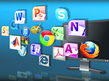
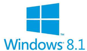
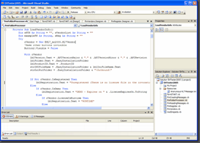
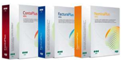
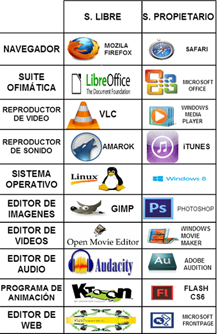
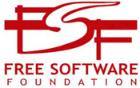
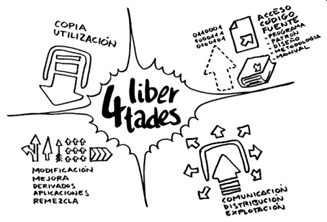

# Software

Parte lógica del ordenador
Programas
Instrucciones 
Reglas informáticas
Datos asociados
Información

# Tipos de software

Software de base
Software de programación
Software de aplicación

# Software de sistema

Aísla detalles específicos de el ordenador particular
Constituido principalmente por:
Sistema operativo: 
Base software de un ordenador
Permite trabajar con el ordenador 
Instala el resto de tipos de software
Drivers o controladores de dispositivos
Permiten que el SO se comunique con los periféricos

# Software de desarrollo

Programas que permiten crear otros programas 
Ayudan al programador a escribir un software nuevo
Lenguajes de programación: 
Java, C #, C ++, Pascal, Cobol, PHP, ASP, etc.

# Software de aplicación

Se ejecutan sobre el SO
Permiten que los usuarios realicen tareas específicas 
procesadores de textos, bases de datos,  hojas de cálculo, presentaciones
Internet
compresores
programas educativo 
finanzas

# Software libre y propietario

Software libre
Da al usuario libertad sobre el
Usar, copiar, estudiar, modificar y distribuir
No implica que sea gratuito

Software propietario
Limitación de copia, modificación o distribución
Cualquiera que no cumple condiciones de software libre

# Las 4 libertades

Libertad 0: 
Uso programa con cualquier propósito
Libertad 1: 
Estudiar funcionamiento y adaptarlo
Libertad 2: 
Distribuir copias del programa
Libertad 3: 
Modificar y mejorar el programa
Haciendo público

# Libertad de uso 

El Software Libre se puede usar para lo que se quiera, sin ningún tipo de limitación
No se puede discriminar a ninguna persona o grupo de personas, ni restringir el uso del programa para una finalidad determinada.
Se puede usar el programa comercialmente, si se quiere.
Tiene que estar permitido también hacer un uso privado del programa (usarlo en tu casa sin que nadie se tenga que enterar de que lo usas). 

# Libertad de análisis

Disponer del código fuente de los programas 
Para analizar qué hacen y cómo lo hacen
Para modificarlos
El código fuente sería la receta
Imprescindible para saber cómo se ha hecho la comida, qué contiene o hacer variaciones.

# Libertad de copia
Se puede 
Compartir el programa con quien se quiera
Distribuir CD o DVD, o otro medio
Difundir públicamente el programa (web)
Condiciones
Sin pedir permiso o informar a nadie
Gratis o no

# Libertad de modificación

Modificar libremente el programa:
Mejorar, traducir, cambiarle, personalizar, etc.
Compartir libremente versión modificada
Sin necesidad de
Pedir permiso a nadie
Informar de los cambios hechos
