# ¿Qué es Linux?

Un sistema operativo (como Windows)
Libre
Se puede modificar y mejorar libremente 
Código de programación abierto
Gratuito
No hay que pagar nada por el

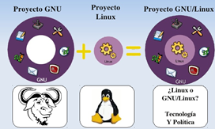

FSF y proyecto GNU

Iniciado por Richard Stallman (1984)
FSF (free software foundation)
Quiere conseguir software que el usuario pueda
Copiar, modificar y distribuir software
Entre otros, un SO
GNU
SO libre y gratuito

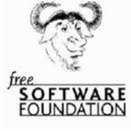

¿Cómo se mantiene?

Comunidad de desarrollo
Programadores aportan
Tiempo
Experiencia
De manera desinteresada
Patrocinios
Google y firefox
Donaciones
Servicios y soporte
Soporte técnico
Personalizaciones
Instalación
Formación para usarlo

# Historia del software libre y distribuciones

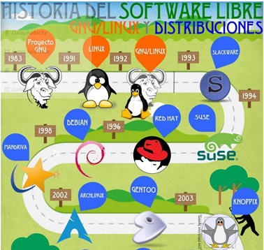

# Componentes de Linux

## Kernel

Núcleo del S.O.
Permite controlar el hardware de la máquina

## Entorno gráfico (DE)

Necesario para que el usuario lo use
Diferentes entornos:
Gnome, KDE, Beryl, Unity

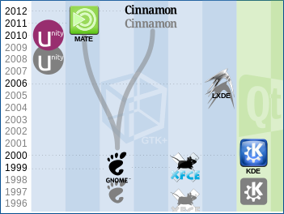

# Sistemas Linux

Desarrollo
Licencia GPL
Empresas, asociaciones y colectivos de personas
Kernel: base del SO (núcleo)
Versiones kernel + evoluciones =  versiones Linux
400 distribuciones: se adaptan a las necesidades
Edubuntu, Musix, 64 Studio, etc

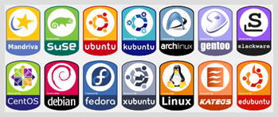

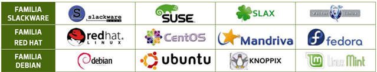

# Distribuciones Linux

Linux es libre
Modificar y mejorar libremente
Grupos de usuarios
Modifican a su gusto
Añaden 
Aplicaciones, utilidades, herramientas de instalación, etc
Crean una distribución y le ponen un nombre

https://distrowatch.com/

# Distribuciones CCAA

A las CCAA les interesa Linux
Es gratuito, no tienen que pagar licencias
Cada comunidad autónoma
Adapta una versión de linux a sus necesidades (colegios, ayuntamientos)
Elige las aplicaciones que quiere que tenga
Ofimática, facturación, etc
Crea una distribución propia
Linex,guadalinex,lliurex,max,linkat,etc

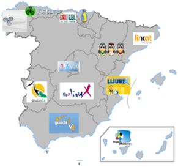

# Distribuciones CCAA más importantes

- Guadalinex (Guadalajara): Ubuntù+Gnome
- Lliurex (Comunitat valenciana): Edubuntu
- Molinux (Castilla la mancha): Ubuntu+Gnome
- Linex (Extremadura): Debian
- Max (Madrid): Ubuntu+GNOME
- Linkat (Generalitat de Catalunya): Suse linux + GNOME

Lista completa de distribuciones CCAA

# Ubuntu

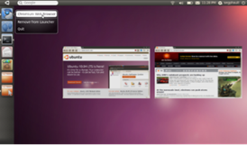

Es la distribución más popular hoy en día
Basada en debian
Instalado salas de informática
Gestor de arranque
Versión que utiliza consellería en los colegios y en los IES

# Arranque DUAL

- Dos SO: Windows y Linux
- Version de Linux: Ubuntu
- Más popular y mayor soporte

# Instalación de linux

## Imagen CD / DVD

Se descarga una imagen
Grabamos un CD/DVD
Arrancamos desde el CD y instalamos
Modifica el disco duro

## LiveCD

- No instala nada en el disco duro
- Arranca una versión de linux de prueba
- Al apagar, todo vuelve a estar como estaba

## Instalación desde Windows

- Se descarga un programa
- Como si fuera una aplicación de windows, se instala y desinstala
- Se puede desinstalar

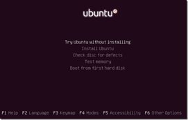

# Versiones Ubuntu

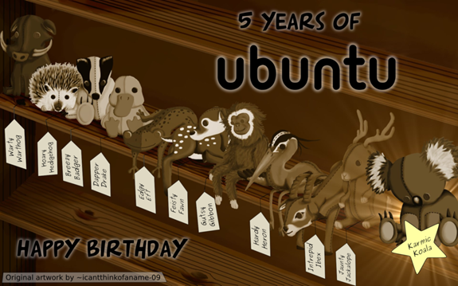

# Sistemas OS

- Lo encontramos en productos de **Apple**
- Sistema cerrado.
- Derechos desarrollo y comercialización propios
- Versiones actuales
  - OS X: PC
  - Mac OS X Server: Servidor
  - iOS 7: Móviles / tablets / smartphones

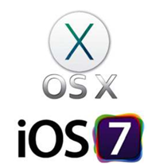

# Android

- Distribución de Linux para dispositivos portátiles
- Surge de la **Open Handset Alliance** 
- 84 compañías
- Estándares abiertos para móviles
- Orientado a dispositivos móviles
- Arquitecturas ARM
- Una única distribución Android
- Versión en función del dispositivo

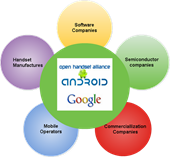

# Versiones

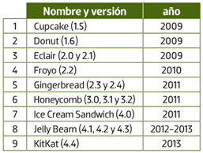

# Otros SO

## Google Chrome OS

Sistema código abierto (principalmente por Google)
Basado en linux

## Blackberry OS

Sistema cerrado para móviles blackberry

## Solaris

Origen propiedad de Oracle. OpenSolaris (código abierto)
Kernel basado en SunOS (derivado de UNIX)
Arquitectura x86 y SPARC

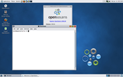
