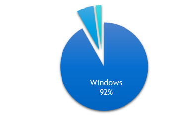
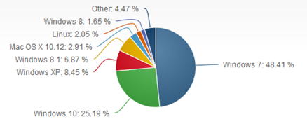
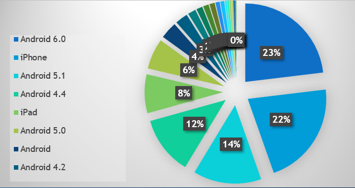
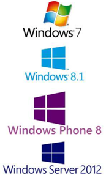
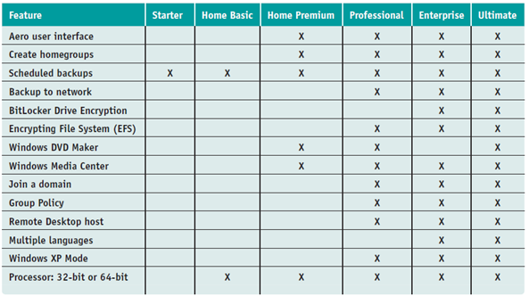
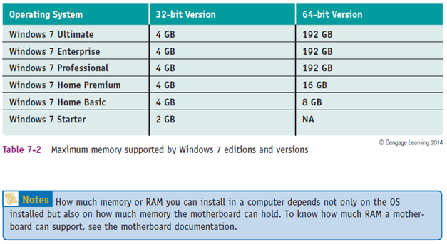

# SO actuales

Sistemas Windows
Sistemas Linux
Sistemas OS
Android
Otros

# SO dispositivos móviles

# SO Windows

Microsoft
Sistemas cerrados
Arquitecturas: 9X y NT (2000+)
Actualidad: integración
PC, portátil, Tablet, Smartphone
Misma interfaz y acceso a contenido

Sistemas actuales
Windows 7 y 8: Arq. x86 (32 bit) o x64 (64 bit)
Windows 10
Windows Server 2012 (servidores)
Windows Phone 8
Windows RT (móviles basados en ARM)

# Versiones Windows7

# Versiones y memoria soportada

