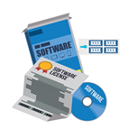
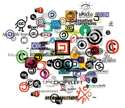
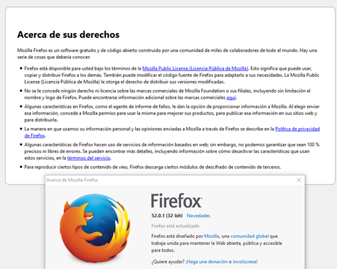
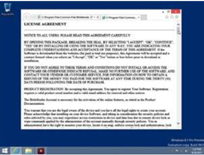
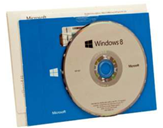
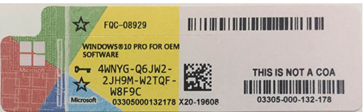
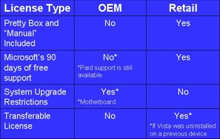

# Licencias de software

- Cada software tiene asociado un tipo de **licencia**
- La licencia establece condiciones, garantías y concesiones
- Una misma aplicación se puede distribuir con diferentes licencias
- Las aplicaciones **multilicencia** permite vertiente libre y propietaria

# Tipos de licencias

GNU/GPL
BSD
MPL (Mozilla public license)
Copyleft
Apache

# GNU / GPL 3.0

Permiso ilimitado para ejecutar el programa
Permite redistribuir el código objeto, siempre acompañado de las fuentes correspondientes
No obliga a divulgar las modificaciones hechas en el ámbito privado
El software carece de garantía y la licencia tiene una cláusula de limitación de responsabilidad
Se han de mantener intactos todos los textos relativos a los derechos de copyright sobre el código y la licencia
Incluye cláusulas de protección respecto a demandas por infracción de patentes 

# Licencia Apache 2.0

Uso con cualquier propósito
Distribuirlo, modificarlo y distribuir modificaciones
Sin copyleft: No requiere que las versiones modificadas tengan que ser distribuidas como software libre
Señalar cambios en los ficheros modificados
Compatible con GPLv3, (no anteriores)
Provisiones de protección respecto a patentes

# Licencias de sistemas operativos

## EULA 

- End User License Agreement
- Solo usuario que lo ha adquirido
- El usuario debe aceptar las condiciones de la licencia
- Restricciones de uso
- Derechos de autor y patentes
- El propietario puede recoger información

## GNU/GPL

Modificaciones distribuidas bajo licencia GNU/GPL
Permite Copia, Modificación, Redistribución
Sin costo por licencia
No ofrece garantías
Puede venderse o cobrar por servicios sobre software

# Distribución de licencias propietarias

## Retail

- Venta directa a usuario final
- No limitada a un equipo concreto
- Podemos venderla o cederla para otro equipo
- El soporte lo da el fabricante del SO

## OEM (Original Equipment Manufacturer)

- Ligada al equipo con la que viene
- No se puede vender o ceder sin el equipo
- Suele ser más barata
- El soporte lo da el vendedor del equipo
- Software preinstalado: OEM por lotes

## Comparativa

