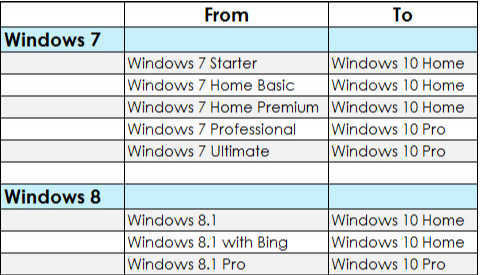

- [Instalación de sistemas operativos](#Instalaci%C3%B3n-de-sistemas-operativos)
  - [Tipos de instalación](#Tipos-de-instalaci%C3%B3n)
    - [Instalación normal (limpia)](#Instalaci%C3%B3n-normal-limpia)
    - [Actualización](#Actualizaci%C3%B3n)
    - [Downgrade](#Downgrade)
    - [Migración](#Migraci%C3%B3n)
  - [Entornos de instalación](#Entornos-de-instalaci%C3%B3n)
    - [Virtual](#Virtual)
    - [No virtual](#No-virtual)
  - [Instalación atendida vs desatendida](#Instalaci%C3%B3n-atendida-vs-desatendida)
    - [Atendida](#Atendida)
    - [Desatendida](#Desatendida)
  - [Ficheros o imágenes](#Ficheros-o-im%C3%A1genes)
  - [Clonación](#Clonaci%C3%B3n)
  - [Creación de una imagen](#Creaci%C3%B3n-de-una-imagen)
  - [Carpetas compartidas](#Carpetas-compartidas)
  - [PXE (Preboot eXecution Environment)](#PXE-Preboot-eXecution-Environment)
    - [Herramientas PXE instalación SO](#Herramientas-PXE-instalaci%C3%B3n-SO)
  - [Proceso para la instalación de un SO](#Proceso-para-la-instalaci%C3%B3n-de-un-SO)

# Instalación de sistemas operativos

- Lugar: Local y Red
- Tipo: Instalación normal, Actualización, Downgrade
- Entorno: Virtual, no virtual
- Atención: Atendida o desatendida
- Modo: Mediante ficheros o mediante imágenes

## Tipos de instalación

### Instalación normal (limpia)

Durante el proceso de instalación se responde a una serie de preguntas relacionadas con la configuración del ordenador y los usuarios.

Una instalación normal se realiza cuando:

- No hay ningún SO en el ordenador
- Se instala un SO y se borra el anterior
- Se instala un SO junto con otro (sistema de arranque dual) - Dual boot

### Actualización

- Pasar de una versión de un SO a otra más actual añadiendo características nuevas
- Manteniendo los datos y los programas que estaban instalados en el ordenador 
- Algunos programas pueden no funcionar correctamente
- La mayoría de los SO permiten actualizar de una versión a otra superior 
- Antes de hacer una actualización 
- Comprobar requisitos PC para soportar el nuevo SO
- Recomendación: realizar una copia de seguridad de los datos 

### Downgrade

Instalar una versión anterior de un SO
Para que se puedan ejecutar determinadas aplicaciones 
En versiones más actuales de un SO no funcionan correctamente

### Migración

- Proceso para pasar de un SO a otro
- Pueden ser sistemas operativos de la misma familia o no
- No conservar los datos y programas Instalados 
- Para conservar los datos
- Hacer una copia de seguridad 
- En algún dispositivo (un CD, DVD, dispositivo USB, tarjeta de memoria

## Entornos de instalación

### Virtual

- El sistema operativo se instala en un entorno virtual. 
- La ventaja de virtualizar es que se pueden utilizar dos o más sistemas operativos de forma simultánea sin necesidad de reiniciar el equipo. 
- Instalar un sistema operativo en un entorno virtual es útil, por ejemplo, para poder ejecutar aplicaciones que funcionan con sistemas operativos anteriores al sistema operativo principal. 

### No virtual

El sistema operativo se instala en un entorno no virtual.

## Instalación atendida vs desatendida

### Atendida

Es necesario estar delante del ordenador 
Respondiendo a preguntas para configurar la instalación

### Desatendida

- No es necesario estar delante del ordenador respondiendo a preguntas
- Se utiliza un archivo de respuesta 
- Contiene información que necesita el sistema operativo para instalarse correctamente. 
- Se puede pasar a través de un dispositivo USB.

## Ficheros o imágenes

- Mediante ficheros
- De un modo u otro el sistema operativo necesita ficheros para funcionar
-Al instalarlo se copian estos ficheros en el disco duro del ordenador. 
- Mediante imágenes
- Imagen = archivo que:
- contiene la estructura y toda la información 
- De un disco duro, una partición, un dispositivo USB, un CD/DVD, etc.
- Se realiza creando una copia completa sector por sector. 
- Se utilizan para crear copias exactas de discos, particiones, etc. 
- El proceso de crear una copia exacta se denomina clonación. 

## Clonación

- Funcionamiento clonación con imágenes: 
- Instalar el SO + drivers y programas en el disco duro del PC
- Saca una imagen del disco o de la partición (máster)
- Volcar en cualquier otro disco duro de cualquier ordenador (local o red)
- Instalar la estructura de un HDD en otro sin instalación
- Volcar imagen en un PC o en varios
- Forma rápida de instalar un SO en un equipo que no lo tenga o que se tenga que cambiar.
- Si lo que se desea es hacer un clon de un disco con el que arrancar el equipo, se deberá clonar todo el disco.

## Creación de una imagen

Consejos

- Antes, desfragmentar el disco duro (se eliminan espacios vacíos)
- Después, de crear la imagen máster hay que probarla en algún PC
- Para clonar un disco, ¡mismo HW!
- HW del PC de la imagen máster (origen)
- HW del PC  donde se vuelca la imagen (destino)
- Algunos programas que sirven para clonar, también 
- Dejan añadir drivers de distintos componentes hardware a una imagen
- Permite reconocer hardware distinto al del PC del que se sacó la imagen. 
- Recomendación: sólo instalar los drivers necesarios (no ensuciar la imagen)
- Realizan compresión
- Es recomendable que las imágenes no ocupen demasiado
- Se reduce tiempo de volcado

## Carpetas compartidas

Son un recurso para compartir información a través de la red. 
Esta forma de instalación es típica de una red, un ordenador que ya tiene un sistema operativo previamente cargado comparte un recurso en red. 
Algunas posibles formas de compartir recursos son: 
Compartir una unidad de CD/DVD. 
En otro ordenador de la red se comparte la unidad CD/DVD
Copiar el contenido del CD/DVD de instalación en una carpeta. 
El contenido de la instalación está en una carpeta que se comparte. 

## PXE (Preboot eXecution Environment)

- Se basa en comunicación cliente - servidor
- PC que soporta PXE se comporta como cliente 
- Envía petición al servidor solicitando la asignación de una IP
- El servidor que tiene DHCP asigna una dirección IP al cliente
- Envía un programa para arrancar la instalación utilizando TFTP 
- Programa de arranque contiene ubicación de los archivos de instalación
- El cliente puede ya descargar esos archivos.
- Herramientas PXE instalación SO
- Windows Deployment Services (WDS). 
- Permite una implantación y adopción rápida de los sistemas operativos Windows.
- Se puede utilizar para instalar máquinas nuevas a partir de una instalación basada en red.
- No hay que estar presente físicamente en cada máquina
- No hay necesidad de instalar el SO directamente desde un CD o un DVD. 
- En anteriores versiones de Windows se utilizaba RIS (Remote Installation Services)

### Herramientas PXE instalación SO

PXELINUX

El entorno PXE utiliza DHCP + conexión TCP/IP básica + descarga TFTP

El programa de arranque carga y configura el kernel de acuerdo a directivas que son obtenidas también desde el servidor TFTP.

Se usa para 
- Instalaciones de Linux desde un servidor de red central
- Para arrancar estaciones de trabajo sin disco
Herramientas PXE instalación SO
Acronis Snap Deploy
Crea una imagen exacta de los discos de la configuración estándar
Incluyendo el sistema operativo, los archivos de configuración y todas las aplicaciones. 
Despliega la imagen en varios sistemas de manera simultánea
Ideal para realizar instalaciones rápidas desde cero

## Proceso para la instalación de un SO

- Planificación de la instalación
- Requisitos hardware
- Preparar el ordenador para la instalación. 
- Arranque
- Disco duro. 
- Particiones
- Dar formato
- Ejecución de la instalación
- Parámetros básicos de la instalación
- Selección de aplicaciones básicas a instalar
- Configuración posterior a la instalación
- Gestor de arranque
- Configuración
- Configuración de drivers
- Configuración de red
- Configuración de actualizaciones y antivirus
- Personalizar el sistema operativo
- Documentación de la instalación

