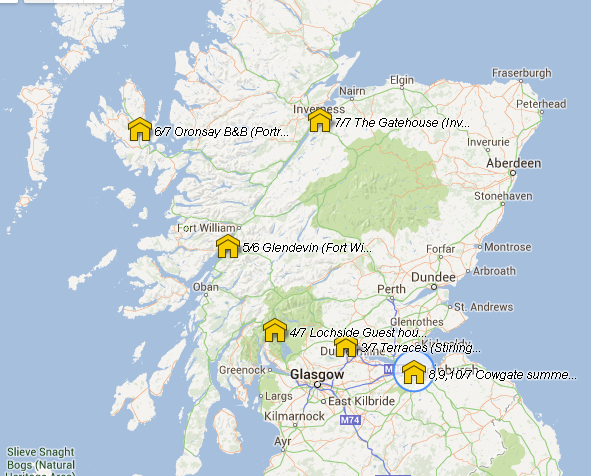

# Viaje Escocia 2013

- [Viaje Escocia 2013](#viaje-escocia-2013)
  - [Mapa del recorrido](#mapa-del-recorrido)
  - [Calendario](#calendario)
  - [Hoteles](#hoteles)
  - [3 de Julio (miércoles) : Llegada a Stirling](#3-de-julio-mi%C3%A9rcoles--llegada-a-stirling)
    - [Castillo de Stirling](#castillo-de-stirling)
    - [Monumento a William Wallace](#monumento-a-william-wallace)
    - [Ruta en Stirling:](#ruta-en-stirling)
    - [Noche en Terraces Hotel en Stirling](#noche-en-terraces-hotel-en-stirling)
  - [4 de Julio (Jueves): Visita a los lagos Lommond y Katrina](#4-de-julio-jueves-visita-a-los-lagos-lommond-y-katrina)
    - [Castillo de Doune](#castillo-de-doune)
    - [Noche: Lochside Guest House](#noche-lochside-guest-house)
  - [5 de Julio (Viernes): Luss, Inveraray, Fort William](#5-de-julio-viernes-luss-inveraray-fort-william)
    - [Bracklinn falls bridge](#bracklinn-falls-bridge)
    - [Dunstaffnage Castle](#dunstaffnage-castle)
    - [Noche: Glendevin, cerca de Fort William](#noche-glendevin-cerca-de-fort-william)
  - [6 de Julio (Sábado): Cruzar a Isla de Skye y dormir allí](#6-de-julio-s%C3%A1bado-cruzar-a-isla-de-skye-y-dormir-all%C3%AD)
    - [Noche: Oronsay B&B, Portree](#noche-oronsay-bb-portree)
  - [7 de Julio (Domingo): Broadford, Lago Ness, Inverness](#7-de-julio-domingo-broadford-lago-ness-inverness)
    - [Noche: The Gatehouse (Inverness)](#noche-the-gatehouse-inverness)
  - [8 de Julio (Lunes): Inverness, St Andrews, Edimburgo](#8-de-julio-lunes-inverness-st-andrews-edimburgo)
    - [Check in hotel](#check-in-hotel)
    - [Devolución coche](#devoluci%C3%B3n-coche)
    - [Noche: Destiny Scotland - Cowgate](#noche-destiny-scotland---cowgate)
  - [9 de Julio (Martes): Edimburgo](#9-de-julio-martes-edimburgo)
  - [10 de Julio (Miércoles): Edimburgo](#10-de-julio-mi%C3%A9rcoles-edimburgo)
  - [Día 9 (Mierc 11 Julio) Edimburgo y vuelta](#d%C3%ADa-9-mierc-11-julio-edimburgo-y-vuelta)

## Mapa del recorrido

## Calendario

3 de Julio (miércoles) : Llegada  a Stirling
4 de Julio (Jueves): Visita a los lagos Lommond y Katrina
5 de Julio (Viernes): Luss, Inveraray, Fort William
6 de Julio (Sábado): Cruzar a Isla de Skye y dormir allí
7 de Julio (Domingo): Broadford, Lago Ness, Inverness
8 de Julio (Lunes): Inverness, St Andrews, Edimburgo
9 de Julio (Martes): Edimburgo
10 de Julio (Miércoles):  Edimburgo
Día 9 (Mierc 11 Julio) Edimburgo y vuelta

## Hoteles

## 3 de Julio (miércoles) : Llegada  a Stirling

Detalles Vuelo de Ida
Desde Palma Mallorca (PMI) a Edinburgh (EDI)
Wed, 03Jul13 Vuelo FR6657 Salida PMI a 11:20 y llegada EDI a 13:25

Llegamos a Edimburgo a la 1 y media, 2 y pico recogiendo las maletas si no hay retrasos.

### Castillo de Stirling

Cuesta 15 libras. Abren de 9:30 a 18:00. Se calculan unas 2 horitas (quizá un poco menos para ver el castillo bien)

Más info: http://explorandoelmundo.wordpress.com/2013/05/26/visita-a-stirling-y-su-castillo-medieval/

### Monumento a William Wallace

Desde el castillo se puede aprovechar e ir a ver este monumento.

### Ruta en Stirling:

Visitar castillo y subir hasta la esplanada para ver las vistas. Bajar hasta el centro de Stirling por la calle principal. Degustar pints y cenar en el pub del hotel Portcullis, entre el castillo y el cementerio, para luego continuar hasta el Puente de Stirling: Old Bridge o Stirling Bridge.

Bajar hacia Argyll’s Lodging, entrada incluida con la del castillo, para ver como vivía la nobleza local. Visitar el cementerio local, la ruina d Mar’s Wark, la antigua cárcel Old Town Jail, y así hasta el centro.

Una vez abajo, en 10mins a pie nos plantamos en el puente de Stirling,que sustituye al que William Wallace usó estratégicamente para derrotar a los ingleses el 11.09.1927.

Y siguiendo por Causewayhead Road terminamos en el monumento a William Wallace.

Si nos sobra tiempo y energía, podemos acercarnos a la University of Stirling y tomar una pint más en The Wallace, un pub con mucho encanto junto a la carretera que lleva al campus.

Y si aún asi sobrara tiempo, tenemos el campo de batalla de Bannochburn, donde sucedieron las batallas más importantes y donde encontramos la estatua de Robert The Bruce.

### Noche en Terraces Hotel en Stirling

Se puede entrar a partir de las 14:00 a 22.30h
Internet gratis en las habitaciones.

## 4 de Julio (Jueves): Visita a los lagos Lommond y Katrina

Salimos de Stirling

Itinerario: Stirling, Dourne, Callander, Loch Katrine, Loch Lommond (Balloch)

### Castillo de Doune

Hasta el lago Katrine hay aproximadamente 57 km (1 horita), desde nuestro hotel de Stirling.
De camino paramos a ver el castillo de Doune (Invernalia). Tiene un parking 300 metros antes, y abren de 9:30 a 17:30 todos los días de la semana. La entrada vale 5.50 libras

Luego bajaríamos del lago katrine al lago Lommond para terminar durmiendo en Arrochar

Lago Katrine: se llega a Trossach Pier del Loch Katrine. Dicen aparcamiento muy caro. Pero hay dos excursiones en barco, de 1 y 2h, o se pueden alquilar bicis y bordear el lago. Vistas preciosas. También llamado “la Señora del Lago”. 

La única vía de acceso en coche al Loch Katrine, es por Aberfoyle, Kinlochard y Stronachalachar. La ruta que bordea el lago y sale en Google maps no es para tráfico rodado → no se ve a penas el lago.

### Noche: Lochside Guest House

Entrada de 14 a 22h. Internet gratis en las habitaciones

## 5 de Julio (Viernes): Luss, Inveraray, Fort William

Itinerario: Luss, Inveraray, Oban, Fort William

Luss: pequeño pueblo pintoresco en la orilla oeste del Loch Lomond. Avenida principal de pequeñas tiendas, iglesia muy antigua y muelle desde donde salen barcos excursión para ver Loch Lomond.

Inveraray: pueblo a la orilla del Loch Fyne. Se puede visitar el castillo de Inveraray (10 pounds each adult with gardens, without 8 pounds).

Oban: se puede visitar la catedral de St. Columba, la destilería de Oban, el castillo Dunollie , el castillo Dunstaffnage y la Torre de McCaig (pequeño coliseo, único interesante son las vistas de la isla de Mull al atardecer).

Vistas desde el castillo de Dunollie: dicen que 4 pounds por persona es muy caro para lo que hay que ver. Simplemente ver las vistas, los ferrys yendo y viniendo
Destillery Oban: £7.50 adult (visita obligada!).

###	Castillo de Kilchurn

### Bracklinn falls bridge

### Dunstaffnage Castle

### Noche: Glendevin, cerca de Fort William

## 6 de Julio (Sábado): Cruzar a Isla de Skye y dormir allí

Itinerario: Fort William,  Ferry a Isla de Skye (Mallaig-Armadale)

Tarifas Web con la info

### Noche: Oronsay B&B, Portree

## 7 de Julio (Domingo): Broadford, Lago Ness, Inverness

Salimos de Portree y llegamos a Inverness

Itinerario: Uig, Broadford, Elienan Donan Castle, Falls fayers, Urquihart Castle, inverness

### Noche: The Gatehouse (Inverness)

## 8 de Julio (Lunes): Inverness, St Andrews, Edimburgo

Salimos de Inverness y llegamos a Edimburgo.

Itinerario: 

Inverness
Elgin
Dufftown
Huntly Castle
Dunnotar Castle
Glamis Castle
St. Andrews (catedral)

### Check in hotel

20h o antes: Dejar material en el hotel
Antes de ir al aeropuerto de Edimburgo a devolver el coche, vamos al hotel a dejar maletas, y 
hacer check in. La residencia tiene como tope las 20h.

Tenemos 2 reservas (las 2 con booking). Se pagan las noches de hotel en destino.

- Dia 8
- Días 9 y 10

### Devolución coche

21h o antes: Aeropuerto edimburgo

Hay 22 minutos hasta el aeropuerto desde la residencia (poco menos de 13 km)

Tenemos establecida como hora de devolver el coche las 21h, aunque esta habierto hasta las 23:30. Hay que mirar si tenemos que repostar antes y donde.

### Noche: Destiny Scotland - Cowgate

## 9 de Julio (Martes): Edimburgo

## 10 de Julio (Miércoles):  Edimburgo

## Día 9 (Mierc 11 Julio) Edimburgo y vuelta

VUELTA

Hay tiempo de visitar la ciudad. Hay que comprobar cómo llegar desde el hotel al aeropuerto, frecuencias y tiempo de antelación.

Desde Edinburgh (EDI) a Palma Mallorca (PMI)
Thu, 11Jul13 Vuelo FR6656 Salida EDI a 13:40 y llegada PMI a 17:35
