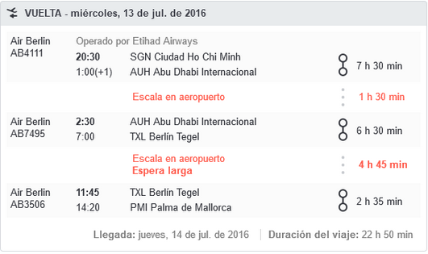

# Viaje a vietnam

- [Viaje a vietnam](#Viaje-a-vietnam)
  - [Preparativos](#Preparativos)
    - [Cambio de moneda](#Cambio-de-moneda)
    - [Planning](#Planning)
  - [Día 01 (19/06/16) - Palma / Berlín / Abu Dhabi](#D%C3%ADa-01-190616---Palma--Berl%C3%ADn--Abu-Dhabi)
    - [Vuelo Palma - Abu Dhabi](#Vuelo-Palma---Abu-Dhabi)
  - [Día 02 (20/06/16) - Abu Dhabi a Ho Chi Minh](#D%C3%ADa-02-200616---Abu-Dhabi-a-Ho-Chi-Minh)
    - [Taxi aeropuerto - ciudad](#Taxi-aeropuerto---ciudad)
    - [Hotel](#Hotel)
    - [Cena](#Cena)
  - [Día 03 (21/06/16) - Ho Chi Minh](#D%C3%ADa-03-210616---Ho-Chi-Minh)
  - [Día 04 (22/06/16) - De Ho Chi Minh a Hanoi](#D%C3%ADa-04-220616---De-Ho-Chi-Minh-a-Hanoi)
    - [Vuelo Ho Chi Minh - Hanoi](#Vuelo-Ho-Chi-Minh---Hanoi)
    - [Hotel](#Hotel-1)
  - [Día 05 (23/06/16) - Pagoda del perfume](#D%C3%ADa-05-230616---Pagoda-del-perfume)
  - [Día 06 (24/06/16) - Hanoi a Sapa](#D%C3%ADa-06-240616---Hanoi-a-Sapa)
    - [Transfer a Hanoi Central](#Transfer-a-Hanoi-Central)
    - [Tren nocturno a Sapa](#Tren-nocturno-a-Sapa)
  - [Día 07 (25/06/16) - Sapa (I) Visita poblado Cat Cat](#D%C3%ADa-07-250616---Sapa-I-Visita-poblado-Cat-Cat)
    - [Hotel en Sapa](#Hotel-en-Sapa)
  - [Día 08 (26/06/16) - Sapa (II) Excursión por Sapa](#D%C3%ADa-08-260616---Sapa-II-Excursi%C3%B3n-por-Sapa)
  - [Día 09 (27/06/16) - Sapa a Hanoi](#D%C3%ADa-09-270616---Sapa-a-Hanoi)
    - [Bus limusine Sapa - Hanoi](#Bus-limusine-Sapa---Hanoi)
    - [Hotel en Hanoi](#Hotel-en-Hanoi)
  - [Día 10 (28/06/16) - Hanoi a crucero de Halong (I)](#D%C3%ADa-10-280616---Hanoi-a-crucero-de-Halong-I)
    - [Crucero](#Crucero)
    - [Tarde](#Tarde)
    - [Noche](#Noche)
  - [Día 11 (29/06/16) - Crucero de Halong (II)](#D%C3%ADa-11-290616---Crucero-de-Halong-II)
  - [Día 12 (30/06/16) - Vuelta de Halong a Hanoi](#D%C3%ADa-12-300616---Vuelta-de-Halong-a-Hanoi)
  - [Día 13 (01/07/16) - Hanoi](#D%C3%ADa-13-010716---Hanoi)
    - [Comida](#Comida)
  - [Día 14 (02/07/16) - Hanoi a Hue (I)](#D%C3%ADa-14-020716---Hanoi-a-Hue-I)
    - [Vuelo Hanoi - Hue](#Vuelo-Hanoi---Hue)
    - [Comida](#Comida-1)
    - [Cena](#Cena-1)
  - [Día 15 (03/07/16) - Hue (II): Ciudadela](#D%C3%ADa-15-030716---Hue-II-Ciudadela)
  - [Día 16 (04/07/16) - De Hue (III) a Hoi an](#D%C3%ADa-16-040716---De-Hue-III-a-Hoi-an)
    - [Montañas del Mármol](#Monta%C3%B1as-del-M%C3%A1rmol)
    - [Check-in hotel](#Check-in-hotel)
    - [Comida](#Comida-2)
    - [Cena](#Cena-2)
    - [Hotel](#Hotel-2)
  - [Día 17 (05/07/16) - Hoi An (II): Playa](#D%C3%ADa-17-050716---Hoi-An-II-Playa)
    - [Comida](#Comida-3)
    - [Cena](#Cena-3)
  - [Día 18 (06/07/16) - Hoi An (III)](#D%C3%ADa-18-060716---Hoi-An-III)
  - [Día 19 (07/07/16) - Viaje Da Nang a Ho Chi Minh](#D%C3%ADa-19-070716---Viaje-Da-Nang-a-Ho-Chi-Minh)
    - [Vuelo Da Nang - Ho Chi Minh](#Vuelo-Da-Nang---Ho-Chi-Minh)
    - [Hotel Town House 23](#Hotel-Town-House-23)
    - [Cena](#Cena-4)
  - [Dïa 20 (08/07/16) - Delta del Mekong día 1](#D%C3%AFa-20-080716---Delta-del-Mekong-d%C3%ADa-1)
  - [Día 21 (09/07/16) - Delta del Mekong día 2](#D%C3%ADa-21-090716---Delta-del-Mekong-d%C3%ADa-2)
  - [Día 22 (10/07/16) - Viaje Ho Chi Minh a Siem Reap](#D%C3%ADa-22-100716---Viaje-Ho-Chi-Minh-a-Siem-Reap)
    - [Vuelo a Camboya](#Vuelo-a-Camboya)
    - [Cena](#Cena-5)
  - [Día 23 (11/07/16) - Siem Reap (I)](#D%C3%ADa-23-110716---Siem-Reap-I)
  - [Día 24 (12/07/16) - Siem Reap (II)](#D%C3%ADa-24-120716---Siem-Reap-II)
  - [Día 25 (13/07/16) - Siem Reap (III)](#D%C3%ADa-25-130716---Siem-Reap-III)
    - [Vuelo a Ho Chi Minh](#Vuelo-a-Ho-Chi-Minh)
  - [Día 26 (14/07/16) - Ho Chi Minh y vuelta a España](#D%C3%ADa-26-140716---Ho-Chi-Minh-y-vuelta-a-Espa%C3%B1a)
  - [Vuelta a España](#Vuelta-a-Espa%C3%B1a)

## Preparativos

### Cambio de moneda

- Cambiamos en España con la empresa global exchange
- Cambiamos 246 euros por 250 USD
- Nos envían el dinero a casa en sobre

### Planning

- Día 01 (19/06/16) - Palma / Berlín / Abu Dhabi
- Día 02 (20/06/16) - Abu Dhabi a Ho Chi Minh
- Día 03 (21/06/16) - Ho Chi Minh
- Día 04 (22/06/16) - De Ho Chi Minh a Hanoi
- Día 05 (23/06/16) - Pagoda del perfume
- Día 06 (24/06/16) - Hanoi a Sapa
- Día 07 (25/06/16) - Sapa (I) Visita poblado Cat Cat
- Día 08 (26/06/16) - Sapa (II) Excursión por Sapa
- Día 09 (27/06/16) - Sapa a Hanoi
- Día 10 (28/06/16) - Hanoi  a crucero de Halong (I)
- Día 11 (29/06/16) - Crucero de Halong (II)
- Día 12 (30/06/16) - Vuelta de Halong a Hanoi
- Día 13 (01/07/16) - Hanoi
- Día 14 (02/07/16) - Hanoi a Hue (I)
- Día 15 (03/07/16) - Hue (II): Ciudadela
- Día 16 (04/07/16) - De Hue (III) a Hoi an
- Día 17 (05/07/16) - Hoi An (II): Playa
- Día 18 (06/07/16) - Hoi An (III)
- Día 19 (07/07/16) - Viaje Da Nang a Ho Chi Minh
- Dïa 20 (08/07/16) - Delta del Mekong día 1
- Día 21 (09/07/16) - Delta del Mekong día 2
- Día 22 (10/07/16) - Viaje Ho Chi Minh a Siem Reap
- Día 23 (11/07/16) - Siem Reap
- Día 24 (12/07/16) - Siem Reap
- Día 25 (13/07/16) - Siem Reap
- Día 26 (14/07/16) - Ho Chi Minh y vuelta a España

## Día 01 (19/06/16) - Palma / Berlín / Abu Dhabi

Todo el trayecto de Palma a Ho Chi Minh City durará 22h 50 min

### Vuelo Palma - Abu Dhabi

- 14:45 a 18:25 - Vuelo Palma a Berlin (Air Berlin)
- 21:50 a 06:00 - Vuelo Berlín a Abu Dhabi (Etihad airways)

## Día 02 (20/06/16) - Abu Dhabi a Ho Chi Minh

- 6:00 a 08:10 - Espera en el aeropuerto de abu dhabi. Café en aeropuerto.
- 8:10 a 19:00 - Vuelo Abu Dhabi a Ho Chi Minh City (5.650km). 
- Tramitar el visado y pasar por aduana
- Cambiar moneda a Dongs vietnamitas. Cambiamos Yenes y Euros (unos 1000)

### Taxi aeropuerto - ciudad

Taxi de Ho Chi Minh City Airport (SGN) al hotel. Compañía cualquiera. (130.000)

### Hotel

Check in en Hong Vina Luxury - (145 Ky Con , District 1, Ho Chi Minh, Vietnam)

### Cena

Cenamos de 2 Pho en un restaurante cercano. (132.000 VND)

22:00 - Dormir en el hotel

## Día 03 (21/06/16) - Ho Chi Minh

- Cappucino y coca cola en McCafe al lado de Notre Dame (40.000 + 15.000)
- Comida en Lemongrass (419.000)
- 16:30 a 17:30 - Compras en Saigon Square
- Dormir en Hong Vina Luxury - (145 Ky Con , District 1, Ho Chi Minh, Vietnam)

## Día 04 (22/06/16) - De Ho Chi Minh a Hanoi

### Vuelo Ho Chi Minh - Hanoi

Detalles del vuelo:
- 07:45 SGN Ho Chi Minh
- 09:50 HAN Ha Noi
- Duración: 2h 5m
- Precio: 3,328,000 VND
- Compañia: Vietjet

Damos una vuelta alrededor del lago Kiem

Nos tomamos un café en Highlands Coffee Hoan Kiem Lake

### Hotel

Dormir en Hanoi Charming 2 Hotel (31 Hang Ga Street, Hoan Kiem, Hanoi)

## Día 05 (23/06/16) - Pagoda del perfume

Dormir en Hanoi Charming 2 Hotel (31 Hang Ga Street, Hoan Kiem, Hanoi)

## Día 06 (24/06/16) - Hanoi a Sapa

14:30 a 15:30 - Comida en Highway 4 (25 Bát Sứ, Hàng Bồ, Hoàn Kiếm, Hà Nội, Vietnam)

Voy a buscar unos bocatas al lado del hotel para cenar.

### Transfer a Hanoi Central

Sobre las 20:30 nos recogen en el hotel y nos llevan en taxi hasta la estación de tren

### Tren nocturno a Sapa

A las 21:15 salimos con el tren nocturno de Hanoi Central a Lao Cai (Sapa)

## Día 07 (25/06/16) - Sapa (I) Visita poblado Cat Cat

- Sobre las 5:30 de la mañana llegamos a la estacion de Lao Cai
- Cogemos sun autobús de Lao Cai a Sapa (1 hora por 2$ en furgoneta compartida)

### Hotel en Sapa

Dormiremos en:

- Sapa Elegance Hotel 
- Adress:  3 Hoang Dieu Street, Lao Cai Province, Sa Pa

## Día 08 (26/06/16) - Sapa (II) Excursión por Sapa

Trekking contratado allí con guía

## Día 09 (27/06/16) - Sapa a Hanoi

VIsitamos las cataratas antes de salir con el coche.

### Bus limusine Sapa - Hanoi

- 15:30 - 21:30 Un autobús limusina nos lleva hasta el Hotel La Beaute de Hanoi
- Cenamos en el restaurante flagrante, cerca del hotel

### Hotel en Hanoi

- La Beaute De Hanoi Hotel
- Adress: 15A Trung Yen Lane - Dinh Liet, Hoan Kiem, Hanoi

## Día 10 (28/06/16) - Hanoi  a crucero de Halong (I)

### Crucero

- 7:45/ 8:15		Our guide will meet you at your hotel. The shuttle bus or private car pick up
- 12:00 / 12:30		"Arriving Tuan Chau marina. Welcome aboard the cruise. Refresh with our welcome drink.
Meet the captain, crew in the cruise briefing. Check into your cabin. Time to refresh and unwind. Set sail as
lunch is served. Join us for a typical local lunch in the dining room or at the outdoor dining area. Mingling
yourself in the stunning views of the Bay and it’s dramatic limestone islets as we sail through the calm emerald
waters heading to Maze cave

### Tarde

- Arrive at Maze cave (hang Mê Cung), explore the cave and find out how the cave was named a
maze. Reach to the peak point of the cave for a breath taking panoramic view of the bay.
- Back to the boat, our cruise will take you to a stunning tranquilizing isolated lagoon for swimming or just simply relaxing on the boat with our spa service and mingle in the picturesque seascape. Heading back toward the sleeping area"

### Noche

- Early evening "Early evening: Summit on the sundeck watching the sunset, enjoy our pre-dinner local wine appetizer. It’s ideal time to make acquaintance with new friends, sharing your traveling experience or simply watching the sunset.
- An authentic Vietnamese menu is served. After dinner, reward yourself with a large selection of cocktails at our bar, or take for you one of our onboard activities: book reading, games, movies, and squid fishing..."

## Día 11 (29/06/16) - Crucero de Halong (II)

- 6:30 "For the early risers join us for a Tai Chi session on the sundeck. Tai chi helps focus the mind and condition the body, joining Tai Chi session to full charge your energy for the day."
- 07:00 – 08:00		 Local breakfast is served 
- 8:00		Our guide will brief you information and the highlights about this fascinating floating village and its local community. Take your option either exploring the village yourself on kayak or comfortably capture the daily life of the fishermen on bamboo boat rowed by the locals.O
- 9:00		Check out the cabins, at your leisure while our cruise taking you pass by other beautiful highlights in the bay. 
- 10:00		You will join with our short class of Cooking demonstration, how to make spring rolls before an early lunch is served.
- 12:00		"Return to the shore and disembark from the cruise as our crew say farewell.
Transfer to minibus or private and return to Hanoi. Arrival back at your hotel approximately 16:30"
- 16:30		Llegada al Hotel

## Día 12 (30/06/16) - Vuelta de Halong a Hanoi

Al dejarnos comemos de puestos callejeros (bocata con pinchos). Nos comemos unos cuantos a 20.000 VND por bocata (con dos).

19:42 a 21:10 - Café en Highlands Coffee 
1 Tràng Tiền, Phan Chu Trinh, Hoàn Kiếm, Hà Nội, Vietnam)

## Día 13 (01/07/16) - Hanoi

10:30 a 11:10 - Café en Giang Cafe (39 Nguyễn Hữu Huân, Lý Thái Tổ, Hoàn Kiếm, Hà Nội, Vietnam)

Tomamos café con huevo

### Comida

12:25 a 13:45 - Comida en Orchid Cooking class & restaurant (25 Hàng Bạc, Hoàn Kiếm, Hà Nội, Vietnam)

21:30-22:30 - Yo me fui a correr alrededor del lago.

## Día 14 (02/07/16) - Hanoi a Hue (I)

07:50 a 9:05 - Taxi al aeropuerto Noi Bai (Hanoi)

### Vuelo Hanoi - Hue

Datos del vuelo:

- Flight VN 1541: Hanoi (HAN) > HUE (HUI)
- Departing 02 Jul - 09:00 AM Arriving 02 Jul - 10:10 AM Duration 01hr 10min Class Economy Aircraft
- Airbus A321-100/200 * Operated by - Vietnam Airlines
- Precio: 2,900,000 VND

Ya en Hue tomamos un café en **The One Coffee & Bakery** porque hacía mucho calor fuera.

### Comida

Comida en Golden Rice

### Cena

20:50 a 21:25 - Comida en **Elegant restaurant** (29 Võ Thị Sáu, Phú Hội, tp. Huế, Thừa Thiên Huế, Vietnam)

## Día 15 (03/07/16) - Hue (II): Ciudadela

- 12.55 a 14:30 - Comida en Family Home Restaurant (hue, 34 Nguyễn Tri Phương, Phú Nhuận, tp. Huế, Huế, Vietnam)
- 12.55 a 14:30 - Cena en Risotto Restaurant (14 Nguyễn Công Trứ, Phú Hội, tp. Huế Phú Hội tp. Huế Huế, Vietnam, Phú Hội, tp. Huế, Thừa Thiên Huế, Vietnam)

## Día 16 (04/07/16) - De Hue (III) a Hoi an

- 7.00. Vamos a desayunar en la cafetería del hotel. Hoy dejamos el hotel pilgrimage 
- 8.00. Recogida coche y tumbas Nos pasa a recoger un coche privado de classy Travel para ir a ver algunas de las tumbas de Hué
- 9.45. Tras visitar las tumbas, nos dirigimos hacia Hoi An por la autopista nacional que conecta el norte y sur de Vietnam 
- 11.15 - 11:50 -  Puerto de montaña Hải Vân Pass
Llegamos al paso de montaña que divide Hué y da Nang. Paramos en una cafetería con vistas a da Nang.

Pedimos un cà phê sữa đá, una coca cola y unas Pringles (20,20 y 40k)
Atravesamos Da Nang  dirigirnos hacia Hoi An, pasando por las montañas de mármol (Ngũ Hành Sơn). 

### Montañas del Mármol

La entrada nos cuesta 15.000 mas 15.000 por ascensor y trayecto. En total pagamos 120.000 (cogemos dos veces el ascensor)

### Check-in hotel

Pagamos al conductor 1.800.000 por el viaje de Hue a hoi An.
14.20 a 14:55 - Llegamos al hotel river suites hoi An para hacer el check in.

Datos del hotel:

- River suites hoi An Hotel
- (4 Nguyễn Du, Cẩm Phô, tp. Hội An, Quảng Nam, Vietnam)

### Comida

- 15:10 a 15:45 - Comida en **Bánh mỳ Phượng** (2B Phan Châu Trinh, Minh An, tp. Hội An, Quảng Nam, Vietnam)
- Los bocatas cuestan 20.000 VND y las cervezas 15.000 VND.
- Muy bueno pero un poco picante. 
- Comemos uno de barbacoa y otro de cerdo a la parrilla.

16.00 - Hotel y descanso 

Recien comidos, volvemos al hotel para darnos una ducha y hacer la siesta hasta que bajen las temperaturas. 

### Cena

19:35 a 21:20 - Cena en **Morning Glory**
(106 Nguyễn Thái Học, Minh An, tp. Hội An, Quảng Nam, Vietnam)

### Hotel 

21:45 - Llegada al hotel para dormir

## Día 17 (05/07/16) - Hoi An (II): Playa

7.30. Desayuno 

Compras por la calle hasta el puente japonés. Aprovechamos para visitar algún templo y pagoda con nuestros tickets de la ciudad antigua. 

Aprovechamos para comprar un juego de tazas 

- 08:50 a 09:30 - Café en **Mia Coffee** (20 Phan Bội Châu, Sơn Phong, tp. Hội An, Quảng Nam, Vietnam). Nos tomamos un café vietnamita con hielo y un coconut no se que.

### Comida

- 12:25 a 12:40 - Comida en Bánh mỳ Phượng (2B Phan Châu Trinh, Minh An, tp. Hội An, Quảng Nam, Vietnam)
- 13.00. Descanso en el hotel 

### Cena

- 19:55 a 21:30 - Cena en Morning Glory (106 Nguyễn Thái Học, Minh An, tp. Hội An, Quảng Nam, Vietnam)

## Día 18 (06/07/16) - Hoi An (III)

- 18:10 a 19:30 - Café y pastelitos en The Cargo Club (107-109 Nguyễn Thái Học, Minh An, tp. Hội An, Quảng Nam, Vietnam)
- 20:00 a 20:40 - Cena en Ba Le Well (45 Phan Châu Trinh, Minh An, tp. Hội An, Quảng Nam, Vietnam)
- 21:20 - Llegada al hotel River suites hoi An Hotel (4 Nguyễn Du, Cẩm Phô, tp. Hội An, Quảng Nam, Vietnam)

## Día 19 (07/07/16) - Viaje Da Nang a Ho Chi Minh

### Vuelo Da Nang - Ho Chi Minh

- Comemos en el Burger King del aeropuerto
- 13.20 - 14.35	"Vuelo Danang – Ho Chi Minh. (1h20m)
- Volamos con Vietjet Air (VJ651)"

### Hotel Town House 23

Hacemos check in en el hotel Town House 23. Pagamos todas las noches del hotel (2.559.000 con tarjeta)

### Cena

- 20:30 a 21:35 - Cena en Ichiba Sushi Vietnam (comida) 

## Dïa 20 (08/07/16) - Delta del Mekong día 1

- 13:30 a 13:45 - Comida en Ut Trinh Homestay (Hoà Ninh, Long Hồ, Vĩnh Long, Vietnam)
- 15:45 a 18:20 - Check in en el IBIS Hotel Can Tho (Tòa Nhà IRIS, 224 30 Tháng 4, Xuân Khánh, Ninh Kiều, Cần Thơ, Vietnam)
- 19:00 a 19:50 - Cena en Sao Hom (Hai Bà Trưng, Tân An, Ninh Kiều, Cần Thơ, Vietnam)

## Día 21 (09/07/16) - Delta del Mekong día 2

Mercado Can Tho y vuelta a HCMC 

- 6:00 Nos levantamos para preparar las maletas y dejar el hotel iris.
- 6.30 bajamos a desayunar para estar preparados en el lobby del hotel
- 7.15. Nos recoge el guía y nos lleva en coche hasta un muelle donde cogemos un barco hacia el mercado de can tho.

En media horita llegamos al mercado, nos dar una vuelta alrededor de él, y procedemos a ir hacia otro embarcadero. Nos deja delante de un homestay donde paramos a tomar un te y algo de fruta. 

Después cogemos unas bicicletas y damos un paseo de media hora por los caminos de alrededor, hasta llegar a un pequeño templo al lado de un árbol milenario. 

Volvemos otra vez a la barca y deshacemos el camino hasta la ciudad de can tho. Allí nos espera el chófer y comenzamos el camino de vuelta en coche a HCMC. 

A medio camino paramos a comer en un restaurante de carretera a unos 60 km de HCMC. Tras comer volvemos hacia nuestro hotel en la ciudad. 

Descansamos en la habitación hasta las 16.30, y decidimos dar un paseo por la zona de la catedral y la oficina de correos. Paramos a tomar unos frapuccinos en el McDonald's y aprovechamos para escribir y enviar las últimas postales. 

12:30 a 13:30 - Comida en Mekong Rest Stop 
(KM 1964+ 300 Quốc lộ 1A,Huyện Châu Thành, TIỀN GIANG, vietnam, Long An, tp. Mỹ Tho, Tiền Giang, Vietnam)

## Día 22 (10/07/16) - Viaje Ho Chi Minh a Siem Reap

- 08:20 a 10:30 - Museo de la guerra **War Remnants Museum**  (28 Võ Văn Tần, 6, Quận 3, Hồ Chí Minh, Vietnam))
- 12:15 a 12:35 - Comida en Cua Hang KFC (28 Võ Văn Tần, 6, Quận 3, Hồ Chí Minh, Vietnam)

### Vuelo a Camboya

Datos vuelo

- Salida: 16:30 (Ho Chi Minh)
- Llegada: 17:30 Siem Reap (Camboya)
- Vietnam Airlines

### Cena

- 20:10 a 21:10 - Cena en Chanrey tree restaurant (Pokambor Ave, Krong Siem Reap, Camboya)

## Día 23 (11/07/16) - Siem Reap (I)

A las 4:45 de la mañana nos recogen para ir a ver el amanecer en los templos de Angkor.

13:10 a 14:20 - Comida en **Traditional Khmer Food restaurant** 
(Krong Siem Reap, Camboya)

## Día 24 (12/07/16) - Siem Reap (II)

- 11:35 a 12:15 - Comida en Khmer Wooden House (Srah Srang, Camboya)
- 19:30 a 20:30 - Cena en Traditional Khmer Food restaurant (Krong Siem Reap, Camboya)

## Día 25 (13/07/16) - Siem Reap (III)

13:45 a 14:50 - Comida en Il forno (Pari's Alley, 16 The-Lane, Krong Siem Reap 63000, Camboya) 

### Vuelo a Ho Chi Minh

- Salida: 18:20 Siem Reap (Camboya)
- Llegada: 19:20 Ho Chi Minh (Vietnam)

## Día 26 (14/07/16) - Ho Chi Minh y vuelta a España

- 10:00 a 10:20 - Saigon square (últimas compras)
- 11:00 a 13:00 - Saigon Coffee Club (66 Nguyễn Du, Bến Nghé, Quận 1, Hồ Chí Minh)
- 14:00 a 14:20 - Ichiba Sushi Vietnam (comida) 
- 15:00 a 16:00 - Saigon Coffee Club (66 Nguyễn Du, Bến Nghé, Quận 1, Hồ Chí Minh)
- 16:00 a 17:00 - Ben Thanh market (últimas compras, camisetas en el exterior del mercado)

20:55 - Vuelo a Abu Dhabi

## Vuelta a España

- 17.00 Hotel Ho Chi Minh a Aeropuerto
- 20.30 Ho Chi Min - Abu Dhabi
- Espera Abu Dhabi (1:30)
- Vuelo Abu Dhabi - Berlin
- Espera Berlin (3:10)
- Berlin - Palma
- Llegada a Palma a las 14:20
