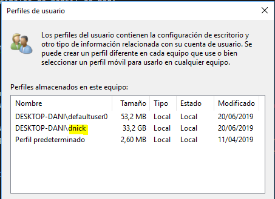

- [Usuarios](#Usuarios)
- [Perfil de usuario](#Perfil-de-usuario)
- [Ventajas de disponer de un perfil de usuario](#Ventajas-de-disponer-de-un-perfil-de-usuario)
- [Qué se guarda en un perfil](#Qu%C3%A9-se-guarda-en-un-perfil)
- [Tipos de perfiles](#Tipos-de-perfiles)
  - [Tipos de perfil de red](#Tipos-de-perfil-de-red)
    - [Perfil móvil](#Perfil-m%C3%B3vil)
    - [Perfil obligatorio](#Perfil-obligatorio)
    - [Perfil súper-obligatorio](#Perfil-s%C3%BAper-obligatorio)
  - [Ver el perfil de un usuario](#Ver-el-perfil-de-un-usuario)

# Usuarios

En un controlador de dominio con Windows Server se crean cuentas de usuario y de grupo que sirven para:

1. Identificar y autentificar las personas o usuarios que podrán acceder a los recursos del sistema.
2. Administrar y gestionar los permisos y privilegios que servirán para controlar los recursos de los usuarios a los recursos del sistema.

# Perfil de usuario

- Un perfil es un entorno personalizado específicamente para un usuario.
- Contiene configuración del escritorio y de los programas del usuario.
- Cuando se inicia sesión en un equipo por primera vez, se crea automáticamente un perfil para ese usuario.

# Ventajas de disponer de un perfil de usuario

- Múltiples usuarios pueden utilizar el mismo equipo, con la configuración de cada uno recuperada al iniciar la sesión al mismo estado en que estaba cuando cerró la sesión
- Los cambios hechos por un usuarios en el escritorio no afectan a otro usuario.
- Si los perfiles de usuarios se almacenan en un servidor pueden seguir a los usuarios a cualquier equipo de la red que ejecute Windows Server u otras versiones de Windows.

# Qué se guarda en un perfil

- Configuración local: Datos de programa, historial y archivos temp.
- Cookies.
- Datos de programa: Configuraciones especifícas de programa determinadas por el fabricante del programa.
- Entorno de red: Accesos directos a Mis sitios de red.
- Escritorio.
- Favoritos.
- Impresoras.
- Menú inicio.
- Mis documentos
- Plantillas: Plantillas de programas.
- Reciente: Archivos más recientes utilizados.
- SendTo: Elementos del menú Enviar a.

# Tipos de perfiles

- Perfil **local**: Solo accesible desde la estación de trabajo donde se ha creado
- Perfil **temporal**: Se crea por error en la carga del perfil de usuario
- Perfil **de red**: Los usuarios de Windows Server pueden acceder desde cualquier estación de trabajo.

## Tipos de perfil de red

Existen 3 tipos principales de perfil de red:

- Perfil móvil
- Perfil obligatorio
- Perfil superobligatorio

### Perfil móvil

- Gran ventaja para usuarios que utilizan habitualmente más de un equipo
- Permite que un usuario tenga el mismo escritorio, configuración de aplicaciones y configuración local en cualquier ordenador que ejecute Windows
- Sólo hay un perfil por cada usuario
- Cada perfil de usuario se almacena en una carpeta compartida en el servidor
- Los cambios en el perfil del usuario permanecen disponibles desde cualquier equipo 
- Después de iniciar sesión el usuario, se copia la información del perfil al equipo local desde el servidor

### Perfil obligatorio

Características:

- No almacena los cambios. 
- Es un perfil móvil de solo lectura
- Si guardamos cualquier documento en el perfil, después de cerrar sesión todos los documentos guardados serán borrados automáticamente
- Cada perfil tiene su propio archivo de preferencias llamado **NTUSER.DAT**
- Para configurar el perfil obligatorio necesitamos renombrar **NTUSER.DAT** a **NTUSER.MAN**

### Perfil súper-obligatorio

- Se incorpora a partir de Windows Server 2008 
- La diferencia es que, si se produce un error que impide cargar el perfil, el usuario no podrá iniciar sesión
- Este perfil impedirá que se cargue un perfil temporal cuando exista algún motivo que impida cargar el perfil super-obligatorio

## Ver el perfil de un usuario

Para ver el tipo de perfil de un usuario:

- Inicio / Panel de control / Sistema / Configuración avanzada del sistema (desde de Windows Server, Opciones avanzadas) 
/ El blog Perfiles de usuario hacer clic en Configuración.

Podemos comprobar que se ha creado una carpeta para el usuario. Si entramos en la carpeta podremos ver lo que se guarda.

